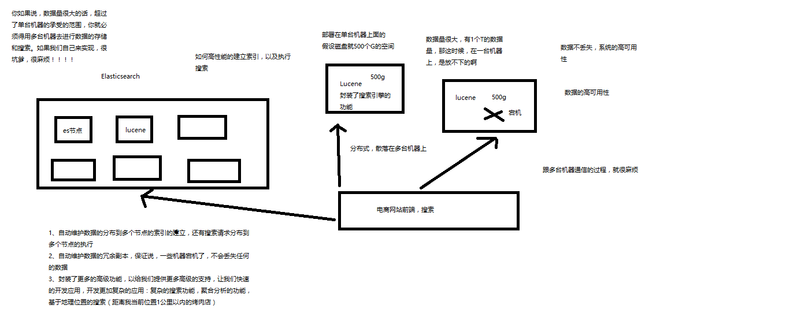
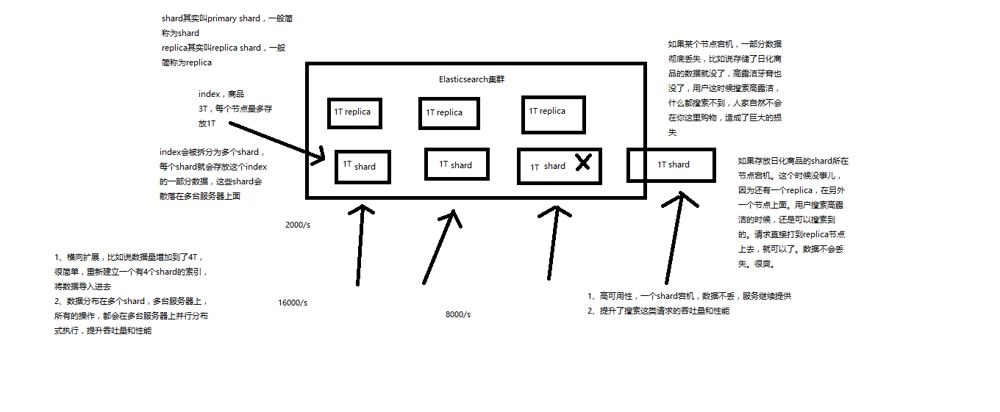

# elasticsearch学习笔记

## 名词介绍

一个采用Restful API标准的高扩展和高可用性的实时数据分析的全文搜索工具


### 什么是全文检索

[](image-201709291005/什么是全文检索.png)


### 什么是lucene

lucene，就是一个jar包，里面包含了封装好的各种建立倒排索引，以及进行搜索的代码，包括各种算法。我们就用java开发的时候，引入lucene jar，然后基于lucene的api进行去进行开发就可以了。用lucene，我们就可以去将已有的数据建立索引，lucene会在本地磁盘上面，给我们组织索引的数据结构。另外的话，我们也可以用lucene提供的一些功能和api来针对磁盘上的索引数据进行搜索


### 什么是Elasticsearch

[](image-201709291005/什么是Elasticsearch.png)


### Elasticsearch的功能

（1）分布式的搜索引擎和数据分析引擎

搜索：百度，网站的站内搜索，IT系统的检索
数据分析：电商网站，最近7天牙膏这种商品销量排名前10的商家有哪些；新闻网站，最近1个月访问量排名前3的新闻版块是哪些
分布式，搜索，数据分析

（2）全文检索，结构化检索，数据分析

全文检索：我想搜索商品名称包含牙膏的商品，select * from products where product_name like "%牙膏%"
结构化检索：我想搜索商品分类为日化用品的商品都有哪些，select * from products where category_id='日化用品'
部分匹配、自动完成、搜索纠错、搜索推荐
数据分析：我们分析每一个商品分类下有多少个商品，select category_id,count(*) from products group by category_id

（3）对海量数据进行近实时的处理

分布式：ES自动可以将海量数据分散到多台服务器上去存储和检索
海量数据的处理：分布式以后，就可以采用大量的服务器去存储和检索数据，自然而然就可以实现海量数据的处理了
近实时：检索个数据要花费1小时（这就不叫近实时，是离线批处理，batch-processing）；在秒级别对数据进行搜索和分析才是近实时

跟分布式/海量数据相反的：lucene，单机应用，只能在单台服务器上使用，最多只能处理单台服务器可以处理的数据量

### Elasticsearch的适用场景

国外

（1）维基百科，类似百度百科，牙膏，牙膏的维基百科，全文检索，高亮，搜索推荐
（2）The Guardian（国外新闻网站），类似搜狐新闻，用户行为日志（点击，浏览，收藏，评论）+社交网络数据（对某某新闻的相关看法），数据分析，给到每篇新闻文章的作者，让他知道他的文章的公众反馈（好，坏，热门，垃圾，鄙视，崇拜）
（3）Stack Overflow（国外的程序异常讨论论坛），IT问题，程序的报错，提交上去，有人会跟你讨论和回答，全文检索，搜索相关问题和答案，程序报错了，就会将报错信息粘贴到里面去，搜索有没有对应的答案
（4）GitHub（开源代码管理），搜索上千亿行代码
（5）电商网站，检索商品
（6）日志数据分析，logstash采集日志，ES进行复杂的数据分析（ELK技术，elasticsearch+logstash+kibana）
（7）商品价格监控网站，用户设定某商品的价格阈值，当低于该阈值的时候，发送通知消息给用户，比如说订阅牙膏的监控，如果高露洁牙膏的家庭套装低于50块钱，就通知我，我就去买
（8）BI系统，商业智能，Business Intelligence。比如说有个大型商场集团，BI，分析一下某某区域最近3年的用户消费金额的趋势以及用户群体的组成构成，产出相关的数张报表，**区，最近3年，每年消费金额呈现100%的增长，而且用户群体85%是高级白领，开一个新商场。ES执行数据分析和挖掘，Kibana进行数据可视化

国内

（9）国内：站内搜索（电商，招聘，门户，等等），IT系统搜索（OA，CRM，ERP，等等），数据分析（ES热门的一个使用场景）

### Elasticsearch的特点

（1）可以作为一个大型分布式集群（数百台服务器）技术，处理PB级数据，服务大公司；也可以运行在单机上，服务小公司
（2）Elasticsearch不是什么新技术，主要是将全文检索、数据分析以及分布式技术，合并在了一起，才形成了独一无二的ES；lucene（全文检索），商用的数据分析软件（也是有的），分布式数据库（mycat）
（3）对用户而言，是开箱即用的，非常简单，作为中小型的应用，直接3分钟部署一下ES，就可以作为生产环境的系统来使用了，数据量不大，操作不是太复杂
（4）数据库的功能面对很多领域是不够用的（事务，还有各种联机事务型的操作）；特殊的功能，比如全文检索，同义词处理，相关度排名，复杂数据分析，海量数据的近实时处理；Elasticsearch作为传统数据库的一个补充，提供了数据库所不不能提供的很多功能


### Elasticsearch核心概念：NRT、索引、分片、副本等

#### 1、lucene和elasticsearch的前世今生

lucene，最先进、功能最强大的搜索库，直接基于lucene开发，非常复杂，api复杂（实现一些简单的功能，写大量的java代码），需要深入理解原理（各种索引结构）

elasticsearch，基于lucene，隐藏复杂性，提供简单易用的restful api接口、java api接口（还有其他语言的api接口）
（1）分布式的文档存储引擎
（2）分布式的搜索引擎和分析引擎
（3）分布式，支持PB级数据

开箱即用，优秀的默认参数，不需要任何额外设置，完全开源

关于elasticsearch的一个传说，有一个程序员失业了，陪着自己老婆去英国伦敦学习厨师课程。程序员在失业期间想给老婆写一个菜谱搜索引擎，觉得lucene实在太复杂了，就开发了一个封装了lucene的开源项目，compass。后来程序员找到了工作，是做分布式的高性能项目的，觉得compass不够，就写了elasticsearch，让lucene变成分布式的系统。

#### 2、elasticsearch的核心概念

（1）Near Realtime（NRT）：近实时，两个意思，从写入数据到数据可以被搜索到有一个小延迟（大概1秒）；基于es执行搜索和分析可以达到秒级

[](image-201709291005/Elasticsearch近实时概念的解释.png)

（2）Cluster：集群，包含多个节点，每个节点属于哪个集群是通过一个配置（集群名称，默认是elasticsearch）来决定的，对于中小型应用来说，刚开始一个集群就一个节点很正常
（3）Node：节点，集群中的一个节点，节点也有一个名称（默认是随机分配的），节点名称很重要（在执行运维管理操作的时候），默认节点会去加入一个名称为“elasticsearch”的集群，如果直接启动一堆节点，那么它们会自动组成一个elasticsearch集群，当然一个节点也可以组成一个elasticsearch集群

（4）Document&field：文档，es中的最小数据单元，一个document可以是一条客户数据，一条商品分类数据，一条订单数据，通常用JSON数据结构表示，每个index下的type中，都可以去存储多个document。一个document里面有多个field，每个field就是一个数据字段。

product document

{
  "product_id": "1",
  "product_name": "高露洁牙膏",
  "product_desc": "高效美白",
  "category_id": "2",
  "category_name": "日化用品"
}

（5）Index：索引，包含一堆有相似结构的文档数据，比如可以有一个客户索引，商品分类索引，订单索引，索引有一个名称。一个index包含很多document，一个index就代表了一类类似的或者相同的document。比如说建立一个product index，商品索引，里面可能就存放了所有的商品数据，所有的商品document。
（6）Type：类型，每个索引里都可以有一个或多个type，type是index中的一个逻辑数据分类，一个type下的document，都有相同的field，比如博客系统，有一个索引，可以定义用户数据type，博客数据type，评论数据type。

商品index，里面存放了所有的商品数据，商品document

但是商品分很多种类，每个种类的document的field可能不太一样，比如说电器商品，可能还包含一些诸如售后时间范围这样的特殊field；生鲜商品，还包含一些诸如生鲜保质期之类的特殊field

type，日化商品type，电器商品type，生鲜商品type

日化商品type：product_id，product_name，product_desc，category_id，category_name
电器商品type：product_id，product_name，product_desc，category_id，category_name，service_period
生鲜商品type：product_id，product_name，product_desc，category_id，category_name，eat_period

每一个type里面，都会包含一堆document


{
  "product_id": "2",
  "product_name": "长虹电视机",
  "product_desc": "4k高清",
  "category_id": "3",
  "category_name": "电器",
  "service_period": "1年"
}


{
  "product_id": "3",
  "product_name": "基围虾",
  "product_desc": "纯天然，冰岛产",
  "category_id": "4",
  "category_name": "生鲜",
  "eat_period": "7天"
}

（7）shard：单台机器无法存储大量数据，es可以将一个索引中的数据切分为多个shard，分布在多台服务器上存储。有了shard就可以横向扩展，存储更多数据，让搜索和分析等操作分布到多台服务器上去执行，提升吞吐量和性能。每个shard都是一个lucene index。
（8）replica：任何一个服务器随时可能故障或宕机，此时shard可能就会丢失，因此可以为每个shard创建多个replica副本。replica可以在shard故障时提供备用服务，保证数据不丢失，多个replica还可以提升搜索操作的吞吐量和性能。primary shard（建立索引时一次设置，不能修改，默认5个），replica shard（随时修改数量，默认1个），默认每个索引10个shard，5个primary shard，5个replica shard，最小的高可用配置，是2台服务器。

[](image-201709291005/shard和replica的解释.png)


###  ES VS SOLR

#### 区别

– 接口
• solr 类似webservice的接口
• es REST风格的访问接口

– 分布式存储
• solrCloud solr4.x才支持
• es是为分布式而生的

– 支持的格式
• solr xml json

• es json– 近实时搜索


#### Es和solr百度指数对比


#### Solr和elasticsearch的性能对比


### ES内置的REST接口


### ES和关系型数据库的数据对比


## 简单的集群管理

### （1）快速检查集群的健康状况

es提供了一套api，叫做cat api，可以查看es中各种各样的数据

GET /_cat/health?v

epoch      timestamp cluster       status node.total node.data shards pri relo init unassign pending_tasks max_task_wait_time active_shards_percent
1488006741 15:12:21  elasticsearch yellow          1         1      1   1    0    0        1             0                  -                 50.0%

epoch      timestamp cluster       status node.total node.data shards pri relo init unassign pending_tasks max_task_wait_time active_shards_percent
1488007113 15:18:33  elasticsearch green           2         2      2   1    0    0        0             0                  -                100.0%

epoch      timestamp cluster       status node.total node.data shards pri relo init unassign pending_tasks max_task_wait_time active_shards_percent
1488007216 15:20:16  elasticsearch yellow          1         1      1   1    0    0        1             0                  -                 50.0%

如何快速了解集群的健康状况？green、yellow、red？

green：每个索引的primary shard和replica shard都是active状态的
yellow：每个索引的primary shard都是active状态的，但是部分replica shard不是active状态，处于不可用的状态
red：不是所有索引的primary shard都是active状态的，部分索引有数据丢失了

为什么现在会处于一个yellow状态？

我们现在就一个笔记本电脑，就启动了一个es进程，相当于就只有一个node。现在es中有一个index，就是kibana自己内置建立的index。由于默认的配置是给每个index分配5个primary shard和5个replica shard，而且primary shard和replica shard不能在同一台机器上（为了容错）。现在kibana自己建立的index是1个primary shard和1个replica shard。当前就一个node，所以只有1个primary shard被分配了和启动了，但是一个replica shard没有第二台机器去启动。

做一个小实验：此时只要启动第二个es进程，就会在es集群中有2个node，然后那1个replica shard就会自动分配过去，然后cluster status就会变成green状态。

### （2）快速查看集群中有哪些索引

GET /_cat/indices?v

health status index   uuid                   pri rep docs.count docs.deleted store.size pri.store.size
yellow open   .kibana rUm9n9wMRQCCrRDEhqneBg   1   1          1            0      3.1kb          3.1kb

### （3）简单的索引操作

创建索引：PUT /test_index?pretty

health status index      uuid                   pri rep docs.count docs.deleted store.size pri.store.size
yellow open   test_index XmS9DTAtSkSZSwWhhGEKkQ   5   1          0            0       650b           650b
yellow open   .kibana    rUm9n9wMRQCCrRDEhqneBg   1   1          1            0      3.1kb          3.1kb

删除索引：DELETE /test_index?pretty

health status index   uuid                   pri rep docs.count docs.deleted store.size pri.store.size
yellow open   .kibana rUm9n9wMRQCCrRDEhqneBg   1   1          1            0      3.1kb          3.1kb


## 快速入门案例实战之电商网站商品管理

### 介绍

有一个电商网站，需要为其基于ES构建一个后台系统，提供以下功能：

（1）对商品信息进行CRUD（增删改查）操作
（2）执行简单的结构化查询
（3）可以执行简单的全文检索，以及复杂的phrase（短语）检索
（4）对于全文检索的结果，可以进行高亮显示
（5）对数据进行简单的聚合分析

### 商品的CRUD操作

#### （1）新增商品：新增文档，建立索引

```
PUT /index/type/id
{
  "json数据"
}

PUT /ecommerce/product/1
{
    "name" : "gaolujie yagao",
    "desc" :  "gaoxiao meibai",
    "price" :  30,
    "producer" :      "gaolujie producer",
    "tags": [ "meibai", "fangzhu" ]
}

PUT /ecommerce/product/2
{
    "name" : "jiajieshi yagao",
    "desc" :  "youxiao fangzhu",
    "price" :  25,
    "producer" :      "jiajieshi producer",
    "tags": [ "fangzhu" ]
}

PUT /ecommerce/product/3
{
    "name" : "zhonghua yagao",
    "desc" :  "caoben zhiwu",
    "price" :  40,
    "producer" :      "zhonghua producer",
    "tags": [ "qingxin" ]
}


返回结果：
{
  "_index": "ecommerce",
  "_type": "product",
  "_id": "1",
  "_version": 1,
  "result": "created",
  "_shards": {
    "total": 2,
    "successful": 1,
    "failed": 0
  },
  "created": true
}
```

es会自动建立index和type，不需要提前创建，而且es默认会对document每个field都建立倒排索引，让其可以被搜索

#### （2）查询商品：检索文档

GET /index/type/id
GET /ecommerce/product/1

```
{
  "_index": "ecommerce",
  "_type": "product",
  "_id": "1",
  "_version": 1,
  "found": true,
  "_source": {
    "name": "gaolujie yagao",
    "desc": "gaoxiao meibai",
    "price": 30,
    "producer": "gaolujie producer",
    "tags": [
      "meibai",
      "fangzhu"
    ]
  }
}
```


#### （3）修改商品：替换文档

```
PUT /ecommerce/product/1
{
    "name" : "jiaqiangban gaolujie yagao",
    "desc" :  "gaoxiao meibai",
    "price" :  30,
    "producer" :      "gaolujie producer",
    "tags": [ "meibai", "fangzhu" ]
}

新增返回结果
{
  "_index": "ecommerce",
  "_type": "product",
  "_id": "1",
  "_version": 1,
  "result": "created",
  "_shards": {
    "total": 2,
    "successful": 1,
    "failed": 0
  },
  "created": true
}
替换返回结果
{
  "_index": "ecommerce",
  "_type": "product",
  "_id": "1",
  "_version": 2,
  "result": "updated",
  "_shards": {
    "total": 2,
    "successful": 1,
    "failed": 0
  },
  "created": false
}
```


```
PUT /ecommerce/product/1
{
    "name" : "jiaqiangban gaolujie yagao"
}
```

替换方式有一个不好，即使必须带上所有的field，才能去进行信息的修改

#### （4）修改商品：更新文档

```
POST /ecommerce/product/1/_update
{
  "doc": {
    "name": "jiaqiangban gaolujie yagao"
  }
}

{
  "_index": "ecommerce",
  "_type": "product",
  "_id": "1",
  "_version": 8,
  "result": "updated",
  "_shards": {
    "total": 2,
    "successful": 1,
    "failed": 0
  }
}
```


#### （5）删除商品：删除文档

```
DELETE /ecommerce/product/1
{
  "found": true,
  "_index": "ecommerce",
  "_type": "product",
  "_id": "1",
  "_version": 9,
  "result": "deleted",
  "_shards": {
    "total": 2,
    "successful": 1,
    "failed": 0
  }
}

{
  "_index": "ecommerce",
  "_type": "product",
  "_id": "1",
  "found": false
}
```


### 多种搜索方式

#### 1、query string search

GET /test_index/test_type/_search?q=test

**搜索全部商品：GET /ecommerce/product/_search**

took：耗费了几毫秒
timed_out：是否超时，这里是没有
_shards：数据拆成了5个分片，所以对于搜索请求，会打到所有的primary shard（或者是它的某个replica shard也可以）
hits.total：查询结果的数量，3个document
hits.max_score：score的含义，就是document对于一个search的相关度的匹配分数，越相关，就越匹配，分数也高
hits.hits：包含了匹配搜索的document的详细数据

```
{
  "took": 2,
  "timed_out": false,
  "_shards": {
    "total": 5,
    "successful": 5,
    "failed": 0
  },
  "hits": {
    "total": 3,
    "max_score": 1,
    "hits": [
      {
        "_index": "ecommerce",
        "_type": "product",
        "_id": "2",
        "_score": 1,
        "_source": {
          "name": "jiajieshi yagao",
          "desc": "youxiao fangzhu",
          "price": 25,
          "producer": "jiajieshi producer",
          "tags": [
            "fangzhu"
          ]
        }
      },
      {
        "_index": "ecommerce",
        "_type": "product",
        "_id": "1",
        "_score": 1,
        "_source": {
          "name": "gaolujie yagao",
          "desc": "gaoxiao meibai",
          "price": 30,
          "producer": "gaolujie producer",
          "tags": [
            "meibai",
            "fangzhu"
          ]
        }
      },
      {
        "_index": "ecommerce",
        "_type": "product",
        "_id": "3",
        "_score": 1,
        "_source": {
          "name": "zhonghua yagao",
          "desc": "caoben zhiwu",
          "price": 40,
          "producer": "zhonghua producer",
          "tags": [
            "qingxin"
          ]
        }
      }
    ]
  }
}
```
query string search的由来，因为search参数都是以http请求的query string来附带的


**搜索商品名称中包含yagao的商品，而且按照售价降序排序**：

GET /ecommerce/product/_search?q=name:yagao&sort=price:desc

适用于临时的在命令行使用一些工具，比如curl，快速的发出请求，来检索想要的信息；但是如果查询请求很复杂，是很难去构建的
在生产环境中，几乎很少使用query string search


#### 2、query DSL


DSL：Domain Specific Language，特定领域的语言
http request body：请求体，可以用json的格式来构建查询语法，比较方便，可以构建各种复杂的语法，比query string search肯定强大多了

**查询所有的商品**

```
GET /ecommerce/product/_search
{
  "query": { "match_all": {} }
}
```
**查询名称包含yagao的商品，同时按照价格降序排序**

```
GET /ecommerce/product/_search
{
    "query" : {
        "match" : {
            "name" : "yagao"
        }
    },
    "sort": [
        { "price": "desc" }
    ]
}
```

**分页查询商品，总共3条商品，假设每页就显示1条商品，现在显示第2页，所以就查出来第2个商品**

```
GET /ecommerce/product/_search
{
  "query": { "match_all": {} },
  "from": 1,
  "size": 1
}
```
**指定要查询出来商品的名称和价格就可以**

```
GET /ecommerce/product/_search
{
  "query": { "match_all": {} },
  "_source": ["name", "price"]
}
```
更加适合生产环境的使用，可以构建复杂的查询


**复杂搜索示例 组合多个搜索条件**

搜索需求：title必须包含elasticsearch，content可以包含elasticsearch也可以不包含，author_id必须不为111

```
PUT /website/article/1
{
    "title": "my elasticsearch article",
    "content": "es is very bad",
    "author_id": 110
}
PUT /website/article/2
{
    "title": "my hadoop article",
    "content": "hadoop is very bad",
    "author_id": 111
}
PUT /website/article/3
{
    "title": "my elasticsearch article",
    "content": "es is very goods",
    "author_id": 111
}


GET /website/article/_search
{
  "query": {
    "bool": {
      "must": [
        {
          "match": {
            "title": "elasticsearch"
          }
        }
      ],
      "should": [
        {
          "match": {
            "content": "elasticsearch"
          }
        }
      ],
      "must_not": [
        {
          "match": {
            "author_id": 111
          }
        }
      ]
    }
  }
}
```


```

1、match all

GET /_search
{
    "query": {
        "match_all": {}
    }
}

2、match

GET /_search
{
    "query": { "match": { "title": "my elasticsearch article" }}
}

3、multi match

GET /test_index/test_type/_search
{
  "query": {
    "multi_match": {
      "query": "test",
      "fields": ["test_field", "test_field1"]
    }
  }
}

4、range query

GET /company/employee/_search 
{
  "query": {
    "range": {
      "age": {
        "gte": 30
      }
    }
  }
}

5、term query  
不分词，直接精准查询

GET /test_index/test_type/_search 
{
  "query": {
    "term": {
      "test_field": "test hello"
    }
  }
}

6、terms query

GET /_search
{
    "query": { "terms": { "tag": [ "search", "full_text", "nosql" ] }}
}

7、exist query（2.x中的查询，现在已经不提供了）
```


#### 3、query filter

搜索商品名称包含yagao，而且售价大于25元的商品
```
GET /ecommerce/product/_search
{
    "query" : {
        "bool" : {
            "must" : {
                "match" : {
                    "name" : "yagao" 
                }
            },
            "filter" : {
                "range" : {
                    "price" : { "gt" : 25 } 
                }
            }
        }
    }
}
```

#### filter与query对比

1、filter与query对比大解密

filter，仅仅只是按照搜索条件过滤出需要的数据而已，不计算任何相关度分数，对相关度没有任何影响
query，会去计算每个document相对于搜索条件的相关度，并按照相关度进行排序

一般来说，如果你是在进行搜索，需要将最匹配搜索条件的数据先返回，那么用query；如果你只是要根据一些条件筛选出一部分数据，不关注其排序，那么用filter
除非是你的这些搜索条件，你希望越符合这些搜索条件的document越排在前面返回，那么这些搜索条件要放在query中；如果你不希望一些搜索条件来影响你的document排序，那么就放在filter中即可

2、filter与query性能

filter，不需要计算相关度分数，不需要按照相关度分数进行排序，同时还有内置的自动cache最常使用filter的数据，性能比较高
query，相反，要计算相关度分数，按照分数进行排序，而且无法cache结果


#### 4、full-text search(全文检索 )


```
GET /ecommerce/product/_search
{

    "query" : {
        "match" : {
            "producer" : "yagao producer"
        }
    }
}
```
尽量，无论是学什么技术，比如说你当初学java，学linux，学shell，学javascript，学hadoop。。。。一定自己动手，特别是手工敲各种命令和代码，切记切记，减少复制粘贴的操作。只有自己动手手工敲，学习效果才最好。

producer这个字段，会先被拆解，建立倒排索引

special		4
yagao		4
producer	1,2,3,4
gaolujie		1
zhognhua	3
jiajieshi		2

yagao producer ---> yagao和producer
```
{
  "took": 4,
  "timed_out": false,
  "_shards": {
    "total": 5,
    "successful": 5,
    "failed": 0
  },
  "hits": {
    "total": 4,
    "max_score": 0.70293105,
    "hits": [
      {
        "_index": "ecommerce",
        "_type": "product",
        "_id": "4",
        "_score": 0.70293105,
        "_source": {
          "name": "special yagao",
          "desc": "special meibai",
          "price": 50,
          "producer": "special yagao producer",
          "tags": [
            "meibai"
          ]
        }
      },
      {
        "_index": "ecommerce",
        "_type": "product",
        "_id": "1",
        "_score": 0.25811607,
        "_source": {
          "name": "gaolujie yagao",
          "desc": "gaoxiao meibai",
          "price": 30,
          "producer": "gaolujie producer",
          "tags": [
            "meibai",
            "fangzhu"
          ]
        }
      },
      {
        "_index": "ecommerce",
        "_type": "product",
        "_id": "3",
        "_score": 0.25811607,
        "_source": {
          "name": "zhonghua yagao",
          "desc": "caoben zhiwu",
          "price": 40,
          "producer": "zhonghua producer",
          "tags": [
            "qingxin"
          ]
        }
      },
      {
        "_index": "ecommerce",
        "_type": "product",
        "_id": "2",
        "_score": 0.1805489,
        "_source": {
          "name": "jiajieshi yagao",
          "desc": "youxiao fangzhu",
          "price": 25,
          "producer": "jiajieshi producer",
          "tags": [
            "fangzhu"
          ]
        }
      }
    ]
  }
}
```
#### 5、phrase search（短语搜索）

跟全文检索相对应，相反，全文检索会将输入的搜索串拆解开来，去倒排索引里面去一一匹配，只要能匹配上任意一个拆解后的单词，就可以作为结果返回
phrase search，要求输入的搜索串，必须在指定的字段文本中，完全包含一模一样的，才可以算匹配，才能作为结果返回

```

GET /ecommerce/product/_search
{
    "query" : {
        "match_phrase" : {
            "producer" : "yagao producer"
        }
    }
}

{
  "took": 11,
  "timed_out": false,
  "_shards": {
    "total": 5,
    "successful": 5,
    "failed": 0
  },
  "hits": {
    "total": 1,
    "max_score": 0.70293105,
    "hits": [
      {
        "_index": "ecommerce",
        "_type": "product",
        "_id": "4",
        "_score": 0.70293105,
        "_source": {
          "name": "special yagao",
          "desc": "special meibai",
          "price": 50,
          "producer": "special yagao producer",
          "tags": [
            "meibai"
          ]
        }
      }
    ]
  }
}
```


#### 6、highlight search（高亮搜索结果）


```
GET /ecommerce/product/_search
{
    "query" : {
        "match" : {
            "producer" : "producer"
        }
    },
    "highlight": {
        "fields" : {
            "producer" : {}
        }
    }
}

```


## 手工画图剖析Elasticsearch的基础分布式架构

[](image-201709291005/ES的基础分布式架构.png)

### 1、Elasticsearch对复杂分布式机制的透明隐藏特性

Elasticsearch是一套分布式的系统，分布式是为了应对大数据量
隐藏了复杂的分布式机制

分片机制（我们之前随随便便就将一些document插入到es集群中去了，我们有没有care过数据怎么进行分片的，数据到哪个shard中去）

cluster discovery（集群发现机制，我们之前在做那个集群status从yellow转green的实验里，直接启动了第二个es进程，那个进程作为一个node自动就发现了集群，并且加入了进去，还接受了部分数据，replica shard）

shard负载均衡（举例，假设现在有3个节点，总共有25个shard要分配到3个节点上去，es会自动进行均匀分配，以保持每个节点的均衡的读写负载请求）

shard副本，请求路由，集群扩容，shard重分配


### 2、Elasticsearch的垂直扩容与水平扩容

垂直扩容：采购更强大的服务器，成本非常高昂，而且会有瓶颈，假设世界上最强大的服务器容量就是10T，但是当你的总数据量达到5000T的时候，你要采购多少台最强大的服务器啊

水平扩容：业界经常采用的方案，采购越来越多的普通服务器，性能比较一般，但是很多普通服务器组织在一起，就能构成强大的计算和存储能力

普通服务器：1T，1万，100万
强大服务器：10T，50万，500万

扩容对应用程序的透明性


### 3、增减或减少节点时的数据rebalance

保持负载均衡

### 4、master节点

（1）创建或删除索引
（2）增加或删除节点


### 5、节点对等的分布式架构

（1）节点对等，每个节点都能接收所有的请求
（2）自动请求路由
（3）响应收集


## shard&replica机制和横向扩容


### 1、shard&replica机制再次梳理

（1）index包含多个shard
（2）每个shard都是一个最小工作单元，承载部分数据，lucene实例，完整的建立索引和处理请求的能力
（3）增减节点时，shard会自动在nodes中负载均衡
（4）primary shard和replica shard，每个document肯定只存在于某一个primary shard以及其对应的replica shard中，不可能存在于多个primary shard
（5）replica shard是primary shard的副本，负责容错，以及承担读请求负载
（6）primary shard的数量在创建索引的时候就固定了，replica shard的数量可以随时修改
（7）primary shard的默认数量是5，replica默认是1，默认有10个shard，5个primary shard，5个replica shard
（8）primary shard不能和自己的replica shar d放在同一个节点上（否则节点宕机，primary shard和副本都丢失，起不到容错的作用），但是可以和其他primary shard的replica shard放在同一个节点上


[](image-201709291005/shard&replica机制再次梳理.png)

### 1、图解横向扩容过程，如何超出扩容极限，以及如何提升容错性

（1）primary&replica自动负载均衡，6个shard，3 primary，3 replica
（2）每个node有更少的shard，IO/CPU/Memory资源给每个shard分配更多，每个shard性能更好
（3）扩容的极限，6个shard（3 primary，3 replica），最多扩容到6台机器，每个shard可以占用单台服务器的所有资源，性能最好
（4）超出扩容极限，动态修改replica数量，9个shard（3primary，6 replica），扩容到9台机器，比3台机器时，拥有3倍的读吞吐量
（5）3台机器下，9个shard（3 primary，6 replica），资源更少，但是容错性更好，最多容纳2台机器宕机，6个shard只能容纳1台机器宕机
（6）这里的这些知识点，你综合起来看，就是说，一方面告诉你扩容的原理，怎么扩容，怎么提升系统整体吞吐量；另一方面要考虑到系统的容错性，怎么保证提高容错性，让尽可能多的服务器宕机，保证数据不丢失

## document id

### 1、手动指定document id

（1）根据应用情况来说，是否满足手动指定document id的前提：

一般来说，是从某些其他的系统中，导入一些数据到es时，会采取这种方式，就是使用系统中已有数据的唯一标识，作为es中document的id。举个例子，比如说，我们现在在开发一个电商网站，做搜索功能，或者是OA系统，做员工检索功能。这个时候，数据首先会在网站系统或者IT系统内部的数据库中，会先有一份，此时就肯定会有一个数据库的primary key（自增长，UUID，或者是业务编号）。如果将数据导入到es中，此时就比较适合采用数据在数据库中已有的primary key。

如果说，我们是在做一个系统，这个系统主要的数据存储就是es一种，也就是说，数据产生出来以后，可能就没有id，直接就放es一个存储，那么这个时候，可能就不太适合说手动指定document id的形式了，因为你也不知道id应该是什么，此时可以采取下面要讲解的让es自动生成id的方式。

（2）put /index/type/id

```
PUT /test_index/test_type/2
{
  "test_content": "my test"
}
```


### 2、自动生成document id

（1）post /index/type

```
POST /test_index/test_type
{
  "test_content": "my test"
}

{
  "_index": "test_index",
  "_type": "test_type",
  "_id": "AVp4RN0bhjxldOOnBxaE",
  "_version": 1,
  "result": "created",
  "_shards": {
    "total": 2,
    "successful": 1,
    "failed": 0
  },
  "created": true
}
```

（2）自动生成的id，长度为20个字符，URL安全，base64编码，GUID，分布式系统并行生成时不可能会发生冲突


## _source元数据和定制返回结果

### 1、_source元数据

```
put /test_index/test_type/1
{
  "test_field1": "test field1",
  "test_field2": "test field2"
}

get /test_index/test_type/1

{
  "_index": "test_index",
  "_type": "test_type",
  "_id": "1",
  "_version": 2,
  "found": true,
  "_source": {
    "test_field1": "test field1",
    "test_field2": "test field2"
  }
}
```

_source元数据：就是说，我们在创建一个document的时候，使用的那个放在request body中的json串，默认情况下，在get的时候，会原封不动的给我们返回回来。


### 2、定制返回结果

定制返回的结果，指定_source中，返回哪些field

```
GET /test_index/test_type/1?_source=test_field1,test_field2

{
  "_index": "test_index",
  "_type": "test_type",
  "_id": "1",
  "_version": 2,
  "found": true,
  "_source": {
    "test_field2": "test field2"
  }
}
```


## 实战演练基于_version进行乐观锁并发控制

1、上机动手实战演练基于_version进行乐观锁并发控制

（1）先构造一条数据出来
```
PUT /test_index/test_type/7
{
  "test_field": "test test"
}
```
（2）模拟两个客户端，都获取到了同一条数据
```
GET test_index/test_type/7

{
  "_index": "test_index",
  "_type": "test_type",
  "_id": "7",
  "_version": 1,
  "found": true,
  "_source": {
    "test_field": "test test"
  }
}
```
（3）其中一个客户端，先更新了一下这个数据

同时带上数据的版本号，确保说，es中的数据的版本号，跟客户端中的数据的版本号是相同的，才能修改
```
PUT /test_index/test_type/7?version=1 
{
  "test_field": "test client 1"
}

{
  "_index": "test_index",
  "_type": "test_type",
  "_id": "7",
  "_version": 2,
  "result": "updated",
  "_shards": {
    "total": 2,
    "successful": 1,
    "failed": 0
  },
  "created": false
}
```
（4）另外一个客户端，尝试基于version=1的数据去进行修改，同样带上version版本号，进行乐观锁的并发控制
```
PUT /test_index/test_type/7?version=1 
{
  "test_field": "test client 2"
}

{
  "error": {
    "root_cause": [
      {
        "type": "version_conflict_engine_exception",
        "reason": "[test_type][7]: version conflict, current version [2] is different than the one provided [1]",
        "index_uuid": "6m0G7yx7R1KECWWGnfH1sw",
        "shard": "3",
        "index": "test_index"
      }
    ],
    "type": "version_conflict_engine_exception",
    "reason": "[test_type][7]: version conflict, current version [2] is different than the one provided [1]",
    "index_uuid": "6m0G7yx7R1KECWWGnfH1sw",
    "shard": "3",
    "index": "test_index"
  },
  "status": 409
}
```
（5）在乐观锁成功阻止并发问题之后，尝试正确的完成更新
```
GET /test_index/test_type/7

{
  "_index": "test_index",
  "_type": "test_type",
  "_id": "7",
  "_version": 2,
  "found": true,
  "_source": {
    "test_field": "test client 1"
  }
}
```
基于最新的数据和版本号，去进行修改，修改后，带上最新的版本号，可能这个步骤会需要反复执行好几次，才能成功，特别是在多线程并发更新同一条数据很频繁的情况下
```
PUT /test_index/test_type/7?version=2 
{
  "test_field": "test client 2"
}

{
  "_index": "test_index",
  "_type": "test_type",
  "_id": "7",
  "_version": 3,
  "result": "updated",
  "_shards": {
    "total": 2,
    "successful": 1,
    "failed": 0
  },
  "created": false
}
```

## partial update（局部更新）

### 1、什么是partial update？

PUT /index/type/id，创建文档&替换文档，就是一样的语法

一般对应到应用程序中，每次的执行流程基本是这样的：

（1）应用程序先发起一个get请求，获取到document，展示到前台界面，供用户查看和修改
（2）用户在前台界面修改数据，发送到后台
（3）后台代码，会将用户修改的数据在内存中进行执行，然后封装好修改后的全量数据
（4）然后发送PUT请求，到es中，进行全量替换
（5）es将老的document标记为deleted，然后重新创建一个新的document

partial update
```
post /index/type/id/_update 
{
   "doc": {
      "要修改的少数几个field即可，不需要全量的数据"
   }
}
```
看起来，好像就比较方便了，每次就传递少数几个发生修改的field即可，不需要将全量的document数据发送过去

### 2、图解partial update实现原理以及其优点

partial update，看起来很方便的操作，实际内部的原理是什么样子的，然后它的优点是什么

[](image-201709291005/图解partial update实现原理以及其优点.png)

### 3、上机动手实战演练partial update
```
PUT /test_index/test_type/10
{
  "test_field1": "test1",
  "test_field2": "test2"
}

POST /test_index/test_type/10/_update
{
  "doc": {
    "test_field2": "updated test2"
  }
}
```


## 批量查询mget

### 1、批量查询的好处

就是一条一条的查询，比如说要查询100条数据，那么就要发送100次网络请求，这个开销还是很大的
如果进行批量查询的话，查询100条数据，就只要发送1次网络请求，网络请求的性能开销缩减100倍

### 2、mget的语法

（1）一条一条的查询

GET /test_index/test_type/1
GET /test_index/test_type/2

（2）mget批量查询
```
GET /_mget
{
   "docs" : [
      {
         "_index" : "test_index",
         "_type" :  "test_type",
         "_id" :    1
      },
      {
         "_index" : "test_index",
         "_type" :  "test_type",
         "_id" :    2
      }
   ]
}

{
  "docs": [
    {
      "_index": "test_index",
      "_type": "test_type",
      "_id": "1",
      "_version": 2,
      "found": true,
      "_source": {
        "test_field1": "test field1",
        "test_field2": "test field2"
      }
    },
    {
      "_index": "test_index",
      "_type": "test_type",
      "_id": "2",
      "_version": 1,
      "found": true,
      "_source": {
        "test_content": "my test"
      }
    }
  ]
}
```
（3）如果查询的document是一个index下的不同type种的话
```
GET /test_index/_mget
{
   "docs" : [
      {
         "_type" :  "test_type",
         "_id" :    1
      },
      {
         "_type" :  "test_type",
         "_id" :    2
      }
   ]
}
```
（4）如果查询的数据都在同一个index下的同一个type下，最简单了
```
GET /test_index/test_type/_mget
{
   "ids": [1, 2]
}
```
### 3、mget的重要性

可以说mget是很重要的，一般来说，在进行查询的时候，如果一次性要查询多条数据的话，那么一定要用batch批量操作的api
尽可能减少网络开销次数，可能可以将性能提升数倍，甚至数十倍，非常非常之重要


## bulk(批量增删改)

### 1、bulk语法

POST /_bulk
{ "delete": { "_index": "test_index", "_type": "test_type", "_id": "3" }} 

{ "create": { "_index": "test_index", "_type": "test_type", "_id": "12" }}
{ "test_field":    "test12" }

{ "index":  { "_index": "test_index", "_type": "test_type", "_id": "2" }}
{ "test_field":    "replaced test2" }

{ "update": { "_index": "test_index", "_type": "test_type", "_id": "1", "_retry_on_conflict" : 3} }
{ "doc" : {"test_field2" : "bulk test1"} }

每一个操作要两个json串，语法如下：

{"action": {"metadata"}}
{"data"}

举例，比如你现在要创建一个文档，放bulk里面，看起来会是这样子的：

{"index": {"_index": "test_index", "_type", "test_type", "_id": "1"}}
{"test_field1": "test1", "test_field2": "test2"}

有哪些类型的操作可以执行呢？
（1）delete：删除一个文档，只要1个json串就可以了
（2）create：PUT /index/type/id/_create，强制创建
（3）index：普通的put操作，可以是创建文档，也可以是全量替换文档
（4）update：执行的partial update操作

bulk api对json的语法，有严格的要求，每个json串不能换行，只能放一行，同时一个json串和一个json串之间，必须有一个换行
```
{
  "error": {
    "root_cause": [
      {
        "type": "json_e_o_f_exception",
        "reason": "Unexpected end-of-input: expected close marker for Object (start marker at [Source: org.elasticsearch.transport.netty4.ByteBufStreamInput@5a5932cd; line: 1, column: 1])\n at [Source: org.elasticsearch.transport.netty4.ByteBufStreamInput@5a5932cd; line: 1, column: 3]"
      }
    ],
    "type": "json_e_o_f_exception",
    "reason": "Unexpected end-of-input: expected close marker for Object (start marker at [Source: org.elasticsearch.transport.netty4.ByteBufStreamInput@5a5932cd; line: 1, column: 1])\n at [Source: org.elasticsearch.transport.netty4.ByteBufStreamInput@5a5932cd; line: 1, column: 3]"
  },
  "status": 500
}

{
  "took": 41,
  "errors": true,
  "items": [
    {
      "delete": {
        "found": true,
        "_index": "test_index",
        "_type": "test_type",
        "_id": "10",
        "_version": 3,
        "result": "deleted",
        "_shards": {
          "total": 2,
          "successful": 1,
          "failed": 0
        },
        "status": 200
      }
    },
    {
      "create": {
        "_index": "test_index",
        "_type": "test_type",
        "_id": "3",
        "_version": 1,
        "result": "created",
        "_shards": {
          "total": 2,
          "successful": 1,
          "failed": 0
        },
        "created": true,
        "status": 201
      }
    },
    {
      "create": {
        "_index": "test_index",
        "_type": "test_type",
        "_id": "2",
        "status": 409,
        "error": {
          "type": "version_conflict_engine_exception",
          "reason": "[test_type][2]: version conflict, document already exists (current version [1])",
          "index_uuid": "6m0G7yx7R1KECWWGnfH1sw",
          "shard": "2",
          "index": "test_index"
        }
      }
    },
    {
      "index": {
        "_index": "test_index",
        "_type": "test_type",
        "_id": "4",
        "_version": 1,
        "result": "created",
        "_shards": {
          "total": 2,
          "successful": 1,
          "failed": 0
        },
        "created": true,
        "status": 201
      }
    },
    {
      "index": {
        "_index": "test_index",
        "_type": "test_type",
        "_id": "2",
        "_version": 2,
        "result": "updated",
        "_shards": {
          "total": 2,
          "successful": 1,
          "failed": 0
        },
        "created": false,
        "status": 200
      }
    },
    {
      "update": {
        "_index": "test_index",
        "_type": "test_type",
        "_id": "1",
        "_version": 3,
        "result": "updated",
        "_shards": {
          "total": 2,
          "successful": 1,
          "failed": 0
        },
        "status": 200
      }
    }
  ]
}
```
bulk操作中，任意一个操作失败，是不会影响其他的操作的，但是在返回结果里，会告诉你异常日志

POST /test_index/_bulk
{ "delete": { "_type": "test_type", "_id": "3" }} 
{ "create": { "_type": "test_type", "_id": "12" }}
{ "test_field":    "test12" }
{ "index":  { "_type": "test_type" }}
{ "test_field":    "auto-generate id test" }
{ "index":  { "_type": "test_type", "_id": "2" }}
{ "test_field":    "replaced test2" }
{ "update": { "_type": "test_type", "_id": "1", "_retry_on_conflict" : 3} }
{ "doc" : {"test_field2" : "bulk test1"} }

POST /test_index/test_type/_bulk
{ "delete": { "_id": "3" }} 
{ "create": { "_id": "12" }}
{ "test_field":    "test12" }
{ "index":  { }}
{ "test_field":    "auto-generate id test" }
{ "index":  { "_id": "2" }}
{ "test_field":    "replaced test2" }
{ "update": { "_id": "1", "_retry_on_conflict" : 3} }
{ "doc" : {"test_field2" : "bulk test1"} }

### 2、bulk size最佳大小

bulk request会加载到内存里，如果太大的话，性能反而会下降，因此需要反复尝试一个最佳的bulk size。一般从1000~5000条数据开始，尝试逐渐增加。另外，如果看大小的话，最好是在5~15MB之间。


## distributed document store(分布式文档存储)

2、什么是distributed document store

到目前为止，你觉得你在学什么东西，给大家一个直观的感觉，好像已经知道了es是分布式的，包括一些基本的原理，然后花了不少时间在学习document本身相关的操作，增删改查。一句话点出来，给大家归纳总结一下，其实我们应该思考一下，es的一个最最核心的功能，已经被我们相对完整的讲完了。

Elasticsearch在跑起来以后，其实起到的第一个最核心的功能，就是一个分布式的文档数据存储系统。ES是分布式的。文档数据存储系统。文档数据，存储系统。
文档数据：es可以存储和操作json文档类型的数据，而且这也是es的核心数据结构。
存储系统：es可以对json文档类型的数据进行存储，查询，创建，更新，删除，等等操作。其实已经起到了一个什么样的效果呢？其实ES满足了这些功能，就可以说已经是一个NoSQL的存储系统了。

围绕着document在操作，其实就是把es当成了一个NoSQL存储引擎，一个可以存储文档类型数据的存储系统，在操作里面的document。

es可以作为一个分布式的文档存储系统，所以说，我们的应用系统，是不是就可以基于这个概念，去进行相关的应用程序的开发了。

什么类型的应用程序呢？

（1）数据量较大，es的分布式本质，可以帮助你快速进行扩容，承载大量数据
（2）数据结构灵活多变，随时可能会变化，而且数据结构之间的关系，非常复杂，如果我们用传统数据库，那是不是很坑，因为要面临大量的表
（3）对数据的相关操作，较为简单，比如就是一些简单的增删改查，用我们之前讲解的那些document操作就可以搞定
（4）NoSQL数据库，适用的也是类似于上面的这种场景

举个例子，比如说像一些网站系统，或者是普通的电商系统，博客系统，面向对象概念比较复杂，但是作为终端网站来说，没什么太复杂的功能，就是一些简单的CRUD操作，而且数据量可能还比较大。这个时候选用ES这种NoSQL型的数据存储，比传统的复杂的功能务必强大的支持SQL的关系型数据库，更加合适一些。无论是性能，还是吞吐量，可能都会更好。


## consistency（一直性写操作参数）

（1）consistency，one（primary shard），all（all shard），quorum（default）

我们在发送任何一个增删改操作的时候，比如说put /index/type/id，都可以带上一个consistency参数，指明我们想要的写一致性是什么？
put /index/type/id?consistency=quorum

one：要求我们这个写操作，只要有一个primary shard是active活跃可用的，就可以执行
all：要求我们这个写操作，必须所有的primary shard和replica shard都是活跃的，才可以执行这个写操作
quorum：默认的值，要求所有的shard中，必须是大部分的shard都是活跃的，可用的，才可以执行这个写操作

（2）quorum机制，写之前必须确保大多数shard都可用，int( (primary + number_of_replicas) / 2 ) + 1，当number_of_replicas>1时才生效

quroum = int( (primary + number_of_replicas) / 2 ) + 1
举个例子，3个primary shard，number_of_replicas=1，总共有3 + 3 * 1 = 6个shard
quorum = int( (3 + 1) / 2 ) + 1 = 3
所以，要求6个shard中至少有3个shard是active状态的，才可以执行这个写操作

（3）如果节点数少于quorum数量，可能导致quorum不齐全，进而导致无法执行任何写操作

3个primary shard，replica=1，要求至少3个shard是active，3个shard按照之前学习的shard&replica机制，必须在不同的节点上，如果说只有2台机器的话，是不是有可能出现说，3个shard都没法分配齐全，此时就可能会出现写操作无法执行的情况

es提供了一种特殊的处理场景，就是说当number_of_replicas>1时才生效，因为假如说，你就一个primary shard，replica=1，此时就2个shard

(1 + 1 / 2) + 1 = 2，要求必须有2个shard是活跃的，但是可能就1个node，此时就1个shard是活跃的，如果你不特殊处理的话，导致我们的单节点集群就无法工作

（4）quorum不齐全时，wait，默认1分钟，timeout，100，30s

等待期间，期望活跃的shard数量可以增加，最后实在不行，就会timeout
我们其实可以在写操作的时候，加一个timeout参数，比如说put /index/type/id?timeout=30，这个就是说自己去设定quorum不齐全的时候，es的timeout时长，可以缩短，也可以增长


## 搜索结果字段含义

GET /_search
```
{
  "took": 6,
  "timed_out": false,
  "_shards": {
    "total": 6,
    "successful": 6,
    "failed": 0
  },
  "hits": {
    "total": 10,
    "max_score": 1,
    "hits": [
      {
        "_index": ".kibana",
        "_type": "config",
        "_id": "5.2.0",
        "_score": 1,
        "_source": {
          "buildNum": 14695
        }
      }
    ]
  }
}
```
took：整个搜索请求花费了多少毫秒

hits.total：本次搜索，返回了几条结果
hits.max_score：本次搜索的所有结果中，最大的相关度分数是多少，每一条document对于search的相关度，越相关，_score分数越大，排位越靠前
hits.hits：默认查询前10条数据，完整数据，_score降序排序

shards：shards fail的条件（primary和replica全部挂掉），不影响其他shard。默认情况下来说，一个搜索请求，会打到一个index的所有primary shard上去，当然了，每个primary shard都可能会有一个或多个replic shard，所以请求也可以到primary shard的其中一个replica shard上去。

timeout：默认无timeout，latency平衡completeness，手动指定timeout，timeout查询执行机制

timeout=10ms（毫秒），timeout=1s（秒），timeout=1m（分钟）
GET /_search?timeout=10m


## multi-index和multi-type搜索模式

告诉你如何一次性搜索多个index和多个type下的数据

/_search：所有索引，所有type下的所有数据都搜索出来
/index1/_search：指定一个index，搜索其下所有type的数据
/index1,index2/_search：同时搜索两个index下的数据
/*1,*2/_search：按照通配符去匹配多个索引
/index1/type1/_search：搜索一个index下指定的type的数据
/index1/type1,type2/_search：可以搜索一个index下多个type的数据
/index1,index2/type1,type2/_search：搜索多个index下的多个type的数据
/_all/type1,type2/_search：_all，可以代表搜索所有index下的指定type的数据


## 精确匹配与全文搜索的对比分析

### 1、exact value

2017-01-01，exact value，搜索的时候，必须输入2017-01-01，才能搜索出来
如果你输入一个01，是搜索不出来的

### 2、full text

（1）缩写 vs. 全程：cn vs. china
（2）格式转化：like liked likes
（3）大小写：Tom vs tom
（4）同义词：like vs love

2017-01-01，2017 01 01，搜索2017，或者01，都可以搜索出来
china，搜索cn，也可以将china搜索出来
likes，搜索like，也可以将likes搜索出来
Tom，搜索tom，也可以将Tom搜索出来
like，搜索love，同义词，也可以将like搜索出来

就不是说单纯的只是匹配完整的一个值，而是可以对值进行拆分词语后（分词）进行匹配，也可以通过缩写、时态、大小写、同义词等进行匹配


