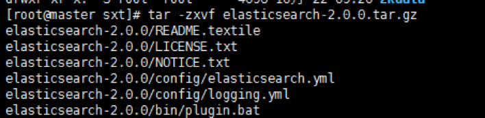

## 安装 Elasticsearch

最好查看官网文档:

https://www.elastic.co/guide/en/elasticsearch/reference/5.6/_installation.html


注： Elasticsearch  Kibana 的下载地址统一为https://www.elastic.co/downloads/
问题排查可以登录https://discuss.elastic.co/c论坛查找相关信息

### 安装单个Elasticsearch

1、安装JDK，至少1.8.0_73以上版本，java -version
2、下载和解压缩Elasticsearch安装包，目录结构
3、启动Elasticsearch：bin\elasticsearch，es本身特点之一就是开箱即用，如果是中小型应用，数据量少，操作不是很复杂，直接启动就可以用了

4、检查ES是否启动成功：http://localhost:9200/?pretty

name: node名称
cluster_name: 集群名称（默认的集群名称就是elasticsearch）
version.number: 5.2.0，es版本号

```
{
  "name" : "4onsTYV",
  "cluster_name" : "elasticsearch",
  "cluster_uuid" : "nKZ9VK_vQdSQ1J0Dx9gx1Q",
  "version" : {
    "number" : "5.2.0",
    "build_hash" : "24e05b9",
    "build_date" : "2017-01-24T19:52:35.800Z",
    "build_snapshot" : false,
    "lucene_version" : "6.4.0"
  },
  "tagline" : "You Know, for Search"
}
```

5、修改集群名称：elasticsearch.yml
6、下载和解压缩Kibana安装包，使用里面的开发界面，去操作elasticsearch，作为我们学习es知识点的一个主要的界面入口
7、启动Kibana：bin\kibana
8、打开网页  http://localhost:5601  ，进入Dev Tools界面
9、执行命令 GET _cluster/health


### 安装Elasticsearch集群

下载elasticsearch-2.0.0.tar.gz到目录/opt/sxt/soft，执行tar -zxvf elasticsearch-2.0.0.tar.gz解压

​                              

修改配置文件config/elasticsearch.yml

[配置模板](image-201711280949/elasticsearch.yml)

如果要配置集群需要两个节点上的elasticsearch配置的cluster.name相同，都启动可以自动组成集群，这里如果不改cluster.name则默认是cluster.name=elasticsearch，nodename随意取但是集群内的各节点不能相同

另外一台机器配置需要修改：

```
node.name: node-2
network.host: 192.168.57.5
```


最后同时启动可以组成集群

启动必须用普通用户启动

```
sudo chown -R vmware01:vmware01 /opt/sxt/soft/elasticsearch-2.2.0
```

然后正式启动

```
 /opt/sxt/soft/elasticsearch-2.2.0/bin/elasticsearch
```


#### 注意：

因为elasticsearch有远程执行脚本的功能所以容易中木马病毒，所以不允许用root用户启动，root用户是起不来的，赋权限，用一般的用户启动
要配置network.host和network.publish_host和network.bind_host才能别的机器或者网卡访问，否则只能是127.0.0.1或者localhost访问
注意配置yml结尾的配置文件都需要冒号后面加空格才行

添加防脑裂配置
discovery.zen.ping.multicast.enabled: false
discovery.zen.ping_timeout: 120s
client.transport.ping_timeout: 60s
discovery.zen.ping.unicast.hosts: ["192.168.57.4","192.168.57.5", "192.168.57.6"]


## 简单的集群管理

### （1）快速检查集群的健康状况

es提供了一套api，叫做cat api，可以查看es中各种各样的数据

GET /_cat/health?v

epoch      timestamp cluster       status node.total node.data shards pri relo init unassign pending_tasks max_task_wait_time active_shards_percent
1488006741 15:12:21  elasticsearch yellow          1         1      1   1    0    0        1             0                  -                 50.0%

epoch      timestamp cluster       status node.total node.data shards pri relo init unassign pending_tasks max_task_wait_time active_shards_percent
1488007113 15:18:33  elasticsearch green           2         2      2   1    0    0        0             0                  -                100.0%

epoch      timestamp cluster       status node.total node.data shards pri relo init unassign pending_tasks max_task_wait_time active_shards_percent
1488007216 15:20:16  elasticsearch yellow          1         1      1   1    0    0        1             0                  -                 50.0%

如何快速了解集群的健康状况？green、yellow、red？

green：每个索引的primary shard和replica shard都是active状态的
yellow：每个索引的primary shard都是active状态的，但是部分replica shard不是active状态，处于不可用的状态
red：不是所有索引的primary shard都是active状态的，部分索引有数据丢失了

为什么现在会处于一个yellow状态？

我们现在就一个笔记本电脑，就启动了一个es进程，相当于就只有一个node。现在es中有一个index，就是kibana自己内置建立的index。由于默认的配置是给每个index分配5个primary shard和5个replica shard，而且primary shard和replica shard不能在同一台机器上（为了容错）。现在kibana自己建立的index是1个primary shard和1个replica shard。当前就一个node，所以只有1个primary shard被分配了和启动了，但是一个replica shard没有第二台机器去启动。

做一个小实验：此时只要启动第二个es进程，就会在es集群中有2个node，然后那1个replica shard就会自动分配过去，然后cluster status就会变成green状态。

### （2）快速查看集群中有哪些索引

GET /_cat/indices?v

health status index   uuid                   pri rep docs.count docs.deleted store.size pri.store.size
yellow open   .kibana rUm9n9wMRQCCrRDEhqneBg   1   1          1            0      3.1kb          3.1kb

### （3）简单的索引操作

创建索引：PUT /test_index?pretty

health status index      uuid                   pri rep docs.count docs.deleted store.size pri.store.size
yellow open   test_index XmS9DTAtSkSZSwWhhGEKkQ   5   1          0            0       650b           650b
yellow open   .kibana    rUm9n9wMRQCCrRDEhqneBg   1   1          1            0      3.1kb          3.1kb

删除索引：DELETE /test_index?pretty

health status index   uuid                   pri rep docs.count docs.deleted store.size pri.store.size
yellow open   .kibana rUm9n9wMRQCCrRDEhqneBg   1   1          1            0      3.1kb          3.1kb

