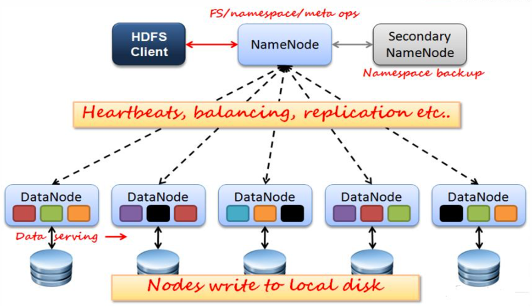
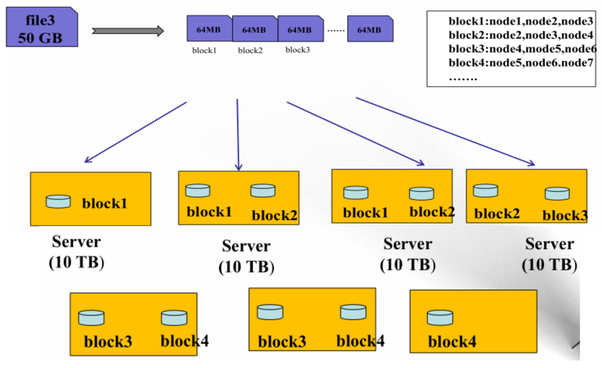
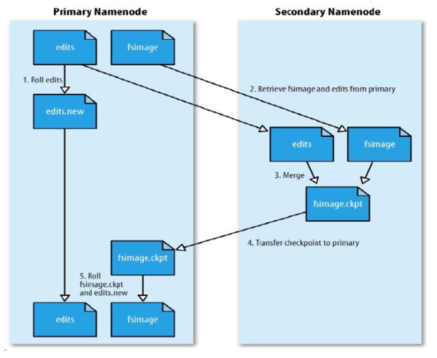
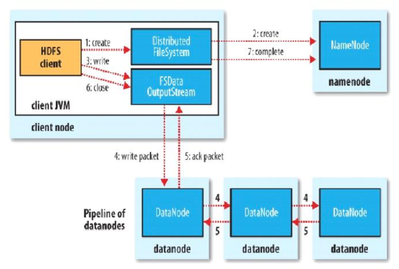
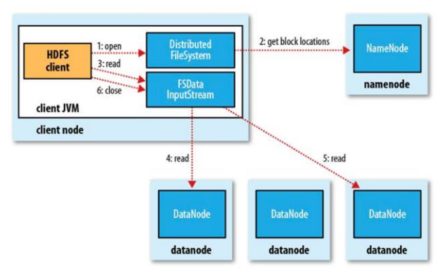

# hadoop 介绍和架构

## 介绍和架构

### Hadoop简介

– 分布式存储系统HDFS(HadoopDistributedFileSystem)
• 分布式存储系统
• 提供了 高可靠性、高扩展性和高吞吐率的数据存储服务

– 分布式计算框架MapReduce
• 分布式计算框架
• 具有易于编程、高容错性和高扩展性等优点。

### HDFS优点:

– 高容错性
• 数据自动保存多个副本
• 副本丢失后，自动恢复

– 适合批处理
• 移动计算而非数据
• 数据位置暴露给计算框架

– 适合大数据处理
• GB、TB、甚至PB级数据
• 百万规模以上的文件数量
• 10K+节点

– 可构建在廉价机器上
• 通过多副本提高可靠性
• 提供了容错和恢复机制

### HDFS缺点:

- 低延迟数据访问
  - 比如毫秒级
  - 低延迟与高吞吐率
- 小文件存取
  - 占用NameNode大量内存
  - 寻道时间超过读取时间
- 并发写入、文件随机修改
  - 一个文件只能有一个写者
  - 仅支持append

### HDFS架构:

###  HDFS 数据存储单元(block)

– 文件被切分成固定大小的数据块
• 默认数据块大小为64MB，可配置
• 若文件大小不到64MB，则单独存成一个block

– 一个文件存储方式
• 按大小被切分成若干个block，存储到不同节点上
• 默认情况下每个block都有三个副本

– Block大小和副本数通过Client端上传文件时设置，文件上传成功后副本数可以变更，Block Size不可变更

### HDFS设计思想:

hdfs存储

### NameNode(NN)

– NameNode主要功能:接受客户端的读写服务

– NameNode保存metadate信息包括

​	• 文件owership和permissions

​	• 文件包含哪些块
​	• Block保存在哪个DataNode(由DataNode启动时上报)

– NameNode的metadate信息在启动后会加载到内存

​	• metadata存储到磁盘文件名为”fsimage”

​	• Block的位置信息不会保存到fsimage

​	• edits记录对metadata的操作日志

### SecondaryNameNode(SNN)

– 它不是NN的备份(但可以做备份)，它的主要工作是帮助NN合并edits

log，减少NN启动时间。

– SNN执行合并时机

​	• 根据配置文件设置的时间间隔fs.checkpoint.period 默认3600秒
​	• 根据配置文件设置editslog大小fs.checkpoint.size规定edits文件的最大值默

认是64MB

### SNN合并流程

### DataNode(DN)

– 存储数据(Block)

– 启动DN线程的时候会向NN汇报block信息
– 通过向NN发送心跳保持与其联系(3秒一次)，如果NN10分钟没有收

到DN的心跳，则认为其已经lost，并copy其上的block到其它DN

### Block的副本放置策略

–  第一个副本:放置在上传文件的DN;如果是集群外提交，则随机挑选一台磁盘不太满，CPU不太忙的节点。

–  第二个副本:放置在于第一个副本不同的 机架的节点上。

–  第三个副本:与第二个副本相同机架的节点。

–  更多副本:随机节点

### HDFS写流程

### HDFS读流程

### HDFS文件权限

– 与Linux文件权限类似
​	• r:read;w:write;x:execute，权限x对于文件忽略，对于文件夹表示是否允许

访问其内容
– 如果Linux系统用户zhangsan使用hadoop命令创建一个文件，那么这个

文件在HDFS中owner就是zhangsan。

– HDFS的权限目的:阻止好人错错事，而不是阻止坏人做坏事。HDFS相信，你告诉我你是谁，我就认为你是			谁。	

### 安全模式

–  namenode启动的时候就是安全模式，首先将映像文件(fsimage)载入内存，并执行编辑日志(edits)中的各

项操作。

–  一旦在内存中成功建立文件系统元数据的映射，则创建一个新的fsimage文件(这个操作不

需要SecondaryNameNode)和一个空的编辑日志。

–  此刻namenode运行在安全模式。即namenode的文件系统对于客服端来说是只读的。(显示

目录，显示文件内容等。写、删除、重命名都会失败)。

–  在此阶段Namenode收集各个datanode的报告，当数据块达到最小副本数以上时，会被认为是“安全”的， 在一定比例(可设置)的数据块被确定为“安全”后，再过若干时间，安全模式结束

–  当检测到副本数不足的数据块时，该块会被复制直到达到最小副本数，系统中数据块的位置并不是由namenode维护的，而是以块列表形式存储在datanode中。

