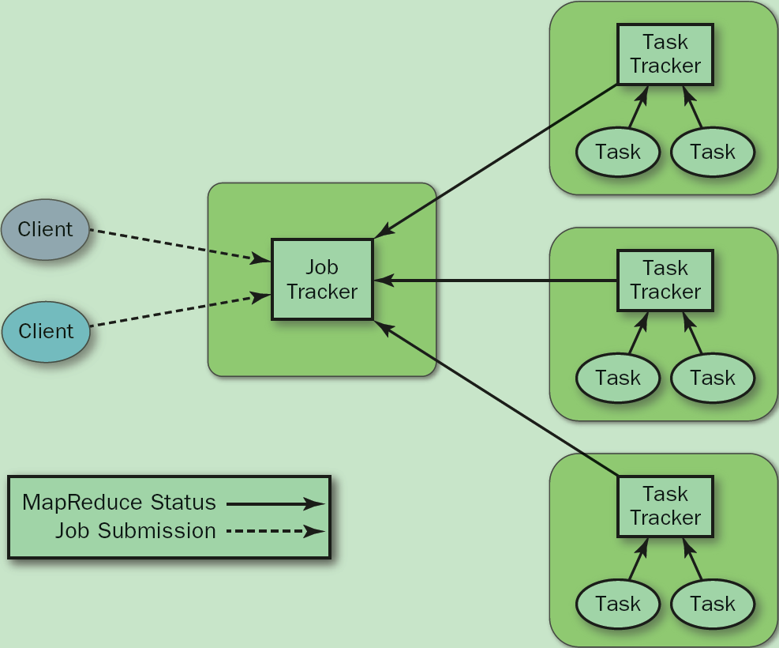
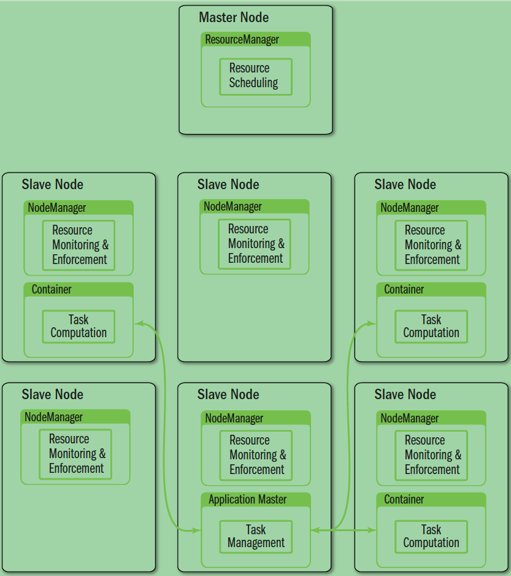
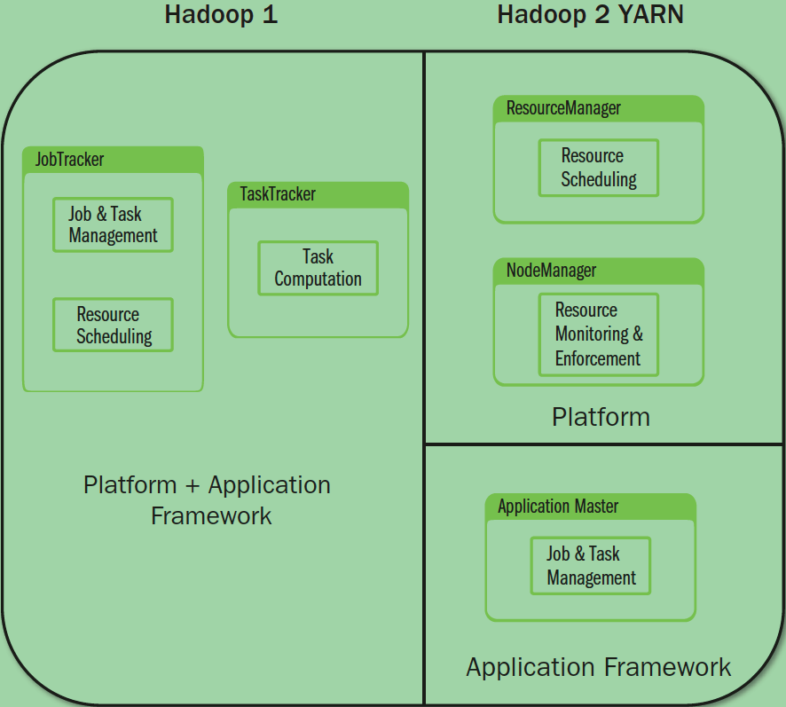
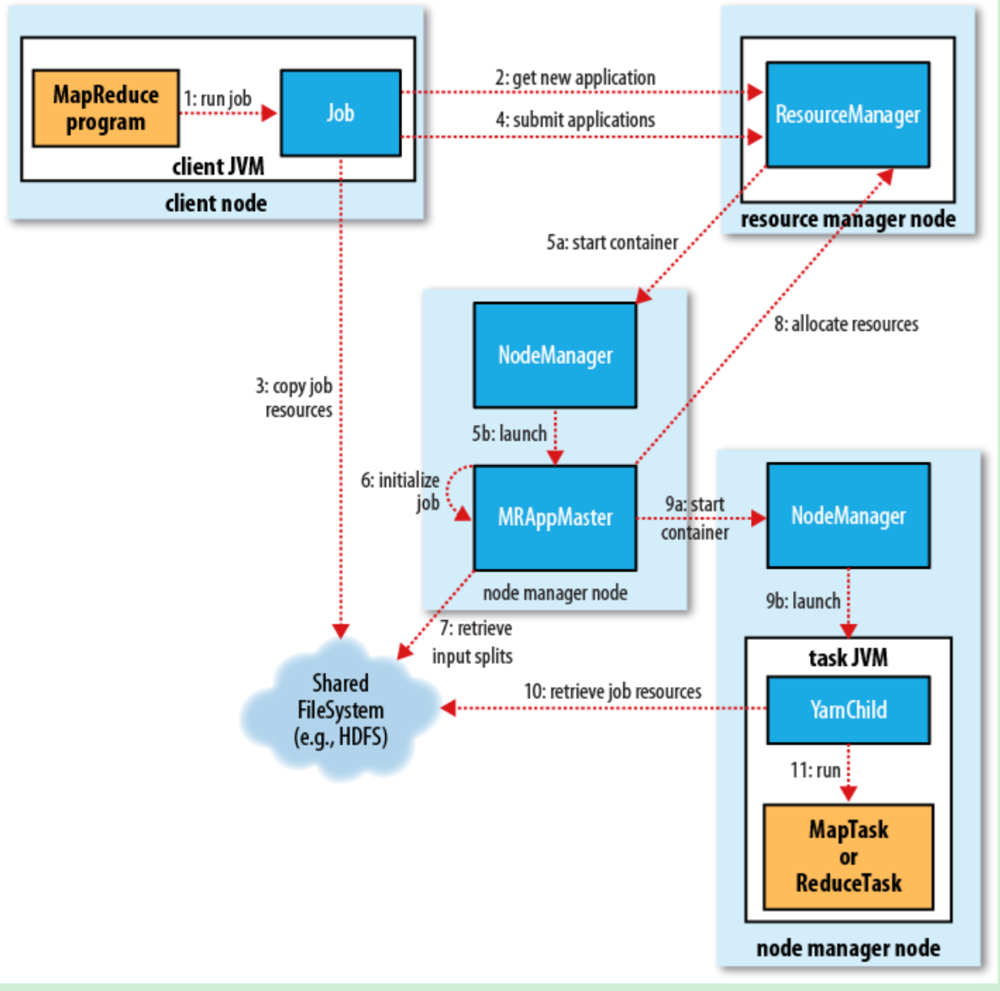
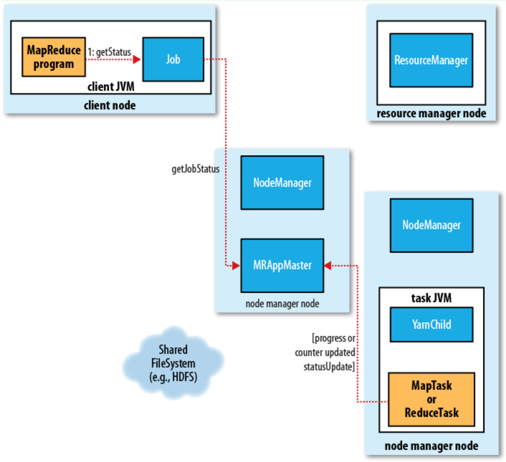

# Hadoop YARN 学习手册

## 旧的MapReduce架构

- **JobTracker:** 负责资源管理，跟踪资源消耗和可用性，作业生命周期管理（调度作业任务，跟踪进度，为任务提供容错）
- **TaskTracker:** 加载或关闭任务，定时报告认为状态

此架构会有以下问题：

1. JobTracker是MapReduce的集中处理点，存在单点故障
2. JobTracker完成了太多的任务，造成了过多的资源消耗，当MapReduce job 非常多的时候，会造成很大的内存开销。这也是业界普遍总结出老Hadoop的MapReduce只能支持4000 节点主机的上限
3. 在TaskTracker端，以map/reduce task的数目作为资&##x6E90;的表示过于简单，没有考虑到cpu/ 内存的占用情况，如果两个大内存消耗的task被调度到了一块，很容易出现OOM
4. 在TaskTracker端，把资源强制划分为map task slot和reduce task slot, 如果当系统中只有map task或者只有reduce task的时候，会造成资源的浪费，也就集群资源利用的问题

总的来说就是**单点问题**和**资源利用率问题**

## YARN架构

YARN就是将JobTracker的职责进行拆分，将资源管理和任务调度监控拆分成独立#x7ACB;的进程：一个全局的资源管理和一个每个作业的管理（ApplicationMaster） ResourceManager和NodeManager提供了计算资源的分配和管理，而ApplicationMaster则完成应用程序的运行

- **ResourceManager:** 全局资源管理和任务调度
- **NodeManager:** 单个节点的资源管理和监控
- **ApplicationMaster:** 单个作业的资源管理和任务监控
- **Container:** 资源申请的单位和任务运行的容器

## 架构对比

YARN架构下形成了一个通用的资源管理平台和一个通用的应用计算^#x5E73;台，避免了旧架构的单点问题和资源利用率问题，同时也让在其上运行的应用不再局限于MapReduce形式

## YARN基本流程

**1. Job submission**

从ResourceManager中获取一个Application ID 检查作业输出配置，计算输入分片 拷贝作业资源（job jar、配置文件、分片信息）到HDFS，以便后面任务的执行

**2. Job initialization**

ResourceManager将作业递交给Scheduler（有很多调度算法，一般是根据优先级）Scheduler为作业分配一个Container，ResourceManager就加载一个application master process并交给NodeManager管理ApplicationMaster主要是创建一系列的监控进程来跟踪作业的进度，同时获取输入分片，为每一个分片创建一个Map task和相应的reduce task Application Master还决定如何运行作业，如果作业很小（可配置），则直接在同一个JVM下运行

**3. Task assignment**

ApplicationMaster向Resource Manager申请资源（一个个的Container，指定任务分配的资源要求）一般是根据data locality来分配资源

**4. Task execution**

ApplicationMaster根据ResourceManager的分配情况，在对应的NodeManager中启动Container 从HDFSN#x4E2D;读取任务所需资源（job jar，配置文件等），然后执行该任务

**5. Progress and status update**

定时将任务的进度和状态报告给ApplicationMaster Client定时向ApplicationMaster获取整个任务的进度和状态

**6. Job completion**

Client定时检查整个作业是否完成 作业完成后，会清空临时文件、目录等

https://www.ctolib.com/docs-hadoop-c-yarn.html