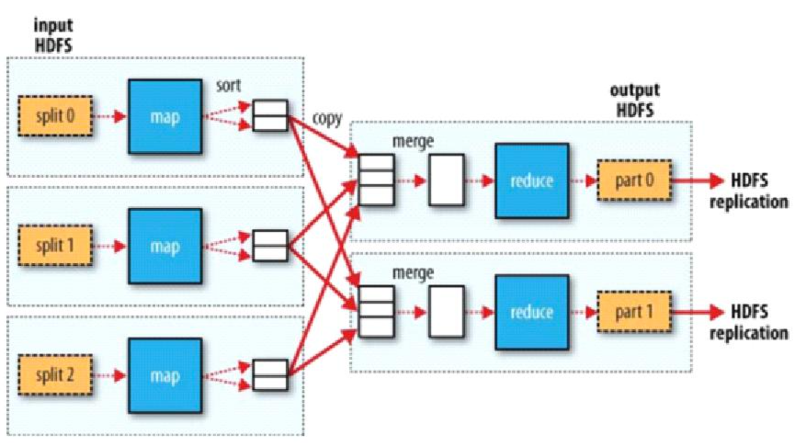
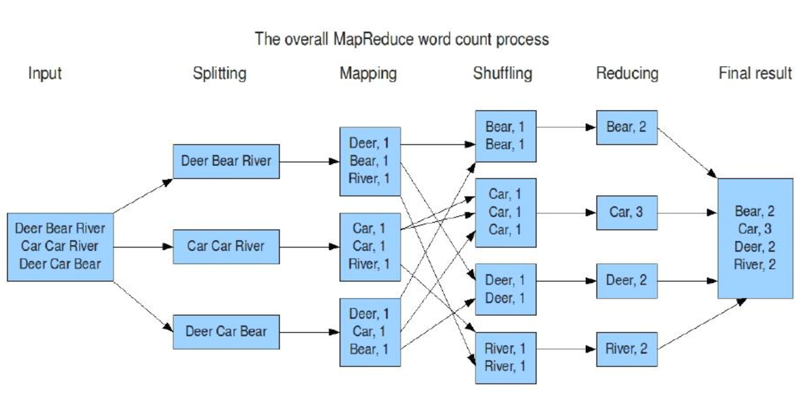
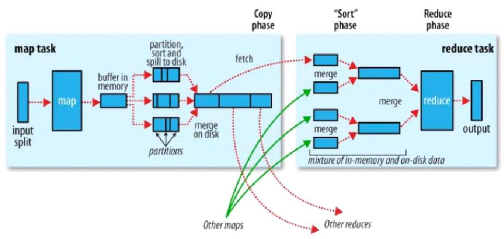
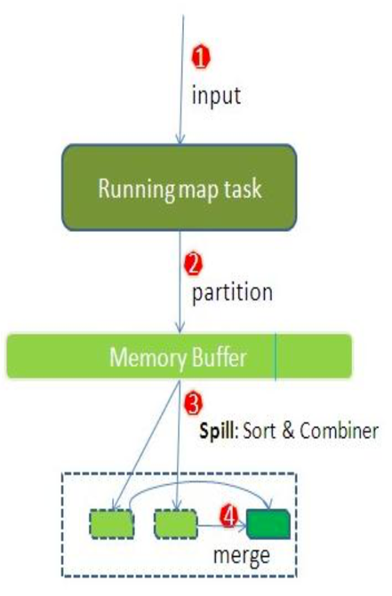
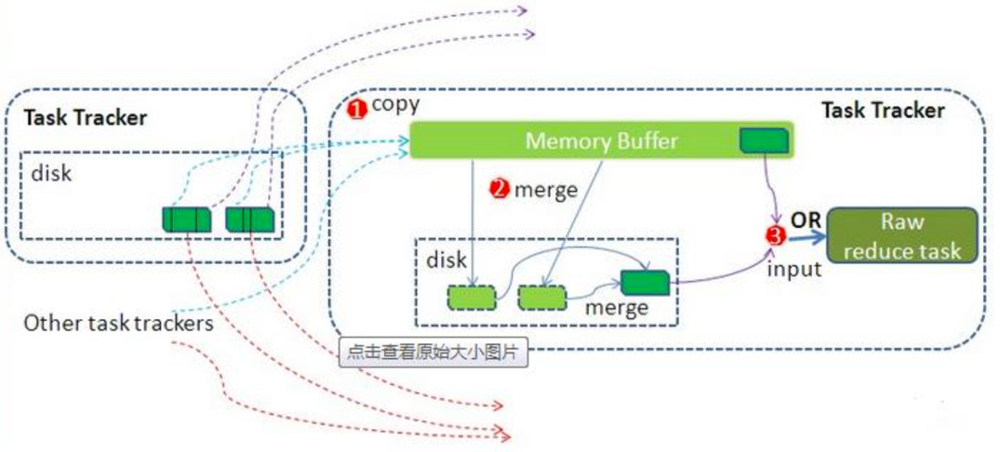

# hadoop核心组件-MapReduce

## 概念介绍

### MapReduce设计理念

– 何为分布式计算。
– 移动计算，而不是移动数据

### 计算框架MR

reduce默认只有一个

#### 具体实例

### Hadoop计算框架之Mapper

– Map-reduce的思想就是“分而治之”

​	• Mapper负责“分”，即把复杂的任务分解为若干个“简单的任务”执行

– “简单的任务”有几个含义:
​	• 数据或计算规模相对于原任务要大大缩小;
​	• 就近计算，即会被分配到存放了所需数据的节点进行计算;
​	• 这些小任务可以并行计算，彼此间几乎没有依赖关系

### Hadoop计算框架之Reducer

– 对map阶段的结果进行汇总。

– Reducer的数目由mapred-site.xml配置文件里的项目mapred.reduce.tasks决定。缺省值为1，用户可以覆盖之

### Hadoop计算框架Shuffler

– 在mapper和reducer中间的一个步骤

– 可以把mapper的输出按照某种key值重新切分和组合成n份，把key值符合某种范围的输出送到特定的reducer那里去处理

– 可以简化reducer过程

### Hadoop计算框架shuffle过程详解

- –  每个maptask都有一个内存缓冲区(默认

  是100MB)，存储着map的输出结果

- –  当缓冲区快满的时候需要将缓冲区的数据

  以一个临时文件的方式存放到磁盘(Spill)

- –  溢写是由单独线程来完成，不影响往缓冲区写map结果的线程(spill.percent，默认是0.8)

- –  当溢写线程启动后，需要对这80MB空间内的key做排序(Sort)

- –  假如client设置过Combiner，那么现在就是使用Combiner的时候了。将有相同key的key/value对的value加起来，减少溢写到磁盘的数据量。(reduce1，word1，[8])。

- –  当整个maptask结束后再对磁盘中这个maptask产生的所有临时文件做合并(Merge)，对于“word1”就是像这样的:{“word1”, [5, 8, 2, ...]},假如有Combiner,{word1 [15]}，最终产生一个文件。

- –  reduce 从tasktrackercopy数据

- –  copy过来的数据会先放入内存缓冲区中，这里的缓冲区大小要比map端

  的更为灵活，它基于JVM的heap size设置

- –  merge有三种形式:1)内存到内存 2)内存到磁盘 3)磁盘到磁盘。merge

  从不同tasktracker上拿到的数据，{word1 [15，17，2]}

- –  参考博客http://langyu.iteye.com/blog/992916?page=3#comments

### MapReduce的 Split大小

– max.split(100M)
– min.split(10M)
– block(64M)
– max(min.split,min(max.split,block))

## 运行环境

YARN

