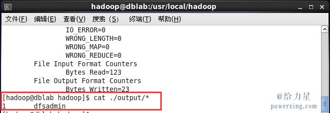
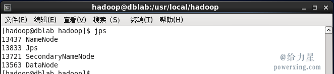

# Hadoop linux 环境安装配置


### 单机安装配置(非分布式)

Hadoop 默认模式为非分布式模式，无需进行其他配置即可运行。非分布式即单 Java 进程，方便进行调试。

现在我们可以执行例子来感受下 Hadoop 的运行。Hadoop 附带了丰富的例子（运行 `./bin/hadoop jar ./share/hadoop/mapreduce/hadoop-mapreduce-examples-2.6.0.jar` 可以看到所有例子），包括 wordcount、terasort、join、grep 等。

在此我们选择运行 grep 例子，我们将 input 文件夹中的所有文件作为输入，筛选当中符合正则表达式 `dfs[a-z.]+` 的单词并统计出现的次数，最后输出结果到 output 文件夹中。

```
cd /usr/local/hadoop
mkdir ./input
cp ./etc/hadoop/*.xml ./input   # 将配置文件作为输入文件
./bin/hadoop jar ./share/hadoop/mapreduce/hadoop-mapreduce-examples-*.jar grep ./input ./output 'dfs[a-z.]+'
cat ./output/*          # 查看运行结果
```

若出现提示 “WARN util.NativeCodeLoader: Unable to load native-hadoop library for your platform… using builtin-java classes where applicable”，该 WARN 提示可以忽略，不会影响 Hadoop 正常运行（可通过编译 Hadoop 源码解决，解决方法请自行搜索）。

若执行成功的话会输出很多作业的相关信息，最后的输出信息如下图所示。作业的结果会输出在指定的 output 文件夹中，通过命令 `cat ./output/*` 查看结果，符合正则的单词 dfsadmin 出现了1次：



**注意**，Hadoop 默认不会覆盖结果文件，因此再次运行上面实例会提示出错，需要先将 `./output` 删除。

```
rm -r ./output
```


### 伪分布式安装配置

在平时的学习中，我们使用伪分布式就足够了。

- 下载 先修改一个node1节点的配置.其他都是复制过去即可

https://archive.apache.org/dist/hadoop/common/hadoop-2.5.1/

- 解压

 tar  -zxvf opt/sxt/soft/hadoop-2.5.1.tar.gz

mv  hadoop-2.5.1  hadoop

- 配置java环境

```
cat /etc/profile

#set java environment
JAVA_HOME=/usr/local/java/jdk_64bit_1.7.0_55
PATH=$PATH:$JAVA_HOME/bin
CLASSPATH=.:$JAVA_HOME/lib/dt.jar:$JAVA_HOME/lib/tools.jar
export JAVA_HOME CLASSPATH PATH
```

- 配置hadoop 命令行目录到环境变量中

vi /etc/profile

```
#set hadoop environment
HADOOP_HOME=/opt/sxt/soft/hadoop
PATH=$PATH:$HADOOP_HOME/bin:$HADOOP_HOME/sbin
export HADOOP_HOME PATH
```

- 修改 etc/hadoop/hadoop-env.sh

```
# The java implementation to use.
export JAVA_HOME=/usr/local/java/jdk_64bit_1.7.0_55
```

- 修改etc/hadoop/core-site.xml

```
<configuration>
    <property>
    <!-- namenode 所在主机的数据上传和下载传输的端口  rpc协议 -->
        <name>fs.defaultFS</name>
        <value>hdfs://localhost:9000</value>
    </property>
    <property>
    <!-- 临时目录,默认是/tmp/hadoop-${user.name} 每次重启清空数据, 由于hdfs-default.xml配置中dfs.namenode.name.dir = 	file://${hadoop.tmp.dir}/dfs/name 是用来存储fsimage(数据源信息),用到临时目录,不可以丢失. -->
        <name>hadoop.tmp.dir</name>
        <value>/opt/sxt/soft/hadoop/tmp</value>
    </property>
</configuration>
```

- 修改etc/hadoop/hdfs-site.xml

```
<configuration>
    <property>
        <name>dfs.replication</name>
        <value>1</value>
    </property>
</configuration>
```

- 格式化namenode (只能在namenode所在主机执行)

```
hdfs namenode -format
```

初始化 fsimage 位置:tmp/dfs/name/current/fsimage_0000000000000000000

- 启动

```
start-dfs.sh
```

启动完成后，可以通过命令 jps 来判断是否成功启动，若成功启动则会列出如下进程: “NameNode”、”DataNode”和SecondaryNameNode（如果 SecondaryNameNode 没有启动，请运行 sbin/stop-dfs.sh 关闭进程，然后再次尝试启动尝试）。如果没有 NameNode 或 DataNode ，那就是配置不成功，请仔细检查之前步骤，或通过查看启动日志排查原因。



- 查看监控页面

接下来使用Hadoop中的监控集群的web 页面查看运行情况：

http://node1:50070/dfsnodelist.jsp

查看SecondaryNameNode 监控信息

http://node2:50090/status.html


### 完全分布式安装配置

正规应该是5台机器,一台NameNode ,一台SecondaryNameNode,三台DataNode

- 准备4台机器并配置好主机ip映射三个node名称:

```
[root@localhost hadoop]# cat /etc/hosts
127.0.0.1   localhost localhost.localdomain localhost4 localhost4.localdomain4
::1         localhost localhost.localdomain localhost6 localhost6.localdomain6
192.168.184.159     node1
192.168.184.169     node2
192.168.184.171     node3
192.168.184.198     node4
```

```
node1 : NameNode(NN)  
node2 : SecondaryNameNode(SNN) ,DataNode(DN)1
node3 : DataNode(DN)2
node4 : DataNode(DN)3
```


- 下载 先修改一个node1节点的配置.其他都是复制过去即可

https://archive.apache.org/dist/hadoop/common/hadoop-2.5.1/

- 解压

 tar  -zxvf opt/sxt/soft/hadoop-2.5.1.tar.gz

mv  hadoop-2.5.1  hadoop

- 配置java环境

```
cat /etc/profile

#set java environment
JAVA_HOME=/usr/local/java/jdk_64bit_1.7.0_55
PATH=$PATH:$JAVA_HOME/bin
CLASSPATH=.:$JAVA_HOME/lib/dt.jar:$JAVA_HOME/lib/tools.jar
export JAVA_HOME CLASSPATH PATH
```

- ssh的免密码登陆

```
  $ ssh-keygen -t dsa -P '' -f ~/.ssh/id_dsa
  $ cat ~/.ssh/id_dsa.pub >> ~/.ssh/authorized_keys
```

- 配置hadoop 命令行目录到环境变量中

vi /etc/profile

```
#set hadoop environment
HADOOP_HOME=/opt/sxt/soft/hadoop
PATH=$PATH:$HADOOP_HOME/bin:$HADOOP_HOME/sbin
export HADOOP_HOME PATH
```


- 修改 etc/hadoop/hadoop-env.sh

```
# The java implementation to use.
export JAVA_HOME=/usr/local/java/jdk_64bit_1.7.0_55
```

- 修改etc/hadoop/core-site.xml

```
<configuration>
    <property>
    <!-- namenode 所在主机的数据上传和下载传输的端口  rpc协议 -->
        <name>fs.defaultFS</name>
        <value>hdfs://node1:9000</value>
    </property>
    <property>
    <!-- 临时目录,默认是/tmp/hadoop-${user.name} 每次重启清空数据, 由于hdfs-default.xml配置中dfs.namenode.name.dir = 	file://${hadoop.tmp.dir}/dfs/name 是用来存储fsimage(数据源信息),用到临时目录,不可以丢失. -->
        <name>hadoop.tmp.dir</name>
        <value>/opt/sxt/soft/hadoop/tmp</value>
    </property>
</configuration>
```

- 修改etc/hadoop/hdfs-site.xml

```
<configuration>
<!-- 配置SecondaryNameNode http访问地址 -->
    <property>
        <name>dfs.namenode.secondary.http-address</name>
        <value>node2:50090</value>
    </property>
    <property>
        <name>dfs.namenode.secondary.https-address</name>
        <value>node2:50091</value>
    </property>
</configuration>
```


- 修改etc/hadoop/masters文件和etc/hadoop/slaves文件

slaves文件(指定DataNode 主机名):

```
node2
node3
node4
```

masters文件 需要手动创建(指定SecondaryNameNode 主机名) :

```
node2
```

- 同步所有节点的配置,每个节点配置都是一样


- 格式化namenode (只能在namenode所在主机执行)

```
hdfs namenode -format
```

初始化 fsimage 位置:tmp/dfs/name/current/fsimage_0000000000000000000

- 启动

```
start-dfs.sh
```

- 查看监控页面

接下来使用Hadoop中的监控集群的web 页面查看运行情况：

http://node1:50070/dfsnodelist.jsp

查看SecondaryNameNode 监控信息

http://node2:50090/status.html


### HDFS 2.x HA(High Availability)搭建

.png)

- edits记录直接保存到 JournalNodes ,修改直接操作
- 元数据保存在NameNode,每次有变动 dataNode 都同时修改nn active和nn standy两个节点

http://hadoop.apache.org/docs/r2.5.2/hadoop-project-dist/hadoop-hdfs/HDFSHighAvailabilityWithQJM.html


四台机器：hadoop1，hadoop2，hadoop3，hadoop4

 

|         | NN   | DN   | ZK   | ZKFC | JN   | RM   | NM（任务管理） |
| ------- | ---- | ---- | ---- | ---- | ---- | ---- | -------- |
| Hadoop1 | Y    |      | Y    | Y    |      |      |          |
| Hadoop2 | Y    | Y    | Y    | Y    | Y    | Y    | Y        |
| Hadoop3 |      | Y    | Y    |      | Y    |      | Y        |
| Hadoop4 |      | Y    |      |      | Y    |      | Y        |

 

1. core-site.xml

```
<configuration>
<property>
  <name>fs.defaultFS</name>
  <value>hdfs://bjsxt</value>
</property>
<property>
   <name>ha.zookeeper.quorum</name>
   <value>hadoop1:2181,hadoop2:2181,hadoop3:2181</value>
</property>
<property>
  <name>hadoop.tmp.dir</name>
  <value>/opt/hadoop</value>
</property>
</configuration>
```

1. hdfs-site.xml

```
<configuration>
<property>
  <name>dfs.nameservices</name>
  <value>bjsxt</value>
</property>
<property>
  <name>dfs.ha.namenodes.bjsxt</name>
  <value>nn1,nn2</value>
</property>
<property>
  <name>dfs.namenode.rpc-address.bjsxt.nn1</name>
  <value>hadoop1:8020</value>
</property>
<property>
  <name>dfs.namenode.rpc-address.bjsxt.nn2</name>
  <value>hadoop2:8020</value>
</property>
<property>
  <name>dfs.namenode.http-address.bjsxt.nn1</name>
  <value>hadoop1:50070</value>
</property>
<property>
  <name>dfs.namenode.http-address.bjsxt.nn2</name>
  <value>hadoop2:50070</value>
</property>
<property>
  <name>dfs.namenode.shared.edits.dir</name>
  <value>qjournal://hadoop2:8485;hadoop3:8485;hadoop4:8485/bjsxt</value
>
</property>
<property>
  <name>dfs.client.failover.proxy.provider.bjsxt</name>
  <value>org.apache.hadoop.hdfs.server.namenode.ha.ConfiguredFailoverProxyProvider</value>
</property>
<property>
  <name>dfs.ha.fencing.methods</name>
  <value>sshfence</value>
</property>
<property>
  <name>dfs.ha.fencing.ssh.private-key-files</name>
  <value>/root/.ssh/id_dsa</value>
</property>
<property>
  <name>dfs.journalnode.edits.dir</name>
  <value>/opt/hadoop/data</value>
</property>
<property>
   <name>dfs.ha.automatic-failover.enabled</name>
   <value>true</value>
</property>
</configuration>
```

1. 准备zookeeper

a)      三台zookeeper：[hadoop1]()，hadoop2，hadoop3

b)      编辑zoo.cfg配置文件

​                  i.          修改dataDir=/opt/zookeeper

​                 ii.          server.1=hadoop1:2888:3888

server.2=hadoop2:2888:3888

server.3=hadoop3:2888:3888

c)      在dataDir目录中创建一个myid的文件，文件内容为1，2，3

1. 配置hadoop中的slaves
2. 启动三个zookeeper：./zkServer.sh start
3. 启动三个JournalNode：./hadoop-daemon.sh start journalnode
4. 在其中一个namenode上格式化：hdfs namenode -format
5. 把刚刚格式化之后的元数据拷贝到另外一个namenode上

a)      启动刚刚格式化的namenode

b)      在没有格式化的namenode上执行：*hdfs namenode -bootstrapStandby*

c)      启动第二个namenode

1. 在其中一个namenode上初始化zkfc：hdfs zkfc -formatZK
2. 停止上面节点：stop-dfs.sh
3. 全面启动：start-dfs.sh

