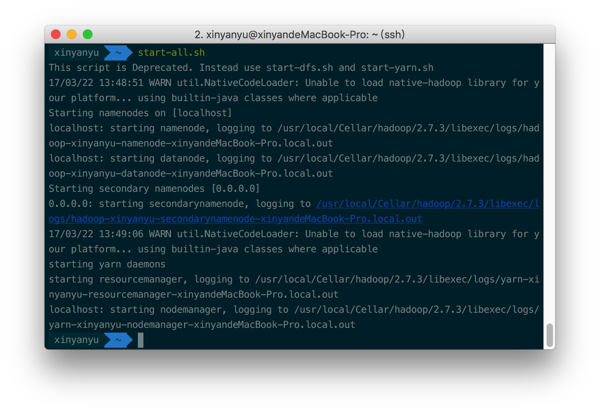
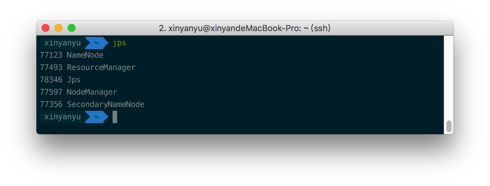

# Mac Serria 伪分布式安装Hadoop以及免密码登录localhost

在平时的学习中，我们使用伪分布式就足够了。


## 1.安装hadoop

### 下载安装包

https://archive.apache.org/dist/hadoop/common/hadoop-2.5.1/

解压

 tar  -zxvf opt/sxt/soft/hadoop-2.5.1.tar.gz

mv  hadoop-2.5.1  hadoop


### 配置环境变量

- 配置java环境

```
cat /etc/profile

#set java environment
JAVA_HOME=/usr/local/java/jdk_64bit_1.7.0_55
PATH=$PATH:$JAVA_HOME/bin
CLASSPATH=.:$JAVA_HOME/lib/dt.jar:$JAVA_HOME/lib/tools.jar
export JAVA_HOME CLASSPATH PATH
```

- 配置hadoop 命令行目录到环境变量中

vi /etc/profile

```
#set hadoop environment
HADOOP_HOME=/opt/sxt/soft/hadoop
PATH=$PATH:$HADOOP_HOME/bin:$HADOOP_HOME/sbin
export HADOOP_HOME PATH
```

- 修改 etc/hadoop/hadoop-env.sh

```
# The java implementation to use.
export JAVA_HOME=/usr/local/java/jdk_64bit_1.7.0_55
```

### hadoop 相关配置文件修改

- 修改etc/hadoop/core-site.xml

```
<configuration>
    <property>
    <!-- namenode 所在主机的数据上传和下载传输的端口  rpc协议 -->
        <name>fs.defaultFS</name>
        <value>hdfs://localhost:9000</value>
    </property>
    <property>
    <!-- 临时目录,默认是/tmp/hadoop-${user.name} 每次重启清空数据, 由于hdfs-default.xml配置中dfs.namenode.name.dir = 	file://${hadoop.tmp.dir}/dfs/name 是用来存储fsimage(数据源信息),用到临时目录,不可以丢失. -->
        <name>hadoop.tmp.dir</name>
        <value>/opt/sxt/soft/hadoop/tmp</value>
    </property>
</configuration>
```

- 修改etc/hadoop/hdfs-site.xml

```
<configuration>
    <property>
        <name>dfs.replication</name>
        <value>1</value>
    </property>
</configuration>
```

## 2. 免密码登录localhost

首先可以尝试这个[链接](http://stackoverflow.com/questions/7439563/how-to-ssh-to-localhost-without-password)中的方法

```
1. ssh-keygen -t rsa
Press enter for each line 提示输入直接按回车就好
2. cat ~/.ssh/id_rsa.pub >> ~/.ssh/authorized_keys
3. chmod og-wx ~/.ssh/authorized_keys 
```

测试 `ssh localhost`如果仍然提示要输入密码，那么可以`vim ~/.ssh/config`文件，添加以下代码。

```
Host localhost
   AddKeysToAgent yes
   UseKeychain yes
   IdentityFile ~/.ssh/id_rsa
```

测试 `ssh localhost`，不再提示需要输入密码。

## 3. 启动和测试

完成上述步骤后，开始测试安装。
首先安装HDFS并格式化namenode

```
hdfs namenode -format
```

之后启动hadoop

```
start-dfs.sh
```



验证安装是否成功
输入`jps`

或者
打开http://localhost:50070
,进入hdfs管理页面
打开http://localhost:8088
,进入hadoop进程管理页面

验证完毕关闭hadoop

```
stop-dfs.sh
```


http://www.cnblogs.com/dagger14/p/6599194.html