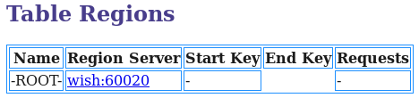

# Hbase与RDBMS

hbase与传统关系数据库区别

hbase适合于非结构化数据存储的数据库。介于Map Entry 和 DB row之间的一种数据存储方式。

1. 数据类型： HBase只有简单的字符串类型，它只保存字符串所有的类型都是交给用户自己处理。关系型数据库可以选择类型
2. 数据操作： HBase操作只有很简单的插入、查询等操作，表与表之间是分离的，没有join
3. 存储模式： HBase基于列存储，每个列族由几个文件保存，不同列族的文件是分离的。传统的关系数据库是基于表格结构和行模式保存的
4. 数据维护： HBase更新操作时，旧的版本仍然保留，实际上时插入了新数据。传统关系数据库是替换修改
5. 可伸缩性： HBase能够容易的增加或者减少硬件数量

Hbase模式设计

eg：学生选择表结构在RDBMS中如下：

学生表（student）：

| s_no | s_name | s_sex | s_age |
| ---- | ------ | ----- | ----- |
| 学号   | 姓名     | 性别    | 年龄    |

课程表（course）：

| c_no | c_name | c_credit |
| ---- | ------ | -------- |
| 课程号  | 课程名    | 学分       |

 

选课表：

| sc_sno | sc_cno | sc_score |
| ------ | ------ | -------- |
| 学号     | 课程号    | 成绩       |

 

 

Hbase中：

student：

 

course:

 

 

工作原理

1）HBase Client端连接ZooKeeper

2）通过ZooKeeper组件client获取哪个server管理-root-Region

3) client访问管理-root-的server

4）由-root-获取管理.meta.的regionserver

5) .meta.中记录了HBase中所有表信息，根据.meta.获取Region分布信息（获取后client将缓存这个信息），访问HRegionServer

（由于client会缓存region信息，因而访问次数多了之后即使不访问.meta.,也能知道访问哪个HRegionServer）

-root-，.meta. table 关系如下：

 

 

http://www.cnblogs.com/wishyouhappy/p/3715566.html