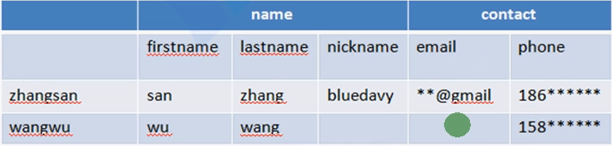

## hbase介绍和架构

### Hadoop生态系统

### HBase简介

– HBase–HadoopDatabase，是一个高可靠性、高性能、面向列、可伸缩、
   	实时读写的分布式数据库
– 利用HadoopHDFS作为其文件存储系统,利用HadoopMapReduce来处理
  	HBase中的海量数据,利用Zookeeper作为其分布式协同服务
– 主要用来存储非结构化和半结构化的松散数据(列存NoSQL数据库)

#### 能做什么

- 海量数据的存储
- 海量数据的查询
  - 60亿条数据，表30个字段
  - 查询1k条数据，需要几十毫秒
  - 查询2w条数据，需要几百毫秒

### HBase数据模型

#### 模型图

#### 示例对比数据存储结构

1，关系型数据库

2，hbase数据库

timestamp是每个单元格都有的一个版本号的意义

table

​	columnfamily

​		column01,column02,...

每条数据有唯一的标识符 

​	rowkey  主键 

面向列的数据库

插入一条数据： rowkey + columnfamily + column01 + timestamp : value  =>cell （单元格）

示例：

person

​	basic

​		name,age,birthday,sex,tel

​	job

​		job1,job2

​	edu

​		xx,yy,zz

TabIe in HBase

- Schema: Tab IeName & Column FamilyName ; 
- value: is stored in column with version as byte[];

示例：

没有值不占用空间

row key：zhangsan，wangwu

#### ROW KEY 说明

- 决定一行数据
- 按照字典顺序排序的。
- Rowkey只能存储64k的字节数据

#### ColumnFamily列族 和 qualifier列 说明

例如上图例子的  cf1是列族，cf1:name 是列

- HBase表中的每个列都归属于某个列族，列族必须作为表模式(schema) 定义的一部分预先给出。如 create ‘test’, ‘course’;
- 列名以列族作为前缀，每个“列族”都可以有多个列成员(column);如 course:math, course:english, 新的列族成员(列)可以随后按需、动态加 入;
- 权限控制、存储以及调优都是在列族层面进行的;
- HBase把同一列族里面的数据存储在同一目录下，由几个文件保存。

#### Timestamp时间戳

- 在HBase每个cell存储单元对同一份数据有多个版本，根据唯一的时间 戳来区分每个版本之间的差异，不同版本的数据按照时间倒序排序， 最新的数据版本排在最前面。
- 时间戳的类型是64位整型。
- 时间戳可以由HBase(在数据写入时自动)赋值，此时时间戳是精确到毫秒的当前系统时间。
- 时间戳也可以由客户显式赋值，如果应用程序要避免数据版本冲突， 就必须自己生成具有唯一性的时间戳。

#### Cell单元格

- 由行和列的坐标交叉决定;

- 单元格是有版本的;

- 单元格的内容是未解析的字节数组;

  • 由{row key， column( =<family> +<qualifier>)， version} 唯一确定的单元。cell中的数据是没有类型的，全部是字节码形式存贮。

#### HLog(WALlog)

用来做数据恢复的

- HLog文件就是一个普通的HadoopSequenceFile，SequenceFile的Key是HLogKey对象，HLogKey中记录了写入数据的归属信息，除了table和region名字外，同时还包括 sequence number和timestamp，timestamp是”写入时间”，sequence number的起始值为0，或者是最近一次存入文件系统中sequence number。
- HLogSequeceFile的Value是HBase的KeyValue对象，即对应HFile中的KeyValue。

### HBase体系架构

#### Client

• 包含访问HBase的接口并维护cache来加快对HBase的访问

#### Zookeeper

• 保证任何时候，集群中只有一个master
• 存贮所有Region的寻址入口。
• 实时监控Regionserver的上线和下线信息。并实时通知Master • 存储HBase的schema和table元数据

#### HMaster

• 为Regionserver分配region
• 负责Regionserver的负载均衡
• 发现失效的Regionserver并重新分配其上的region 
• 管理用户对table的增删改操作

#### HRegionServer

• Regionserver维护region，处理对这些region的IO请求 
• Regionserver负责切分在运行过程中变得过大的region

#### HRegion

• HBase自动把表水平划分成多个区域(region)，每个region会保存一个表里面某段连续的数据;每个表一开始只有一个region，随着数据不断插入表，region不断增大，当增大到一个阀值的时候，region就会等分会两个新的region(裂变);
• 当table中的行不断增多，就会有越来越多的region。这样一张完整的表被保存在多个Regionserver 上。

#### Memstore 与 storefile

- 一个region由多个store组成，一个store对应一个CF(列族)
- store包括位于内存中的memstore和位于磁盘的storefile写操作先写入 memstore，当memstore中的数据达到某个阈值，hregionserver会启动 flashcache进程写入storefile，每次写入形成单独的一个storefile
- 当storefile文件的数量增长到一定阈值后，系统会进行合并(minor、 major compaction)，在合并过程中会进行版本合并和删除工作 (majar)，形成更大的storefile
- 当一个region所有storefile的大小和超过一定阈值后，会把当前的region 分割为两个，并由hmaster分配到相应的regionserver服务器，实现负载 均衡
- 客户端检索数据，先在memstore找，找不到再找storefile
- storefile系统里面就是hfile(hdfs文件)

– HRegion是HBase中分布式存储和负载均衡的最小单元。最小单元就表示不同的HRegion可以分布在不同的 HRegion server上。

– HRegion由一个或者多个Store组成，每个store保存一个columns family。

– 每个Strore又由一个memStore和0至多个StoreFile组成。如图:StoreFile以HFile格式保存在HDFS上。

### HBase一般应用情况

不会直接插入数据到hbase ,而是先插入到关系型数据库在同步到hbase,然后用hbase 来查询.因为hbase是关系型数据库不支持很严格的事务.

