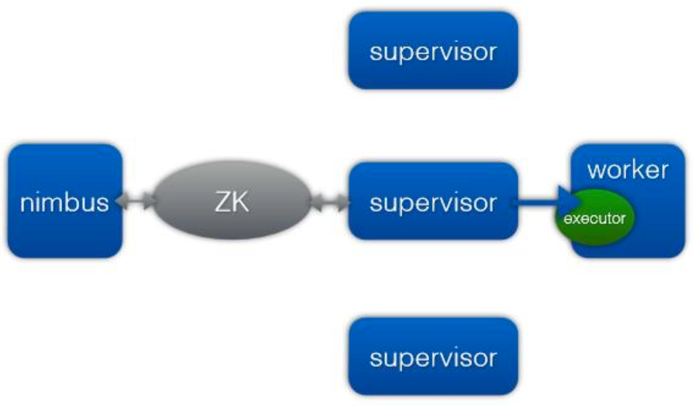
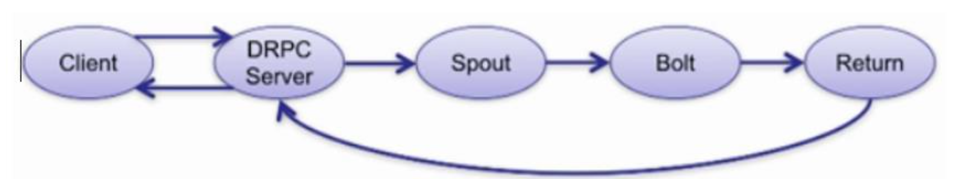
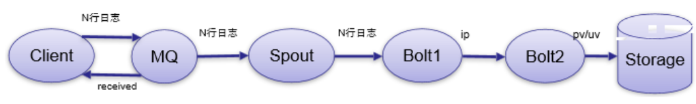
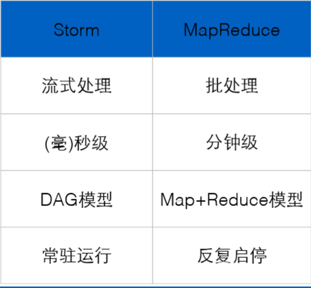
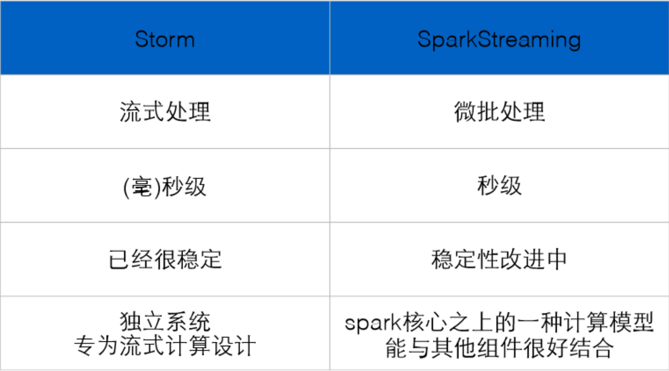

# storm学习笔记

## 介绍和架构

### 简介

• storm是一个分布式的、容错的实时计算系统，它被托管在GitHub上，遵循 Eclipse Public License 1.0。Storm是由BackType开发的实时处理系统，由Twitter开源

• 官网http://storm.apache.org/
• 国内外各大网站使用，例如雅虎、阿里、百度

• 在2013年的时候，Storm进入Apache社区进行孵化，最终进入了Apache顶级项目

### 低延时

• **Storm实时低延迟**，主要有两个原因:

​	– storm进程是常驻内存的，不像hadoop里面是不断的启停的，就没有不断启停的开销。

​	– 第二点，Storm的数据是不经过磁盘的，都是在内存里面，处理完就没有了，处理完就没有了，数据的交换				经过网络，这样就避免磁盘IO的开销，所以Storm可以很低的延迟。

### Storm和hadoop的区别

- –  数据来源:HADOOP是HDFS上某个文件夹下的可能是成TB的数据，STORM是实时新增的某一笔数据
- –  处理过程:HADOOP是分MAP阶段到REDUCE阶段，STORM是由用户定义处理流程，流程中可以包含多个步骤，每个步骤可以是数据源(SPOUT)或处理逻辑(BOLT)
- –  是否结束:HADOOP最后是要结束的，STORM是没有结束状态，到最后一步时，就停
  在那，直到有新
  数据进入时再从头开始
- –  处理速度:HADOOP是以处理HDFS上大量数据为目的，速度慢，STORM是只要处理
  新增的某一笔数据即可
  可以做到很快。
- –  适用场景:HADOOP是在要处理一批数据时用的，不讲究时效性，要处理就提交一个
  JOB，STORM是要处理
  某一新增数据时用的，要讲时效性
- –  与MQ对比:HADOOP没有对比性，STORM可以看作是有N个步骤，每个步骤处理完就
  向下一个MQ发送消息，
  监听这个MQ的消费者继续处理

### 架构:

– Nimbus(主节点)

– Supervisor(从节点)

– Worker(任务程序)

### 编程模型:

– DAG

– Spout(喷口,数据来源)

– Bolt(螺栓,节点,业务处理逻辑)

### 数据传输:

– Zmq

​	• Zmq也是开源的消息传递的框架，虽然叫mq，但它并不是一个message queue，而是一个封装的比较好的消息传递的框架

– Netty

​	• netty是NIO的网络框架，效率比较高。之所以有netty是storm在apache之后呢，zmq的license和storm的license不兼容的，bolt处理完消息后会告诉Spout。

### 高可用性:

​	– 异常处理

​	– 消息可靠性保证机制

### 可维护性:

​	– Storm有个UI可以看跑在上面的程序监控

### 实时请求应答服务(同步)

– 实时请求应答服务(同步)，往往不是一个很简单的操作，而且大量的操作，用DAG模型来提高请求处理速度

– DRPC
– 实时请求处理
– 例子:发送图片，或者图片地址，进行图片特征的提取

这里DRPC Server的好处是什么呢?这样看起来就像是一个Server，经过Spout，然后经过Bolt，不是更麻烦了吗?DRPC Server其实适用于分布式，可以应用分布式处理这个单个请求，来加速处理的过程。

### 流式处理(异步)

- 流式处理(异步)，不是说不快，而是不是等待结果

- 逐条处理

  – 例子:ETL，把关心的数据提取，标准格式入库，它的特点是我把数据给你了，不用再返回给我，这个是异步的

- 另外一种类型呢，就是

- 分析统计

  – 例子:日志PV，UV统计，访问热点统计，这类数据之间是有关联的，比如按某些字段做聚合，加和，平均等等

  

• 最后写到Redis，Hbase，MySQL，或者其他的MQ里面去给其他的系统去消费。

### Storm和MapReduce对比

• Storm:进程、线程常驻运行，数据不进入磁盘，网络传递。

• MapReduce:TB、PB级别数据设计的，一次的批处理作业。 

### Storm和Spark对比

- Storm:纯流式处理，处理数据单元是一个个Tuple。另外Storm专门为流式处理设计，它的数据传输模式更为简单，很多地方也更为高效。并不是不能做批处理，它也可以来做微批处理，来提高吞吐。
- Spark Streaming:微批处理，一个批处理怎么做流式处理呢，它基于内存和DAG可以把处理任务做的很快，把RDD做的很小来用小的批处理来接近流式处理。

