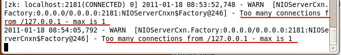
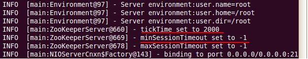

# ZooKeeper系列1：ZooKeeper的配置

问题导读：

1.zookeeper有哪些配置文件？

2.zookeeper最低配置需要哪些配置项？

3.zookeeper高级配置需要配置哪些项？

ZooKeeper 的功能特性通过 ZooKeeper 配置文件来进行控制管理（ zoo.cfg 配置文件）。 ZooKeeper 这样的设计其实是有它自身的原因的。通过前面对 ZooKeeper 的配置可以看出，对 ZooKeeper 集群进行配置的时候，它的配置文档是完全相同的（对于集群伪分布模式来说，只有很少的部分是不同的）。这样的配置方使得在部署ZooKeeper 服务的时候非常地方便。另外，如果服务器使用不同的配置文件，必须要确保不同配置文件中的服务器列表相匹配。

在设置 ZooKeeper 配置文档的时候，某些参数是可选的，但是某些参数是必须的。这些必须的参数就构成了ZooKeeper 配置文档的最低配置要求。

下面是在最低配置要求中必须配置的参数：

## **1 ）最低配置**

**clientPort**

监听客户端连接的端口；

**dataDir**

存储内存中数据库快照的位置；

注意 应该谨慎地选择日志存放的位置，使用专用的日志存储设备能够大大地提高系统的性能，如果将日志存储在比较繁忙的存储设备上，那么将会在很大程度上影响系统的性能。

**tickTime**

基本事件单元，以毫秒为单位。它用来控制心跳和超时，默认情况下最小的会话超时时间为两倍的 tickTime 。

## **2 ）高级配置**

下面是高级配置要求中可选的配置参数，用户可以使用下面的参数来更好地规定 ZooKeeper 的行为：

**dataLogDir**

这个操作将管理机器把事务日志写入到“ dataLogDir ”所指定的目录，而不是“ dataDir ”所指定的目录。这将允许使用一个专用的日志设备并且帮助我们避免日志和快照之间的竞争。配置如下：

```
#the location of the log file

dataLogDir=/root/hadoop-0.20.2/zookeeper-3.3.1/log/data_log
```


**maxClientCnxns**

这个操作将限制连接到 ZooKeeper 的客户端的数量，限制并发连接的数量，它通过 IP 来区分不同的客户端。此配置选项可以用来阻止某些类别的 Dos 攻击。将它设置为 0 或者忽略而不进行设置将会取消对并发连接的限制。

例如，此时我们将 maxClientCnxns 的值设置为 1 ，如下所示：

```
#set maxClientCnxns

maxClientCnxns=1
```


启动 ZooKeeper 之后，首先用一个客户端连接到 ZooKeeper 服务器之上。然后，当第二个客户端尝试对ZooKeeper 进行连接，或者某些隐式的对客户端的连接操作，将会触发 ZooKeeper 的上述配置。系统会提示相关信息，如下图 1 所示：

 

图 1 ： ZooKeeper maxClientCnxns 异常

**minSessionTimeout 和 maxSessionTimeout**

最小的会话超时时间以及最大的会话超时时间。其中，最小的会话超时时间默认情况下为 2 倍的 tickTme 时间，最大的会话超时时间默认情况下为 20 倍的会话超时时间。在启动时，系统会显示相应信息，见下图 2 所示，默认会话超时时间：

 

图2 ：默认会话超时时间

从上图中可以看书， minSessionTimeout 以及 maxSessionTimeout 的值均为 -1 ，现在我们来设置系统的最小会话超时时间以及最大会话超时时间，如下所示：

```
#set minSessionTimeout

minSessionTimeout=1000

#set maxSessionTImeout

maxSessionTimeout=10000
```


在配置 minSessionTmeout 以及 maxSessionTimeout 的值的时候需要注意，如果将此值设置的太小的话，那么会话很可能刚刚建立便由于超时而不得不退出。一般情况下，不能将此值设置的比 tickTime 的值还小。

## **3 ）集群配置**

**initLimit**

此配置表示，允许 follower （相对于 leader 而言的“客户端”）连接并同步到 leader 的初始化连接时间，它以 tickTime 的倍数来表示。当超过设置倍数的 tickTime 时间，则连接失败。

**syncLimit**

此配置表示， leader 与 follower 之间发送消息，请求和应答时间长度。如果 follower 在设置的时间内不能与leader 进行通信，那么此 follower 将被丢弃。

来源： <http://www.aboutyun.com/thread-9308-1-1.html>