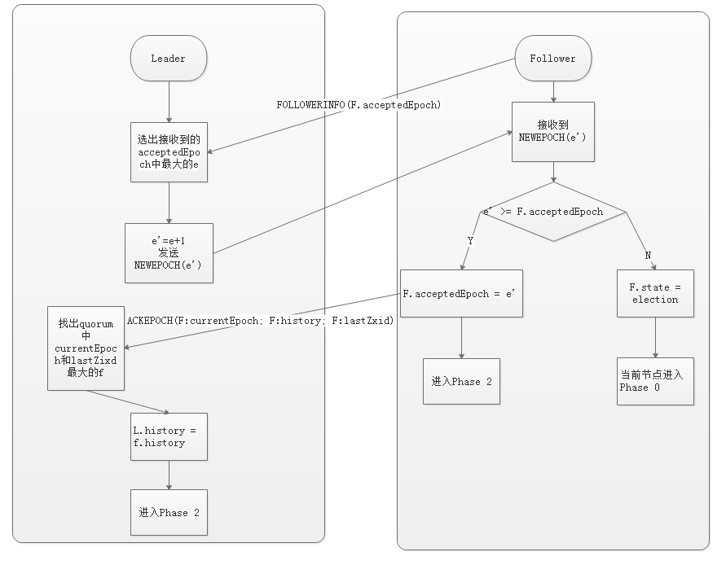
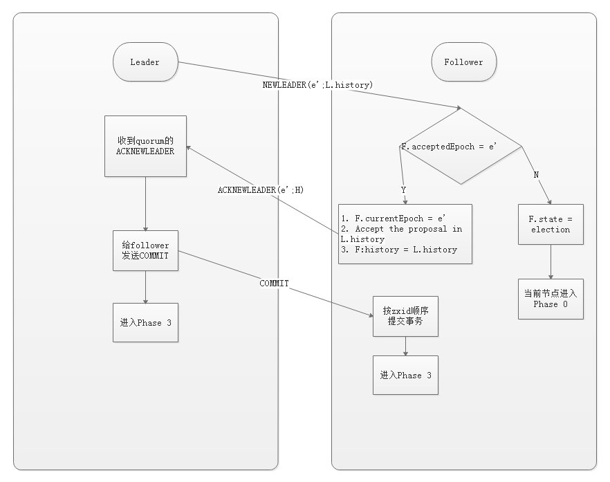
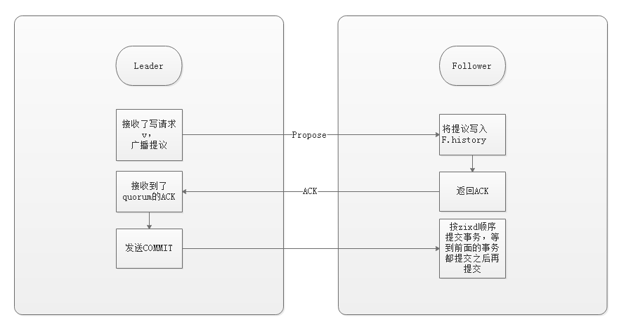
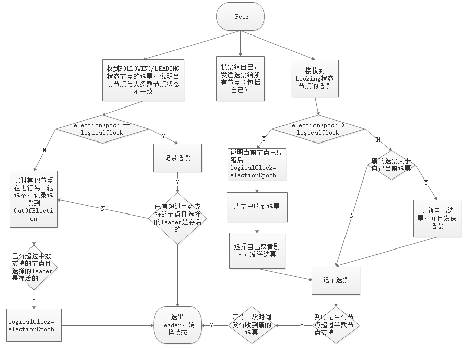
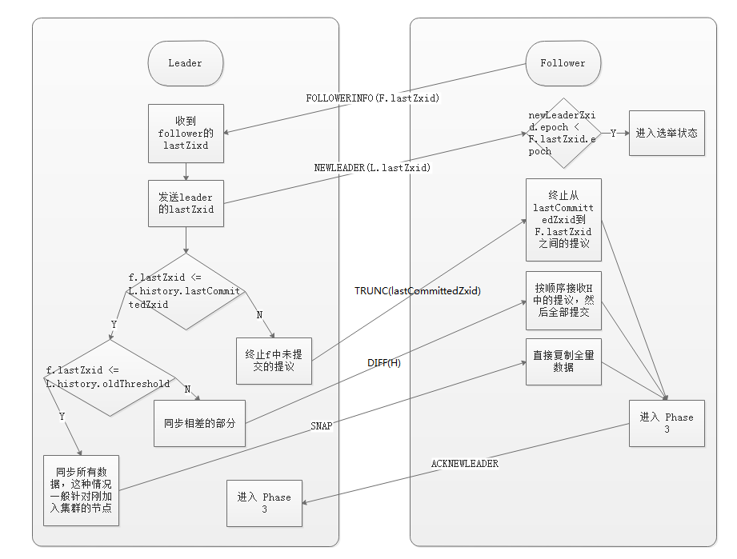

[TOC]

# Zookeeper ZAB 协议分析

## 前言

ZAB 协议是为分布式协调服务 ZooKeeper 专门设计的一种支持崩溃恢复的原子广播协议。在 ZooKeeper 中，主要依赖 ZAB 协议来实现分布式数据一致性，基于该协议，ZooKeeper 实现了一种主备模式的系统架构来保持集群中各个副本之间的数据一致性。

## Atomic broadcast protocol

ZAB 是 Zookeeper 原子广播协议的简称，下面我们来讨论协议的内容，注意：理论与实现是有区别的，如果你对协议的理论不感兴趣，可以直接跳过看实现。

### 问题的提出

Zookeeper 客户端会随机连接到 Zookeeper 集群的一个节点，如果是读请求，就直接从当前节点中读取数据；如果是写请求，那么节点就会向 leader 提交事务，leader 会广播事务，只要有超过半数节点写入成功，该写请求就会被提交（类 2PC 协议）。

那么问题来了：

- 主从架构下，leader 崩溃，数据一致性怎么保证？
- 选举 leader 的时候，整个集群无法处理写请求的，如何快速进行 leader 选举？

带着这两个问题，我们来看看 ZAB 协议是如何解决的。

### ZAB 的四个阶段

#### 术语解释

- **quorum**：集群中超过半数的节点集合

ZAB 中的节点有三种状态

- **following**：当前节点是跟随者，服从 leader 节点的命令
- **leading**：当前节点是 leader，负责协调事务
- **election/looking**：节点处于选举状态

*代码实现中多了一种：observing 状态，这是 Zookeeper 引入 Observer 之后加入的，Observer 不参与选举，是只读节点，跟 ZAB 协议没有关系*

节点的持久状态

- **history**：当前节点接收到事务提议的 log
- **acceptedEpoch**：follower 已经接受的 leader 更改年号的 NEWEPOCH 提议
- **currentEpoch**：当前所处的年代
- **lastZxid**：history 中最近接收到的提议的 zxid （最大的）

> 在 ZAB 协议的事务编号 Zxid 设计中，Zxid 是一个 64 位的数字，其中低 32 位是一个简单的单调递增的计数器，针对客户端每一个事务请求，计数器加 1；而高 32 位则代表 Leader 周期 epoch 的编号，每个当选产生一个新的 Leader 服务器，就会从这个 Leader 服务器上取出其本地日志中最大事务的ZXID，并从中读取 epoch 值，然后加 1，以此作为新的 epoch，并将低 32 位从 0 开始计数。
>
> epoch：可以理解为当前集群所处的年代或者周期，每个 leader 就像皇帝，都有自己的年号，所以每次改朝换代，leader 变更之后，都会在前一个年代的基础上加 1。这样就算旧的 leader 崩溃恢复之后，也没有人听他的了，因为 follower 只听从当前年代的 leader 的命令。*

#### Phase 0: Leader election（选举阶段）

节点在一开始都处于选举阶段，只要有一个节点得到超半数节点的票数，它就可以当选准 leader。只有到达 Phase 3 准 leader 才会成为真正的 leader。这一阶段的目的是就是为了选出一个准 leader，然后进入下一个阶段。

协议并没有规定详细的选举算法，后面我们会提到实现中使用的 Fast Leader Election。

#### Phase 1: Discovery（发现阶段）

在这个阶段，followers 跟准 leader 进行通信，同步 followers 最近接收的事务提议。这个一阶段的主要目的是发现当前大多数节点接收的最新提议，并且准 leader 生成新的 epoch，让 followers 接受，更新它们的 acceptedEpoch
phase 1
一个 follower 只会连接一个 leader，如果有一个节点 f 认为另一个 follower p 是 leader，f 在尝试连接 p 时会被拒绝，f 被拒绝之后，就会进入 Phase 0。

#### Phase 2: Synchronization（同步阶段）

同步阶段主要是利用 leader 前一阶段获得的最新提议历史，同步集群中所有的副本。只有当 quorum 都同步完成，准 leader 才会成为真正的 leader。follower 只会接收 zxid 比自己的 lastZxid 大的提议。
phase 2

#### Phase 3: Broadcast（广播阶段）

到了这个阶段，Zookeeper 集群才能正式对外提供事务服务，并且 leader 可以进行消息广播。同时如果有新的节点加入，还需要对新节点进行同步。
phase 3
值得注意的是，ZAB 提交事务并不像 2PC 一样需要全部 follower 都 ACK，只需要得到 quorum （超过半数的节点）的 ACK 就可以了。

## 协议实现

协议的 Java 版本实现跟上面的定义有些不同，选举阶段使用的是 Fast Leader Election（FLE），它包含了 Phase 1 的发现职责。因为 FLE 会选举拥有最新提议历史的节点作为 leader，这样就省去了发现最新提议的步骤。实际的实现将 Phase 1 和 Phase 2 合并为 Recovery Phase（恢复阶段）。所以，ZAB 的实现只有三个阶段：

- **Fast Leader Election**
- **Recovery Phase**
- **Broadcast Phase**

### Fast Leader Election

前面提到 FLE 会选举拥有最新提议历史（lastZixd最大）的节点作为 leader，这样就省去了发现最新提议的步骤。这是基于拥有最新提议的节点也有最新提交记录的前提。

#### 成为 leader 的条件

1. 选`epoch`最大的
2. `epoch`相等，选 zxid 最大的
3. `epoch`和`zxid`都相等，选择`server id`最大的（就是我们配置`zoo.cfg`中的`myid`）

节点在选举开始都默认投票给自己，当接收其他节点的选票时，会根据上面的条件更改自己的选票并重新发送选票给其他节点，当有一个节点的得票超过半数，该节点会设置自己的状态为 leading，其他节点会设置自己的状态为 following。

#### 选举过程

FLE

### Recovery Phase （恢复阶段）

这一阶段 follower 发送它们的 lastZixd 给 leader，leader 根据 lastZixd 决定如何同步数据。这里的实现跟前面 Phase 2 有所不同：Follower 收到 TRUNC 指令会中止 L.lastCommittedZxid 之后的提议，收到 DIFF 指令会接收新的提议。

> history.lastCommittedZxid：最近被提交的提议的 zxid
> history:oldThreshold：被认为已经太旧的已提交提议的 zxid

Recovery Phase

## 总结

经过上面的分析，我们可以来回答开始提到的两个问题

- 主从架构下，leader 崩溃，数据一致性怎么保证？

  leader 崩溃之后，集群会选出新的 leader，然后就会进入恢复阶段，新的 leader 具有所有已经提交的提议，因此它会保证让 followers 同步已提交的提议，丢弃未提交的提议（以 leader 的记录为准），这就保证了整个集群的数据一致性。

- 选举 leader 的时候，整个集群无法处理写请求的，如何快速进行 leader 选举？

  这是通过 Fast Leader Election 实现的，leader 的选举只需要超过半数的节点投票即可，这样不需要等待所有节点的选票，能够尽早选出 leader。

这篇文章是根据我对 ZAB 协议的理解写成的，如果觉得有些细节没有讲清楚，可以看后面的参考资料，我主要是参考这篇[论文](http://www.tcs.hut.fi/Studies/T-79.5001/reports/2012-deSouzaMedeiros.pdf&usg=AFQjCNG8TKh-JN5Csqoditj7hlOo5nbR6g)的。

*参考资料*
[ZooKeeper’s atomic broadcast protocol:Theory and practice](http://www.tcs.hut.fi/Studies/T-79.5001/reports/2012-deSouzaMedeiros.pdf&usg=AFQjCNG8TKh-JN5Csqoditj7hlOo5nbR6g)

http://blog.xiaohansong.com/2016/08/25/zab/