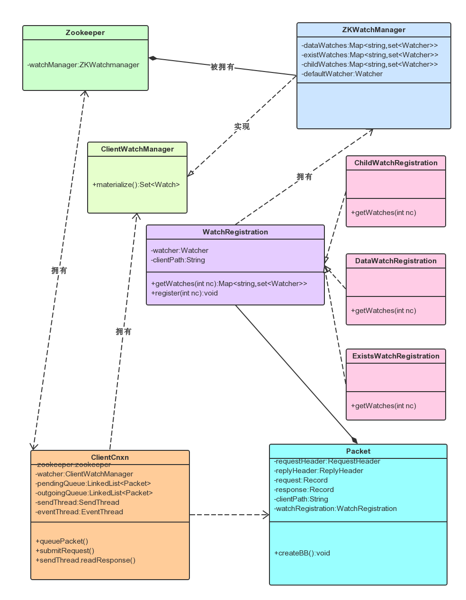
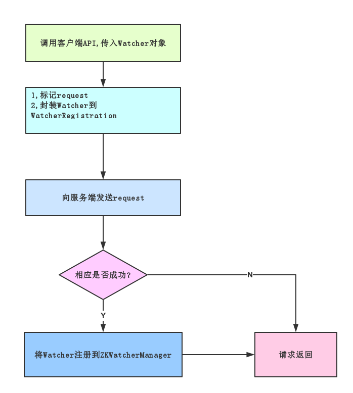

[TOC]

# zookeeper中Watcher总结

发表于 2015-07-02   |   标签 [zookeeper](http://www.dongzhuoyao.com/tag/zookeeper/), [zookeeper watcher](http://www.dongzhuoyao.com/tag/zookeeper-watcher/)   |  

## ZooKeeper的Watcher机制

总体来说.可以概括为以下几个过程:

客户端注册Watcher,

服务端处理Watcher,

客户端回调Watcher,

其内部组件之间的关系如下所示:

## 客户端Watcher注册流程图

## Watcher特性总结

zookeeper具有以下几个特性:

- 一致性:

从上面的介绍中可以看到，无论是服务端还是客户端,一旦一个watcher被触发,zookeeper都会将其从相应的存储中移除。因此,开发人员在watch的使用上要记住的一点是要需要反复注册。这样的设计有效的减轻了服务器的压力。试想,如果注册一个Watcher之后一直有效,那么,针对这些更新非常频繁的节点,服务端会不断的向客户端发送时间通知,这无论对于网络还是服务店性能的影响都非常大.

- 客户端串行执行

客户端Watcher回调的过程是一个串行同步的过程,这为我们保证了顺序,同时,需要开发人员注意的一点是,千万不要因为一个watcher的处理逻辑影响了整个客户端的watcher回调。

- 轻量

WatchedEvent是zookeeper整个Watcher通知机制最小同志单元,这个数据结构中只包含三部分内容:通知状态,事件类型和节点路径。也就是说,Watcher通知非常简单,只会告诉客户端发生了事件,而不会说明事件的具体内容。例如针对NodeDataChanged事件,zookeeper的Watcher只会通知客户端指定数据节点的数据内容发生了变更,而对于原始数据以及变更后的新数据都无法从这个事件中直接获取到。而是需要客户端主动重新去获取数据----这也是zookeeper的Watcher机制一个非常重要的特性。

另外,客户端向服务端注册Watcher的时候，并不会把客户端真实的Watcher对象传递到服务端，仅仅只是在客户端请求中使用boolean类型属性进行了标记,同时服务端也仅仅保存了当前连接的ServerCnxn对象。

如此轻量的Watcher机制设计,在网络开销和服务端内存开销上都是非常廉价的。

## 参考文献:

从Paxos到Zookeeper分布式一致性原理与实践，倪超著

Note:本文章基于zookeeper 3.3.1代码而写

http://www.dongzhuoyao.com/zookeeper-watcher/