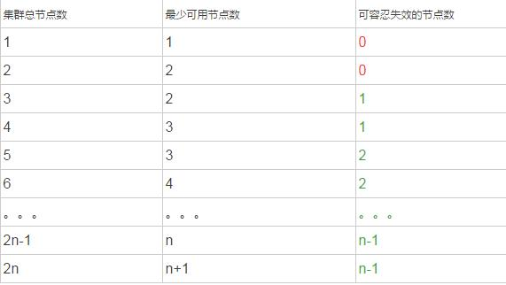

# 在项目中大量使用zookeeper，为什么却都建议配置为奇数台？

JAVA小生 2018-01-08 21:03:39

项目中大量使用zookeeper，为什么说zookeeper建议配置为奇数台？

使用过zookeeper的同学都知道，集群中的zookeeper需要超过半数，整个集群对外才可用。这里所谓的整个集群对外才可用，是指整个集群还能选出一个Leader来，zookeeper默认采用quorums来支持Leader的选举。

其实quorums机制有两个作用：

1.可以保证集群中选举出leader，且是唯一的一个，不会出现脑裂(split-brain)。

2.当客户端更新数据时，当大多数节点更新成功，客户端就会被通知更新成功了，其他节点可以稍后再更新，以致达到数据的最终一致性

可能这还不够清晰，举个列子：设集群中最少可用节点数为n,

 

由此可见，当集群总数为1或2，都不行，因为可容忍失效的节点数都为0，所以要想保证zookeeper的高可用，至少需要3台+。同时，我们可以发现一个规律，3个节点与4个节点的效果是一样的，可容忍失效的节点数都是1，即2n-1与2n，可容忍失效的节点数都是n-1。2n-1个节点能达到的效果，为啥要用2n个节点呢？省一台节省了成本。配置成偶数台也不会有问题，只不过浪费了而已。

https://www.toutiao.com/i6508618650281312772/?tt_from=android_share&utm_campaign=client_share&timestamp=1516030813&app=news_article&iid=22128443611&utm_medium=toutiao_android