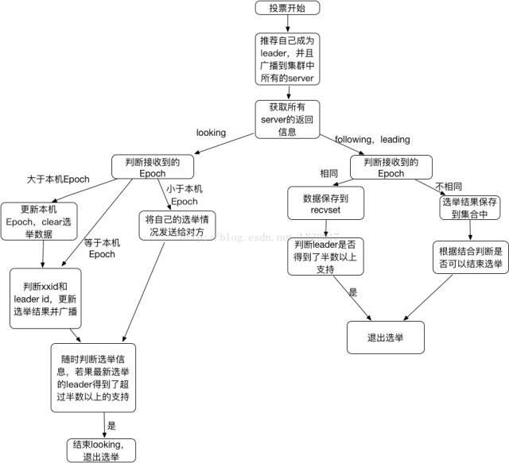
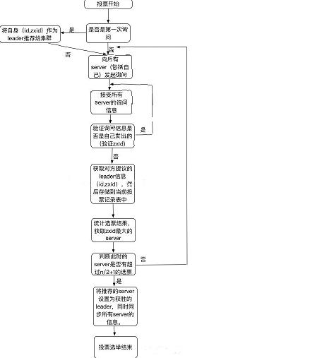

[TOC]

# zookeeper设计原则和工作原理

 

## **一、 zookeeper是什么**

ZooKeeper是一个分布式的，开放源码的分布式应用程序协调服务

具体介绍可以看官方网站：https://zookeeper.apache.org/

## **二、 zookeeper能做什么**

1、 配置维护：在分布式系统中，一般会把服务部署到n台机器上，服务配置文件都是相同的，如果配置文件的配置选项发生了改变，那我们就得一台一台的去改动。这时候zookeeper就起作用了，可以把zk当成一个高可用的配置存储器，把这样配置的事情交给zk去进行管理，将集群的配置文件拷贝到zookeeper的文件系统的某个节点上，然后用zk监控所有分布式系统里的配置文件状态，一旦发现有配置文件发生了变化，那么每台服务器同步zk的配置文件，zk同时保证同步操作的原子性，确保每个服务器的配置文件都能被更新。

2、 命名服务：在分布式应用中，通常需要一个完整的命名规则，既能够产生唯一的名称又便于人识别和记住。Zk就提供了这种服务，类似于域名和ip之间对应关系，域名容易记住，通过名称来获取资源和服务的地址，提供者等信息。

3、 分布式锁：分布式程序分布在不同主机上的进程对互斥资源进行访问的时候需要加锁。这样理解：很多分布式系统有多个服务窗口，但是某个时刻只让一个服务去干活，当这台服务器出问题的时候锁释放，里脊fail over到另外的服务。举例子，比如去某个地方办理证件的时候，只能有一个窗口对你服务，如果这个窗口的柜员有急事走了，那么系统或者经理给你指定另外一个窗口继续服务。

4、 集群管理：分布式集群中，经常会由于各种原因，比如硬件故障，网络问题，有些节点挂掉、有些节点加进来。这个时候机器需要感知到变化，然后根据变化做出对应的决策，那么zk就实现了类似这种集群的管理。

5、 队列管理 ：类似一些mq实现队列的功能，这个不常用，不适合高性能的应用。

## **三、 zookeeper的角色管理**

领导者（Leader）：领导者负责进行投票的发起和决议，更新系统状态。

学习者（Learner）：跟随者（Follower）：用于接受客户请求并向客户端返回结果，在选主过程中参与投票。

观察者（ObServer）：ObServer可以接受客户端连接，将写请求转发给leader节点，但ObServer不参加投票过程，只同步leader状态。ObServer的目的是为了扩展系统，提高读取速度。

客户端（Client）：请求发起方。

## **四、 zookeeper设计原则**

1、最终一致性：客户端（Client）无论连接到哪个zk的节点，展示给他的视图都是一样的。

2、可靠性：消息message被到一台服务器接受，那么它到任何服务器都被接受。

3、 实时性：zk保证在一个时间间隔范围内获得服务器的更新信息，或者服务器失效信息。但是由于网络延时等一些其他原因，zk不能保证两个客户端同事得到跟新或者失效信息。

4、 等待无关：慢的或者失效的客户端（Client）不得干预快速的client的请求，使得每个client都能有效的等待。

5、 原子性：更新只能成功或者失败，没有其他中间信息。

6、 顺序性：包括全局有序和偏序两种：全局有序是指如果再一台服务器上消息a在消息b前发布，则在所有Server上消息a都将在消息b前被发布；偏序是指如果一个消息b在消息a后被同一个发送者发布，a必将排在b前面。

## **五、 zookeeper工作原理**

zk的核心是原子广播，这个机制保证了各个Server之间的同步，实现这个机制的协议叫做Zab协议。Zab协议有两种模式，分别是恢复模式（选主）和广播模式（同步）。当服务启动或者领导者崩溃后，Zab进入恢复模式，当leader被选举出来，然后进行同步模式，同步完成以后，恢复模式结束。

为了保证事务的顺序一致性。实现中zxid是一个64位的数字，它高32位是用epoch用来标志leader关系是否改变，每次一个新的leader选举出来，都会拥有一个新的epoch。低32位用来递增计数。

（1）Serverid：在配置server时，给定的服务器的标示id。

（2）Zxid:服务器在运行时产生的数据id，zxid越大，表示数据越新。

（3）Epoch：选举的轮数，即逻辑时钟。随着选举的轮数++

### **1、 选主流程**

当leader崩溃或者leader失去大多数的follower，这时候zk进入恢复模式，然后需要重新选举出一个leader。让所有的Server都恢复到一个正确的状态。Zk选举算法有两种，一种是基于**basic paxos**实现，一种是基于**fast paxos**算法实现。系统默认的是fast paxos。

每个Server在工作过程中有三种状态：

LOOKING：当前Server不知道Leader是谁，正在搜寻。

LEADING:当前Server即为选举出来的leader。

FOLLOWING：leader已经选举出来，当前Server与之同步。

#### basic paxos流程:

1、选举线程由当前Server发起选举的线程担任，其主要功能是对投票结果进行统计，并选出推荐的Server。

2、选举线程首先向所有Server发起一次询问（包括自己）。

3、选举线程收到回复后，验证是否是自己发起的询问（验证zxid是否一致），然后获取对方的id（myid），并存储到当前询问对象列表中，最后获取对方提议的leader相关信息（myid，zxid），并将这些信息存储到当次选举的投票记录表中。

4、收到所有Server回复以后，就计算出zxid最大的那个Server，并将这个Server相关信息设置成下一次投票的Server。

5、线程将当前zxid最大的Server设置成为当前Server要推荐的Leader，若果此时获胜的Server获得n/2+1的Server票数，设置当前推荐的leader为获胜的Server，将根据获胜的Server相关信息设置成自己的状态，否则，继续这个过程，直到leader被选举出来。

备注：要使Leader获得多数的Server支持，则Server总数必须是奇数2n+1，且存活的Server的数据不得少于n+1。

zookeeper

#### fast paxos流程:

1、 server启动、恢复准备加入集群，此时都会读取本身的zxid等信息。

2、 所有server加入集群时都会推荐自己成为leader，然后将（leader id,zxid,epoch）作为广播信息到集群中所有的server，等待集群中的server返回信息。

3、 收到集群中其他服务器返回的信息，分为两类，服务器处于looking状态，或者其他状态。

**（1） 服务器处于looking状态**

先判断逻辑时钟Epoch：

（a） 如果接受到Epoch大于自己目前的逻辑时钟，那么更新本机的Epoch，同时clear其他服务器发送来的选举数据。然后判断是否需要更新当前自己的选举情况（开始选择的leader id是自己）。

判断规则：保存的zxid最大值和leaderid来进行判断。先看数据zxid，zxid大的胜出；其次判断leader id，leader id大的胜出；然后再将自身最新的选举结果广播给其他server。

（b） 如果接受到的Epoch小于目前的逻辑时钟，说明对方处于一个比较低一轮的选举轮数，这时需要将自己的选举情况发送给它即可。

（c） 如果接收到的Epoch等于目前的逻辑时钟，再根据（a）中的判断规则，将自身的最新选举结果广播给其他server。

同时server还要处理两种情况：

（a） 如果server接收到了其他所有服务器的选举信息，那么则根据这些选举信息确定自己的状态（Following，Leading），结束Looking，退出选举。

（b） 即时没有收到所有服务器的选举信息，也可以判断一下根据以上过程之后最新的选举leader是不是得到了超过半数以上服务器的支持，如果是则尝试接受最新数据，如果没有最新数据，说明都接受了这个结果，同样也退出选举过程。

**（2） 服务器处于其他状态（Following，Leading）**

（a） 若果逻辑时钟Epoch相同，将该数据保存到recvset，若果所接受服务器宣称自己是leader，那么将判断是不是有半数以上的服务器选举他，若果是则设置选举状态退出选举过程。

（b） 若果Epoch不相同，那么说明另一个选举过程中已经有了选举结果，于是将选举结果加入到outofelection集合中，再根据outofelection来判断是否可以结束选举，保存逻辑时钟，设置选举状态，并退出选举过程。

zookeeper

### 2、 同步流程

1、 leader等待server连接。

2、 follower连接到leader，将最大的zxid发送给leader。

3、 leader根据zxid确定同步点。

4、 同步完成之后，通知follower成为uptodat状态。

5、 follower收到uptodate消息后，开始接受client请求服务。

### 3、 主要功能

#### **1、 Leader主要功能**

（a） 恢复数据。

（b） 维持与Learner的心跳，接受Learner请求并判断Learner的请求消息类型。

备注：Learner的消息类型主要是ping、request、ack、revalidate。

ping消息：是指Learner的心跳信息。

request消息：follower发送的提议信息，包括写请求和同步请求。

ack消息：是follower对提议的回复，超过半数follower通过，则commit提议。

revalidate消息：用来延长session有效时间。

#### **2、 Follower主要功能**

（a） 向Leader发送请求。

（b） 接受Leaser消息并进行处理。

（c） 接受Client的请求，如果是写请求，发送给Leader进行投票。

（d） 返回结果给Client。

备注：follower处理Leader的如下几个消息：

ping：心跳信息。

proposal消息：leader发起提案，要求follower投票。

commit消息：服务器端最新一次提案的消息。

uptodate消息：表明同步完成。

revalidate消息：根据Leader的REVALIDATE结果，关闭待revalidate的session还是允许其接受消息；

sync消息：返回sync信息到client客户端。

https://www.toutiao.com/i6500040588123963917/?tt_from=android_share&utm_campaign=client_share&timestamp=1516030703&app=news_article&iid=22128443611&utm_medium=toutiao_android