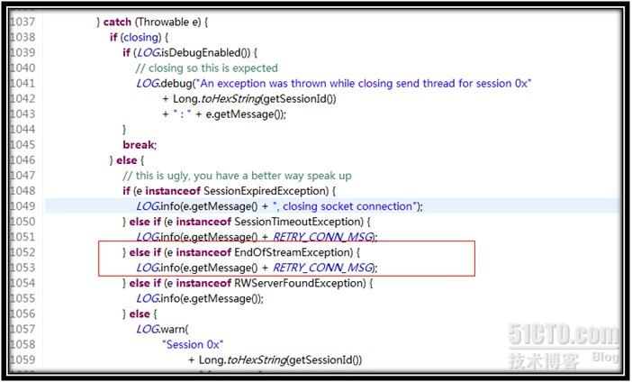
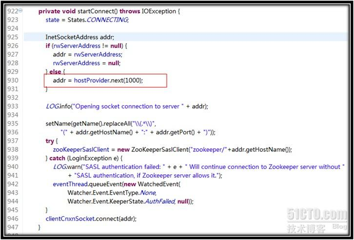
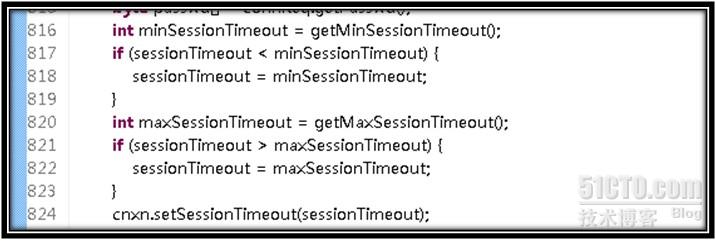

[TOC]


# ZooKeeper 会话超时

  

## **1、会话概述**

在ZooKeeper中，客户端和服务端建立连接后，会话随之建立，生成一个全局唯一的会话ID(Session ID)。服务器和客户端之间维持的是一个长连接，在SESSION_TIMEOUT时间内，服务器会确定客户端是否正常连接(客户端会定时向服务器发送heart_beat，服务器重置下次SESSION_TIMEOUT时间)。因此，在正常情况下，Session一直有效，并且ZK集群所有机器上都保存这个Session信息。在出现网络或其它问题情况下（例如客户端所连接的那台ZK机器挂了，或是其它原因的网络闪断），客户端与当前连接的那台服务器之间连接断了，这个时候客户端会主动在地址列表（实例化ZK对象的时候传入构造方法的那个参数connectString）中选择新的地址进行连接。

## **2、连接断开**

好了，上面基本就是服务器与客户端之间维持会话的过程了。在这个过程中，用户可能会看到两类异常CONNECTIONLOSS(连接断开)和SESSIONEXPIRED(Session过期)。连接断开(CONNECTIONLOSS)一般发生在网络的闪断或是客户端所连接的服务器挂机的时候，这种情况下，ZooKeeper客户端自己会首先感知到这个异常,具体逻辑是在如下方法中触发的：

```java
void org.apache.zookeeper.ClientCnxn.SendThread.run(){ 
…… 
…… 
    } catch (Throwable e) { 
        if (closing) { 
            if (LOG.isDebugEnabled()) { 
                // closing so this is expected 
                LOG.debug("An exception was thrown while closing send thread for session 0x" 
                        + Long.toHexString(getSessionId()) 
                        + " : " + e.getMessage()); 
            } 
            break; 
        } else { 
            // this is ugly, you have a better way speak up 
            if (e instanceof SessionExpiredException) { 
                LOG.info(e.getMessage() + ", closing socket connection"); 
            } else if (e instanceof SessionTimeoutException) { 
                LOG.info(e.getMessage() + RETRY_CONN_MSG); 
            } else if (e instanceof EndOfStreamException) { 
                LOG.info(e.getMessage() + RETRY_CONN_MSG); 
            } else if (e instanceof RWServerFoundException) { 
                LOG.info(e.getMessage()); 
            } else { 
    ……                 
    ……                     
} 
```

一种场景是Server服务器挂了，这个时候，ZK客户端首选会捕获异常，如下：

[](image-201802262035/085824958.jpg)

捕获异常后，ZK客户端会打印类似于如下日志：

```
EndOfStreamException: Unable to read additional data from server sessionid 0x13ab17ad9ec000b, likely server has closed socket 
```

然后做一些socket连接的善后工作。接下去是客户端重新选择一个Server Ip尝试连接，逻辑如代码C2-1所示，这里主要就是从地址列表中获取一个新的Server地址进行连接，关于这个地址如何获取，请查看这个文章：《[ZooKeeper客户端地址列表的随机原理](http://nileader.blog.51cto.com/1381108/932948)》。

```java
[C2-1] 
private void startConnect() throws IOException { 
    state = States.CONNECTING; 
 
    InetSocketAddress addr; 
    if (rwServerAddress != null) { 
        addr = rwServerAddress; 
        rwServerAddress = null; 
    } else { 
        addr = hostProvider.next(1000); 
    } 
 
    LOG.info("Opening socket connection to server " + addr); 
 
    setName(getName().replaceAll("\\(.*\\)", 
            "(" + addr.getHostName() + ":" + addr.getPort() + ")")); 
    try { 
        zooKeeperSaslClient = new ZooKeeperSaslClient("zookeeper/"+addr.getHostName()); 
    } catch (LoginException e) { 
        LOG.warn("SASL authentication failed: " + e + " Will continue connection to Zookeeper server without " 
                + "SASL authentication, if Zookeeper server allows it."); 
        eventThread.queueEvent(new WatchedEvent( 
                Watcher.Event.EventType.None, 
                Watcher.Event.KeeperState.AuthFailed, null)); 
    } 
    clientCnxnSocket.connect(addr); 
} 
```

[](image-201802262035/090146268.jpg)

 程序运行过程中，整个过程日志打印大致如下：

```
2012-10-31 09:09:57,379 - INFO  [main-SendThread(test.zookeeper.connection_string2:2181):zookeeper.ClientCnxn$SendThread@1053] - Unable to read additional data from server sessionid 0x23ab45c87df0000, likely server has closed socket, closing socket connection and attempting reconnect 
 
收到事件通知：Disconnected 
 
获取数据成功，path：/nileader 
2012-10-31 09:09:58,293 - INFO  [main-SendThread-zookeeper.ClientCnxn$SendThread@933] - Opening socket connection to server /1.2.1.1:2181 
 
2012-10-31 09:09:58,294 - WARN  [main-SendThread-client.ZooKeeperSaslClient@123] - SecurityException: java.lang.SecurityException: Unable to locate a login configuration occurred when trying to find JAAS configuration. 
 
2012-10-31 09:09:58,295 - INFO  [main-SendThread-client.ZooKeeperSaslClient@125] - Client will not SASL-authenticate because the default JAAS configuration section 'Client' could not be found. If you are not using SASL, you may ignore this. On the other hand, if you expected SASL to work, please fix your JAAS configuration. 
 
2012-10-31 09:09:58,296 - INFO  [main-SendThread-zookeeper.ClientCnxn$SendThread@846] - Socket connection established to test.zookeeper.connection_string/1.2.1.1:2181, initiating session 
 
2012-10-31 09:09:58,299 - INFO  [main-SendThread-zookeeper.ClientCnxn$SendThread@1175] - Session establishment complete on server test.zookeeper.connection_string/1.2.1.1:2181, sessionid = 0x23ab45c87df0000, negotiated timeout = 10000 
 
收到事件通知：SyncConnected 
```

 所以，现在对于“连接断开”这个过程就一目了然了，核心流程如下:

**ZK客户端捕获“连接断开”异常 ——> 获取一个新的ZK地址 ——> 尝试连接**

在这个流程中，我们可以发现，整个过程不需要开发者额外的程序介入，都是ZK客户端自己会进行的，并且，使用的会话ID都是同一个，所以结论就是：发生CONNECTIONLOSS的情况，应用不需要做什么事情，等待ZK客户端建立新的连接即可。

## 3、会话超时

SESSIONEXPIRED发生在上面蓝色文字部分，这个通常是ZK客户端与服务器的连接断了，试图连接上新的ZK机器，但是这个过程如果耗时过长，超过了SESSION_TIMEOUT 后还没有成功连接上服务器，那么服务器认为这个Session已经结束了（服务器无法确认是因为其它异常原因还是客户端主动结束会话），由于在ZK中，很多数据和状态都是和会话绑定的，一旦会话失效，那么ZK就开始清除和这个会话有关的信息，包括这个会话创建的临时节点和注册的所有Watcher。在这之后，由于网络恢复后，客户端可能会重新连接上服务器，但是很不幸，服务器会告诉客户端一个异常：SESSIONEXPIRED（会话过期）。此时客户端的状态变成 CLOSED状态，应用要做的事情就是的看自己应用的复杂程序了，要重新实例zookeeper对象，然后重新操作所有临时数据（包括临时节点和注册Watcher），总之，会话超时在ZK使用过程中是真实存在的。

 

所以这里也简单总结下，一旦发生会话超时，那么存储在ZK上的所有临时数据与注册的订阅者都会被移除，此时需要重新创建一个ZooKeeper客户端实例，需要自己编码做一些额外的处理。

 

## **4、会话时间（Session Time）**

在《[ZooKeeper API 使用](http://nileader.blog.51cto.com/1381108/795265)》一文中已经提到，在实例化一个ZK客户端的时候，需要设置一个会话的超时时间。这里需要注意的一点是，客户端并不是可以随意设置这个会话超时时间，在ZK服务器端对会话超时时间是有限制的，主要是**minSessionTimeout**和**maxSessionTimeout**这两个参数设置的。（详细查看这个文章《[ZooKeeper管理员指南](http://nileader.blog.51cto.com/1381108/1032157)》）Session超时时间限制，如果客户端设置的超时时间不在这个范围，那么会被强制设置为最大或最小时间。 默认的Session超时时间是在2 * tickTime ~ 20 * tickTime。ZK实现如下，在这个方法中处理：

```
ZooKeeperServer.processConnectRequest(ServerCnxn cnxn, ByteBuffer incomingBuffer) 
```

[](image-201802262035/090801775.jpg)

所以，如果应用对于这个会话超时时间有特殊的需求的话，一定要和ZK管理员沟通好，确认好服务端是否设置了对会话时间的限制。 


http://blog.51cto.com/nileader/938106