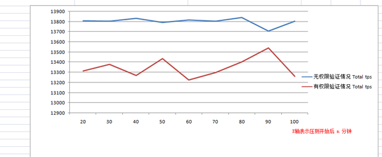

[TOC]


# zookeeper 权限控制

目前在公司内部使用ZooKeeper的地方越来越多，应用大多喜欢自己部署一套ZK集群来使用。考虑到ZK的高可用，并且一套ZK集群至少3台机器， 那么每个应用，尤其是一些非核心应用都自己去部署一套的话，对资源利用率很低。另外，随着ZK容灾的提出，单套ZK集群使用的机器量会更大，运维人员开始 对这个情况担忧，强烈希望能够合并ZK集群。ZK集群合并使用本身并没有太大的难度，问题在于应用方是否愿意大家共用一套ZK集群，这其中一个显而易见的问题就是权限：如果我的数据被别人动了怎么办？

​       在公司不少牛人的帮助下，暂时得到两个权限方案，同时也希望大家提出自己的看法，共同进步。个人建议采用zookeeper acl的权限控制方式。

## **方案一：采用ZooKeeper支持的ACL digest方式，用户自己定义节点的权限**

​        这种方案将zookeeper的acl和digest授权认证模式相结合。具体操作流程如下：

.jpg)


​      

​      可以把这个访问授权过程看作是用户注册，系统给你一个密码，每次操作使用这个用户名(appName)和密码. 于是就可以对应有这样权限管理系统，专门是负责进行节点的创建申请：包含“申请私有节点”和“申请公有节点”。这样一来，节点的创建都是由这个权限管理系统来负责了，每次申请完后，系统都会返回给你的一个key，格式通常是“{appName}:{password}”,以后你的任何操作都要在zk session 中携带上这个key，这样就能进行权限控制。当然，用户自己通过zk客户端进行path的创建也是可以的，只是要求他们要使用授权方式来进行zk节点的创建。（注意，如果使用zkclient，请使用 https://github.com/nileader/zkclient ）

整个权限控制流程的代码测试，如下图所示，点击查看大图：（测试代码在[这里](http://115.com/file/dp57zvzo)）


```
package org.I0Itec.zkclient; 
 
import java.util.ArrayList; 
import java.util.List; 
 
import org.apache.zookeeper.WatchedEvent; 
import org.apache.zookeeper.Watcher; 
import org.apache.zookeeper.ZooDefs.Ids; 
import org.apache.zookeeper.data.ACL; 
 
/** 
* Description: ZooKeepre ACL权限控制 测试 
* @author nileader / nileader@gmail.com 
* @Date Feb 2, 2012 
*/ 
public class DemoAuth implements Watcher { 
 
final static String SERVER_LIST = “127.0.0.1:4711″; 
 
final static String PATH = “/yinshi_auth_test”; 
final static String PATH_DEL = “/yinshi_auth_test/will_be_del”; 
 
final static String authentication_type = “digest”; 
 
final static String correctAuthentication = “taokeeper:true”; 
final static String badAuthentication = “taokeeper:errorCode”; 
 
static ZkClient zkClient = null; 
 
public static void main( String[] args ) throws Exception { 
 
List< ACL > acls = new ArrayList< ACL >( 1 ); 
for ( ACL ids_acl : Ids.CREATOR_ALL_ACL ) { 
acls.add( ids_acl ); 
} 
 
try { 
zkClient = new ZkClient( SERVER_LIST, 50000); 
zkClient.addAuthInfo( authentication_type, correctAuthentication.getBytes() ); 
} catch ( Exception e ) { 
// TODO Auto-generated catch block 
e.printStackTrace(); 
} 
 
try { 
zkClient.createPersistent( PATH, acls, “init content” ); 
System.out.println( “使用授权key：” + correctAuthentication + “创建节点：” + PATH + “, 初始内容是: init content” ); 
} catch ( Exception e ) { 
e.printStackTrace(); 
} 
try { 
zkClient.createPersistent( PATH_DEL, acls, “待删节点” ); 
System.out.println( “使用授权key：” + correctAuthentication + “创建节点：” + PATH_DEL + “, 初始内容是: init content” ); 
} catch ( Exception e ) { 
// TODO Auto-generated catch block 
e.printStackTrace(); 
} 
 
// 获取数据 
getDataByNoAuthentication(); 
getDataByBadAuthentication(); 
getDataByCorrectAuthentication(); 
 
// 更新数据 
updateDataByNoAuthentication(); 
updateDataByBadAuthentication(); 
updateDataByCorrectAuthentication(); 
 
// 获取数据 
getDataByNoAuthentication(); 
getDataByBadAuthentication(); 
getDataByCorrectAuthentication(); 
 
//删除数据 
deleteNodeByBadAuthentication(); 
deleteNodeByNoAuthentication(); 
deleteNodeByCorrectAuthentication(); 
 
deleteParent(); 
 
zkClient.close(); 
} 
 
/** 获取数据：采用错误的密码 */ 
static void getDataByBadAuthentication() { 
String prefix = “[使用错误的授权信息]“; 
try { 
System.out.println( prefix + “获取数据：” + PATH ); 
zkClient = new ZkClient( SERVER_LIST, 50000); 
zkClient.addAuthInfo( authentication_type, badAuthentication.getBytes() ); 
System.out.println( prefix + “成功获取数据：” + zkClient.readData( PATH ) ); 
} catch ( Exception e ) { 
System.err.println( prefix + “获取数据失败，原因：” + e.getMessage() ); 
} 
} 
 
/** 获取数据：不采用密码 */ 
static void getDataByNoAuthentication() { 
String prefix = “[不使用任何授权信息]“; 
try { 
System.out.println( prefix + “获取数据：” + PATH ); 
zkClient = new ZkClient( SERVER_LIST, 50000); 
System.out.println( prefix + “成功获取数据：” + zkClient.readData( PATH ) ); 
} catch ( Exception e ) { 
System.err.println( prefix + “获取数据失败，原因：” + e.getMessage() ); 
} 
} 
 
/** 采用正确的密码 */ 
static void getDataByCorrectAuthentication() { 
String prefix = “[使用正确的授权信息]“; 
try { 
System.out.println( prefix + “获取数据：” + PATH ); 
zkClient = new ZkClient( SERVER_LIST, 50000); 
zkClient.addAuthInfo( authentication_type, correctAuthentication.getBytes() ); 
System.out.println( prefix + “成功获取数据：” + zkClient.readData( PATH ) ); 
} catch ( Exception e ) { 
System.out.println( prefix + “获取数据失败，原因：” + e.getMessage() ); 
} 
} 
 
/** 
* 更新数据：不采用密码 
*/ 
static void updateDataByNoAuthentication() { 
 
String prefix = “[不使用任何授权信息]“; 
 
System.out.println( prefix + “更新数据： ” + PATH ); 
try { 
zkClient = new ZkClient( SERVER_LIST, 50000); 
if( zkClient.exists( PATH ) ){ 
zkClient.writeData( PATH, prefix ); 
System.out.println( prefix + “更新成功” ); 
} 
} catch ( Exception e ) { 
System.err.println( prefix + “更新失败，原因是：” + e.getMessage() ); 
} 
} 
 
/** 
* 更新数据：采用错误的密码 
*/ 
static void updateDataByBadAuthentication() { 
 
String prefix = “[使用错误的授权信息]“; 
 
System.out.println( prefix + “更新数据：” + PATH ); 
try { 
zkClient = new ZkClient( SERVER_LIST, 50000); 
zkClient.addAuthInfo( authentication_type, badAuthentication.getBytes() ); 
if( zkClient.exists( PATH ) ){ 
zkClient.writeData( PATH, prefix ); 
System.out.println( prefix + “更新成功” ); 
} 
} catch ( Exception e ) { 
System.err.println( prefix + “更新失败，原因是：” + e.getMessage() ); 
} 
} 
 
/** 
* 更新数据：采用正确的密码 
*/ 
static void updateDataByCorrectAuthentication() { 
 
String prefix = “[使用正确的授权信息]“; 
 
System.out.println( prefix + “更新数据：” + PATH ); 
try { 
zkClient = new ZkClient( SERVER_LIST, 50000); 
zkClient.addAuthInfo( authentication_type, correctAuthentication.getBytes() ); 
if( zkClient.exists( PATH ) ){ 
zkClient.writeData( PATH, prefix ); 
System.out.println( prefix + “更新成功” ); 
} 
} catch ( Exception e ) { 
System.err.println( prefix + “更新失败，原因是：” + e.getMessage() ); 
} 
} 
 
/** 
* 不使用密码 删除节点 
*/ 
static void deleteNodeByNoAuthentication() throws Exception { 
 
String prefix = “[不使用任何授权信息]“; 
 
try { 
System.out.println( prefix + “删除节点：” + PATH_DEL ); 
zkClient = new ZkClient( SERVER_LIST, 50000); 
if( zkClient.exists( PATH_DEL ) ){ 
zkClient.delete( PATH_DEL ); 
System.out.println( prefix + “删除成功” ); 
} 
} catch ( Exception e ) { 
System.err.println( prefix + “删除失败，原因是：” + e.getMessage() ); 
} 
} 
 
/** 
* 采用错误的密码删除节点 
*/ 
static void deleteNodeByBadAuthentication() throws Exception { 
 
String prefix = “[使用错误的授权信息]“; 
 
try { 
System.out.println( prefix + “删除节点：” + PATH_DEL ); 
zkClient = new ZkClient( SERVER_LIST, 50000); 
zkClient.addAuthInfo( authentication_type, badAuthentication.getBytes() ); 
if( zkClient.exists( PATH_DEL ) ){ 
zkClient.delete( PATH_DEL ); 
System.out.println( prefix + “删除成功” ); 
} 
} catch ( Exception e ) { 
System.err.println( prefix + “删除失败，原因是：” + e.getMessage() ); 
} 
} 
 
/** 
* 使用正确的密码删除节点 
*/ 
static void deleteNodeByCorrectAuthentication() throws Exception { 
 
String prefix = “[使用正确的授权信息]“; 
 
try { 
System.out.println( prefix + “删除节点：” + PATH_DEL ); 
zkClient = new ZkClient( SERVER_LIST, 50000); 
zkClient.addAuthInfo( authentication_type, correctAuthentication.getBytes() ); 
if( zkClient.exists( PATH_DEL ) ){ 
zkClient.delete( PATH_DEL ); 
System.out.println( prefix + “删除成功” ); 
} 
} catch ( Exception e ) { 
System.out.println( prefix + “删除失败，原因是：” + e.getMessage() ); 
} 
} 
 
/** 
* 使用正确的密码删除节点 
*/ 
static void deleteParent() throws Exception { 
try { 
zkClient = new ZkClient( SERVER_LIST, 50000); 
zkClient.addAuthInfo( authentication_type, correctAuthentication.getBytes() ); 
if( zkClient.exists( PATH ) ){ 
zkClient.delete( PATH ); 
} 
} catch ( Exception e ) { 
e.printStackTrace(); 
} 
} 
 
@Override 
public void process( WatchedEvent event ) { 
// TODO Auto-generated method stub 
 
} 
 
} 
```


## 方案二、对zookeeper的AuthenticationProvider进行扩展，和内部其它系统A打通，从系统A中获取一些信息来判断权限

这个方案大致是这样：
\1. A系统上有一份IP和appName对应的数据本地。
\2. 将这份数据在ZK服务器上缓存一份，并定时进行缓存更新。
\3. 每次客户端对服务器发起请求的时候，获取客户端ip进行查询，判断是否有对应appName的权限。限制指定ip只能操作指定 /appName znode。
\4. 其它容灾措施。

**个人比较两个方案：**
1.方案一较方案二，用户的掌控性大，无论线上，日常，测试都可以由应用开发人员自己决定开启/关闭权限。 （方案一的优势）
2.方案二较方案一，易用性强，用户的使用和无权限基本一致。 （方案二的优势）
3.方案一较方案二更为纯洁。因为我觉得zk本来就应该是一个底层组件，让他来依赖其它上层的另一个系统？权限的控制精度取决于系统A上信息的准确性。 (方案一的优势)

**另外附上 方案一 有权限和无权限对比压测TPS情况**
**测试条件**：三台ZK服务器：8核 JDK 1.6.0-06 四台zk客户端机器：5核 JDK1.6.0-21
**测试场景**：800个发布者，对应800个path，每个path 3个订阅者，共2400个订阅者。发布者发布数据，通知订阅者。
**结论**：权限控制对zk的TPS有一定的影响，但是还是保持在较高的水准（1.3w+），如图（点击查看大图）：

 

 

来源： <http://nileader.blog.51cto.com/1381108/795525>

 