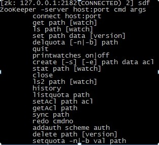
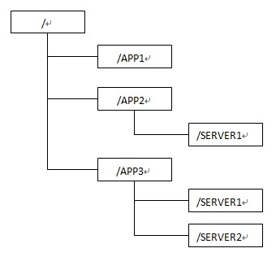
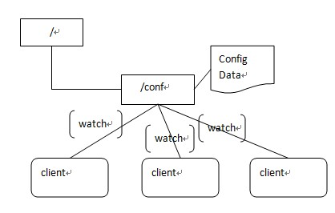
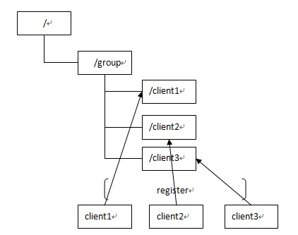

# zookeeper使用和原理探究（一）

## **zookeeper介绍**

zookeeper是一个为分布式应用提供一致性服务的软件，它是开源的Hadoop项目中的一个子项目，并且根据google发表的<The Chubby lock service for loosely-coupled distributed systems>论文来实现的，接下来我们首先来安装使用下这个软件，然后再来探索下其中比较重要一致性算法。  

## **zookeeper集群安装和使用**

zookeeper的安装基本上可以按照 http://hadoop.apache.org/zookeeper/docs/current/ zookeeperStarted.html 这个页面上的步骤完成安装，这里主要介绍下部署一个集群的步骤，因为这个官方页面似乎讲得并不是非常详细(Running Replicated Zookeeper)。
由于手头机器不足，所以在一台机器上部署了3个server,如果你手头也比较紧，也可以这么做。那么我建了3个文件夹，如下
**server1   server2   server3**
然后每个文件夹里面解压一个zookeeper的下载包，并且还建了几个文件夹，总体结构如下,最后那个是下载过来压缩包的解压文件
**data dataLog logs zookeeper-3.3.2**那么首先进入data目录，创建一个myid的文件，里面写入一个数字，比如我这个是server1,那么就写一个1，server2对应myid文件就写入2，server3对应myid文件就写个3
然后进入**zookeeper-3.3.2/conf**目录，那么如果是刚下过来，会有3个文件，**configuration.xml, log4j.properties,zoo_sample.cfg**,这3个文件我们首先要做的就是在这个目录创建一个zoo.cfg的配置文件，当然你可以把zoo_sample.cfg文件改成zoo.cfg，配置的内容如下所示： 

**tickTime=2000**
**initLimit=5**
**syncLimit=2**
**dataDir=xxxx/zookeeper/server1/data**
**dataLogDir=xxx/zookeeper/server1/dataLog**
**clientPort=2181**
server.1=127.0.0.1:2888:3888
server.2=127.0.0.1:2889:3889
server.3=127.0.0.1:2890:3890

加粗的几个配置应该官网讲得很清楚了，只是需要注意的是clientPort这个端口如果你是在1台机器上部署多个server,那么每台机器都要不同的clientPort，比如我server1是2181,server2是2182，server3是2183，dataDir和dataLogDir也需要区分下。 
最后几行唯一需要注意的地方就是 server.X 这个数字就是对应 data/myid中的数字。你在3个server的myid文件中分别写入了1，2，3，那么每个server中的zoo.cfg都配server.1,server.2,server.3就OK了。因为在同一台机器上，后面连着的2个端口3个server都不要一样，否则端口冲突，其中第一个端口用来集群成员的信息交换，第二个端口是在leader挂掉时专门用来进行选举leader所用。

进入zookeeper-3.3.2/bin 目录中，**./zkServer.sh start**启动一个server,这时会报大量错误？其实没什么关系，因为现在集群只起了1台server，zookeeper服务器端起来会根据zoo.cfg的服务器列表发起选举leader的请求，因为连不上其他机器而报错，那么当我们起第二个zookeeper实例后，leader将会被选出，从而一致性服务开始可以使用，这是因为3台机器只要有2台可用就可以选出leader并且对外提供服务(2n+1台机器，可以容n台机器挂掉)。
接下来就可以使用了，我们可以先通过 zookeeper自带的客户端交互程序来简单感受下zookeeper到底做一些什么事情。进入zookeeper-3.3.2/bin（3个server中任意一个）下，**./zkCli.sh –server 127.0.0.1:2182**,我连的是开着2182端口的机器。
那么，首先我们随便打个命令，因为zookeeper不认识，他会给出命令的help,如下图  
   
ls(查看当前节点数据),
ls2(查看当前节点数据并能看到更新次数等数据) ,
create(创建一个节点) ,
get(得到一个节点，包含数据和更新次数等数据),
set(修改节点)
delete(删除一个节点)
通过上述命令实践，我们可以发现，zookeeper使用了一个类似文件系统的树结构，数据可以挂在某个节点上，可以对这个节点进行删改。另外我们还发现，当改动一个节点的时候，集群中活着的机器都会更新到一致的数据。 

## **zookeeper的数据模型**

在简单使用了zookeeper之后，我们发现其数据模型有些像操作系统的文件结构，结构如下图所示

(1)     每个节点在zookeeper中叫做znode,并且其有一个唯一的路径标识，如/SERVER2节点的标识就为/APP3/SERVER2
(2)     Znode可以有子znode，并且znode里可以存数据，但是EPHEMERAL类型的节点不能有子节点
(3)     Znode中的数据可以有多个版本，比如某一个路径下存有多个数据版本，那么查询这个路径下的数据就需要带上版本。
(4)     znode 可以是临时节点，一旦创建这个 znode 的客户端与服务器失去联系，这个 znode 也将自动删除，Zookeeper 的客户端和服务器通信采用长连接方式，每个客户端和  服务器通过心跳来保持连接，这个连接状态称为 session，如果 znode 是临时节点，这个 session 失效，znode 也就删除了
(5)     znode 的目录名可以自动编号，如 App1 已经存在，再创建的话，将会自动命名为 App2 
(6)     znode 可以被监控，包括这个目录节点中存储的数据的修改，子节点目录的变化等，一旦变化可以通知设置监控的客户端，这个功能是zookeeper对于应用最重要的特性，通过这个特性可以实现的功能包括配置的集中管理，集群管理，分布式锁等等。  

## **通过java代码使用zookeeper **

Zookeeper的使用主要是通过创建其jar包下的Zookeeper实例，并且调用其接口方法进行的，主要的操作就是对znode的增删改操作，监听znode的变化以及处理。 
以下为主要的API使用和解释

```
//创建一个Zookeeper实例，第一个参数为目标服务器地址和端口，第二个参数为Session超时时间，第三个为节点变化时的回调方法
ZooKeeper zk = new ZooKeeper("127.0.0.1:2181", 500000,new Watcher() {
           // 监控所有被触发的事件
             public void process(WatchedEvent event) {
           //dosomething
           }
      });
//创建一个节点root，数据是mydata,不进行ACL权限控制，节点为永久性的(即客户端shutdown了也不会消失)
zk.create("/root", "mydata".getBytes(),Ids.OPEN_ACL_UNSAFE, CreateMode.PERSISTENT);

//在root下面创建一个childone znode,数据为childone,不进行ACL权限控制，节点为永久性的
zk.create("/root/childone","childone".getBytes(), Ids.OPEN_ACL_UNSAFE,CreateMode.PERSISTENT);

//取得/root节点下的子节点名称,返回List<String>
zk.getChildren("/root",true);

//取得/root/childone节点下的数据,返回byte[]
zk.getData("/root/childone", true, null);

//修改节点/root/childone下的数据，第三个参数为版本，如果是-1，那会无视被修改的数据版本，直接改掉
zk.setData("/root/childone","childonemodify".getBytes(), -1);

//删除/root/childone这个节点，第二个参数为版本，－1的话直接删除，无视版本
zk.delete("/root/childone", -1);
      
//关闭session
zk.close();

```


 

## Zookeeper的主流应用场景实现思路（除去官方示例） 

### (1)配置管理

集中式的配置管理在应用集群中是非常常见的，一般商业公司内部都会实现一套集中的配置管理中心，应对不同的应用集群对于共享各自配置的需求，并且在配置变更时能够通知到集群中的每一个机器。

Zookeeper很容易实现这种集中式的配置管理，比如将APP1的所有配置配置到/APP1 znode下，APP1所有机器一启动就对/APP1这个节点进行监控(zk.exist("/APP1",true)),并且实现回调方法Watcher，那么在zookeeper上/APP1 znode节点下数据发生变化的时候，每个机器都会收到通知，Watcher方法将会被执行，那么应用再取下数据即可(zk.getData("/APP1",false,null));

以上这个例子只是简单的粗颗粒度配置监控，细颗粒度的数据可以进行分层级监控，这一切都是可以设计和控制的。

​     



### (2)集群管理 

应用集群中，我们常常需要让每一个机器知道集群中（或依赖的其他某一个集群）哪些机器是活着的，并且在集群机器因为宕机，网络断链等原因能够不在人工介入的情况下迅速通知到每一个机器。

Zookeeper同样很容易实现这个功能，比如我在zookeeper服务器端有一个znode叫/APP1SERVERS,那么集群中每一个机器启动的时候都去这个节点下创建一个EPHEMERAL类型的节点，比如server1创建/APP1SERVERS/SERVER1(可以使用ip,保证不重复)，server2创建/APP1SERVERS/SERVER2，然后SERVER1和SERVER2都watch /APP1SERVERS这个父节点，那么也就是这个父节点下数据或者子节点变化都会通知对该节点进行watch的客户端。因为EPHEMERAL类型节点有一个很重要的特性，就是客户端和服务器端连接断掉或者session过期就会使节点消失，那么在某一个机器挂掉或者断链的时候，其对应的节点就会消失，然后集群中所有对/APP1SERVERS进行watch的客户端都会收到通知，然后取得最新列表即可。

另外有一个应用场景就是集群选master,一旦master挂掉能够马上能从slave中选出一个master,实现步骤和前者一样，只是机器在启动的时候在APP1SERVERS创建的节点类型变为EPHEMERAL_SEQUENTIAL类型，这样每个节点会自动被编号，例如

   

```
zk.create("/testRootPath/testChildPath1","1".getBytes(), Ids.OPEN_ACL_UNSAFE,CreateMode.EPHEMERAL_SEQUENTIAL);
        
zk.create("/testRootPath/testChildPath2","2".getBytes(), Ids.OPEN_ACL_UNSAFE,CreateMode.EPHEMERAL_SEQUENTIAL);
        
zk.create("/testRootPath/testChildPath3","3".getBytes(), Ids.OPEN_ACL_UNSAFE,CreateMode.EPHEMERAL_SEQUENTIAL);
        
// 创建一个子目录节点
zk.create("/testRootPath/testChildPath4","4".getBytes(), Ids.OPEN_ACL_UNSAFE,CreateMode.EPHEMERAL_SEQUENTIAL);

System.out.println(zk.getChildren("/testRootPath", false));

```

 

打印结果：

[testChildPath10000000000, testChildPath20000000001, testChildPath40000000003, testChildPath30000000002]


```
zk.create("/testRootPath", "testRootData".getBytes(),Ids.OPEN_ACL_UNSAFE, CreateMode.PERSISTENT);

// 创建一个子目录节点
zk.create("/testRootPath/testChildPath1","1".getBytes(), Ids.OPEN_ACL_UNSAFE,CreateMode.EPHEMERAL);
        
zk.create("/testRootPath/testChildPath2","2".getBytes(), Ids.OPEN_ACL_UNSAFE,CreateMode.EPHEMERAL);
        
zk.create("/testRootPath/testChildPath3","3".getBytes(), Ids.OPEN_ACL_UNSAFE,CreateMode.EPHEMERAL);
        
// 创建一个子目录节点
zk.create("/testRootPath/testChildPath4","4".getBytes(), Ids.OPEN_ACL_UNSAFE,CreateMode.EPHEMERAL);

System.out.println(zk.getChildren("/testRootPath", false));
```

打印结果:[testChildPath2, testChildPath1, testChildPath4, testChildPath3]


我们默认规定编号最小的为master,所以当我们对/APP1SERVERS节点做监控的时候，得到服务器列表，只要所有集群机器逻辑认为最小编号节点为master，那么master就被选出，而这个master宕机的时候，相应的znode会消失，然后新的服务器列表就被推送到客户端，然后每个节点逻辑认为最小编号节点为master，这样就做到动态master选举。


## **总结** 

我们初步使用了一下zookeeper并且尝试着描述了几种应用场景的具体实现思路，接下来的文章，我们会尝试着去探究一下zookeeper的高可用性与leaderElection算法。


**参考**：<http://www.ibm.com/developerworks/cn/opensource/os-cn-zookeeper/>      <http://hadoop.apache.org/zookeeper/docs/current/>      <http://rdc.taobao.com/team/jm/archives/448>

来源： <<http://www.blogjava.net/BucketLi/archive/2010/12/21/341268.html>>

 