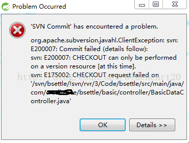
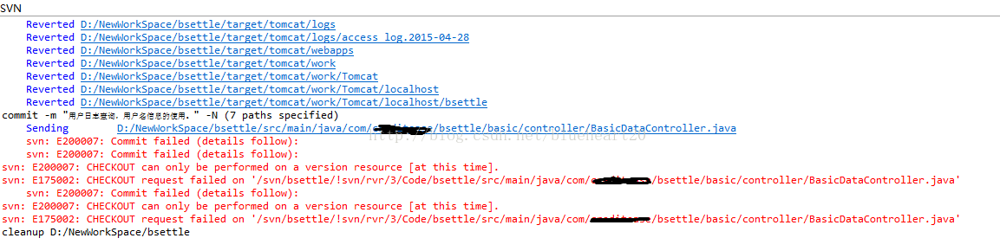
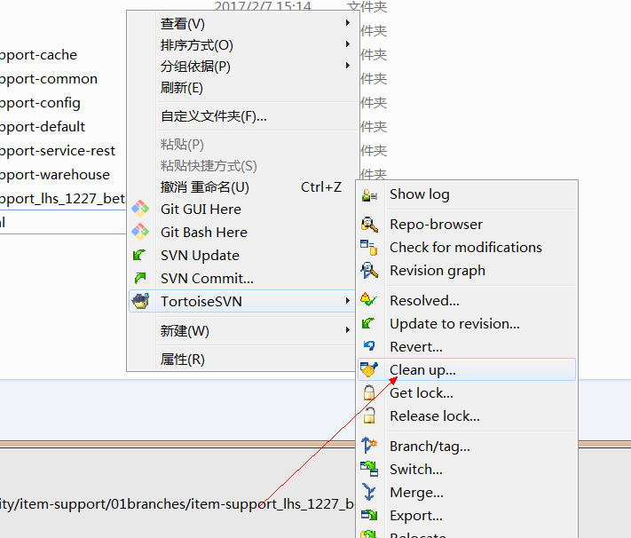
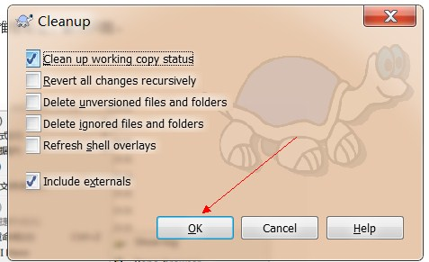

引言： 在切换subversion服务器地址之后，发生的无法正确提交代码的问题org.apache.subversion.javahl.ClientException: svn: E200007: Commit failed (details follow)， 该如何解决呢？

### 1.  背景介绍

   由于项目需要，在机器上切换了subversion的服务器地址，但是在新的subversion的服务器地址上进行代码提交之时，出现了无法提交的错误。

### 2.  错误信息的分析

   具体的错误信息：

```
org.apache.subversion.javahl.ClientException: svn: E200007: Commit failed (details follow):  
svn: E200007: CHECKOUT can only be performed on a version resource [at this time].  
svn: E175002: CHECKOUT request failed on '/svn/bsettle/!svn/rvr/3/Code/bsettle/src/main/java/com/bsettle/basic/controller/BasicDataController.java'  
org.apache.subversion.javahl.ClientException: svn: E200007: Commit failed (details follow):  
svn: E200007: CHECKOUT can only be performed on a version resource [at this time].  
svn: E175002: CHECKOUT request failed on '/svn/bsettle/!svn/rvr/3/Code/bsettle/src/main/java/com/bsettle/basic/controller/BasicDataController.java'  
```

Eclipse中出现的错误信息：

 

基于以上出现的错误信息， 可以得知，无法向目的服务器提交信息，原因是ChECKOUTcan only be performed on a version resource[at this time].

首先排除是subversion本身的客户端发生导致的问题，Eclipse本身也不存在问题，之前都是正常工作的。

那只能是由于切换subversion服务器导致的问题，无法提交，是不是由于缓存在本地的权限或者地址信息不匹配造成的呢？

### 3. 问题的解决

  那就清除一下本地的缓存吧， 右键选中项目--> Team-> Referesh/Clearup [刷新/清除]。

  

 哈哈，然后就可以顺利提交代码，原来问题就是不同的svn服务器地址的本地缓存造成的问题。

### 4. 总结

  大胆假设，排除分析，推理论证，解决问题。

### 5.idea中出现这个问题：

用小乌龟客户端清理下即可。在idea里面清理无效。



 



 

如上图步骤清理即可。

来源： [http://blog.csdn.net/blueheart20/article/details/45341321](http://blog.csdn.net/blueheart20/article/details/45341321)