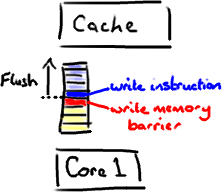

[TOC]

# cpu之揭秘内存屏障

原文地址：<http://ifeve.com/disruptor-memory-barriers/>

译者：杜建雄     校对：欧振聪

最近我博客文章更新有点慢，因为我在忙着写一篇介绍内存屏障（[Memory Barries](http://en.wikipedia.org/wiki/Memory_barrier)）以及如何将其应用于[Disruptor](http://code.google.com/p/disruptor)的文章。问题是，无论我翻阅了多少资料，向耐心的[Martin](http://mechanical-sympathy.blogspot.com/)和[Mike](http://mikes-tech.blogspot.com/)请教了多少遍，以试图理清一些知识点，可我总是不能直观地抓到重点。大概是因为我不具备深厚的背景知识来帮助我透彻理解。

所以，与其像个傻瓜一样试图去解释一些自己都没完全弄懂的东西，还不如在抽象和大量简化的层次上，把我在该领域所掌握的知识分享给大家 。Martin已经写了一篇文章《[going into memory barriers](http://mechanical-sympathy.blogspot.com/2011/07/memory-barriersfences.html)》介绍内存屏障的一些具体细节，所以我就略过不说了。

免责声明：文章中如有错误全由本人负责，与Disruptor的实现和[LMAX](http://www.lmaxtrader.co.uk/)里真正懂这些知识的大牛们无关。

## **主题是什么？**

我写这个系列的博客主要目的是解析Disruptor是如何工作的，并深入了解下为什么这样工作。理论上，我应该从可能准备使用disruptor的开发人员的角度来写，以便在代码和技术论文[[Disruptor-1.0.pdf](http://disruptor.googlecode.com/files/Disruptor-1.0.pdf)]之间搭建一座桥梁。这篇文章提及到了内存屏障，我想弄清楚它们到底是什么，以及它们是如何应用于实践中的。

## **什么是内存屏障？**

它是一个CPU指令。没错，又一次，我们在讨论CPU级别的东西，以便获得我们想要的性能（Martin著名的Mechanical Sympathy理论）。基本上，它是这样一条指令： a)确保一些特定操作执行的顺序； b)影响一些数据的可见性(可能是某些指令执行后的结果)。

编译器和CPU可以在保证输出结果一样的情况下对指令重排序，使性能得到优化。插入一个内存屏障，相当于告诉CPU和编译器先于这个命令的必须先执行，后于这个命令的必须后执行。正如去拉斯维加斯旅途中各个站点的先后顺序在你心中都一清二楚。

 

内存屏障另一个作用是强制更新一次不同CPU的缓存。例如，一个写屏障会把这个屏障前写入的数据刷新到缓存，这样任何试图读取该数据的线程将得到最新值，而不用考虑到底是被哪个cpu核心或者哪颗CPU执行的。

## **和Java有什么关系？**

现在我知道你在想什么——这不是汇编程序。它是Java。

这里有个神奇咒语叫volatile(我觉得这个词在Java规范中从未被解释清楚)。如果你的字段是volatile，Java内存模型将在写操作后插入一个写屏障指令，在读操作前插入一个读屏障指令。

 

这意味着如果你对一个volatile字段进行写操作，你必须知道：

1、一旦你完成写入，任何访问这个字段的线程将会得到最新的值。

2、在你写入前，会保证所有之前发生的事已经发生，并且任何更新过的数据值也是可见的，因为内存屏障会把之前的写入值都刷新到缓存。

## **举个例子呗！**

很高兴你这样说了。又是时候让我来画几个甜甜圈了。

[RingBuffer](http://code.google.com/p/disruptor/source/browse/trunk/code/src/main/com/lmax/disruptor/RingBuffer.java)的指针(cursor)（译注：指向队尾元素）属于一个神奇的volatile变量，同时也是我们能够不用锁操作就能实现Disruptor的原因之一。

 

生产者将会取得下一个[Entry](http://code.google.com/p/disruptor/source/browse/trunk/code/src/main/com/lmax/disruptor/AbstractEntry.java?spec=svn109&r=201)（或者是一批）,并可对它（们）作任意改动， 把它（们）更新为任何想要的值。[如你所知](http://ifeve.com/dissecting-the-disruptor-writing-to-the-ring-buffer/)，在所有改动都完成后，生产者对ring buffer调用commit方法来更新序列号（译注:把cursor更新为该Entry的序列号）。对volatile字段(cursor)的写操作创建了一个内存屏障，这个屏障将刷新所有缓存里的值（或者至少相应地使得缓存失效）。

这时候，消费者们能获得最新的序列号码(8)，并且因为内存屏障保证了它之前执行的指令的顺序，消费者们可以确信生产者对7号Entry所作的改动已经可用。

 … 那么消费者那边会发生什么？ 

消费者中的序列号是volatile类型的，会被若干个外部对象读取——其他的[下游消费者](http://mechanitis.blogspot.com/2011/07/dissecting-disruptor-wiring-up.html)可能在跟踪这个消费者。[ProducerBarrier](http://code.google.com/p/disruptor/source/browse/trunk/code/src/main/com/lmax/disruptor/ProducerBarrier.java?spec=svn109&r=201)/[RingBuffer](http://code.google.com/p/disruptor/source/browse/trunk/code/src/main/com/lmax/disruptor/RingBuffer.java?spec=svn109&r=242)(取决于你看的是旧的还是新的代码)跟踪它以确保环没有出现重叠（wrap）的情况（译注：为了防止下游的消费者和上游的消费者对同一个Entry竞争消费，导致在环形队列中互相覆盖数据，下游消费者要对上游消费者的消费情况进行跟踪）。


所以，如果你的下游消费者(C2)看见前一个消费者(C1)在消费号码为12的Entry，当C2的读取也到了12，它在更新序列号前将可以获得C1对该Entry的所作的更新。

基本来说就是，C1更新序列号前对ring buffer的所有操作（如上图黑色所示），必须先发生，待C2拿到C1更新过的序列号之后，C2才可以为所欲为（如上图蓝色所示）。

## **对性能的影响**

内存屏障作为另一个CPU级的指令，没有[锁那样大的开销](http://ifeve.com/locks-are-bad/)。内核并没有在多个线程间干涉和调度。但凡事都是有代价的。内存屏障的确是有开销的——编译器/cpu不能重排序指令，导致不可以尽可能地高效利用CPU，另外刷新缓存亦会有开销。所以不要以为用volatile代替锁操作就一点事都没。

你会注意到Disruptor的实现对序列号的读写频率尽量降到最低。对volatile字段的每次读或写都是相对高成本的操作。但是，也应该认识到在批量的情况下可以获得很好的表现。如果你知道不应对序列号频繁读写，那么很合理的想到，先获得一整批Entries,并在更新序列号前处理它们。这个技巧对生产者和消费者都适用。以下的例子来自[BatchConsumer](http://code.google.com/p/disruptor/source/browse/trunk/code/src/main/com/lmax/disruptor/BatchConsumer.java?r=239):

```
    long nextSequence = sequence + 1;
    while (running)
    {
        try
        {
            final long availableSequence = consumerBarrier.waitFor(nextSequence);
            while (nextSequence <= availableSequence)
            {
                entry = consumerBarrier.getEntry(nextSequence);
                handler.onAvailable(entry);
                nextSequence++;
            }
            handler.onEndOfBatch();
            sequence = entry.getSequence();
        }
        …
        catch (final Exception ex)
        {
            exceptionHandler.handle(ex, entry);
            sequence = entry.getSequence();
            nextSequence = entry.getSequence() + 1;
        }
    }
```

（你会注意到，这是个旧式的代码和命名习惯，因为这是摘自我以前的博客文章，我认为如果直接转换为新式的代码和命名习惯会让人有点混乱）

在上面的代码中，我们在消费者处理entries的循环中用一个局部变量（nextSequence）来递增。这表明我们想尽可能地减少对volatile类型的序列号的进行读写。

**总结**

内存屏障是CPU指令，它允许你对数据什么时候对其他进程可见作出假设。在Java里，你使用volatile关键字来实现内存屏障。使用volatile意味着你不用被迫选择加锁，并且还能让你获得性能的提升。

但是，你需要对你的设计进行一些更细致的思考，特别是你对volatile字段的使用有多频繁，以及对它们的读写有多频繁。

PS：上文中讲到的Disruptor中使用的[New World Order ](http://mechanitis.blogspot.com/2011/08/disruptor-20-all-change-please.html)是一种完全不同于我目前为止所发表的博文中的命名习惯。我想下一篇文章会对旧式的和新式的命名习惯做一个对照。

 延伸阅读：

[1]  [一种高效无锁内存队列的实现](http://www.searchtb.com/2012/10/introduction_to_disruptor.html)

[2] [Lock-free publishing](http://blog.codeaholics.org/2011/the-disruptor-lock-free-publishing/)

[3] [Disruptor系列译文](http://ifeve.com/disruptor/)

**原创文章，转载请注明：** 转载自[并发编程网 – ifeve.com](http://ifeve.com/)**本文链接地址:** [剖析Disruptor:为什么会这么快？(三)揭秘内存屏障](http://ifeve.com/disruptor-memory-barrier/)


http://ifeve.com/disruptor-memory-barrier/