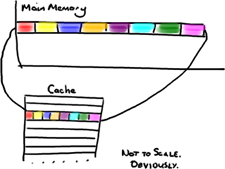
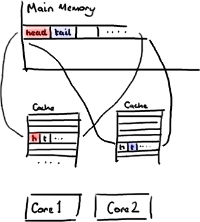
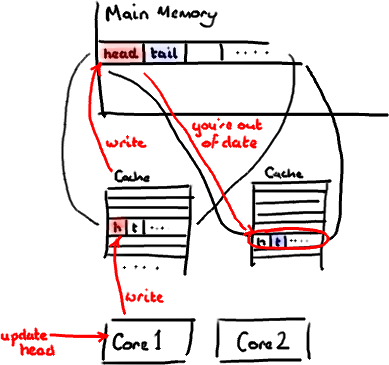
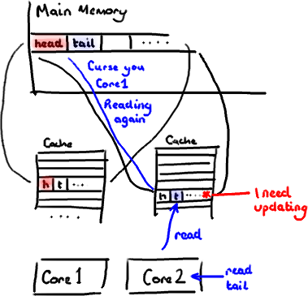

[TOC]


# cpu之神奇的缓存行填充

原文地址：http://ifeve.com/disruptor-padding/

**作者**：Trisha  **译者**：方腾飞 **校对**：丁一

我们经常提到一个短语Mechanical Sympathy，这个短语也是[Martin博客的标题](http://mechanical-sympathy.blogspot.com/)（译注：Martin Thompson），Mechanical Sympathy讲的是底层硬件是如何运作的，以及与其协作而非相悖的编程方式。

我在[上一篇文章](http://ifeve.com/locks-are-bad/)中提到[RingBuffer](http://code.google.com/p/disruptor/source/browse/trunk/code/src/main/com/lmax/disruptor/RingBuffer.java)后，我们收到一些关于[RingBuffer](http://code.google.com/p/disruptor/source/browse/trunk/code/src/main/com/lmax/disruptor/RingBuffer.java)中填充高速缓存行的评论和疑问。由于这个适合用漂亮的图片来说明，所以我想这是下一个我该解决的问题了。
*（译注：Martin Thompson很喜欢用Mechanical Sympathy这个短语，这个短语源于赛车驾驶,它反映了驾驶员对于汽车有一种天生的感觉，所以他们对于如何最佳的驾御它非常有感觉。）*

## 计算机入门

我喜欢在[LMAX](http://www.lmaxtrader.co.uk/)工作的原因之一是，在这里工作让我明白从大学和A Level Computing所学的东西实际上还是有意义的。做为一个开发者你可以逃避不去了解CPU，数据结构或者[大O符号](http://en.wikipedia.org/wiki/Big_O_notation) —— 而我用了10年的职业生涯来忘记这些东西。但是现在看来，如果你知道这些知识并应用它，你能写出一些非常巧妙和非常快速的代码。

因此，对在学校学过的人是种复习，对未学过的人是个简单介绍。但是请注意，这篇文章包含了大量的过度简化。

CPU是你机器的心脏，最终由它来执行所有运算和程序。主内存（RAM）是你的数据（包括代码行）存放的地方。本文将忽略硬件驱动和网络之类的东西，因为[Disruptor](https://code.google.com/p/disruptor/)的目标是尽可能多的在内存中运行。

CPU和主内存之间有好几层缓存，因为即使直接访问主内存也是非常慢的。如果你正在多次对一块数据做相同的运算，那么在执行运算的时候把它加载到离CPU很近的地方就有意义了（比如一个循环计数－你不想每次循环都跑到主内存去取这个数据来增长它吧）。

[](./image-201712221435/CPUCache.png)

越靠近CPU的缓存越快也越小。所以L1缓存很小但很快(译注：L1表示一级缓存)，并且紧靠着在使用它的CPU内核。L2大一些，也慢一些，并且仍然只能被一个单独的 CPU 核使用。L3在现代多核机器中更普遍，仍然更大，更慢，并且被单个插槽上的所有 CPU 核共享。最后，你拥有一块主存，由全部插槽上的所有 CPU 核共享。

当CPU执行运算的时候，它先去L1查找所需的数据，再去L2，然后是L3，最后如果这些缓存中都没有，所需的数据就要去主内存拿。走得越远，运算耗费的时间就越长。所以如果你在做一些很频繁的事，你要确保数据在L1缓存中。

Martin和Mike的 [QCon presentation](http://www.infoq.com/presentations/LMAX)演讲中给出了一些缓存未命中的消耗数据：

| **从CPU到**                            | **大约需要的 CPU 周期** | **大约需要的时间** |
| ------------------------------------ | ---------------- | ----------- |
| 主存                                   |                  | 约60-80纳秒    |
| QPI 总线传输(between sockets, not drawn) |                  | 约20ns       |
| L3 cache                             | 约40-45 cycles,   | 约15ns       |
| L2 cache                             | 约10 cycles,      | 约3ns        |
| L1 cache                             | 约3-4 cycles,     | 约1ns        |
| 寄存器                                  | 1 cycle          |             |

如果你的目标是让端到端的延迟只有 10毫秒，而其中花80纳秒去主存拿一些未命中数据的过程将占很重的一块。

## 缓存行

现在需要注意一件有趣的事情，数据在缓存中不是以独立的项来存储的，如不是一个单独的变量，也不是一个单独的指针。缓存是由缓存行组成的，通常是64字节（译注：这篇文章发表时常用处理器的缓存行是64字节的，比较旧的处理器缓存行是32字节），并且它有效地引用主内存中的一块地址。一个Java的long类型是8字节，因此在一个缓存行中可以存8个long类型的变量。

[](./image-201712221435/CacheLines.png)

(为了简化，我将忽略多级缓存)

非常奇妙的是如果你访问一个long数组，当数组中的一个值被加载到缓存中，它会额外加载另外7个。因此你能非常快地遍历这个数组。事实上，你可以非常快速的遍历在连续的内存块中分配的任意数据结构。我在第一篇[关于ring buffer的文章](http://mechanitis.blogspot.com/2011/06/dissecting-disruptor-whats-so-special.html)中顺便提到过这个，它解释了我们的ring buffer使用数组的原因。

因此如果你数据结构中的项在内存中不是彼此相邻的（链表，我正在关注你呢），你将得不到免费缓存加载所带来的优势。并且在这些数据结构中的每一个项都可能会出现缓存未命中。

不过，所有这种免费加载有一个弊端。设想你的long类型的数据不是数组的一部分。设想它只是一个单独的变量。让我们称它为`head`，这么称呼它其实没有什么原因。然后再设想在你的类中有另一个变量紧挨着它。让我们直接称它为`tail`。现在，当你加载`head`到缓存的时候，你也免费加载了`tail`。

[](./image-201712221435/FalseSharing.png)

听想来不错。直到你意识到`tail`正在被你的生产者写入，而`head`正在被你的消费者写入。这两个变量实际上并不是密切相关的，而事实上却要被两个不同内核中运行的线程所使用。

[](./image-201712221435/FalseSharingWriteHead.png)

设想你的消费者更新了`head`的值。缓存中的值和内存中的值都被更新了，而其他所有存储`head`的缓存行都会都会失效，因为其它缓存中`head`不是最新值了。请记住我们必须以整个缓存行作为单位来处理（译注：这是CPU的实现所规定的，详细可参见[深入分析Volatile的实现原理](http://ifeve.com/volatile)），不能只把`head`标记为无效。

[](./image-201712221435/FalseSharingReadTail.png)

现在如果一些正在其他内核中运行的进程只是想读`tail`的值，整个缓存行需要从主内存重新读取。那么一个和你的消费者无关的线程读一个和`head`无关的值，它被缓存未命中给拖慢了。

当然如果两个独立的线程同时写两个不同的值会更糟。因为每次线程对缓存行进行写操作时，每个内核都要把另一个内核上的缓存块无效掉并重新读取里面的数据。你基本上是遇到两个线程之间的写冲突了，尽管它们写入的是不同的变量。

这叫作“[伪共享](http://en.wikipedia.org/wiki/False_sharing)”（译注：可以理解为错误的共享），因为每次你访问`head`你也会得到`tail`，而且每次你访问`tail`，你也会得到`head`。这一切都在后台发生，并且没有任何编译警告会告诉你，你正在写一个并发访问效率很低的代码。

## 解决方案－神奇的缓存行填充

你会看到Disruptor消除这个问题，至少对于缓存行大小是64字节或更少的处理器架构来说是这样的（译注：有可能处理器的缓存行是128字节，那么使用64字节填充还是会存在伪共享问题），通过增加补全来确保ring buffer的序列号不会和其他东西同时存在于一个缓存行中。

```
public long p1, p2, p3, p4, p5, p6, p7; // cache line padding
private volatile long cursor = INITIAL_CURSOR_VALUE;
public long p8, p9, p10, p11, p12, p13, p14; // cache line padding
```

因此没有伪共享，就没有和其它任何变量的意外冲突，没有不必要的缓存未命中。

在你的`Entry`类中也值得这样做，如果你有不同的消费者往不同的字段写入，你需要确保各个字段间不会出现伪共享。

修改：Martin写了一个从技术上来说更准确更详细的关于[伪共享的文章](http://ifeve.com/false-sharing/)，并且发布了性能测试结果。

**原创文章，转载请注明：** 转载自[并发编程网 – ifeve.com](http://ifeve.com/)**本文链接地址:** [剖析Disruptor:为什么会这么快？（二）神奇的缓存行填充](http://ifeve.com/disruptor-cacheline-padding/)


http://ifeve.com/disruptor-cacheline-padding/

