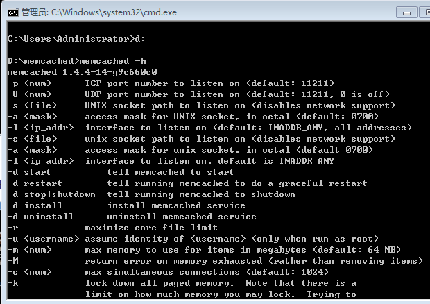
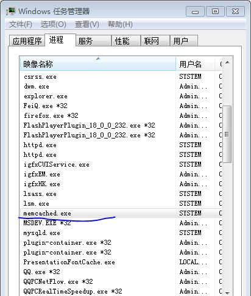

# [Memcached和Memcache安装（64位win7）](http://www.cnblogs.com/wujuntian/p/4791220.html)

**一、Memcached和Memcache的区别：**

​    网上关于Memcached和Memcache的区别的理解众说纷纭，我个人的理解是：

Memcached是一个内存缓存系统，而Memcache是php的一个扩展，是php用于操作和管理Memcached的工具。如果安装了Memcached但没有安装Memcache，php无法操控Memcached，但是可以使用命令行来操控Memcached；如果安装了Memcache却没安装Memcached，则无法使用。只有同时安装了Memcached和Memcache，才能在PHP中使用Memcached。

​    以上仅代表个人观点。

​    网上关于Memcached和Memcache的安装教程有很多，下面是我参考网上教程并动手操作后总结出来的方法，注意，我的操作是基于64位win7系统的。

 

**二、安装memcached：**

\1. 下载地址：http://pan.baidu.com/s/1gdKbp8R

  （这是在网上找的下载地址，我试过，可以下载）

\2. 解压下载后的文件，把它放到一个目录中，如D:\memcached。

\3. 打开cmd，进入memcached解压后存放的目录，运行命令：

   memcached.exe -d install

   如果没有意外的话已经安装成功了。

   （目录中应该有memcached.exe这个文件）

\4. 测试是否安装成功：

   打开cmd，进入memcached解压后存放的目录，运行命令：

   memcached -h，若安装成功，会出现如下界面：

  

 

\5. 启动memcached：

  打开cmd，进入memcached解压后存放的目录，运行命令：

  memcached.exe -d start

  这时memcached已经启动，在任务管理器中可以看到这个进程：

 

 

\6. 连接Memcached：

  打开cmd，运行命令：

  telnet 127.0.0.1 11211

  即可连接Memcached。

 

注：win7中可能会出现“telnet’不是内部或外部命令”的错误，这是因为系统中默认没有安装telnet的缘故，可在“控制面板”->“程序”->“程序和功能”->“打开或关闭Windows功能”中打开“Telnet客户端”。

 

**三、安装memcache的php扩展：**

\1. 下载地址：http://windows.php.net/downloads/pecl/releases/memcache/3.0.8/

  （注意：要下载对应php版本和系统位数的dll文件）

\2. 把php_memcache.dll放到php的ext目录下，如：

   D:\wamp\bin\php\php5.5.12\ext

\3. 打开php.ini，在extension处添加一行代码：

   extension=php_memcache.dll

\4. 重启服务器。

\5. 查看php的extensions服务，php_memcache现在应该可以使用了，即处于打钩状态，之

  前是处于叹号状态的，若还处于叹号状态，用鼠标在上面点击一下就好了。

\6. 通过代码测试php是否已经可以使用memcached：

```
  $memcache = new Memcache;

  $memcache->connect("127.0.0.1",11211);

  echo "Memcached's version: " . $memcache->getVersion() . "<br />";

  $data = array(

           'url' => "http://www.cnblogs.com/wujuntian/",

           'name' => "编程人，在天涯"

  );

  $memcache -> set("info",$data,0,10);

  $info = $memcache->get("info");

  echo '<pre>';

  print_r($info);
```

 

若能打印出memcache中的信息，则说明php的memcache扩展已安装成功且能使用了！

 

注意：运行代码时若出现错误Fatal error: Class 'Memcache' not found，有可能是下载的 

​      php_memcache.dll文件与php版本不符，或者与系统位数不符。

​      我的是64位系统，php版本是5.5.12，下载的是php_memcache-3.0.8-5.5-ts-vc11-x64.zip

​      这个文件。

 

来源： [http://www.cnblogs.com/wujuntian/p/4791220.html](http://www.cnblogs.com/wujuntian/p/4791220.html)