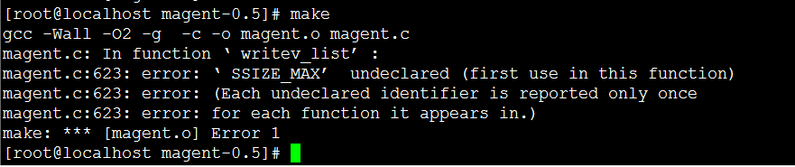
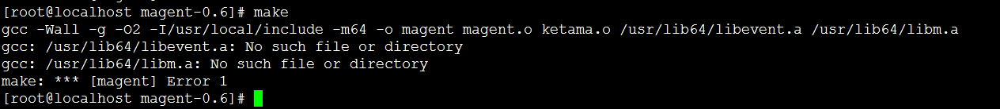
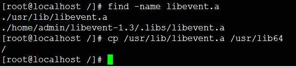
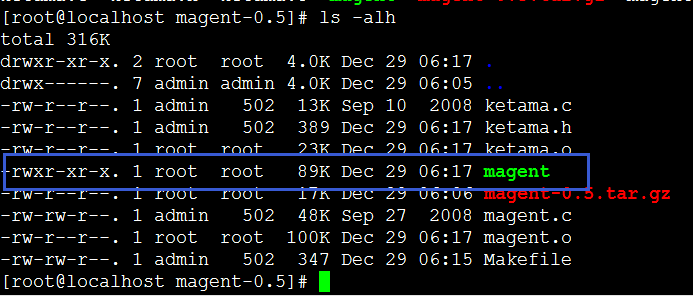
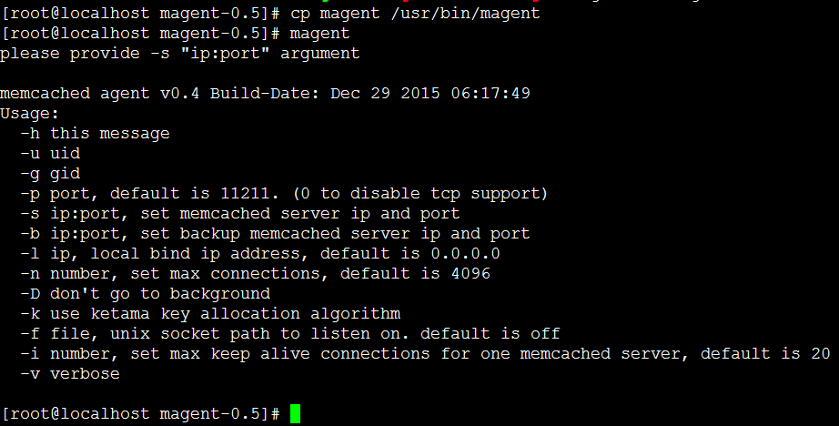
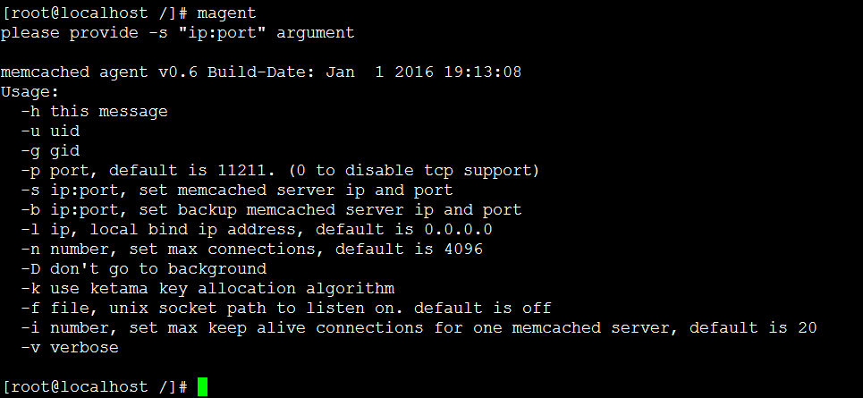
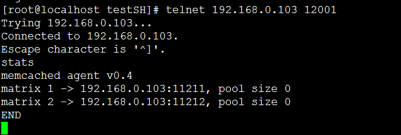

### 一、伪集群方案 

最常见的做法：memcache安装后，在一台机器或多台机器上启动多个实例，客户端配置memcache节点的ip，port即可。 

由客户端实现分布式缓存效果，其实是伪集群。 

memcache节点之间不通信，无数据备份，负载均衡由客户端实现，存在单点故障。 

客户端可设置故障恢复和故障转移机制。

### 二、简单集群方案 

使用Magent代理组件搭建集群服务。 

集群特性： 

1）memcache节点宕机后，客户端能自动重连。 

2）有数据备份，比如部署了memcache节点1、节点2和备份节点，当节点1宕机，set操作到节点1的时候，会失败（不会自动跳到另一个节点当中去），但备份memcache节点是会保留所有key，所有运用get命令还是能够得到正常结果的。

1、下载安装 
1）下载地址：[http://memagent.googlecode.com/files/magent-0.6.tar.gz](http://memagent.googlecode.com/files/magent-0.6.tar.gz)，最新版本为0.6，目前演示用的是magent-0.5版本的。注意目前这个google的地址在国内是无法访问的，只能通过其他方式下载了，相信各位有办法的。也可以在以下地址找到： 
[http://download.csdn.net/detail/huangying2124/9386872](http://download.csdn.net/detail/huangying2124/9386872)

2）编译安装 
1.tar -xzvf magent-0.5.tar.gz 
2./sbin/ldconfig 
3.sed -i “s#LIBS = -levent#LIBS = -levent -lm#g” Makefile 
4.make 
5.cp magent /usr/bin/magent 
6.magent

执行第三步时，要注意最后的输出文件为Makefile。 
执行第四步时，一般会遇到如下错误： 
错误一： 

问题原因：缺少SSIZE_MAX字义 
解决方法： 
修改ketama.h文件，在文件起始行加下以下代码： 
\#ifndef SSIZE_MAX 
\#define SSIZE_MAX 32767 
\#endif

保存文件，重新执行make命令即可

错误二： 

这个错误是magent-0.6.tar.gz才有，0.5版本的没有。

问题原因：文件存放路径的问题 
libm.a 默认在/usr/lib/x86…/lib64下 
libevent.a 默认在/usr/lib/下 
本人演示用的Linux操作系统是Centos-6.5，其他操作系统可能不同，请注意区分。

解决办法： 
可用find命令查找，再将这两个文件拷贝到/usr/lib64目录下 
find -name libm.a 
find -name libevent.a

若libm.a提示找不到，则需要重新安装glibc-static组件：yum install glibc-static。

错误三： 
安装过程中出现：/usr/lib64/libevent.a(event 0) : In function ‘gettime’错误字样

解决办法： 
1、先备份Makefile文件：cp Makefile Makefile.bak 
2、修改Makefile文件，找到`CFLAGS = -Wall -g -O2 -I/usr/local/include $(M64)`，改为`CFLAGS = -lrt -g -O2 -I/usr/local/include $(M64)`即可。

make命令成功后，会在当前目录下产生magent文件，将该文件夹移到/usr/bin/目录下即可。

文件夹移到新的位置后，可以直接使用magent命令，如下图所示，表示安装成功： 

2、Magent启动命令常用参数 
-u：启动用户名 
-n：连接数，默认为4096 
-l：magent监听的IP地址 
-p(小写)：magent监听的端口号 
-s：注册的memcache节点信息，格式为ip:port 
-b：用于备份的memcache节点信息，格式为ip:port

示例命令 magent -u root -n 2048 -l 192.168.0.103 -p 12001 -s 192.168.0.103:11211 -s 192.168.0.103:11212 -b 192.168.0.103:11213

3、使用示例 
1）先启动memcache节点 
/usr/local/bin/memcached -d -m 128 -u root -l 192.168.0.103 -p 11211 -P /tmp/memcached11211.pid 
/usr/local/bin/memcached -d -m 128 -u root -l 192.168.0.103 -p 11212 -P /tmp/memcached11212.pid 
/usr/local/bin/memcached -d -m 128 -u root -l 192.168.0.103 -p 11213 -P /tmp/memcached11213.pid

共启动3个memcache节点，端口分别为11211，11212，11213

2）启动magent，代理memcache节点 
magent -u root -n 2048 -l 192.168.0.103 -p 12001 -s 192.168.0.103:11211 -s 192.168.0.103:11212 -b 192.168.0.103:11213

如命令所示： 
memcache 11211和11212两个节点为工作节点，11213节点将作为备份节点; 
magent监听的端口为12001，ip为192.168.0.103。

注：为了演示方便，都在一台机器上启动实例，若实际需要为多台机器，将ip和端口更换即可。

4、基本使用方法 
1）Telnet作为客户端，连接magent 
还记得前一遍讲解的Telnet操作吗？magent的操作也一样适用。 
演示的ip和port可以参照上面的演示示例。 
telnet 192.168.0.103 12001 
stats命令查看状态，如下图所示： 

可以看到magent版本号，连接的memcache工作节点列表，用matrix1、matrix2表示。

2）get，set，version等命令跟memcache的操作是一致的 
set操作时，按哈希算法写入两个工作节点（简单映射哈希算法），备份节点不受此哈希算法影响，所有的缓存对象都会到备份节点中存储。 
get操作时，先按哈希算法查找，查找不到就到备份节点里查询，因为set时所有的缓存对象都会保存到备份节点上。 
当某一memcache工作节点宕机时，set还是按原有的哈希算法做set操作，宕机的节点上无数据，但备份节点上有，get操作还是不受影响的（所以说备份节点很重要，一定要设置）。 
当宕机的节点重新启动时，该节点已无数据。magent做get操作时，尽管备份节点上还有数据，但还是会返回空值。（这是一个很大的问题！）

code.google官方最新发布的版本为magent-0.6.tar.gz，也一样没有修复这个问题。

另外附上magent-0.5和magent-0.6的下载地址： 
原版： 
magent-0.5：[http://download.csdn.net/detail/huangying2124/9386870](http://download.csdn.net/detail/huangying2124/9386870) 
magent-0.6：[http://download.csdn.net/detail/huangying2124/9386872](http://download.csdn.net/detail/huangying2124/9386872)

修正版（修正安装过程中出现SSIZE_MAX无法找到的问题） 
magent-0.5：[http://download.csdn.net/detail/huangying2124/9386875](http://download.csdn.net/detail/huangying2124/9386875) 
magent-0.6：[http://download.csdn.net/detail/huangying2124/9386878](http://download.csdn.net/detail/huangying2124/9386878)

来源： [http://blog.csdn.net/dailywater/article/details/50876865](http://blog.csdn.net/dailywater/article/details/50876865)