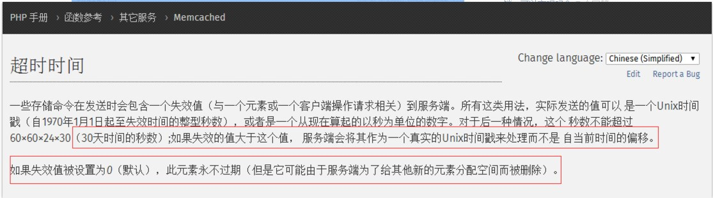

## memcached 可以设置数据永不过期吗？

在一个文档上看的这句话：“最大30天的数据过期时间, 设置为永久的也会在这个时间过期，常量REALTIME_MAXDELTA 60*60*24*30 控制”。
（暂不考虑LRU）我能通过修改其源码来达到我的目标“让数据永不过期”吗？

[**1 条评论 ](http://www.zhihu.com/question/20436540#)[**分享](http://www.zhihu.com/question/20436540#)

按投票排序[按时间排序](http://www.zhihu.com/question/20436540?sort=created)**

### 8 个回答

**1赞同**反对，不会显示你的姓名

[](http://www.zhihu.com/people/ohJack)[施剑波](http://www.zhihu.com/people/ohJack)，大胆妖孽纳命来

[刘项](http://www.zhihu.com/people/lexdene) 赞同

如果空间不够足而且还没有到最长失效时间，则会按照最近最少访问做gc回收。

[编辑于 2013-07-04](http://www.zhihu.com/question/20436540/answer/17697994) [**2 条评论](http://www.zhihu.com/question/20436540#) [**感谢](http://www.zhihu.com/question/20436540#) [**分享](http://www.zhihu.com/question/20436540#) [**收藏](http://www.zhihu.com/question/20436540#) • [没有帮助](http://www.zhihu.com/question/20436540#) • [举报](http://www.zhihu.com/question/20436540#) • [作者保留权利](http://www.zhihu.com/terms#sec-licence-1)

**1赞同**反对，不会显示你的姓名

[](http://www.zhihu.com/people/hao-zhi-gang-90)[gavin](http://www.zhihu.com/people/hao-zhi-gang-90)，IT/民工/足球/登山

[刘项](http://www.zhihu.com/people/lexdene) 赞同

我觉得 你考虑的过多了，一般的数据30天已经很长了，没有必要设置永不过期，万一数据更新了缓存没有变化，处理这些脏数据也麻烦；如果确实是常量，那么你可以考虑2级的缓存，把一些数据放在web服务器，甚至客户端岂不更有效率

[发布于 2012-08-23](http://www.zhihu.com/question/20436540/answer/15134054) [**1 条评论](http://www.zhihu.com/question/20436540#) [**感谢](http://www.zhihu.com/question/20436540#) [**分享](http://www.zhihu.com/question/20436540#) [**收藏](http://www.zhihu.com/question/20436540#) • [没有帮助](http://www.zhihu.com/question/20436540#) • [举报](http://www.zhihu.com/question/20436540#) • [作者保留权利](http://www.zhihu.com/terms#sec-licence-1)

**0赞同**反对，不会显示你的姓名

[](http://www.zhihu.com/people/liao-hong-xiang-2)[廖鸿翔](http://www.zhihu.com/people/liao-hong-xiang-2)，一个在苦苦修行的程序猿



[发布于 2016-03-10](http://www.zhihu.com/question/20436540/answer/90007853) [**添加评论](http://www.zhihu.com/question/20436540#) [**感谢](http://www.zhihu.com/question/20436540#) [**分享](http://www.zhihu.com/question/20436540#) [**收藏](http://www.zhihu.com/question/20436540#) • [没有帮助](http://www.zhihu.com/question/20436540#) • [举报](http://www.zhihu.com/question/20436540#) • [作者保留权利](http://www.zhihu.com/terms#sec-licence-1)

**0赞同**反对，不会显示你的姓名

[]()知乎用户，注定流浪的汉子

```
rel_time_t realtime(time_t exptime) {/* no. of seconds in 30 days - largest possible delta exptime */if (exptime == 0) return 0; /* 0 means never expire */if (exptime > REALTIME_MAXDELTA)return (rel_time_t) (exptime - stats.started);else {return (rel_time_t) (exptime+ current_time);}}
```

所以：memcache设置的缓存时间如果超过30天，需要使用 time()+时间；设置为0，永久有效，但是如果内存不够用就LRU了

[发布于 2015-10-15](http://www.zhihu.com/question/20436540/answer/67847627) [**添加评论](http://www.zhihu.com/question/20436540#) [**感谢](http://www.zhihu.com/question/20436540#) [**分享](http://www.zhihu.com/question/20436540#) [**收藏](http://www.zhihu.com/question/20436540#) • [没有帮助](http://www.zhihu.com/question/20436540#) • [举报](http://www.zhihu.com/question/20436540#) • [作者保留权利](http://www.zhihu.com/terms#sec-licence-1)

**0赞同**反对，不会显示你的姓名

[](http://www.zhihu.com/people/ji-fan-93)[寄凡](http://www.zhihu.com/people/ji-fan-93)，混迹于编程与农民之间

过期时间最大可以设置到30天，这个是我做过测试的，肯定是这样的，没错；至于设置成0，过不过期有待进一步验证，因为memcached本身可能会因空间问题，而将其删除。

[发布于 2013-06-27](http://www.zhihu.com/question/20436540/answer/17689661) [**添加评论](http://www.zhihu.com/question/20436540#) [**感谢](http://www.zhihu.com/question/20436540#) [**分享](http://www.zhihu.com/question/20436540#) [**收藏](http://www.zhihu.com/question/20436540#) • [没有帮助](http://www.zhihu.com/question/20436540#) • [举报](http://www.zhihu.com/question/20436540#) • [作者保留权利](http://www.zhihu.com/terms#sec-licence-1)

**0赞同**反对，不会显示你的姓名

[](http://www.zhihu.com/people/orainxiong)[orainxiong](http://www.zhihu.com/people/orainxiong)，无业

最长保留时间：REALTIME_MAXDELTA 60*60*24*30 单位是秒

[发布于 2013-03-25](http://www.zhihu.com/question/20436540/answer/16489810) [**添加评论](http://www.zhihu.com/question/20436540#) [**感谢](http://www.zhihu.com/question/20436540#) [**分享](http://www.zhihu.com/question/20436540#) [**收藏](http://www.zhihu.com/question/20436540#) • [没有帮助](http://www.zhihu.com/question/20436540#) • [举报](http://www.zhihu.com/question/20436540#) • [作者保留权利](http://www.zhihu.com/terms#sec-licence-1)

**0赞同**反对，不会显示你的姓名

[](http://www.zhihu.com/people/lidongwei)[李沫沫](http://www.zhihu.com/people/lidongwei)，IT程序员，自然科学爱好者，汪星人。

exptime设置为0 即为永不过期，大于0的数值才会计算unix时间戳或者当前秒偏移。 [http://blog.s135.com/book/memcached/**](http://link.zhihu.com/?target=http%3A//blog.s135.com/book/memcached/)

[发布于 2013-01-04](http://www.zhihu.com/question/20436540/answer/15866383) [**添加评论](http://www.zhihu.com/question/20436540#) [**感谢](http://www.zhihu.com/question/20436540#) [**分享](http://www.zhihu.com/question/20436540#) [**收藏](http://www.zhihu.com/question/20436540#) • [没有帮助](http://www.zhihu.com/question/20436540#) • [举报](http://www.zhihu.com/question/20436540#) • [作者保留权利](http://www.zhihu.com/terms#sec-licence-1)

**0赞同**反对，不会显示你的姓名

[]()知乎用户，越努力 越幸运

memcache设置的缓存时间如果超过30天，需要使用 time()+时间；设置为0，永久有效，但是如果内存不够用就LRU了

[发布于 2015-01-30](http://www.zhihu.com/question/20436540/answer/38455851) [**添加评论](http://www.zhihu.com/question/20436540#) [**感谢](http://www.zhihu.com/question/20436540#) [**分享](http://www.zhihu.com/question/20436540#) [**收藏](http://www.zhihu.com/question/20436540#) • [没有帮助](http://www.zhihu.com/question/20436540#) • [举报](http://www.zhihu.com/question/20436540#) • [作者保留权利](http://www.zhihu.com/terms#sec-licence-1)

来源： [http://www.zhihu.com/question/20436540](http://www.zhihu.com/question/20436540)