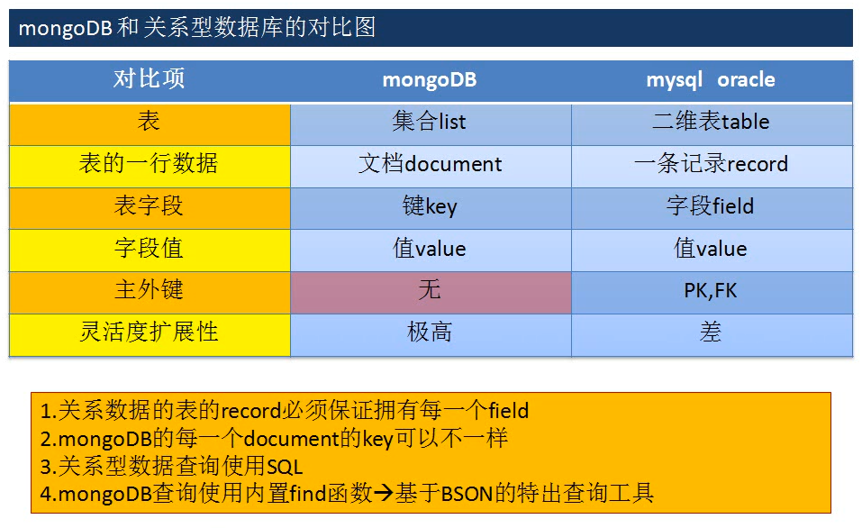
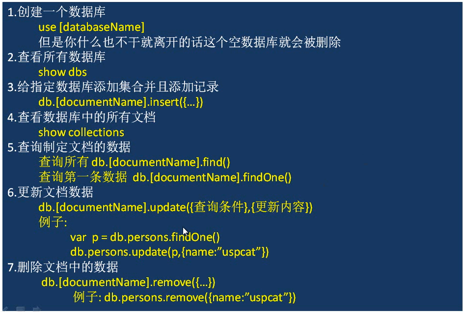
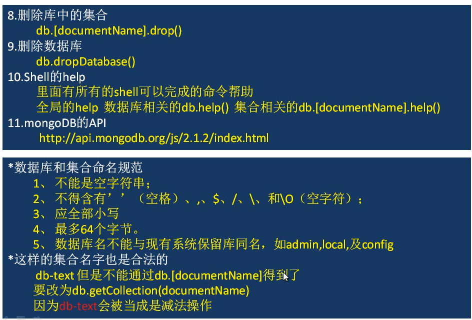
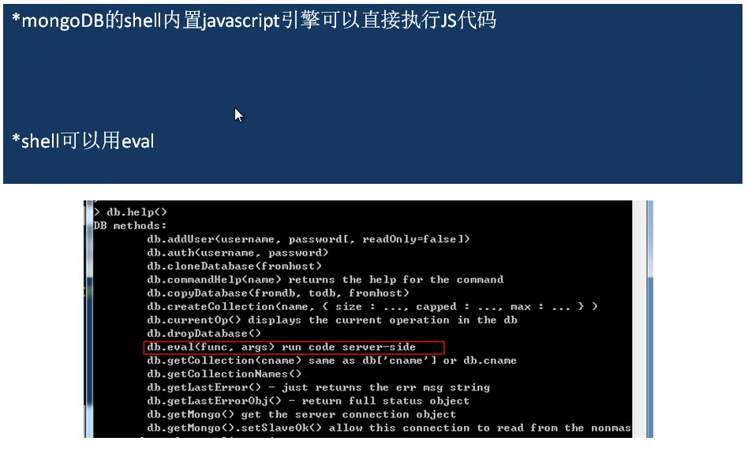
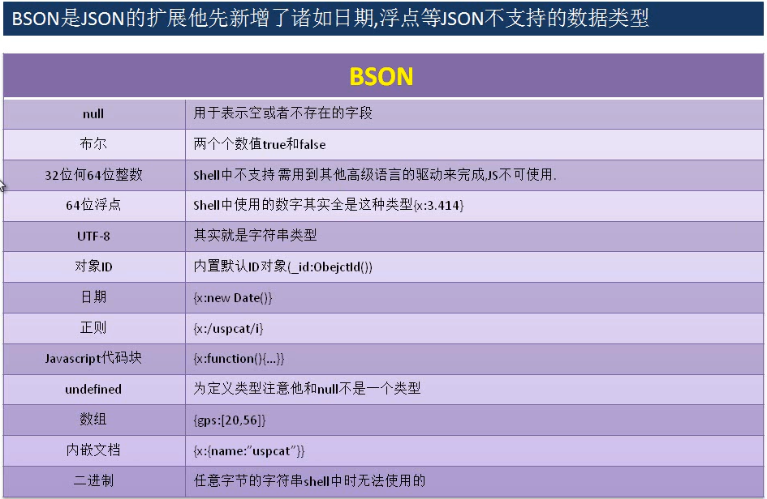
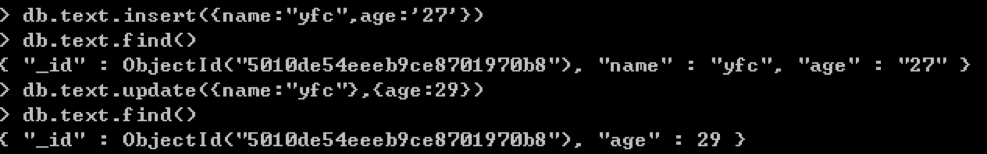
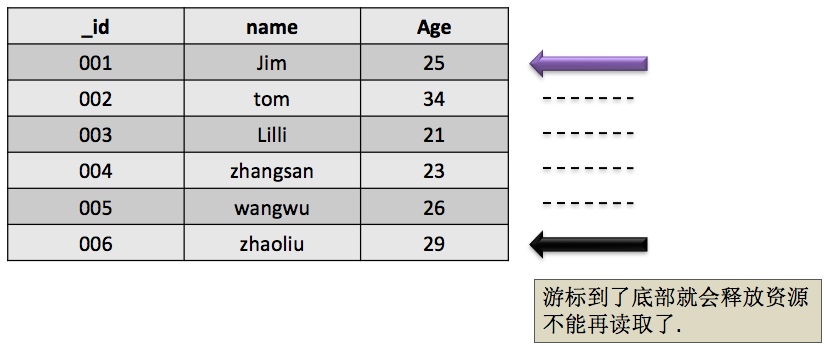
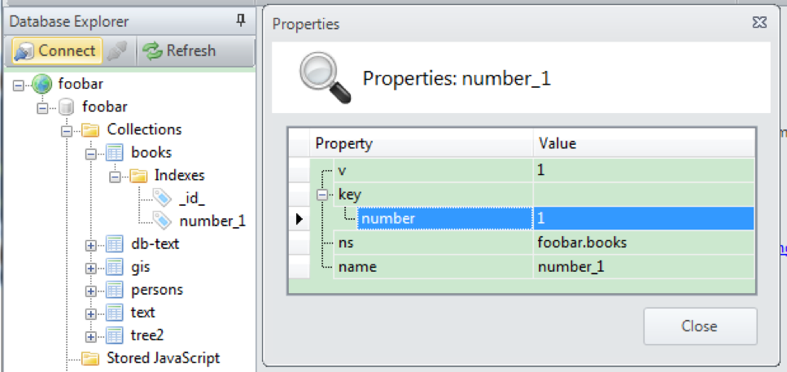
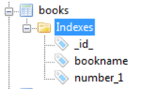

# mongoDB视频相应文档


### mongoDB和关系型数据库的对比图：



### 基础操作：





### BSON扩充的数据类型



### Document数据插入

1.插入文档

   db.[documentName].insert({})

```
db.persons.insert([{_id:"001","name":"123"}])
```

2.批量插入文档

​         shell 这样执行是错误的 db.[documentName].insert([{},{},{},……..])

​        shell 不支持批量插入

​        想完成批量插入可以用mongo的应用驱动或是shell的for循环

```
for (let i = 0; i < 10; i++) {
    db.persons.insert([{ "name":"123"}])
}
```

3.Save操作

​         save操作和insert操作区别在于当遇到_id相同的情况下

​         save完成保存操作

​         insert则会报错

### Document数据删除

1.删除列表中所有数据

​    db.[documentName].remove()

​        集合的本身和索引不会别删除

2.根据条件删除

​       db.[documentName].remove({})

​    删除集合text中name等于uspcat的纪录

​        db.text.remove({name:”uspcat”})

3.小技巧

​        如果你想清楚一个数据量十分庞大的集合

​       直接删除该集合并且重新建立索引的办法

​       比直接用remove的效率和高很多

### Document数据更新

#### 1.强硬的文档替换式更新操作

   db.[documentName].update({查询器},{修改器})



​        强硬的更新会用新的文档代替老的文档

#### 2.主键冲突的时候会报错并且停止更新操作

​        因为是强硬替换当替换的文档和已有文档ID冲突的时候

​        则系统会报错

#### 3.insertOrUpdate操作

​        目的:查询器查出来数据就执行更新操作,查不到数据就插入操作

​     做法:db.[documentName].update({查询器},{修改器},true)

#### 4.批量更新操作

​         默认情况当查询器查询出多条数据的时候默认就修改第一条数据

​        如何实现批量修改

​        db.[documentName].update({查询器},{修改器},false, true)  

```
db.persons.update({name:"3"},{$set:{name:"33"}},false,true)
```

#### 5.使用修改器来完成局部更新操作

| 修改器名称                                    | 语法                                | 案例                                |
| ---------------------------------------- | --------------------------------- | --------------------------------- |
| $set                                     | {$set:{field: value}}             | {$set:{name:”uspcat”}}            |
| 它用来指定一个键值对,如果存在键就进行修改不存在则进行添加.           |                                   |                                   |
| $inc                                     | { $inc : { field : value } }      | { $inc : { "count" : 1 } }        |
| 只是使用与数字类型,他可以为指定的键对应的数字类型的数值进行加减操作.      |                                   |                                   |
| $unset                                   | { $unset : { field : 1} }         | { $unset : { “name":1 }           |
| 他的用法很简单,就是删除指定的键                         |                                   |                                   |
| $push                                    | { $push : { field : value } }     | { $push : { books:”JS”}           |
| 1.如果指定的键是数组增追加新的数值                                                       2.如果指定的键不是数组则中断当前操作Cannot apply $push/$pushAll  modifier to non-array                                                                                 3.如果不存在指定的键则创建数组类型的键值对 |                                   |                                   |
| $pushAll                                 | { $pushAll : { field : array } }  | { $push : { books:[“EXTJS”,”JS”]} |
| 用法和$push相似他可以体谅添加数组数据                    |                                   |                                   |
| $addToSet                                | { $addToSet: {  field : value } } | { $addToSet: {  books:”JS”}       |
| 目标数组存在此项则不操作,不存在此项则加进去                   |                                   |                                   |

| 修改器名称                                    | 语法                             | 案例                                   |
| ---------------------------------------- | ------------------------------ | ------------------------------------ |
| $pop                                     | {$pop:{field: value}}          | {$pop:{name:1}} {$pop:{name:-1}}     |
| 从指定数组删除一个值1删除最后一个数值,-1删除第一个数值            |                                |                                      |
| $pull                                    | { $pull: { field : value } }   | { $pull : { “book" : “JS” } }        |
| 删除一个被指定的数值                               |                                |                                      |
| $pullAll                                 | { $pullAll: { field : array} } | { $pullAll: { “name":[“JS”,”JAVA”] } |
| 一次性删除多个指定的数值                             |                                |                                      |
| $                                        | { $push : { field : value } }  | { $push : { books:”JS”}              |
| 1.数组定位器,如果数组有多个数值我们只想对其中一部分进行操作我们就要用到定位器($)                                                                                                                       例子:                                                                                                                               例如有文档{"name":"YFC","age":27,"books":[{"type":"JS","name":"EXTJS4"},{"type":"JS","name":"JQUERY"},{"type":"DB","name":"MONGODB"}]}  我们要把type等于JS的文档增加一个相同的作者author是USPCAT                                                        办法:                                                                                  db.persons.update({"books.type":"JS"},{$set:{"books.$.author":"USPCAT"}}) |                                |                                      |

注意：切记修改器是放到最外面,后面要学的查询器是放到内层的

#### 6.$addToSet与$each结合完成批量数组更新

books数组不存在的再添加数值

​    db.text.update({_id:1000},{$addToSet:{books:{$each:[“JS”,”DB”]}}})

​         $each会循环后面的数组把每一个数值进行$addToSet操作

 

#### 7.存在分配与查询效率

​     当document被创建的时候DB为其分配没存和预留内存当修改操作

​         不超过预留内层的时候则速度非常快反而超过了就要分配新的内存

​      则会消耗时间


#### 6.runCommand函数和findAndModify函数

runCommand可以执行mongoDB中的特殊函数
findAndModify就是特殊函数之一他的用于是返回update或remove后的文档

语法：

```
 	 runCommand({“findAndModify”:”processes”,
       	query:{查询器},
		sort{排序},
		 new:true
		update:{更新器},
		remove:true
       }).value
```

示例：

```
var ps = db.runCommand({
    "findAndModify": "persons",
    "query": { "name": "YFC" },
    "update": { "$set": { "email": "1221" } },
    "new": true
}) 
 ps.value
```

http://www.cppblog.com/byc/archive/2011/07/15/151063.aspx


### Find 详讲

#### 1.指定返回的键

   db.[documentName].find ({条件},{键指定})

​        数据准备->[persons.json](image-201708221613/persons.json)

​    1.1 查询出所有数据的指定键(name ,age ,country)

  db.persons.find({},{name:1,age:1,country:1,_id:0})

0:不显示

1:显示

#### 2.查询条件

| 比较操作符 |      |                         |
| ----- | ---- | ----------------------- |
| $lt   | <    | {age:{$gte:22,$lte:27}} |
| $lte  | <=   |                         |
| $gt   | >    |                         |
| $gte  | >=   |                         |
| $ne   | !=   | {age:{$ne:26}}          |


##### 2.1查询出年龄在25到27岁之间的学生

```
db.persons.find({ age: { $gte: 25, $lte: 27 }},{age:1,_id:0})
```


##### 2.2查询出所有不是韩国籍的学生的数学成绩

```
db.persons.find({ country: { $ne: ["Korea"]}},{_id:0,m:1})
```

#### 3.包含或不包含

​      $in或$nin

​      2.3查询国籍是中国或美国的学生信息

```
db.persons.find({country:{$in:["USA","China"]}})
```

​      2.4查询国籍不是中国或美国的学生信息

```
db.persons.find({country:{$nin:["USA","China"]}})
```

#### 4.OR查询

  $or

#####   2.4查询语文成绩大于85或者英语大于90的学生信息

```
db.persons.find({$or:[{c:{$gte:85}},{e:{$gte:90}}]},{_id:0,c:1,e:1})
```

#### 5.Null

​      把中国国籍的学生上增加新的键sex

```
db.persons.update({country:"China"},{$set:{sex:"m"}},false,true)
```

​      2.5查询出sex 等于 null的学生

```
db.persons.find({sex:{$in:[null]}},{country:1})
```

#### 6.正则查询

​        2.6查询出名字中存在”li”的学生的信息

​        db.persons.find({name:/li/},{_id:0,name:1})

##### MongoDB 正则表达式

正则表达式是使用单个字符串来描述、匹配一系列符合某个句法规则的字符串。

许多程序设计语言都支持利用正则表达式进行字符串操作。

MongoDB 使用 **$regex** 操作符来设置匹配字符串的正则表达式。

MongoDB使用PCRE (Perl Compatible Regular Expression) 作为正则表达式语言。

不同于全文检索，我们使用正则表达式不需要做任何配置。

考虑以下 **posts** 集合的文档结构，该文档包含了文章内容和标签：

```
{
   "post_text": "enjoy the mongodb articles on runoob",
   "tags": [
      "mongodb",
      "runoob"
   ]
}
```

------

##### 使用正则表达式

以下命令使用正则表达式查找包含 runoob 字符串的文章：

```
>db.posts.find({post_text:{$regex:"runoob"}})
```

以上查询也可以写为：

```
>db.posts.find({post_text:/runoob/})
```

------

##### 不区分大小写的正则表达式

如果检索需要不区分大小写，我们可以设置 $options 为 $i。

以下命令将查找不区分大小写的字符串 runoob：

```
>db.posts.find({post_text:{$regex:"runoob",$options:"$i"}})
```

集合中会返回所有包含字符串 runoob 的数据，且不区分大小写：

```
{
   "_id" : ObjectId("53493d37d852429c10000004"),
   "post_text" : "hey! this is my post on  runoob", 
   "tags" : [ "runoob" ]
} 
```

------

##### 数组元素使用正则表达式

我们还可以在数组字段中使用正则表达式来查找内容。 这在标签的实现上非常有用，如果你需要查找包含以 run 开头的标签数据(ru 或 run 或 runoob)， 你可以使用以下代码：

```
>db.posts.find({tags:{$regex:"run"}})
```

------

##### 优化正则表达式查询

- 如果你的文档中字段设置了索引，那么使用索引相比于正则表达式匹配查找所有的数据查询速度更快。

  ​

- 如果正则表达式是前缀表达式，所有匹配的数据将以指定的前缀字符串为开始。例如： 如果正则表达式为 **^tut **，查询语句将查找以 tut 为开头的字符串。

**这里面使用正则表达式有两点需要注意：**

正则表达式中使用变量。一定要使用eval将组合的字符串进行转换，不能直接将字符串拼接后传入给表达式。否则没有报错信息，只是结果为空！实例如下：

```
var name=eval("/" + 变量值key +"/i"); 
```

以下是模糊查询包含title关键词, 且不区分大小写:

```
title:eval("/"+title+"/i")    // 等同于 title:{$regex:title,$Option:"$i"}   
```

#### 7.$not的使用

   $not可以用到任何地方进行取反操作

​        2.7查询出名字中不存在”li”的学生的信息

​        db.persons.find({name:{$not:/li/i}},{_id:0,name:1})

​        $not和$nin的区别是$not可以用在任何地方儿$nin是用到集合上的

#### 8.数组查询$all和index应用

​    2.8查询喜欢看MONGOD和JS的学生

​       db.persons.find({books:{$all:[“MONGOBD”,”JS”]}},{books:1,_id:0})

​      2.9查询第二本书是JAVA的学习信息

```
db.persons.find({"books.1":"JAVA"})
```

#### 9.查询指定长度数组$size它不能与比较查询符一起使用(这是弊端)

#####       2.8查询出喜欢的书籍数量是4本的学生

```
db.persons.find({books:{$size:4}},{_id:0,books:1})
```

#####       2.9查询出喜欢的书籍数量大于3本的学生

​      1.增加字段size

```
db.persons.update({},{$set:{size:4}},false,true)
```

​      2.改变书籍的更新方式,每次增加书籍的时候size增加1

​          db.persons.update({查询器},{$push:{books:”ORACLE”},$inc:{size:1}})

```
 db.persons.update({name:"jim"},{$push: {books:"ORACLE"},$inc: {size:1}})
```

​      3.利用$gt查询

```
 db.persons.find({size:{$gt:4}})
```


#####       2.10利用shell查询出Jim喜欢看的书的数量

```
var persons = db.persons.find({name:"jim"})
while(persons.hasNext()){
  var obj = persons.next();
  print(obj.books.length)
} 
```

#####       课间小结

​               1.mongodb 是NOSQL数据库但是他在文档查询上还是很强大的

​               2.查询符基本是用到花括号里面的更新符基本是在外面

​               3.shell是个彻彻底底的JS引擎,但是一些特殊的操作要靠他的

​                   各个驱动包来完成(JAVA,NODE.JS)

#### 10.$slice操作符返回文档中指定数组的内部值

#####        2.11查询出Jim书架中第2~4本书

```
db.persons.find({name:"jim"},{books:{"$slice":[1,3]}})
```

#####        2.12查询出最后一本书

```
db.persons.find({name:"jim"},{books:{"$slice":-1},_id:0,name:1})
```

#### 11.文档查询 数组查询

​      为jim添加学习简历文档 [jim.json](image-201708221613/jim.json)

#####       2.13查询出在K上过学的学生

​      1. 这个我们用绝对匹配可以完成,但是有些问题(找找问题?顺序?总要带着score?)

​          db.persons.find({school:{school:"K",score:"A"}},{_id:0,school:1})

​     2.为了解决顺序的问题我可以用对象”.”的方式定位

​          db.persons.find({"school.score":"A","school.school":"K"},{_id:0,school:1})

​     3.这样也问题看例子:

​      db.persons.find({"school.score":"A","school.school":”J”},{_id:0,school:1})

​         同样能查出刚才那条数据,原因是score和school会去其他对象对比

​     4.正确做法单条条件组查询$elemMatch ,解决查询数组顺序和全部匹配问题，推荐用这个

​          db.persons.find({school:{$elemMatch:{school:"K",score:"A"}}})


#### 12.$where

​      12.查询年龄大于22岁,喜欢看C++书,在K学校上过学的学生信息

​            复杂的查询我们就可以用$where因为他是万能

​            但是我们要尽量避免少使用它因为他会有性能的代价

​       **这个在命令行才能执行成功！图形化客户端会全部查询出来**

```
db.persons.find({"$where":function(){
	//得到查询结果的每一条文档
	var books = this.books;
	//得到文档中的school对象
	var school = this.school;
	//如果年纪>=22
	if(this.age > 22){
		var php = null;
		//遍历书籍
		for ( var i = 0; i < books.length; i++) {
			if(books[i] == "C++"){
				php = books[i];
				//如果学校是真
				if(school){
					for (var j = 0; j < school.length; j++) {
						//判断是不是在K上学
						if(school[j].school == "K"){
							//返回是真
							return true;
						}
					}
					break;
				}
			}
		}	
	}
}})
```


### 分页与排序

#### 1.Limit返回指定的数据条数

​    1.1查询出persons文档中前5条数据

​    db.persons.find({},{_id:0,name:1}).limit(5)

#### 2.Skip返回指定数据的跨度

​    2.1查询出persons文档中5~10条的数据

​    db.persons.find({},{_id:0,name:1}).limit(5).skip(5)

#### 3.Sort返回按照年龄排序的数据[1,-1]

​    db.persons.find({},{_id:0,name:1,age:1}).sort({age:1})

值为1或-1，以分别指定升序或降序排序。

   注意:mongodb的key可以存不同类型的数据排序就也有优先级

   最小值

   null

   数字

   字符串

   对象/文档

   数组

   二进制

   对象ID

   布尔

   日期

​    时间戳 à 正则 à 最大值  

#### 4.Limit和Skip完成分页

​    4.1三条数据位一页进行分页

​         第一页àdb.persons.find({},{_id:0,name:1}).limit(3).skip(0)

​         第二页àdb.persons.find({},{_id:0,name:1}).limit(3).skip(3)

   4.2skip有性能问题,没有特殊情况下我们也可以换个思路

​          对文档进行重新解构设计

| _id  | name     | Age  | Date                |
| ---- | -------- | ---- | ------------------- |
| 001  | Jim      | 25   | 2012-07-31:12:24:24 |
| 002  | tom      | 34   | 2012-07-31:12:24:54 |
| 003  | Lilli    | 21   | 2012-07-31:12:24:57 |
| 004  | zhangsan | 23   | 2012-07-31:12:25:24 |
| 005  | wangwu   | 26   | 2012-07-31:12:27:26 |
| 006  | zhaoliu  | 29   | 2012-07-31:12:30:24 |

每次查询操作的时候前后台传值全要把上次的最后一个文档的日期保存下来

db.persons.find({date:{$gt:日期数值}}).limit(3)

个人建议à应该把软件的中点放到便捷和精确查询上而不是分页的性能上

因为用户最多不会翻查过2页的


### 游标和其他知识

#### 1.游标

   利用游标遍历查询数据

   var  persons = db.persons.find();

   while(persons.hasNext()){

​      obj = persons.next();

​         print(obj.name)

​    } 





#### 2.游标几个销毁条件

   1.客户端发来信息叫他销毁

   2.游标迭代完毕

   3.默认游标超过10分钟没用也会别清除

#### 3.查询快照

​    快照后就会针对不变的集合进行游标运动了,看看使用方法.

   db.persons.find({$query:{name:”Jim”},$snapshot:true})

​    高级查询选项

​    $query

​    $orderby

​    $maxsan：integer最多扫描的文档数

​    $min：doc 查询开始

​    $max：doc 查询结束

​    $hint：doc  使用哪个索引

​    $explain:boolean 统计

​    $snapshot:boolean一致快照


#### 4.为什么有的时候要用查询快照?看图.


### 索引详讲

#### 1.创建简单索引

​        数据准备

```
for(var i = 0 ; i<200000 ;i++){
	db.books.insert({number:i,name:i+"book"})
}
```

​        1.先检验一下查询性能

​            var start = new Date()

​            db.books.find({number:65871})

​            var end = new Date()

​            end - start

​         2.为number 创建索引

​            db.books.ensureIndex({number:1}) 这个废弃了

Changed in version 3.2: Starting in MongoDB 3.2 

   db.books.createIndex({number:1})

对于字段上升索引，请指定值为1; 对于降序索引，请指定值-1。

​         3.再执行第一部的代码可以看出有数量级的性能提升

#### 2.索引使用需要注意的地方

​         1.创建索引的时候注意1是正序创建索引-1是倒序创建索引(主要针对时间)

​        2.索引的创建在提高查询性能的同事会影响插入的性能

​            对于经常查询少插入的文档可以考虑用索引

​        3.符合索引要注意索引的先后顺序

​        4.每个键全建立索引不一定就能提高性能呢

​             索引不是万能的

​        5.在做排序工作的时候如果是超大数据量也可以考虑加上索引

​             用来提高排序的性能


#### 3.索引的名称

​    3.1用VUE查看索引名称



   3.2创建索引同时指定索引的名字

​          db.books.ensureIndex({name:-1},{name:”bookname”})



#### 4.唯一索引

​     4.1如何解决文档books不能插入重复的数值

​           建立唯一索引

​          db.books.createIndex({name:-1},{unique:true})

​          试验

​         db.books .insert({name:"1book"})

#### 5.踢出重复值 版本3.0中已更改：dropDups选项不再可用。

​      5.1如果建议唯一索引之前已经有重复数值如何处理

​          db.books.createIndex({name:-1},{unique:true,dropDups:true})

#### 6.Hint

​      6.1如何强制查询使用指定的索引呢?

​           db.books.find({name:"1book",number:1}).hint({name:-1})

​            指定索引必须是已经创建了的索引


#### 7.Expain

​        7.1如何详细查看本次查询使用那个索引和查询数据的状态信息

​          db.books.find({name:"1book"}).explain()

​              “cursor” : “BtreeCursor name_-1“ 使用索引

​              “nscanned” : 1 查到几个文档

​              “millis” : 0 查询时间0是很不错的性能

### 索引管理

#### 1.system.indexes

​        1.1在shell查看数据库已经建立的索引

​              db.system.indexes.find()

​              db.system.namespaces.find()

#### 2.后台执行

​        2.1执行创建索引的过程会暂时锁表问题如何解决?

​              为了不影响查询我们可以叫索引的创建过程在后台

​              db.books.ensureIndex({name:-1},{background:true})

#### 3.删除索引

​        3.1批量和精确删除索引

​              db.runCommand({dropIndexes :”books” , index:”name_-1”})

​              db.runCommand({dropIndexes :”books” , index:”*”})


### 空间索引

1.mongoDB提供强大的空间索引可以查询出一定范围的地理坐标.看例子

​          准备数据[map.json](image-201708221613/map.json)


#### 1.查询出距离点(70,180)最近的3个点

​       添加2D索引

​       db.map.createIndex({"gis":"2d"},{min:-1,max:201})

​       默认会建立一个[-180,180]之间的2D索引

​       查询点(70,180)最近的3个点

​       db.map.find({"gis":{$near:[70,180]}},{gis:1,_id:0}).limit(3)

#### 2.查询以点(50,50)和点(190,190)为对角线的正方形中的所有的点

​         db.map.find({gis:{"$within":{$box:[[50,50],[190,190]]}}},{_id:0,gis:1})

#### 3.查询出以圆心为(56,80)半径为50规则下的圆心面积中的点

​         db.map.find({gis:{$within:{$center:[[56,80],50]}}},{_id:0,gis:1})


### Count+Distinct+Group


#### 1.Count

​    请查询persons中美国学生的人数.

​     db.persons.find({country:"USA"}).count()

#### 2.Distinct

​     请查询出persons中一共有多少个国家分别是什么.

​     db.runCommand({distinct:"persons", key:"country"}).values

#### 3.Group

​      语法:

​      db.runCommand({group:{

​             ns:集合名字,

Key:分组的键对象,

Initial:初始化累加器,

$reduce:组分解器,

Condition:条件,

Finalize:组完成器

​      }})

​      分组首先会按照key进行分组,每组的 每一个文档全要执行$reduce的方法,

​      他接收2个参数一个是组内本条记录,一个是累加器数据.

3.1请查出persons中每个国家学生数学成绩最好的学生信息(必须在90以上)

```
db.runCommand({group:{
	ns:"persons",
	key:{"country":true},
	initial:{m:0},
	$reduce:function(doc,prev){
		if(doc.m > prev.m){
			prev.m = doc.m;
			prev.name = doc.name;
			prev.country = doc.country;
		}
	},
	condition:{m:{$gt:90}}
}})
```


3.2在3.1要求基础之上吧没个人的信息链接起来写一个描述赋值到m上

finalize:function(prev){

 prev.m = prev.name+" Math scores "+prev.m

}

```
db.runCommand({group:{
	ns:"persons",
	key:{"country":true},
	initial:{m:0},
	$reduce:function(doc,prev){
		if(doc.m > prev.m){
			prev.m = doc.m;
			prev.name = doc.name;
			prev.country = doc.country;
		}
	},
	finalize:function(prev){
		prev.m = prev.name+" Math scores "+prev.m
	},
	condition:{m:{$gt:90}}
}})
```

4.用函数格式化分组的键

​        4.1如果集合中出现键Counrty和counTry同时存在那分组有点麻烦这要如何解决呢?

​        $keyf:function(doc){

​                return{country:doc.counTry}

​        },…..       

指定一个创建“key object”作为分组key， 使用$ keyf而不是按计算字段分组，而不是现有的文档字段。

```

db.persons.insert({
	name:"USPCAT",
	age:27,
	email:"2145567457@qq.com",
	c:89,m:100,e:67,
	counTry:"China",
	books:["JS","JAVA","EXTJS","MONGODB"]
})

db.runCommand({group:{
	ns:"persons",
	$keyf:function(doc){
		if(doc.counTry){
			return {country:doc.counTry}
		}else{
			return {country:doc.country}
		}
	},
	initial:{m:0},
	$reduce:function(doc,prev){
		if(doc.m > prev.m){
			prev.m = doc.m;
			prev.name = doc.name;
			if(doc.country){
				prev.country = doc.country;
			}else{
				prev.country = doc.counTry;
			}
		}
	},
	finalize:function(prev){
		prev.m = prev.name+" Math scores "+prev.m
	},
	condition:{m:{$gt:90}}
}})
```


### 数据库命令操作

#### 1.命令执行器runCommand

​         1.1用命令执行完成一次删除表的操作

db.runCommand({drop:"map"})

执行结果：

{

​        "nIndexesWas" : 2,

​        "msg" : "indexes dropped forcollection",

​        "ns" :"foobar.map",

​        "ok" : 1

}

#### 2.如何查询mongoDB为我们提供的命令 

​         1.在shell中执行 db.listCommands()

​         2.访问网址http://localhost:28017/_commands（前提是启动的时候需要添加 -rest  命令  开启简单的rest API）

#### 3.常用命令举例 

​         3.1查询服务器版本号和主机操作系统

​         db.runCommand({buildInfo:1})    

​         3.2查询执行集合的详细信息,大小,空间,索引等……

​        db.runCommand({collStats:"persons"})

​         3.3查看操作本集合最后一次错误信息

​        db.runCommand({getLastError:"persons"})

### 固定集合特性

1.固定集合概念


2.固定特性

​        2.1固定集合默认是没有索引的就算是_id也是没有索引的

​        2.2由于不需分配新的空间他的插入速度是非常快的

​        2.3固定集合的顺是确定的导致查询速度是非常快的

​        2.4最适合的是应用就是日志管理

3.创建固定集合

​        3.1创建一个新的固定集合要求大小是100个字节,可以存储文档10个

​            db.createCollection("mycoll",{size:100,capped:true,max:10})

capped：要创建一个上限集合，请指定true。 如果指定true，则还必须在size字段中设置最大大小。

​        3.2把一个普通集合转换成固定集合

​             db.runCommand({convertToCapped:”persons”,size:100000})

4.反向排序,默认是插入顺序排序.

​        4.1查询固定集合mycoll并且反响排序

​             db.mycoll.find().sort({$natural:-1})

5.尾部游标,可惜shell不支持java和php等驱动是支持的

​        5.1尾部游标概念

​             这是个特殊的只能用到固定级和身上的游标,他在没有结果的时候

​             也不回自动销毁他是一直等待结果的到来

### GridFS文件系统

1.概念

​          GridFS是mongoDB自带的文件系统他用二进制的形式存储文件

​          大型文件系统的绝大多是特性GridFS全可以完成

2.利用的工具

mongofiles

3.使用GridFS

​          3.1查看GridFS的所有功能

​           cmd->mongofiles

​          3.2上传一个文件

​           mongofiles -d foobar -l"E:\a.txt" put "a.txt“

​          3.3查看GridFS的文件存储状态

​                利用VUE查看   

​                集合查看

​                db.fs.chunks.find() 和db.fs.files.find() 存储了文件系统的所有文件信息


3.4查看文件内容

​     C:\Users\thinkpad>mongofiles -d foobar get "a.txt“

​     VUE可以查看,shell无法打开文件

3.5查看所有文件

​     mongofiles -d foobar list

3.5删除已经存在的文件VUE中操作

​     mongofiles -d foobar delete 'a.txt'

### 补充->服务器端脚本

1.Eval

​    1.1服务器端运行eval

​          db.eval("function(name){ return name}","uspcat")

2.Javascript的存储

​    2.1在服务上保存js变量活着函数共全局调用

​          1.把变量加载到特殊集合system.js中

​        db.system.js.insert({_id:"name",value:"uspcat"})

​          2.调用

​             db.eval("return  name;")


查看目前脚本：db.system.js.find()

System.js相当于Oracle中的存储过程,因为value不单单可以写变量

还可以写函数体也就是javascript代码