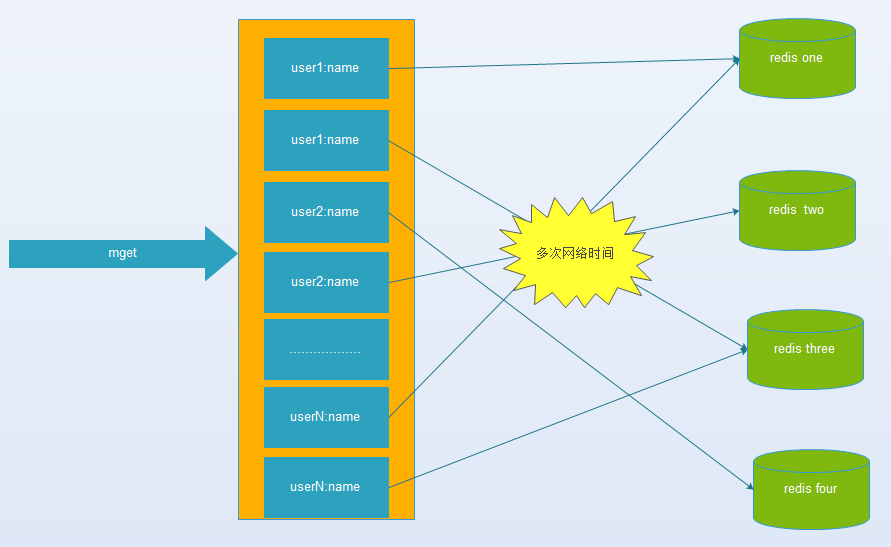
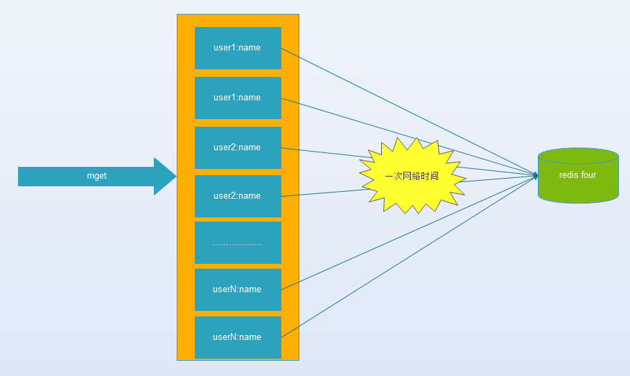
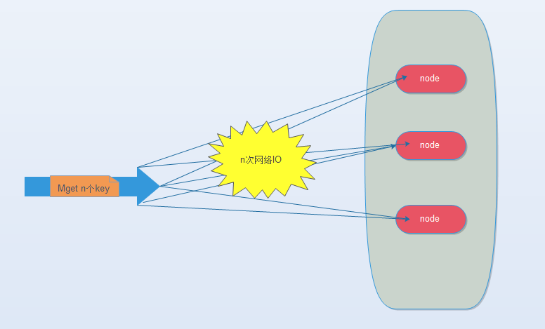
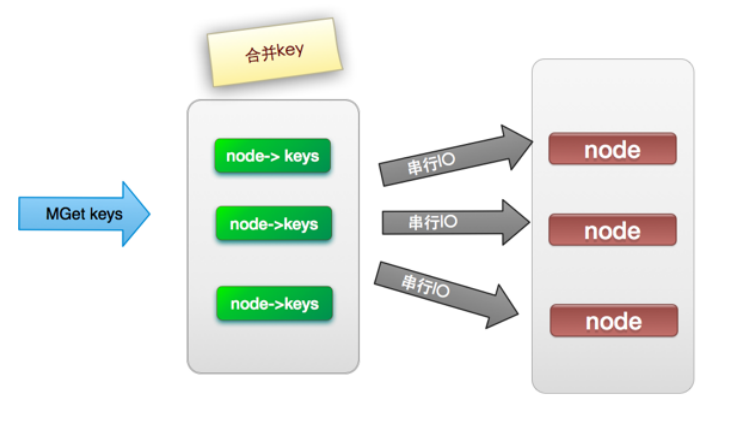
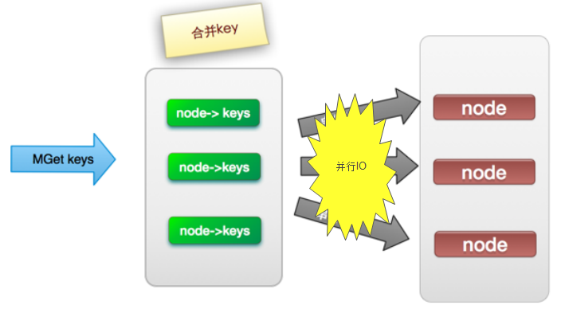
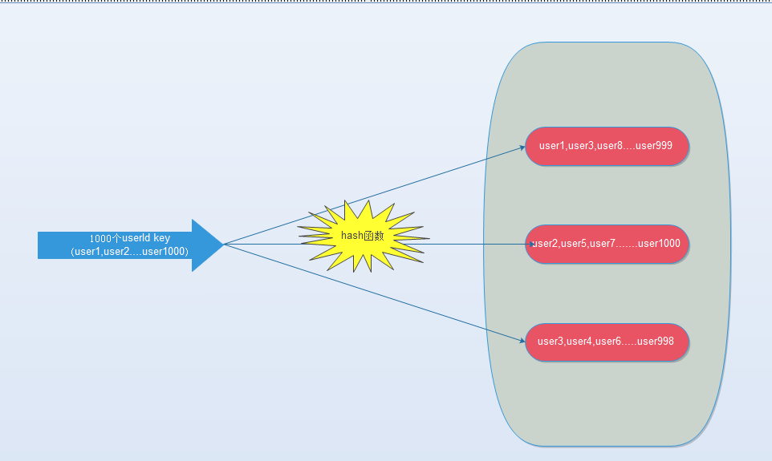
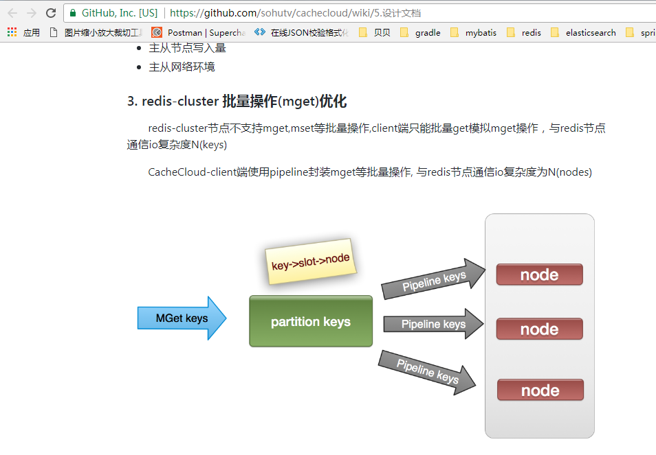
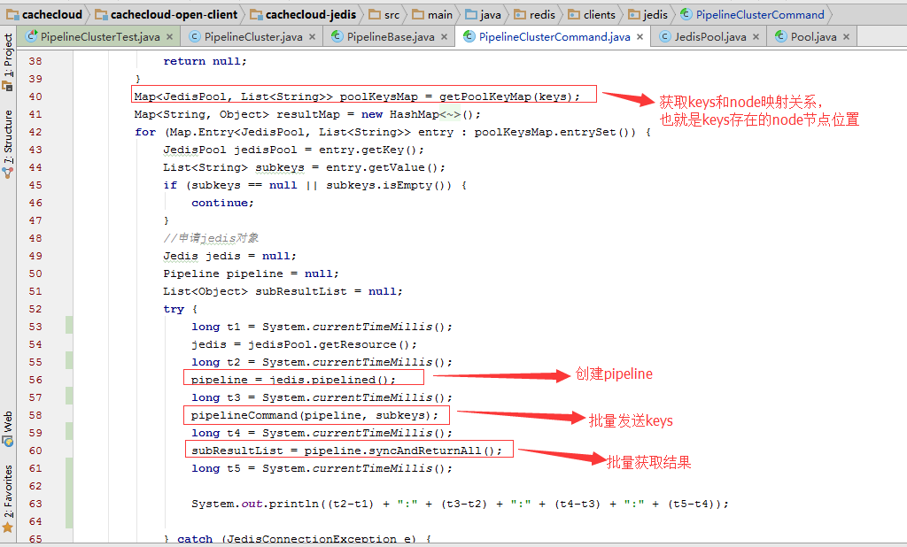

# redis cluster mget 引发的讨论

​    背景：近期由于跨机房数据同步问题，准备调研使用redis替换memcache，在调研过程中发现棘手的问题，原有的memcache提供大量批量获取操作(mget)操作，程序最大支持同时获取2000个。而redis最新的3.x版本引入了cluster模式，而也正是因为引入了cluster模式导致了redis的mget命令无法使用，过去的一周抽空调研了一些方法，但是很遗憾还是没有找到完美的方案来解决这个问题，这篇文章把整个过程沉淀总结一下。

​    首先，先贴出一个概念叫作《缓存-无底洞问题》，该问题由 facebook 的工作人员提出的， facebook 在 2010 年左右，memcached 节点就已经达3000 个，缓存数千 G 内容。他们发现了一个问题---memcached 连接频率，效率下降了，于是加 memcached 节点，添加了后，发现因为连接频率导致的问题，仍然存在，并没有好转，称之为”无底洞现象”。为什么会出现这个现象，请对比下面两张图片，图一是多IO版本，也就是说当存在的节点异常多的时候，IO的代价已经超过数据传输，上文提到的facebook的节点已经超过3000个，在这种情况下再增加节点已经没法再提高效率了。（参考连接http://blog.csdn.net/erica_1230/article/details/50569301）

  图一 多IO版本

​    图二 单IO版本

​    redis引入cluster模式后，批量获取操作mget也面临同样的问题。redis是传统的key-value的存储模式，RedisCluster将数据按key哈希到16384个slot上，每个redis node负责一部分的slot。mget需要执行的操作就是从redis node获取所有的key-value值，然后进行merge然后返回。目前网上可以搜到的关于mget的几种优化方案 ( http://ifeve.com/redis-multiget-hole/)，我把其中几个图摘录出来。

​    其实IO的优化思路都比较通用，无非就是提高命令本身效率，串行改并行，单个转批量。摘录一段网上的IO优化思路总结：

(1) 命令本身的效率：例如sql优化，命令优化

(2) 网络次数：减少通信次数

(3) 降低接入成本:长连/连接池,NIO等。

(4) IO访问合并:O(n)到O(1)过程:批量接口(mget)

mget 优化几种方案

方案一：传统的串行IO操作，也就说n个key，分n次串行操作来获取key，复杂度是o(n)。

方案二：将Mget操作(n个key)，利用已知的hash函数算出key对应的节点，这样就可以得到一个这样的关系：Map<node, somekeys>，也就是每个节点对应的一些keys，这样将之前的o(n)的效率降低到o(node.size())。

方案三：在方案二的基础上将串行取数据改为并行取数据，进一步提高效率。

方案四：通过redis自带的hashtag功能，强制一批key分配到某台机器上，不推荐使用。

​    那么我们做了那些实验呢，首先方案三由于多线程的复杂度过高选择放弃（当然如果方案有个proxy中间代理去实现这个功能，那么我觉得还是可以尝试的），方案四会造成key的存储分布不均匀也选择放弃，方案四还因为我们的每次取得key的组合关系是随机的，所以没法保证肯定落在同一个redis node上，我们只尝试了方案一和方案二，得出的数据是方案二比方案一有2~3倍的性能提升，但耗时波动区间太大（100个线程并行获取100key，耗时20ms-200ms不等），所以暂时不考虑迁移了。

​    在整个调研过程中，我们使用的客户端是jedis，目前jedis的最新版本是支持redis cluster的模式的，批量获取我们用了redis的pipeline模式，串行获取就用了redis的get操作，实验过程中比较困惑的是理论上批量获取应该比串行获取更加有优势，而且优势应该非常明显才对，但是实际上也就2-3倍的性能差别，没有达到想象中的10倍差距，后来仔细分析了一下应该有下面两方面的原因。

​    首先看过jedis的redis cluster部分的源码我们可以指导，jedis在启动的初始化过程中已经维护了slot和node之间的长连接，也就是说jedis和每个redis的node都建立了长连接，而且是一个长连接的线程池，在这种情况下单个get操作原本用于连接建立的耗时就可以忽略了，mget原因在降低连接建立方面的优势就没有了；

​    其次redis的服务端采用的是单线程模型，也就是说一个操作耗时太长会影响下一个操作，那么mget本身需要操作的key就比get要多，从单个操作的执行层面来说mget反而可能比get还更耗时。

​    最后我们得出的结论是pipeline的mget还是比get要快2~3倍，那么可以说明的是redis在服务端应该做了很多优化，mget的效率跟get应该相差不大，其次批量发送数据本身就比串行数据要快，毕竟客户端和服务端交互的次数少了，即便是建立连接的时间可以忽略。

调研过程中我们发现虽然有大量的文章提供了思路，但是实践的资料在网上的确不多，目前我唯一找到的就是搜狐开源redis的监控平台cachecloud（https://cachecloud.github.io/），摘录其中的一些关键源码。

Cachecloud视频教程在线：<http://my.tv.sohu.com/pl/9100280/index.shtml>

CacheCloud视频教程百度网盘:<http://pan.baidu.com/s/1c2mET5e>

Redis入门视频教程：<http://my.tv.sohu.com/pl/9102138/index.shtml>

Redis入门PPT：<http://pan.baidu.com/s/1jIztTcy>

QQ群： 534429768

最后推荐一本书《Redis开发与运维》，感觉不错。

http://www.jianshu.com/p/22aa8efaec8f