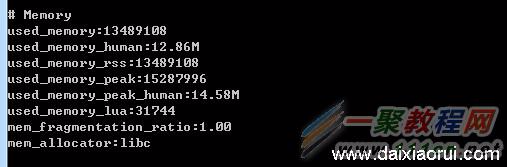

指令：info memory

怎么查看redis占用内存大小的情况呢，如果我们不了解具体的内存占用情况我们可以和小编一起来看看吧，具体的细节如下所示．

redis缓存固然高效，可是它会占用我们系统中宝贵的内存资源，特别是当我们的项目运行了一段时间后，我们需要看一下redis占用了多少内存，那么可以用“info”命令查看。

执行info命令后，找到Memory这一栏，就可以看到内存的使用信息了，如下图：

 

\# Memory

 

used_memory:13490096 //数据占用了多少内存（字节）

 

used_memory_human:12.87M //数据占用了多少内存（带单位的，可读性好）

 

used_memory_rss:13490096  //redis占用了多少内存

 

used_memory_peak:15301192 //占用内存的峰值（字节）

 

used_memory_peak_human:14.59M //占用内存的峰值（带单位的，可读性好）

 

used_memory_lua:31744  //lua引擎所占用的内存大小（字节）

 

mem_fragmentation_ratio:1.00  //内存碎片率

 

mem_allocator:libc //redis内存分配器版本，在编译时指定的。有libc、jemalloc、tcmalloc这3种。

 

如果一个项目的数据量比较大，就要经常用info来看内存的使用量，这样才能让项目更稳定

来源： [http://www.111cn.net/database/276/96878.htm](http://www.111cn.net/database/276/96878.htm)