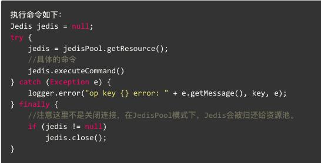
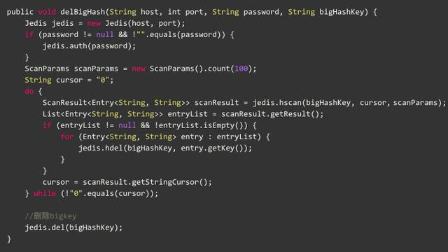
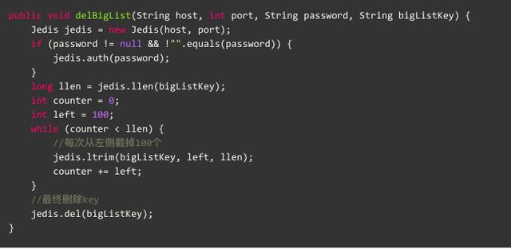
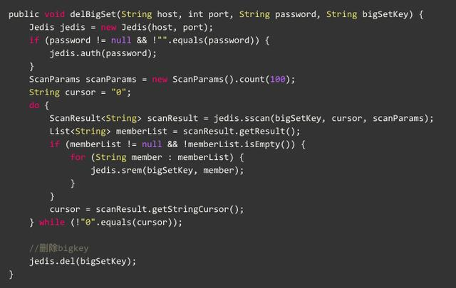
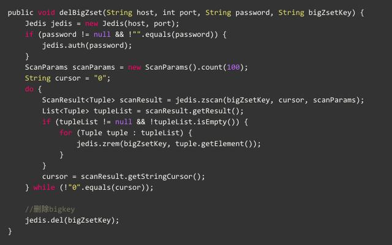

[TOC]


# 阿里云Redis开发规范

云栖社区 2018-03-15 21:36:00

> 摘要： 本文介绍了在使用阿里云Redis的开发规范，从键值设计、命令使用、客户端使用、相关工具等方面进行说明，通过本文的介绍可以减少使用Redis过程带来的问题。

## **一、键值设计**

**1. key名设计**

- (1)【建议】: 可读性和可管理性

以业务名(或数据库名)为前缀(防止key冲突)，用冒号分隔，比如业务名:表名:id

```
ugc:video:1
```

- (2)【建议】：简洁性

保证语义的前提下，控制key的长度，当key较多时，内存占用也不容忽视，例如：

```
user:{uid}:friends:messages:{mid}简化为u:{uid}:fr:m:{mid}。
```

- (3)【强制】：不要包含特殊字符

反例：包含空格、换行、单双引号以及其他转义字符

**2. value设计**

- (1)【强制】：拒绝bigkey(防止网卡流量、慢查询)

string类型控制在10KB以内，hash、list、set、zset元素个数不要超过5000。

反例：一个包含200万个元素的list。

非字符串的bigkey，不要使用del删除，使用hscan、sscan、zscan方式渐进式删除，同时要注意防止bigkey过期时间自动删除问题(例如一个200万的zset设置1小时过期，会触发del操作，造成阻塞，而且该操作不会不出现在慢查询中(latency可查))，查找方法和删除方法

- (2)【推荐】：选择适合的数据类型。

例如：实体类型(要合理控制和使用数据结构内存编码优化配置,例如ziplist，但也要注意节省内存和性能之间的平衡)

反例：

```
set user:1:name tomset user:1:age 19set user:1:favor football
```

正例:

```
hmset user:1 name tom age 19 favor football
```

**3.【推荐】：控制key的生命周期，redis不是垃圾桶。**

建议使用expire设置过期时间(条件允许可以打散过期时间，防止集中过期)，不过期的数据重点关注idletime。

## 二、命令使用

**1.【推荐】 O(N)命令关注N的数量**

例如hgetall、lrange、smembers、zrange、sinter等并非不能使用，但是需要明确N的值。有遍历的需求可以使用hscan、sscan、zscan代替。

**2.【推荐】：禁用命令**

禁止线上使用keys、flushall、flushdb等，通过redis的rename机制禁掉命令，或者使用scan的方式渐进式处理。

**3.【推荐】合理使用select**

redis的多数据库较弱，使用数字进行区分，很多客户端支持较差，同时多业务用多数据库实际还是单线程处理，会有干扰。

**4.【推荐】使用批量操作提高效率**

```
原生命令：例如mget、mset。非原生命令：可以使用pipeline提高效率。
```

但要注意控制一次批量操作的元素个数(例如500以内，实际也和元素字节数有关)。

注意两者不同：

```
1. 原生是原子操作，pipeline是非原子操作。2. pipeline可以打包不同的命令，原生做不到3. pipeline需要客户端和服务端同时支持。
```

**5.【建议】Redis事务功能较弱，不建议过多使用**

Redis的事务功能较弱(不支持回滚)，而且集群版本(自研和官方)要求一次事务操作的key必须在一个slot上(可以使用hashtag功能解决)

**6.【建议】Redis集群版本在使用Lua上有特殊要求：**

- 1.所有key都应该由 KEYS 数组来传递，redis.call/pcall 里面调用的redis命令，key的位置，必须是KEYS array, 否则直接返回error，"-ERR bad lua script for redis cluster, all the keys that the script uses should be passed using the KEYS arrayrn"
- 2.所有key，必须在1个slot上，否则直接返回error, "-ERR eval/evalsha command keys must in same slotrn"

**7.【建议】必要情况下使用monitor命令时，要注意不要长时间使用。**

## 三、客户端使用

**1.【推荐】**

避免多个应用使用一个Redis实例

正例：不相干的业务拆分，公共数据做服务化。

**2.【推荐】**

使用带有连接池的数据库，可以有效控制连接，同时提高效率，标准使用方式：



下面是JedisPool优化方法的文章:

- Jedis常见异常汇总
- JedisPool资源池优化

**3.【建议】**

高并发下建议客户端添加熔断功能(例如netflix hystrix)

**4.【推荐】**

设置合理的密码，如有必要可以使用SSL加密访问（阿里云Redis支持）

**5.【建议】**

根据自身业务类型，选好maxmemory-policy(最大内存淘汰策略)，设置好过期时间。

默认策略是volatile-lru，即超过最大内存后，在过期键中使用lru算法进行key的剔除，保证不过期数据不被删除，但是可能会出现OOM问题。

其他策略如下：

- allkeys-lru：根据LRU算法删除键，不管数据有没有设置超时属性，直到腾出足够空间为止。
- allkeys-random：随机删除所有键，直到腾出足够空间为止。
- volatile-random:随机删除过期键，直到腾出足够空间为止。
- volatile-ttl：根据键值对象的ttl属性，删除最近将要过期数据。如果没有，回退到noeviction策略。
- noeviction：不会剔除任何数据，拒绝所有写入操作并返回客户端错误信息"(error) OOM command not allowed when used memory"，此时Redis只响应读操作。

## 四、相关工具

**1.【推荐】：数据同步**

redis间数据同步可以使用：redis-port

**2.【推荐】：big key搜索**

redis大key搜索工具

**3.【推荐】：热点key寻找(内部实现使用monitor，所以建议短时间使用)**

facebook的redis-faina

```
阿里云Redis已经在内核层面解决热点key问题，欢迎使用。
```

## 五 附录：删除bigkey

```
1. 下面操作可以使用pipeline加速。2. redis 4.0已经支持key的异步删除，欢迎使用。
```

**1. Hash删除: hscan + hdel**



**2. List删除: ltrim**



**3. Set删除: sscan + srem**



**4. SortedSet删除: zscan + zrem**



 

https://www.toutiao.com/a6533121366831399431/?tt_from=android_share&utm_campaign=client_share&timestamp=1521159564&app=news_article&iid=27725142849&utm_medium=toutiao_android