本文使用Druid的连接池替换掉原来的C3P0连接池，然后配置Druid的相关属性，完成对Spring web工程的JDBC监控。

> 其实，我采用Druid替换其它连接池，最关键的一个理由是**Druid有对SQL执行的监控统计功能**。 :)
>
> 本文就是来看看看Druid的监控功能。~~~ **一起玩起来 : )**

## Druid介绍

> Druid是一个JDBC组件库，包括数据库连接池、SQL Parser等组件。DruidDataSource是最好的数据库连接池。参考Druid wiki上的文章 **<<各连接池的性能比较>>**

### Druild包获取

Maven工程中添加druid依赖包：

```
		<!-- https://mvnrepository.com/artifact/com.alibaba/druid -->
		<dependency>
			<groupId>com.alibaba</groupId>
			<artifactId>druid</artifactId>
			<version>1.0.26</version>
		</dependency>
```

## Druid使用

### 替换C3P0连接池

Web工程原先采用**C3P0连接池**的配置：

```
	<!-- 配置数据源-C3PO -->
	<bean id="dataSource" class="com.mchange.v2.c3p0.ComboPooledDataSource"
		destroy-method="close">
		<property name="driverClass" value="${jdbc.driverClassName}" />
		<property name="jdbcUrl" value="${jdbc.url}" />
		<property name="user" value="${jdbc.username}" />
		<property name="password" value="${jdbc.password}" />
		<property name="autoCommitOnClose" value="false" />
		<property name="maxIdleTime" value="${cpool.maxIdleTime}" />
		<property name="checkoutTimeout" value="${cpool.checkoutTimeout}" />
		<property name="initialPoolSize" value="${cpool.minPoolSize}" />
		<property name="minPoolSize" value="${cpool.minPoolSize}" />
		<property name="maxPoolSize" value="${cpool.maxPoolSize}" />
		<property name="acquireIncrement" value="${cpool.acquireIncrement}" />
		<property name="maxIdleTimeExcessConnections" value="${cpool.maxIdleTimeExcessConnections}" />
	</bean>
```

改成**Druid连接池DruidDataSource**

```
	<!-- 配置数据源-druid -->
	<bean id="dataSource" class="com.alibaba.druid.pool.DruidDataSource"
		destroy-method="close">
		<property name="url" value="${jdbc.url}" />
		<property name="username" value="${jdbc.username}" />
		<property name="password" value="${jdbc.password}" />
		<property name="maxActive" value="20" />
		<property name="initialSize" value="1" />
		<property name="maxWait" value="60000" />
		<property name="minIdle" value="1" />
		<property name="timeBetweenEvictionRunsMillis" value="60000" />
		<property name="minEvictableIdleTimeMillis" value="300000" />
		<property name="testWhileIdle" value="true" />
		<property name="testOnBorrow" value="false" />
		<property name="testOnReturn" value="false" />
		<property name="poolPreparedStatements" value="true" />
		<property name="maxOpenPreparedStatements" value="20" />
	</bean>
```

### StatViewServlet配置

> Druid内置提供了一个StatViewServlet**用于展示Druid的统计信息**。

> 这个StatViewServlet的用途包括：
>
> - 提供监控信息展示的html页面
> - 提供监控信息的JSON API

StatViewServlet是一个标准的javax.servlet.http.HttpServlet，需要配置在你web应用中的**WEB-INF/web.xml**中。

```
	<servlet>
		<servlet-name>DruidStatView</servlet-name>
		<servlet-class>com.alibaba.druid.support.http.StatViewServlet</servlet-class>
	</servlet>
	<servlet-mapping>
		<servlet-name>DruidStatView</servlet-name>
		<url-pattern>/druid/*</url-pattern>
	</servlet-mapping>
```

配置完之后，可以通过如下格式的地址在浏览器访问查看。

```
http:/<host>:<port>/<context>/druid
```

举个例子:

如果**host为localhost，port为8080，context为Demo**，那么，可以通过如下URL访问。

```
http://localhost:8080/Demo/druid
```

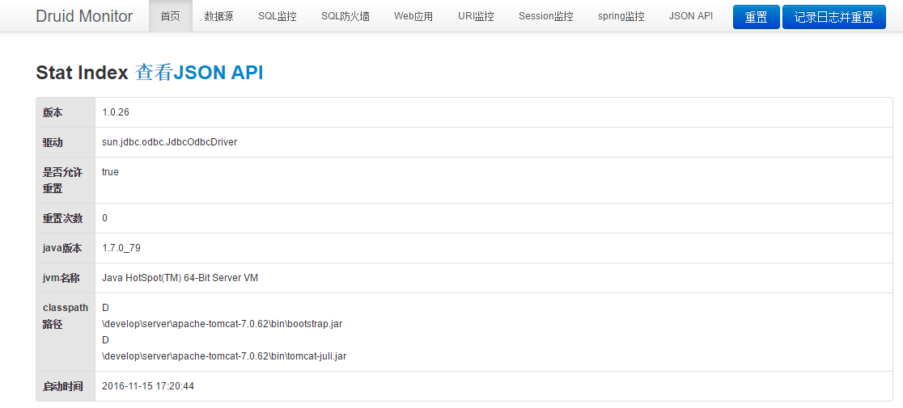

那么问题来了

**查看的时候，能否提供用户名和密码作为验证呢，而不是直接就能看JDBC执行的状态信息？**

**答案是肯定的。**

> 需要在上述配置的情况下，配置Servlet的 `loginUsername` 和 `loginPassword`这两个初始参数。

如：

```
	<servlet>
		<servlet-name>DruidStatView</servlet-name>
		<servlet-class>com.alibaba.druid.support.http.StatViewServlet</servlet-class>
	  <init-param>  
   		 <!-- 用户名 -->  
    	 <param-name>loginUsername</param-name>  
   		 <param-value>druid</param-value>  
   	  </init-param>  
      <init-param>  
   	    <!-- 密码 -->  
    	<param-name>loginPassword</param-name>  
    	<param-value>druid</param-value>  
      </init-param>  
	</servlet>
	<servlet-mapping>
		<servlet-name>DruidStatView</servlet-name>
		<url-pattern>/druid/*</url-pattern>
	</servlet-mapping>
```

配置好之后，登录之后才能访问。

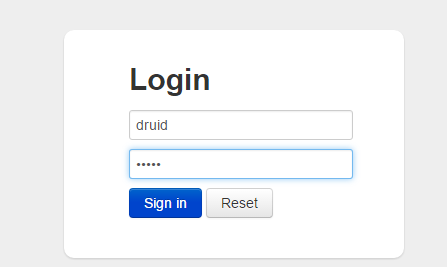

### StatFilter配置

> Druid内置提供一个**StatFilter**，**用于统计监控信息**。

**如果没有配置StatFilter，那么，我们无法获取相关统计信息。**

比如：

无法看到**SQL监控**TAB上的数据。

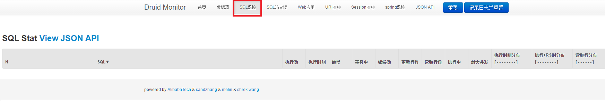

**URI监控**TAB中，无法获取JDBC相关的SQL执行信息。

 

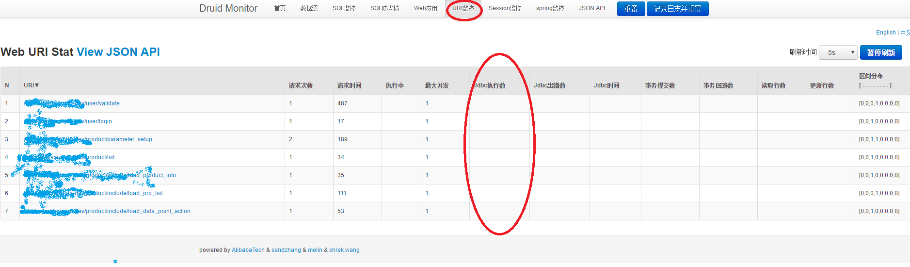

> 如何展示出这些数据呢？ **解决的办法**就是**配置StatFilter**。

**StatFilter**的别名是**stat**，在spring中使用别名配置方式如下：

```
<property name="filters" value="stat" />
```

将上述**stat**添加到dataSource中去即可。

```
	<!-- 配置数据源-druid -->
	<bean id="dataSource" class="com.alibaba.druid.pool.DruidDataSource"
		destroy-method="close">
		<property name="url" value="${jdbc.url}" />
		<property name="username" value="${jdbc.username}" />
		<property name="password" value="${jdbc.password}" />
		<property name="filters" value="stat" />
		<property name="maxActive" value="20" />
		<property name="initialSize" value="1" />
		<property name="maxWait" value="60000" />
		<property name="minIdle" value="1" />
		<property name="timeBetweenEvictionRunsMillis" value="60000" />
		<property name="minEvictableIdleTimeMillis" value="300000" />
		<property name="testWhileIdle" value="true" />
		<property name="testOnBorrow" value="false" />
		<property name="testOnReturn" value="false" />
		<property name="poolPreparedStatements" value="true" />
		<property name="maxOpenPreparedStatements" value="20" />
	</bean>
```

添加完毕之后，再来看一下上述两个TAB (** SQL监控以及 URI监控**)下**JDBC**的内容：

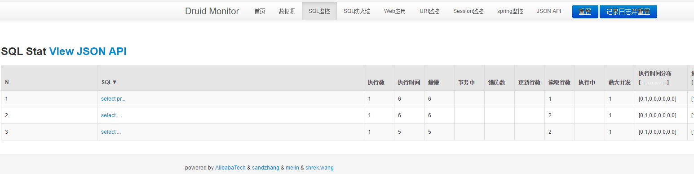

> 在SQL监控页面，可以很清楚地看到目前执行SQL的具体情况，包括某条SQL语句执行的时间（平均、最慢）、SQL执行次数、SQL执行出错的次数等。这些信息，可以作为系统SQL语句优化的一个指标。

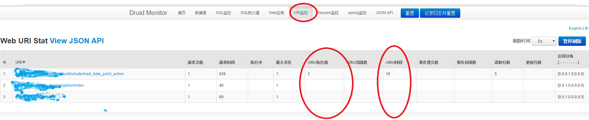

> 在URI监控页，可以清楚地看到执行某个动作，关联SQL有多少，请求次数、执行时间、并发数等信息。

**StatFilter**可以和其他的**Filter**配置使用，比如, 与**log4j**组合使用。

```
 <property name="filters" value="stat,log4j" />
```

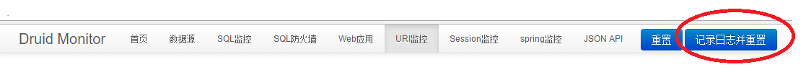

这样，我们在点击 **“记录日志并重置”** 的按钮时，Console中就会输入JDBC相关日志，日志采用JSON的方式记录，如：

```
[INFO ][2016-11-15 20:11:11,677] com.alibaba.druid.pool.DruidDataSourceStatLoggerImpl.log(DruidDataSourceStatLoggerImpl.java:77) - 
{"url":"jdbc:mysql://127.0.0.1:3306/Demo?useUnicode=true&characterEncoding=utf-8&zeroDateTimeBehavior=convertToNull","dbType":"mysql","name":"DataSource-958465974","activeCount":0,"poolingCount":1,"connectCount":0,"closeCount":0}

```

**内置Filter别名和对应的Filter类名**如下：

> | **别名**        | **Filter类名**                             |
> | ------------- | ---------------------------------------- |
> | default       | com.alibaba.druid.filter.stat.StatFilter |
> | stat          | com.alibaba.druid.filter.stat.StatFilter |
> | mergeStat     | com.alibaba.druid.filter.stat.MergeStatFilter |
> | encoding      | com.alibaba.druid.filter.encoding.EncodingConvertFilter |
> | log4j         | com.alibaba.druid.filter.logging.Log4jFilter |
> | log4j2        | com.alibaba.druid.filter.logging.Log4j2Filter |
> | slf4j         | com.alibaba.druid.filter.logging.Slf4jLogFilter |
> | commonlogging | com.alibaba.druid.filter.logging.CommonsLogFilter |

### 慢SQL记录

StatFilter属性slowSqlMillis用来配置SQL慢的标准，执行时间超过slowSqlMillis的就是慢。slowSqlMillis的缺省值为3000，也就是3秒。

```
<bean id="stat-filter" class="com.alibaba.druid.filter.stat.StatFilter">
    <property name="slowSqlMillis" value="10000" />
    <property name="logSlowSql" value="true" />
</bean>
```

在上面的配置中，slowSqlMillis被修改为10秒，并且通过日志输出执行慢的SQL。

**slowSqlMillis**属性也可以通过**connectProperties**来配置，例如：

```
<bean id="dataSource" class="com.alibaba.druid.pool.DruidDataSource" init-method="init" destroy-method="close">
    ... ...
    <property name="filters" value="stat" />
    <property name="connectionProperties" value="druid.stat.slowSqlMillis=5000" />
  </bean>
```

### Wallfilter配置

> 配置WallFilter，可以起到**拦截**作用，从而形成SQL的白名单和黑名单。

缺省情况下，配置装载的目录如下：

> | 数据库类型     | 目录                            |
> | --------- | ----------------------------- |
> | mysql     | META-INF/druid/wall/mysql     |
> | oracle    | META-INF/druid/wall/oracle    |
> | sqlserver | META-INF/druid/wall/sqlserver |
> | postgres  | META-INF/druid/wall/postgres  |

从配置目录中以下文件中读取配置：

```
  deny-variant.txt
  deny-schema.txt
  deny-function.txt
  permit-variant.txt
  permit-variant.txt
```

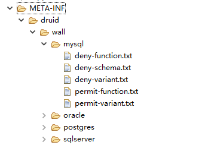

指定配置装载的目录是可以指定，例如：

```
  <bean id="wall-filter-config" class="com.alibaba.druid.wall.WallConfig" init-method="init">
      <!-- 指定配置装载的目录  -->
      <property name="dir" value="META-INF/druid/wall/mysql" />
  </bean>

  <bean id="wall-filter" class="com.alibaba.druid.wall.WallFilter">
      <property name="dbType" value="mysql" />
      <property name="config" ref="wall-filter-config" />
  </bean>

  <bean id="dataSource" class="com.alibaba.druid.pool.DruidDataSource" init-method="init" destroy-method="close">
      ...
      <property name="proxyFilters">
          <list>
              <ref bean="wall-filter"/>
          </list>
      </property>
  </bean>
```

本文实例中，采用如下的配置：

```
	<bean id="wall-filter-config" class="com.alibaba.druid.wall.WallConfig"
		init-method="init">
		<!-- 指定配置装载的目录 -->
		<property name="dir" value="META-INF/druid/wall/mysql" />
	</bean>

	<bean id="wall-filter" class="com.alibaba.druid.wall.WallFilter">
		<property name="dbType" value="mysql" />
		<property name="config" ref="wall-filter-config" />
	</bean>

	<!-- 配置数据源-druid -->
	<bean id="dataSource" class="com.alibaba.druid.pool.DruidDataSource"
		destroy-method="close">
		<property name="url" value="${jdbc.url}" />
		<property name="username" value="${jdbc.username}" />
		<property name="password" value="${jdbc.password}" />
		<property name="filters" value="stat" />
		<property name="maxActive" value="20" />
		<property name="initialSize" value="1" />
		<property name="maxWait" value="60000" />
		<property name="minIdle" value="1" />
		<property name="timeBetweenEvictionRunsMillis" value="60000" />
		<property name="minEvictableIdleTimeMillis" value="300000" />
		<property name="testWhileIdle" value="true" />
		<property name="testOnBorrow" value="false" />
		<property name="testOnReturn" value="false" />
		<property name="poolPreparedStatements" value="true" />
		<property name="maxOpenPreparedStatements" value="20" />
		<property name="proxyFilters">
			<list>
				<ref bean="wall-filter" />
			</list>
		</property>
	</bean>
```

配置好Wallfilter, 我们就可以看到**SQL防火墙** TAB下的内容了。

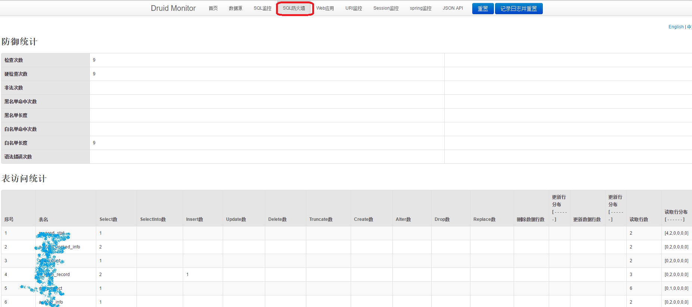

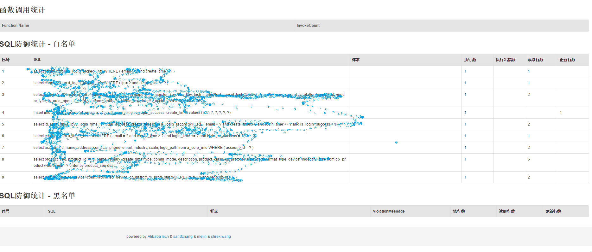

> 因为是默认状态，没有配置任何拦截的属性信息，所以，SQL的执行都在白名单中展示出来了。

### 配置Spring和jdbc的关联

最后，还有一个Tab的内容没有展示，那就是**Spring监控**。

> Druid提供了Spring和Jdbc的关联监控。

本文在Spring的applicationContext.xml配置文件中配置如下信息，支持方法名的拦截。

```
	<bean id="druid-stat-interceptor"
		class="com.alibaba.druid.support.spring.stat.DruidStatInterceptor">
	</bean>

	<bean id="druid-stat-pointcut" class="org.springframework.aop.support.JdkRegexpMethodPointcut"
		scope="prototype">
		<property name="patterns">
			<list>
				<value>com.demo.mybatis.auto.*</value>
				<value>com.demo.mybatis.manual.*</value>
			</list>
		</property>
	</bean>
	<aop:config>
		<aop:advisor advice-ref="druid-stat-interceptor"
			pointcut-ref="druid-stat-pointcut" />
	</aop:config>
```

 

完工后，我们再去看一下，**Spring监控**的TAB内容，就可以看到相关的MyBatis Mapper执行信息。

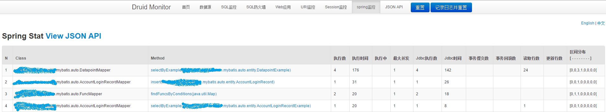

> 在Spring监控页，可以显示相关DAO执行的方法，方法执行的次数、执行的时间等信息。

## 小结

通过上述几个部分的配置，监控页面上所有的TAB都可以查看信息了。


当然，Druid还有很多其他的功能，在这篇文章中就一一展示，有兴趣的朋友可以在[**Druid的Github网页**](https://github.com/alibaba/druid/wiki)上查看。

© 著作权归作者所有
来源： <https://my.oschina.net/wangmengjun/blog/788386>