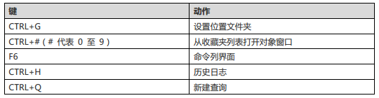
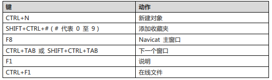
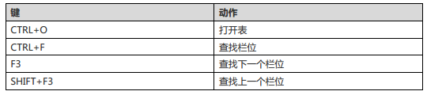
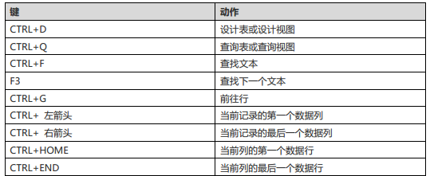
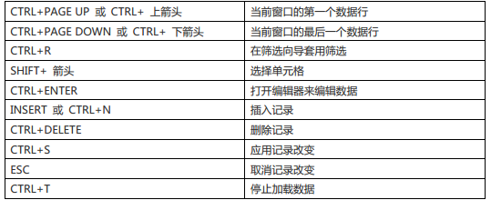
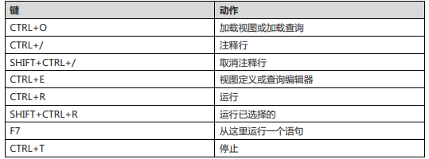
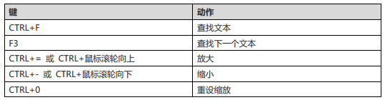
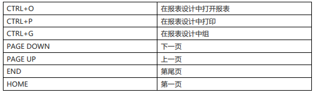
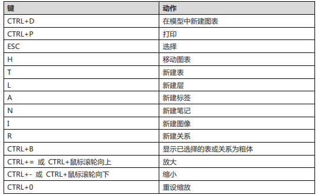

ctrl+q           打开查询窗口

ctrl+/            注释sql语句

ctrl+shift +/  解除注释

ctrl+r           运行查询窗口的sql语句

ctrl+shift+r   只运行选中的sql语句

F6               打开一个mysql命令行窗口

ctrl+l            删除一行

ctrl+n           打开一个新的查询窗口

ctrl+w          关闭一个查询窗口

ctrl+tab         在窗口间进行切换

# 详说 Navicat for MySQL 快捷键

发布时间：2016-03-22

巧妙地使用 [Navicat for MySQL](http://www.formysql.com/) 快捷键，可以大大提高工作效率，本教程将分类介绍 Navicat for MySQL 快捷键。

### Navicat 主窗口

Navicat 主窗口快捷键

### 常规

Navicat 常规快捷键

### 表设计器

Navicat 表设计器快捷键

### 表查看器

Navicat 表查看器快捷键

### 视图查看器

Navicat 视图查看器快捷键

### 视图或查询

Navicat 视图或查询快捷键

### SQL 编辑器

Navicat SQL 编辑器快捷键

### 报表

Navicat 报表快捷键

### 模型

Navicat 模型快捷键

来源： <http://www.formysql.com/jiqiao/navicat-kuaijiejian.html>