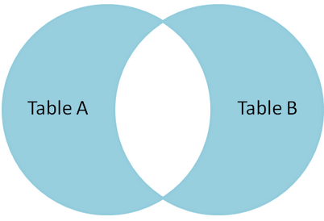
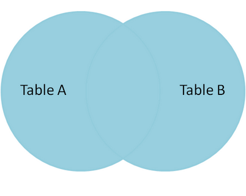

# Mysql Join语法解析与性能分析详解

分类: database
日期: 2015-08-30

原文地址: 

http://blog.chinaunix.net/uid-29632145-id-5178166.html

------

****[Mysql Join语法解析与性能分析详解]() *2015-08-30 10:42:55*

分类： Mysql/postgreSQL

## 一．[Join语法](http://www.cnblogs.com/Mysql%20Join%E8%AF%AD%E6%B3%95%E8%A7%A3%E6%9E%90%E4%B8%8E%E6%80%A7%E8%83%BD%E5%88%86%E6%9E%90%E8%AF%A6%E8%A7%A3)概述

join 用于多表中字段之间的联系，语法如下：

```
... FROM table1 INNER|LEFT|RIGHT JOIN table2 ON conditiona 
```

table1:左表；table2:右表。

[JOIN](http://www.cnblogs.com/Mysql%20Join%E8%AF%AD%E6%B3%95%E8%A7%A3%E6%9E%90%E4%B8%8E%E6%80%A7%E8%83%BD%E5%88%86%E6%9E%90%E8%AF%A6%E8%A7%A3) 按照功能大致分为如下三类：

INNER JOIN（内连接,或等值连接）：取得两个表中存在连接匹配关系的记录。

LEFT JOIN（左连接）：取得左表（table1）完全记录，即是右表（table2）并无对应匹配记录。

RIGHT JOIN（右连接）：与 LEFT JOIN 相反，取得右表（table2）完全记录，即是左表（table1）并无匹配对应记录。

注意：**mysql不支持Full join**,不过可以通过UNION 关键字来合并 LEFT JOIN 与 RIGHT JOIN来模拟FULL join.

接下来给出一个列子用于解释下面几种分类。如下两个表(A,B)

```
mysql> select A.id,A.name,B.name from A,B where A.id=B.id;
+----+-----------+-------------+
| id | name       | name             |
+----+-----------+-------------+
|  1 | Pirate       | Rutabaga      |
|  2 | Monkey    | Pirate            |
|  3 | Ninja         | Darth Vader |
|  4 | Spaghetti  | Ninja             |
+----+-----------+-------------+
4 rows in set (0.00 sec) 
```

## 二.Inner join

内连接，也叫等值连接，inner join产生同时符合A和B的一组数据。

```
mysql> select * from A inner join B on A.name = B.name;
+----+--------+----+--------+
| id | name   | id | name   |
+----+--------+----+--------+
|  1 | Pirate |  2 | Pirate |
|  3 | Ninja  |  4 | Ninja  |
+----+--------+----+--------+ 
```


## 三.Left join

```
mysql> select * from A left join B on A.name = B.name;
#或者：select * from A left outer join B on A.name = B.name;

+----+-----------+------+--------+
| id | name      | id   | name   |
+----+-----------+------+--------+
|  1 | Pirate    |    2 | Pirate |
|  2 | Monkey    | NULL | NULL   |
|  3 | Ninja     |    4 | Ninja  |
|  4 | Spaghetti | NULL | NULL   |
+----+-----------+------+--------+
4 rows in set (0.00 sec) 
```

left join,（或**left outer join:在Mysql中两者等价，推荐使用left join.**）左连接从左表(A)产生一套完整的记录,与匹配的记录(右表(B)) .如果没有匹配,右侧将包含null。


如果想只从左表(A)中产生一套记录，但不包含右表(B)的记录，可以通过设置where语句来执行，如下：

```
mysql> select * from A left join B on A.name=B.name where A.id is null or B.id is null;
+----+-----------+------+------+
| id | name      | id   | name |
+----+-----------+------+------+
|  2 | Monkey    | NULL | NULL |
|  4 | Spaghetti | NULL | NULL |
+----+-----------+------+------+
2 rows in set (0.00 sec) 
```


同理，还可以模拟inner join. 如下：

```
mysql> select * from A left join B on A.name=B.name where A.id is not null and B.id is not null;
+----+--------+------+--------+
| id | name   | id   | name   |
+----+--------+------+--------+
|  1 | Pirate |    2 | Pirate |
|  3 | Ninja  |    4 | Ninja  |
+----+--------+------+--------+
2 rows in set (0.00 sec) 
```

**求差集：**

根据上面的例子可以求差集，如下：

```
SELECT * FROM A LEFT JOIN B ON A.name = B.name
WHERE B.id IS NULL
union
SELECT * FROM A right JOIN B ON A.name = B.name
WHERE A.id IS NULL;
# 结果
    +------+-----------+------+-------------+
| id   | name      | id   | name        |
+------+-----------+------+-------------+
|    2 | Monkey    | NULL | NULL        |
|    4 | Spaghetti | NULL | NULL        |
| NULL | NULL      |    1 | Rutabaga    |
| NULL | NULL      |    3 | Darth Vader |
+------+-----------+------+-------------+ 
```



## 四.Right join

```
mysql> select * from A right join B on A.name = B.name;
+------+--------+----+-------------+
| id   | name   | id | name        |
+------+--------+----+-------------+
| NULL | NULL   |  1 | Rutabaga    |
|    1 | Pirate |  2 | Pirate      |
| NULL | NULL   |  3 | Darth Vader |
|    3 | Ninja  |  4 | Ninja       |
+------+--------+----+-------------+
4 rows in set (0.00 sec) 
```

同left join。

## 五.Cross join

cross join：交叉连接，得到的结果是两个表的乘积，即笛卡尔积

> 笛卡尔（Descartes）乘积又叫直积。假设集合A={a,b}，集合B={0,1,2}，则两个集合的笛卡尔积为{(a,0),(a,1),(a,2),(b,0),(b,1), (b,2)}。可以扩展到多个集合的情况。类似的例子有，如果A表示某学校学生的集合，B表示该学校所有课程的集合，则A与B的笛卡尔积表示所有可能的选课情况。

```
mysql> select * from A cross join B;
+----+-----------+----+-------------+
| id | name      | id | name        |
+----+-----------+----+-------------+
|  1 | Pirate    |  1 | Rutabaga    |
|  2 | Monkey    |  1 | Rutabaga    |
|  3 | Ninja     |  1 | Rutabaga    |
|  4 | Spaghetti |  1 | Rutabaga    |
|  1 | Pirate    |  2 | Pirate      |
|  2 | Monkey    |  2 | Pirate      |
|  3 | Ninja     |  2 | Pirate      |
|  4 | Spaghetti |  2 | Pirate      |
|  1 | Pirate    |  3 | Darth Vader |
|  2 | Monkey    |  3 | Darth Vader |
|  3 | Ninja     |  3 | Darth Vader |
|  4 | Spaghetti |  3 | Darth Vader |
|  1 | Pirate    |  4 | Ninja       |
|  2 | Monkey    |  4 | Ninja       |
|  3 | Ninja     |  4 | Ninja       |
|  4 | Spaghetti |  4 | Ninja       |
+----+-----------+----+-------------+
16 rows in set (0.00 sec)

#再执行：mysql> select * from A inner join B; 试一试

#在执行mysql> select * from A cross join B on A.name = B.name; 试一试

更多内容源码搜藏http://www.codesocang.com
```

实际上，**在 MySQL 中（仅限于 MySQL） CROSS JOIN 与 INNER JOIN 的表现是一样的**，在不指定 ON 条件得到的结果都是笛卡尔积，反之取得两个表完全匹配的结果。 INNER JOIN 与 CROSS JOIN 可以省略 INNER 或 CROSS 关键字，因此下面的 SQL 效果是一样的：

```
... FROM table1 INNER JOIN table2
... FROM table1 CROSS JOIN table2
... FROM table1 JOIN table2 
```

## 六.Full join

```
mysql> select * from A left join B on B.name = A.name 
    -> union 
    -> select * from A right join B on B.name = A.name;
+------+-----------+------+-------------+
| id   | name      | id   | name        |
+------+-----------+------+-------------+
|    1 | Pirate    |    2 | Pirate      |
|    2 | Monkey    | NULL | NULL        |
|    3 | Ninja     |    4 | Ninja       |
|    4 | Spaghetti | NULL | NULL        |
| NULL | NULL      |    1 | Rutabaga    |
| NULL | NULL      |    3 | Darth Vader |
+------+-----------+------+-------------+
6 rows in set (0.00 sec) 
```

全连接产生的所有记录（双方匹配记录）在表A和表B。如果没有匹配,则对面将包含null。



## 七.性能优化

### 1.显示(explicit) inner join VS 隐式(implicit) inner join

如：

```
select * from
table a inner join table b
on a.id = b.id; 
```

VS

```
select a.*, b.*
from table a, table b
where a.id = b.id; 
```

我在数据库中比较(10w数据)得之，它们用时几乎相同，第一个是显示的inner join，后一个是隐式的inner join。

**参照:Explicit vs implicit SQL joins**

### 2.left join/right join VS inner join

尽量用inner join.避免 LEFT JOIN 和 NULL.

在使用left join（或right join）时，应该清楚的知道以下几点：

#### (1). on与 where的执行顺序

> ON 条件（“A LEFT JOIN B ON 条件表达式”中的ON）用来决定如何从 B 表中检索数据行。如果 B 表中没有任何一行数据匹配 ON 的条件,将会额外生成一行所有列为 NULL 的数据,**在匹配阶段 WHERE 子句的条件都不会被使用。仅在匹配阶段完成以后，WHERE 子句条件才会被使用。它将从匹配阶段产生的数据中检索过滤。**

所以我们要注意：**在使用Left (right) join的时候，一定要在先给出尽可能多的匹配满足条件，减少Where的执行。**如：

PASS

```
select * from A
inner join B on B.name = A.name
left join C on C.name = B.name
left join D on D.id = C.id
where C.status>1 and D.status=1; 
```

Great

```
select * from A
inner join B on B.name = A.name
left join C on C.name = B.name and C.status>1
left join D on D.id = C.id and D.status=1 
```

从上面例子可以看出，尽可能满足ON的条件，而少用Where的条件。从执行性能来看第二个显然更加省时。

#### (2).注意ON 子句和 WHERE 子句的不同

如作者举了一个列子：

```
mysql> SELECT * FROM product LEFT JOIN product_details
       ON (product.id = product_details.id)
       AND product_details.id=2;
+----+--------+------+--------+-------+
| id | amount | id   | weight | exist |
+----+--------+------+--------+-------+
|  1 |    100 | NULL |   NULL |  NULL |
|  2 |    200 |    2 |     22 |     0 |
|  3 |    300 | NULL |   NULL |  NULL |
|  4 |    400 | NULL |   NULL |  NULL |
+----+--------+------+--------+-------+
4 rows in set (0.00 sec)

mysql> SELECT * FROM product LEFT JOIN product_details
       ON (product.id = product_details.id)
       WHERE product_details.id=2;
+----+--------+----+--------+-------+
| id | amount | id | weight | exist |
+----+--------+----+--------+-------+
|  2 |    200 |  2 |     22 |     0 |
+----+--------+----+--------+-------+
1 row in set (0.01 sec) 
```

> 从上可知，第一条查询使用 ON 条件决定了从 LEFT JOIN的 product_details表中检索符合的所有数据行。第二条查询做了简单的LEFT JOIN，然后使用 WHERE 子句从 LEFT JOIN的数据中过滤掉不符合条件的数据行。

#### (3).尽量避免子查询，而用join

往往性能这玩意儿，更多时候体现在数据量比较大的时候，此时，我们应该避免复杂的子查询。如下：

PASS

```
insert into t1(a1) select b1 from t2 where not exists(select 1 from t1 where t1.id = t2.r_id); 
```

Great

```
insert into t1(a1)  
select b1 from t2  
left join (select distinct t1.id from t1 ) t1 on t1.id = t2.r_id   
where t1.id is null; 
```

这个可以参考mysql的exists与inner join 和 not exists与 left join 性能差别惊人

原文：<http://www.codesocang.com/jiaocheng/mysql/8068.html>