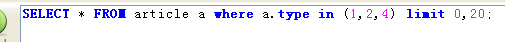
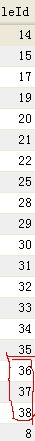
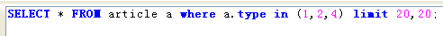
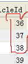

# mysql中，写limit得记得排序……

用mysql的limit进行分页。。发现竟然有些数据没显示在页面上。。总共才24条数据。楞找不到。。 
后来把语句弄到mysql上查了一下才知道。这条语句中的limit有问题。。有些数据在第二页被重复显示了。。 
非常郁闷。。下面给截图 
查第一页的语句 

 

 

- SQL code

  `            SELECT * FROM article a where a.type in (1,2,4) limit 0,20;            `

第一页的结果 
(注意红色部分) 
第二页的语句 
 

- SQL code

  `            SELECT * FROM article a where a.type in (1,2,4) limit 20,20;            `

 

结果： 
(注意红色部分) 
\--------------------------------------------------------------------------
后来发现排下序就没事了。。原来用MySQL的limit必须排序。。唉
这是一位网友给的MySQL Help:
If you use LIMIT row_count with ORDER BY, MySQL ends the sorting as soon as it has found the first row_count rows of the sorted result, rather than sorting the entire result. If ordering is done by using an index, this is very fast. If a filesort must be done, all rows that match the query without the LIMIT clause must be selected, and most or all of them must be sorted, before it can be ascertained that the first row_count rows have been found. In either case, after the initial rows have been found, there is no need to sort any remainder of the result set, and MySQL does not do so.

 

**总结：用limit必须先order by~ 顺序是 ------  先 order by ....  再 limit ......**

http://blog.csdn.net/allenlinrui/article/details/6288500