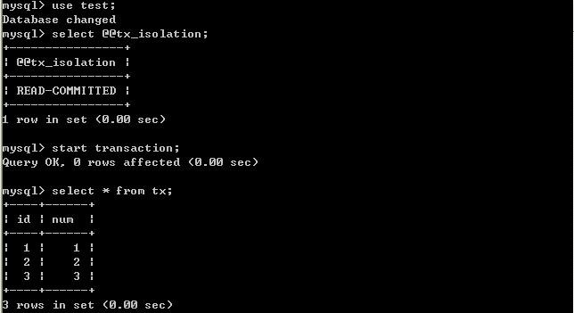

# MySQL事务隔离级别详解

## 设置事务隔离级别命令

用户可以用SET TRANSACTION语句改变单个会话或者所有新进连接的隔离级别。它的语法如下：

```
SET [SESSION | GLOBAL] TRANSACTION ISOLATION LEVEL {READ UNCOMMITTED | READ COMMITTED | REPEATABLE READ | SERIALIZABLE}
```

```
set SESSION TRANSACTION ISOLATION LEVEL  READ UNCOMMITTED
```

注意：默认的行为（不带session和global）是为下一个（未开始）事务设置隔离级别。如果你使用GLOBAL关键字，语句在全局对从那点开始创建的所有新连接（除了不存在的连接）设置默认事务级别。你需要SUPER权限来做这个。使用SESSION 关键字为将来在当前连接上执行的事务设置默认事务级别。 任何客户端都能自由改变会话隔离级别（甚至在事务的中间），或者为下一个事务设置隔离级别。

  

## 隔离级别

   SQL标准定义了4类隔离级别，包括了一些具体规则，用来限定事务内外的哪些改变是可见的，哪些是不可见的。低级别的隔离级一般支持更高的并发处理，并拥有更低的系统开销。

### Read Uncommitted（读取未提交内容）

在该隔离级别，所有事务都可以看到其他未提交事务的执行结果。本隔离级别很少用于实际应用，因为它的性能也不比其他级别好多少。读取未提交的数据，也被称之为脏读（Dirty Read）。

### Read Committed（读取提交内容）

这是大多数数据库系统的默认隔离级别（但不是MySQL默认的）。它满足了隔离的简单定义：一个事务只能看见已经提交事务所做的改变。这种隔离级别 也支持所谓的不可重复读（Nonrepeatable Read），因为同一事务的其他实例在该实例处理其间可能会有新的commit，所以同一select可能返回不同结果。

### Repeatable Read（可重读）

这是MySQL的默认事务隔离级别，它确保同一事务的多个实例在并发读取数据时，会看到同样的数据行。不过理论上，这会导致另一个棘手的问题：幻读 （Phantom Read）。简单的说，幻读指当用户读取某一范围的数据行时，另一个事务又在该范围内插入了新行，当用户再读取该范围的数据行时，会发现有新的“幻影” 行。InnoDB和Falcon存储引擎通过多版本并发控制（MVCC，Multiversion Concurrency Control）机制解决了该问题。

### Serializable（可串行化）

这是最高的隔离级别，它通过强制事务排序，使之不可能相互冲突，从而解决幻读问题。简言之，它是在每个读的数据行上加上共享锁。在这个级别，可能导致大量的超时现象和锁竞争。         	这四种隔离级别采取不同的锁类型来实现，若读取的是同一个数据的话，就容易发生问题。	例如： 

​	脏读(Drity Read)：某个事务已更新一份数据，另一个事务在此时读取了同一份数据，由于某些原因，前一个RollBack了操作，则后一个事务所读取的数据就会是不正确的。         

​	不可重复读(Non-repeatable read):在一个事务的两次查询之中数据不一致，这可能是两次查询过程中间插入了一个事务更新的原有的数据。         

​	幻读(Phantom Read):在一个事务的两次查询中数据笔数不一致，例如有一个事务查询了几列(Row)数据，而另一个事务却在此时插入了新的几列数据，先前的事务在接下来的查询中，就会发现有几列数据是它先前所没有的。         

在MySQL中，实现了这四种隔离级别，分别有可能产生问题如下所示：

## 测试实例

### 表结构

下面，将利用MySQL的客户端程序，分别测试几种隔离级别。测试数据库为test，表为tx；表结构：

| id   | int  |
| ---- | ---- |
| num  | int  |

ddl

```
CREATE TABLE `tx` (  `id` int(11) NOT NULL AUTO_INCREMENT,  `num` int(11) NOT NULL,  PRIMARY KEY (`id`)) ENGINE=InnoDB DEFAULT CHARSET=utf8
```

两个命令行客户端分别为A，B；不断改变A的隔离级别，在B端修改数据。

### (一)、将A的隔离级别设置为read uncommitted(未提交读)

 在B未更新数据之前：

**客户端A：**           

B更新数据：

**客户端B：**


**客户端A：**


​        经过上面的实验可以得出结论，事务B更新了一条记录，但是没有提交，此时事务A可以查询出未提交记录。造成脏读现象。未提交读是最低的隔离级别。

### (二)、将客户端A的事务隔离级别设置为read committed(已提交读)

 在B未更新数据之前：

客户端A：

[](http://xm-king.iteye.com/upload/picture/pic/72626/ae414e52-c216-3bbb-b005-0d972f593456.jpg)

B更新数据：

**客户端B：**


**客户端A：**


​       经过上面的实验可以得出结论，已提交读隔离级别解决了脏读的问题，但是出现了不可重复读的问题，即事务A在两次查询的数据不一致，因为在两次查询之间事务B更新了一条数据。已提交读只允许读取已提交的记录，但不要求可重复读。

### (三)、将A的隔离级别设置为repeatable read(可重复读)

 在B未更新数据之前：

**客户端A：**


B更新数据：

**客户端B：**


**客户端A：**


B插入数据：

**客户端B：**


**客户端A：**


​       由以上的实验可以得出结论，可重复读隔离级别只允许读取已提交记录，而且在一个事务两次读取一个记录期间，其他事务部的更新该记录。但该事务不要求与其他事务可串行化。例如，当一个事务可以找到由一个已提交事务更新的记录，但是可能产生幻读问题(注意是可能，因为数据库对隔离级别的实现有所差别)。像以上的实验，就没有出现数据幻读的问题。

### (四)、将A的隔离级别设置为 可串行化 (Serializable)

**A端打开事务，B端插入一条记录**

**事务A端：**


**事务B端：**


因为此时事务A的隔离级别设置为serializable，开始事务后，并没有提交，所以事务B只能等待。

**事务A提交事务：**

**事务A端**


**事务B端**


​      

​         serializable完全锁定字段，若一个事务来查询同一份数据就必须等待，直到前一个事务完成并解除锁定为止 。是完整的隔离级别，会锁定对应的数据表格，因而会有效率的问题。