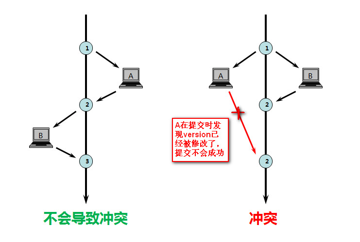

[TOC]


# mysql乐观锁总结和实践

## 前言

上一篇文章《[MySQL悲观锁总结和实践](http://chenzhou123520.iteye.com/blog/1860954)》谈到了MySQL悲观锁，但是悲观锁并不是适用于任何场景，它也有它存在的一些不足，因为悲观锁大多数情况下依靠数据库的锁机制实现，以保证操作最大程度的独占性。如果加锁的时间过长，其他用户长时间无法访问，影响了程序的并发访问性，同时这样对数据库性能开销影响也很大，特别是对长事务而言，这样的开销往往无法承受。所以与悲观锁相对的，我们有了乐观锁，具体参见下面介绍：

## 乐观锁介绍

乐观锁（ Optimistic Locking ） 相对悲观锁而言，乐观锁假设认为数据一般情况下不会造成冲突，所以在数据进行提交更新的时候，才会正式对数据的冲突与否进行检测，如果发现冲突了，则让返回用户错误的信息，让用户决定如何去做。那么我们如何实现乐观锁呢，一般来说有以下2种方式：

1.使用数据版本（Version）记录机制实现，这是乐观锁最常用的一种实现方式。何谓数据版本？即为数据增加一个版本标识，一般是通过为数据库表增加一个数字类型的 “version” 字段来实现。当读取数据时，将version字段的值一同读出，数据每更新一次，对此version值加一。当我们提交更新的时候，判断数据库表对应记录的当前版本信息与第一次取出来的version值进行比对，如果数据库表当前版本号与第一次取出来的version值相等，则予以更新，否则认为是过期数据。用下面的一张图来说明：



如上图所示，如果更新操作顺序执行，则数据的版本（version）依次递增，不会产生冲突。但是如果发生有不同的业务操作对同一版本的数据进行修改，那么，先提交的操作（图中B）会把数据version更新为2，当A在B之后提交更新时发现数据的version已经被修改了，那么A的更新操作会失败。

2.乐观锁定的第二种实现方式和第一种差不多，同样是在需要乐观锁控制的table中增加一个字段，名称无所谓，字段类型使用时间戳（timestamp）, 和上面的version类似，也是在更新提交的时候检查当前数据库中数据的时间戳和自己更新前取到的时间戳进行对比，如果一致则OK，否则就是版本冲突。

 

## 使用举例

以MySQL InnoDB为例

还是拿之前的实例来举：商品goods表中有一个字段status，status为1代表商品未被下单，status为2代表商品已经被下单，那么我们对某个商品下单时必须确保该商品status为1。假设商品的id为1。

 

下单操作包括3步骤：

1.查询出商品信息

```
select (status,status,version) from t_goods where id=#{id}
```

2.根据商品信息生成订单


3.修改商品status为2

```
update t_goods 
set status=2,version=version+1
where id=#{id} and version=#{version};
```

那么为了使用乐观锁，我们首先修改t_goods表，增加一个version字段，数据默认version值为1。

t_goods表初始数据如下： 

```sql
mysql> select * from t_goods;  
+----+--------+------+---------+  
| id | status | name | version |  
+----+--------+------+---------+  
|  1 |      1 | 道具 |       1 |  
|  2 |      2 | 装备 |       2 |  
+----+--------+------+---------+  
2 rows in set  
  
mysql>  
```

对于乐观锁的实现，我使用MyBatis来进行实践，具体如下：

Goods实体类：

```java
/** 
 * ClassName: Goods <br/> 
 * Function: 商品实体. <br/> 
 * date: 2013-5-8 上午09:16:19 <br/> 
 * @author chenzhou1025@126.com 
 */  
public class Goods implements Serializable {  
  
    /** 
     * serialVersionUID:序列化ID. 
     */  
    private static final long serialVersionUID = 6803791908148880587L;  
      
    /** 
     * id:主键id. 
     */  
    private int id;  
      
    /** 
     * status:商品状态：1未下单、2已下单. 
     */  
    private int status;  
      
    /** 
     * name:商品名称. 
     */  
    private String name;  
      
    /** 
     * version:商品数据版本号. 
     */  
    private int version;  
      
    @Override  
    public String toString(){  
        return "good id:"+id+",goods status:"+status+",goods name:"+name+",goods version:"+version;  
    }  
  
    //setter and getter  
  
}  
```

GoodsDao

```java
/** 
 * updateGoodsUseCAS:使用CAS(Compare and set)更新商品信息. <br/> 
 * 
 * @author chenzhou1025@126.com 
 * @param goods 商品对象 
 * @return 影响的行数 
 */  
int updateGoodsUseCAS(Goods goods);  
```

mapper.xml

```xml
<update id="updateGoodsUseCAS" parameterType="Goods">  
    <![CDATA[ 
        update t_goods 
        set status=#{status},name=#{name},version=version+1 
        where id=#{id} and version=#{version} 
    ]]>  
</update>  
```

GoodsDaoTest测试类

```java
@Test  
public void goodsDaoTest(){  
    int goodsId = 1;  
    //根据相同的id查询出商品信息，赋给2个对象  
    Goods goods1 = this.goodsDao.getGoodsById(goodsId);  
    Goods goods2 = this.goodsDao.getGoodsById(goodsId);  
      
    //打印当前商品信息  
    System.out.println(goods1);  
    System.out.println(goods2);  
      
    //更新商品信息1  
    goods1.setStatus(2);//修改status为2  
    int updateResult1 = this.goodsDao.updateGoodsUseCAS(goods1);  
    System.out.println("修改商品信息1"+(updateResult1==1?"成功":"失败"));  
      
    //更新商品信息2  
    goods1.setStatus(2);//修改status为2  
    int updateResult2 = this.goodsDao.updateGoodsUseCAS(goods1);  
    System.out.println("修改商品信息2"+(updateResult2==1?"成功":"失败"));  
}  
```

输出结果：

```
good id:1,goods status:1,goods name:道具,goods version:1  
good id:1,goods status:1,goods name:道具,goods version:1  
修改商品信息1成功  
修改商品信息2失败  
```

说明：

在GoodsDaoTest测试方法中，我们同时查出同一个版本的数据，赋给不同的goods对象，然后先修改good1对象然后执行更新操作，执行成功。然后我们修改goods2，执行更新操作时提示操作失败。此时t_goods表中数据如下：

```sql
mysql> select * from t_goods;  
+----+--------+------+---------+  
| id | status | name | version |  
+----+--------+------+---------+  
|  1 |      2 | 道具 |       2 |  
|  2 |      2 | 装备 |       2 |  
+----+--------+------+---------+  
2 rows in set  
  
mysql>   
```

我们可以看到 id为1的数据version已经在第一次更新时修改为2了。所以我们更新good2时update where条件已经不匹配了，所以更新不会成功，具体sql如下：

```sql
update t_goods   
set status=2,version=version+1  
where id=#{id} and version=#{version};  
```

这样我们就实现了乐观锁

## 悲观锁批量问题

目前暂时不支持批量更新的乐观锁，原因是由于批量更新在实际开发中应用场景不多，另外批量更新乐观锁开发难度比较大；


以上就是我对MySQL乐观锁的总结和实践，写得比较浅显，有不对的地方欢迎拍砖


http://chenzhou123520.iteye.com/blog/1863407