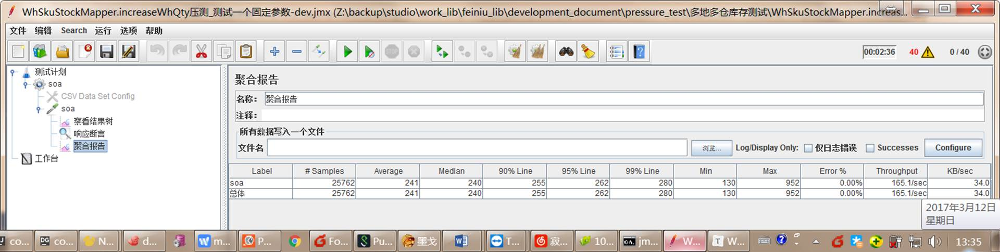
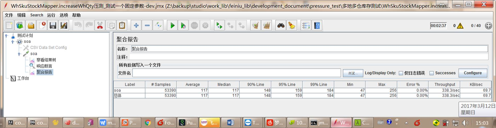
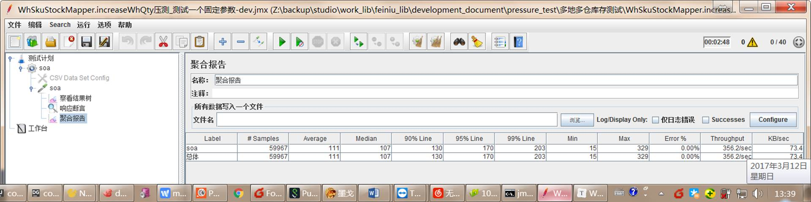

在mysql中批量更新我们可能使用update,replace into来操作，下面小编来给各位同学详细介绍mysql 批量更新与性能吧。

### **php批量更新**

那如果更新多条数据为不同的值，可能很多人会这样写：

```
foreach ($display_order as $id => $ordinal) { 
    $sql = "UPDATE categories SET display_order = $ordinal WHERE id = $id"; 
    mysql_query($sql); 
}
```

即是循环一条一条的更新记录。一条记录update一次，这样性能很差，也很容易造成阻塞。

那么能不能一条sql语句实现批量更新呢？mysql并没有提供直接的方法来实现批量更新，但是可以用点小技巧来实现。

```
UPDATE mytable 
    SET myfield = CASE id 
        WHEN 1 THEN 'value'
        WHEN 2 THEN 'value'
        WHEN 3 THEN 'value'
    END
WHERE id IN (1,2,3)
```

这里使用了case when 这个小技巧来实现批量更新。
举个例子：

```
UPDATE categories 
    SET display_order = CASE id 
        WHEN 1 THEN 3 
        WHEN 2 THEN 4 
        WHEN 3 THEN 5 
    END
WHERE id IN (1,2,3)
```

这句sql的意思是，更新display_order 字段，如果id=1 则display_order 的值为3，如果id=2 则 display_order 的值为4，如果id=3 则 display_order 的值为5。
即是将条件语句写在了一起。
这里的where部分不影响代码的执行，但是会提高sql执行的效率。确保sql语句仅执行需要修改的行数，这里只有3条数据进行更新，而where子句确保只有3行数据执行。

如果更新多个值的话，只需要稍加修改：

```
UPDATE categories 
    SET display_order = CASE id 
        WHEN 1 THEN 3 
        WHEN 2 THEN 4 
        WHEN 3 THEN 5 
    END, 
    title = CASE id 
        WHEN 1 THEN 'New Title 1'
        WHEN 2 THEN 'New Title 2'
        WHEN 3 THEN 'New Title 3'
    END
WHERE id IN (1,2,3)
```

到这里，已经完成一条mysql语句更新多条记录了。
但是要在业务中运用，需要结合服务端语言，这里以php为例，构造这条mysql语句：

```
$display_order = array( 
    1 => 4, 
    2 => 1, 
    3 => 2, 
    4 => 3, 
    5 => 9, 
    6 => 5, 
    7 => 8, 
    8 => 9 
); 
$ids = implode(',', array_keys($display_order)); 
$sql = "UPDATE categories SET display_order = CASE id "; 
foreach ($display_order as $id => $ordinal) { 
    $sql .= sprintf("WHEN %d THEN %d ", $id, $ordinal); 
} 
$sql .= "END WHERE id IN ($ids)"; 
echo $sql;
```

这个例子，有8条记录进行更新。代码也很容易理解，你学会了吗

### **多种批量更新示例：**

mysql并发情况下批量更新，将网上看到的总结一下一共有以下四种办法：

表结构和数据信息在页面最低。

#### 1.批量update，多条用逗号分割

sql写法：

```
 update warehouse_sku_stock_yxy_test SET mod_dt= NOW() ,sale_qty =IFNULL(sale_qty,0) -1 where wh_seq_sku='CS016111001,KS1201608CG240000605' ;
 update warehouse_sku_stock_yxy_test SET mod_dt= NOW() ,sale_qty =IFNULL(sale_qty,0) -1 where wh_seq_sku='CZ017033131,KZ1201609CG190000111' ;
```

mybatis写法：

```
void increaseWhQtyByUpdateBatch(List<SkuWhQtyUpdateRequestEntity> whQtyRequestList);
```

```
    <!-- 更新库存 -->
    <update id="increaseWhQtyByUpdateBatch" parameterType="java.util.List">
        <foreach collection="list" item="item" index="index" open="" close="" separator=";">
            update warehouse_sku_stock_yxy_test
            <set>
                mod_dt= NOW()
                <if test="item.corpGroupBizQty != null">
                    ,corp_group_biz_qty =corp_group_biz_qty+#{item.corpGroupBizQty,jdbcType=INTEGER}
                </if>
                <if test="item.sysKeepQty != null">
                    ,sys_keep_qty = sys_keep_qty+#{item.sysKeepQty,jdbcType=INTEGER}
                </if>
                <if test="item.saleQty != null">
                    ,sale_qty =IFNULL(sale_qty,0)+ #{item.saleQty,jdbcType=INTEGER}
                </if>
            </set>
            where wh_seq_sku=#{item.whSkuSeq,jdbcType=VARCHAR}
        </foreach>
    </update>
```

#### 2.replace into 或者insert into ...on duplicate key update

```
replace into test_tbl (id,dr) values (1,'2'),(2,'3'),...(x,'y');
```

或者使用

如果主键存在则更新，不存在则插入

sql写法：

```
INSERT INTO warehouse_sku_stock_yxy_test (id) VALUE (2514655) ON DUPLICATE KEY UPDATE mod_dt = NOW() ,sale_qty =IFNULL(sale_qty,0) -1 ; 
INSERT INTO warehouse_sku_stock_yxy_test (id) VALUE (2514656) ON DUPLICATE KEY UPDATE mod_dt = NOW() ,sale_qty =IFNULL(sale_qty,0) -1 ;
```

mybatis写法：

```
void increaseWhQtyByInsertInto(List<SkuWhQtyUpdateRequestEntity> whQtyRequestList);
```

```
  <insert id="increaseWhQtyByInsertInto" parameterType="java.util.List">
        <foreach collection="list" item="item" index="index" open="" close="" separator=";">
            INSERT INTO warehouse_sku_stock_yxy_test (id) VALUE (#{item.id})
            ON DUPLICATE KEY UPDATE mod_dt = NOW()
            <if test="item.saleQty != null">
                ,sale_qty =IFNULL(sale_qty,0)+ #{item.saleQty,jdbcType=INTEGER}
            </if>
        </foreach>
    </insert>
```


#### 3.update set case when then end 

sql写法：

```
UPDATE warehouse_sku_stock_yxy_test
SET sale_qty = CASE id
               WHEN '1232'
                 THEN IFNULL(sale_qty, 0) - 1
               WHEN '1234'
                 THEN IFNULL(sale_qty, 0) - 1
               END,
     mod_dt  = CASE mod_dt
               WHEN mod_dt
                 THEN NOW()
               END
WHERE id= '1232'
      OR wh_seq_sku = '1234';
```

mybatis写法：

```
void increaseWhQtyByCase(List<SkuWhQtyUpdateRequestEntity> whQtyRequestList);
```

 

```
    <update id="increaseWhQtyByCase" parameterType="java.util.List">
        update warehouse_sku_stock_yxy_test
        <trim prefix="set" suffixOverrides=",">
            <trim prefix="sale_qty =case id" suffix="end,">
                <foreach collection="list" item="item" index="index">
                    <if test="item.saleQty != null">
                        when #{item.id,jdbcType=VARCHAR} then IFNULL(sale_qty,0)+ #{item.saleQty,jdbcType=INTEGER}
                    </if>
                </foreach>
            </trim>
            <trim prefix="mod_dt =case mod_dt" suffix="end,">
                    when mod_dt then NOW()
            </trim>
        </trim>
        where
        <foreach collection="list" separator="or" item="item" index="index">
            id=#{item.id}
        </foreach>
    </update>
```


#### 4.创建临时表，先更新临时表，然后从临时表中update

```
create temporary table tmp(id int(4) primary key,dr varchar(50));
insert into tmp values  (0,'gone'), (1,'xx'),...(m,'yy');
update test_tbl, tmp set test_tbl.dr=tmp.dr where test_tbl.id=tmp.id;
```

注意：这种方法需要用户有temporary 表的create 权限。

下面是上述方法update 100000条数据的性能测试结果：

逐条update

real    0m15.557s
user    0m1.684s
sys    0m1.372s

replace into
real    0m1.394s
user    0m0.060s
sys    0m0.012s

insert into on duplicate key update
real    0m1.474s
user    0m0.052s
sys    0m0.008s

create temporary table and update:
real    0m0.643s
user    0m0.064s
sys    0m0.004s

就测试结果来看，测试当时使用replace into性能较好。

replace into  和insert into on duplicate key update的不同在于：
replace into　操作本质是对重复的记录先delete 后insert，如果更新的字段不全会将缺失的字段置为缺省值
insert into 则是只update重复记录，不会改变其它字段。

1. 【replace into】和【insert into】更新都依赖于主键或唯一值，并都可能造成新增记录的操作的结构隐患

2. 【replace into】操作本质是对重复记录先delete然后insert，如果更新的字段不全缺失的字段将被设置成缺省值

3. 【insert into】则只是update重复的记录，更改的字段只能依循公式值

4. 【临时表】方式需要用户有temporary 表的create 权限

5.  数量较少时【replace into】和【insert into】性能最好，数量大时【临时表】最好，【CASE】则具有通用型也不具结构隐患 、

   ​

   来源： <http://www.itwendao.com/article/detail/269356.html>

#### 表结构和数据信息

```
CREATE TABLE `warehouse_sku_stock_yxy_test` (
  `id` bigint(18) NOT NULL AUTO_INCREMENT COMMENT 'id',
  `wh_seq` varchar(36) NOT NULL DEFAULT '' COMMENT '仓库编码',
  `whg_seq` varchar(32) NOT NULL DEFAULT '' COMMENT '仓群编码',
  `sku_seq` varchar(36) NOT NULL DEFAULT '0' COMMENT 'sku_seq',
  `spu_seq` varchar(36) NOT NULL DEFAULT '',
  `wh_seq_sku` varchar(64) NOT NULL DEFAULT '' COMMENT '仓库编码,sku_seq',
  `sale_qty` int(11) NOT NULL DEFAULT '0' COMMENT '可卖量',
  `sys_keep_qty` int(11) NOT NULL DEFAULT '0' COMMENT '系统策略保留量',
  `corp_group_biz_qty` int(11) NOT NULL DEFAULT '0' COMMENT '企业组团商品剩余数量',
  `islifeexpired` varchar(2) NOT NULL DEFAULT '0' COMMENT '是否不再使用(0:否/1:是)',
  `lifeexpireddt` datetime NOT NULL DEFAULT CURRENT_TIMESTAMP COMMENT '不再使用日期',
  `ins_dt` datetime NOT NULL DEFAULT CURRENT_TIMESTAMP COMMENT '新增日期时间',
  `ins_usr_seq` varchar(32) NOT NULL DEFAULT '' COMMENT '新增人员流水号',
  `ins_by_who` varchar(32) NOT NULL DEFAULT '' COMMENT '记录操作人员的类型(0:其他/1:厂商/2:公司人员/3:系统)',
  `mod_dt` datetime NOT NULL DEFAULT CURRENT_TIMESTAMP COMMENT '修改日期时间',
  `mod_usr_seq` varchar(32) NOT NULL DEFAULT '' COMMENT '修改人员流水号',
  `mod_by_who` varchar(32) NOT NULL DEFAULT '' COMMENT '记录操作人员的类型(0:其他/1:厂商/2:公司人员/3:系统)',
  `whg_sku` varchar(64) NOT NULL DEFAULT '' COMMENT '仓群sku',
  `wh_func_type` varchar(2) NOT NULL DEFAULT '' COMMENT '仓库功能类型 1 快配仓 2 主仓',
  PRIMARY KEY (`id`)
) ENGINE=InnoDB AUTO_INCREMENT=2515524 DEFAULT CHARSET=utf8 ROW_FORMAT=COMPACT COMMENT='仓库和sku库存表';
INSERT INTO warehouse_sku_stock_yxy_test (id, wh_seq, whg_seq, sku_seq, spu_seq, wh_seq_sku, sale_qty, sys_keep_qty, corp_group_biz_qty, islifeexpired, lifeexpireddt, ins_dt, ins_usr_seq, ins_by_who, mod_dt, mod_usr_seq, mod_by_who, whg_sku, wh_func_type) VALUES (2514655, 'CS016111001', 'QS016111001', 'KS1201608CG240000605', 'PS1170313', 'CS016111001,KS1201608CG240000605', 999974065, 0, 0, '0', '2017-03-02 19:17:17', '2017-03-02 19:17:17', 'CK4641', '1', '2017-03-11 16:59:20', 'CK4641', '1', 'QS016111001,KS1201608CG240000605', '2');
INSERT INTO warehouse_sku_stock_yxy_test (id, wh_seq, whg_seq, sku_seq, spu_seq, wh_seq_sku, sale_qty, sys_keep_qty, corp_group_biz_qty, islifeexpired, lifeexpireddt, ins_dt, ins_usr_seq, ins_by_who, mod_dt, mod_usr_seq, mod_by_who, whg_sku, wh_func_type) VALUES (2514656, 'CS016111001', 'QS016111001', 'KS1201608CG250000390', 'PS1170326', 'CS016111001,KS1201608CG250000390', 999974060, 0, 0, '0', '2017-03-02 19:17:17', '2017-03-02 19:17:17', 'CL1087', '2', '2017-03-11 16:59:20', 'CL1087', '2', 'QS016111001,KS1201608CG250000390', '2');
INSERT INTO warehouse_sku_stock_yxy_test (id, wh_seq, whg_seq, sku_seq, spu_seq, wh_seq_sku, sale_qty, sys_keep_qty, corp_group_biz_qty, islifeexpired, lifeexpireddt, ins_dt, ins_usr_seq, ins_by_who, mod_dt, mod_usr_seq, mod_by_who, whg_sku, wh_func_type) VALUES (2514657, 'CZ017033131', 'QZ017033131', 'KZ1201609CG190000111', 'PZ117031', 'CZ017033131,KZ1201609CG190000111', 999974065, 0, 0, '0', '2017-03-02 19:17:17', '2017-03-02 19:17:17', 'CK5334', '1', '2017-03-11 16:59:20', 'CK5334', '1', 'QZ017033131,KZ1201609CG190000111', '2');
INSERT INTO warehouse_sku_stock_yxy_test (id, wh_seq, whg_seq, sku_seq, spu_seq, wh_seq_sku, sale_qty, sys_keep_qty, corp_group_biz_qty, islifeexpired, lifeexpireddt, ins_dt, ins_usr_seq, ins_by_who, mod_dt, mod_usr_seq, mod_by_who, whg_sku, wh_func_type) VALUES (2514658, 'CZ017032653', 'QZ017032653', 'KZ1201608CG240000566', 'PZ1170324', 'CZ017032653,KZ1201608CG240000566', 999974065, 0, 0, '0', '2017-03-02 19:17:17', '2017-03-02 19:17:17', 'CK9658', '1', '2017-03-11 16:59:20', 'CK9658', '1', 'QZ017032653,KZ1201608CG240000566', '2');
INSERT INTO warehouse_sku_stock_yxy_test (id, wh_seq, whg_seq, sku_seq, spu_seq, wh_seq_sku, sale_qty, sys_keep_qty, corp_group_biz_qty, islifeexpired, lifeexpireddt, ins_dt, ins_usr_seq, ins_by_who, mod_dt, mod_usr_seq, mod_by_who, whg_sku, wh_func_type) VALUES (2514659, 'CZ017032653', 'QZ017032653', 'KZ1201608CG240000567', 'PZ1170324', 'CZ017032653,KZ1201608CG240000567', 999974065, 0, 0, '0', '2017-03-02 19:17:17', '2017-03-02 19:17:17', 'CK9658', '1', '2017-03-11 16:59:20', 'CK9658', '1', 'QZ017032653,KZ1201608CG240000567', '2');
```

### 自己的压测结果：

#### 固定一个入参 5商品 3特卖  40线程 dev 环境

 

##### 入参：

{"mode":"0","list":[{"id":"2514655","saleQty":-1,"skuSeq":"KS1201608CG240000605","uniqueKey":"CS016111001,KS1201608CG240000605","whSeq":"CS016111001","whSkuSeq":"CS016111001,KS1201608CG240000605","whgSku":"QS016111001,KS1201608CG240000605"},{"id":"2514656","saleQty":-1,"skuSeq":"KZ1201609CG190000111","uniqueKey":"CZ017033131,KZ1201609CG190000111","whSeq":"CZ017033131","whSkuSeq":"CZ017033131,KZ1201609CG190000111","whgSku":"QZ017033131,KZ1201609CG190000111"},{"id":"2514658","saleQty":-1,"skuSeq":"KZ1201608CG240000566","uniqueKey":"CZ017032653,KZ1201608CG240000566","whSeq":"CZ017032653","whSkuSeq":"CZ017032653,KZ1201608CG240000566","whgSku":"QZ017032653,KZ1201608CG240000566"},{"id":"2514659","saleQty":-1,"skuSeq":"KZ1201608CG240000567","uniqueKey":"CZ017032653,KZ1201608CG240000567","whSeq":"CZ017032653","whSkuSeq":"CZ017032653,KZ1201608CG240000567","whgSku":"QZ017032653,KZ1201608CG240000567"},{"id":"2514657","saleQty":-1,"skuSeq":"KS1201608CG250000390","uniqueKey":"CS016111001,KS1201608CG250000390","whSeq":"CS016111001","whSkuSeq":"CS016111001,KS1201608CG250000390","whgSku":"QS016111001,KS1201608CG250000390"}]}

 

 

##### 批量update，多条用逗号分开

 



 

 

##### insert into ...on duplicate key update



 

 

 

 

##### update set case when then end 

#### 

 

 

 

来源： <http://www.111cn.net/database/mysql/52275.htm>