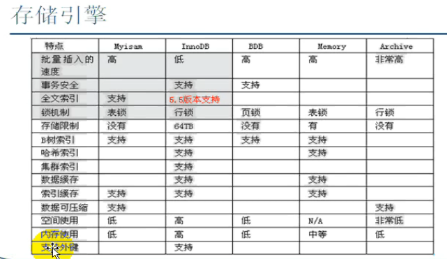
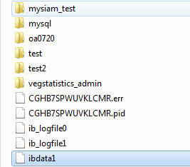
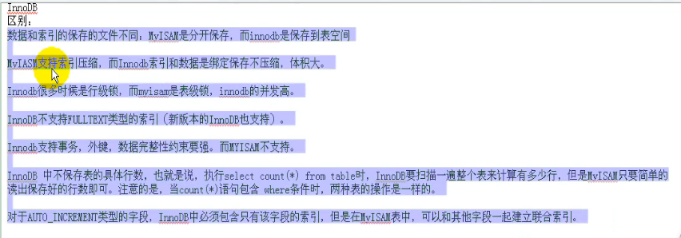

[TOC]

# 存储引擎myisam ,inndb区别

## 说明

稍微额外提一下,**其实因为你们用的都是mysiam，所以建了外键在数据库都不会生效的**。

只是为了数据库结构清晰一些而已

 

将来改用innodb时，这个外键才真正有效。 

 

Mysiam擅长插入，检索（查询）    （表锁）

innodb擅长更新，删除             （行锁）     并发性好  支持事务

 

 

 

保存的文件方式不同：

INNODB一个表生成一个文件，ibdata1用来保存数据和索引（ibdata1可能会很多个存数据多的时候）

MyISAM生成三个文件（结构[frm]，数据[MYD]，索引[MYI]）

  

## MyISAM和INNODB引擎区别主要有以下几点

1.MyISAM查询性能比InnoDB更快，但不支持事务处理，InnoDB支持事务处理和外键等高级功能

2.InnoDB不支持全文检索

3.InnoDB中不保存表的具体行数，也就是说，执行select count(*) from table时，InnoDB要扫描一遍整个表来计算有多少行，但是MyISAM只要简单的读出保存好的行数即可。注意的是，当count(*)语句包含 where条件时，两种表的操作是一样的。

4.DELETE FROM table时，InnoDB不会重新建立表，而是一行一行的删除

5.Innodb的auto_increment字段，必须建立单独的索引，而不允许是联合索引

6.每张MyISAM 表被存放在三个文件 ：frm 文件存放表格定义。 数据文件是MYD (MYData) 。 索引文件是MYI (MYIndex) 引伸。

因为MyISAM相对简单所以在效率上要优于InnoDB，小型应用使用MyISAM是不错的选择。

MyISAM表是保存成文件的形式,在跨平台的数据转移中使用MyISAM存储会省去不少的麻烦

InnoDB 把数据和索引存放在表空间里，可能包含多个文件，这与其它的不一样，举例来说，在 MyISAM 中，表被存放在单独的文件中。InnoDB 表的大小只受限于操作系统的文件大小，一般为 2 GB。InnoDB所有的表都保存在同一个数据文件 ibdata1 中（也可能是多个文件，或者是独立的表空间文件），相对来说比较不好备份

 

 

 

 