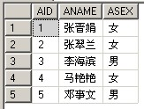
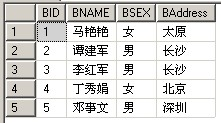
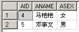

比如在Northwind数据库中有一个查询为

SELECT c.CustomerId,CompanyName FROM Customers c

WHERE EXISTS(

SELECT OrderID FROM Orders o WHERE o.CustomerID=c.CustomerID) 

这里面的EXISTS是如何运作呢？子查询返回的是OrderId字段，可是外面的查询要找的是CustomerID和CompanyName字段，这两个字段肯定不在OrderID里面啊，这是如何匹配的呢？ 

EXISTS用于检查子查询是否至少会返回一行数据，该子查询实际上并不返回任何数据，而是返回值True或False

EXISTS 指定一个子查询，检测 行 的存在。

语法： EXISTS subquery

参数： subquery 是一个受限的 SELECT 语句 (不允许有 COMPUTE 子句和 INTO 关键字)。

结果类型： Boolean 如果子查询包含行，则返回 TRUE ，否则返回 FLASE 。

### 数据准备：

mysql 为例。

| 例表A：TableIn                              | 例表B：TableEx                              |
| ---------------------------------------- | ---------------------------------------- |
|  |  |

建表语句：

```
-- ----------------------------
-- Table structure for tableex
-- ----------------------------
DROP TABLE IF EXISTS `tableex`;
CREATE TABLE `tableex` (
  `BID` int(11) DEFAULT NULL,
  `BNAME` varchar(255) DEFAULT NULL,
  `BSEX` varchar(255) DEFAULT NULL,
  `BAddress` varchar(255) DEFAULT NULL
) ENGINE=InnoDB DEFAULT CHARSET=utf8;
-- ----------------------------
-- Records of tableex
-- ----------------------------
INSERT INTO `tableex` VALUES ('1', '马艳艳', '女', '太原');
INSERT INTO `tableex` VALUES ('2', '谭建军', '男', '长沙');
INSERT INTO `tableex` VALUES ('3', '李红军', '男', '长沙');
INSERT INTO `tableex` VALUES ('4', '丁秀娟', '女', '北京');
INSERT INTO `tableex` VALUES ('5', '邓事文', '男', '深圳');
-- ----------------------------
-- Table structure for tablein
-- ----------------------------
DROP TABLE IF EXISTS `tablein`;
CREATE TABLE `tablein` (
  `AID` int(11) DEFAULT NULL,
  `ANAME` varchar(255) DEFAULT NULL,
  `ASEX` varchar(255) DEFAULT NULL
) ENGINE=InnoDB DEFAULT CHARSET=utf8;
-- ----------------------------
-- Records of tablein
-- ----------------------------
INSERT INTO `tablein` VALUES ('1', '张晋娟', '女');
INSERT INTO `tablein` VALUES ('2', '张翠兰', '女');
INSERT INTO `tablein` VALUES ('3', '张海滨', '男');
INSERT INTO `tablein` VALUES ('4', '马艳艳', '女');
INSERT INTO `tablein` VALUES ('5', '邓事文', '男');
```

### 示例说明：

#### （一）. 在子查询中使用 NULL 仍然返回结果集

select * from TableIn where exists(select null)

等同于： select * from TableIn

 

#### （二）. 比较使用 EXISTS 和 IN 的查询。注意两个查询返回相同的结果。

select * from TableIn where exists(select BID from TableEx where BNAME=TableIn.ANAME)

select * from TableIn where ANAME in(select BNAME from TableEx)



#### （三）. 比较使用 EXISTS 和 = ANY 的查询。注意两个查询返回相同的结果。

select * from TableIn where exists(select BID from TableEx where BNAME=TableIn.ANAME)

select * from TableIn where ANAME=ANY(select BNAME from TableEx)


NOT EXISTS 的作用与 EXISTS 正好相反。如果子查询没有返回行，则满足了 NOT EXISTS 中的 WHERE 子句。

#### （四）. 在插入记录前，需要检查这条记录是否已经存在，只有当记录不存在时才执行插入操作，可以通过使用 EXISTS 条件句防止插入重复记录。

```
INSERT INTO TableIn (ANAME, ASEX)
SELECT '张三','男'
FROM dual
WHERE NOT EXISTS
    ( SELECT 1
     FROM TableIn
     WHERE TableIn.AID = 5 )
```

### 结论：

EXISTS(包括 NOT EXISTS )子句的返回值是一个BOOL值。 EXISTS内部有一个子查询语句(SELECT ... FROM...)， 我将其称为EXIST的内查询语句。其内查询语句返回一个结果集。 EXISTS子句根据其内查询语句的结果集空或者非空，返回一个布尔值。

一种通俗的可以理解为：将外查询表的每一行，代入内查询作为检验，如果内查询返回的结果取非空值，则EXISTS子句返回TRUE，这一行行可作为外查询的结果行，否则不能作为结果。

分析器会先看语句的第一个词，当它发现第一个词是SELECT关键字的时候，它会跳到FROM关键字，然后通过FROM关键字找到表名并把表装入内存。接着是找WHERE关键字，如果找不到则返回到SELECT找字段解析，如果找到WHERE，则分析其中的条件，完成后再回到SELECT分析字段。最后形成一张我们要的虚表。

WHERE关键字后面的是条件表达式。条件表达式计算完成后，会有一个返回值，即非0或0，非0即为真(true)，0即为假(false)。同理WHERE后面的条件也有一个返回值，真或假，来确定接下来执不执行SELECT。

分析器先找到关键字SELECT，然后跳到FROM关键字将STUDENT表导入内存，并通过指针找到第一条记录，接着找到WHERE关键字计算它的条件表达式，如果为真那么把这条记录装到一个虚表当中，指针再指向下一条记录。如果为假那么指针直接指向下一条记录，而不进行其它操作。一直检索完整个表，并把检索出来的虚拟表返回给用户。EXISTS是条件表达式的一部分，它也有一个返回值(true或false)。

EXISTS与IN的使用效率的问题，通常情况下采用exists要比in效率高，因为IN不走索引，但要看实际情况具体使用：

IN适合于外表大而内表小的情况；EXISTS适合于外表小而内表大的情况。
来源： <http://www.cnblogs.com/netserver/archive/2008/12/25/1362615.html>