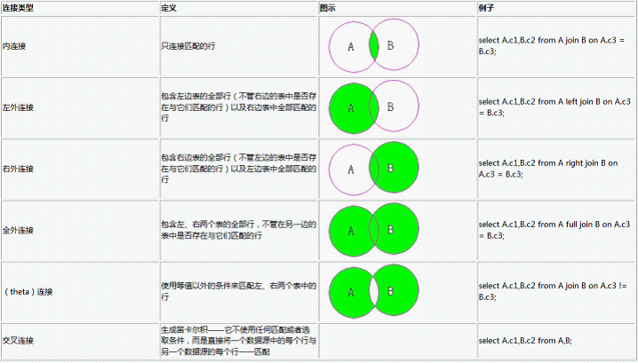

# Oracle 表连接方式(内连接_外连接_自连接) 详解

分类: database
日期: 2014-05-31

原文地址: 

http://blog.chinaunix.net/uid-29632145-id-4282023.html

------

****[Oracle 表连接方式(内连接/外连接/自连接) 详解]() *2014-05-31 18:51:18*

分类： Oracle

## 说明

Oracle 表之间的连接分为三种：

1. 内连接(自然连接)

2. 外连接

（1）左外连接 (左边的表不加限制)
​       （2）右外连接(右边的表不加限制)
​        （3）全外连接(左右两表都不加限制)

3. 自连接（同一张表内的连接）

 

SQL的标准语法：
select table1.column,table2.column
from table1 [inner | left | right | full ] join table2 on table1.column1 = table2.column2;

inner join 表示内连接；

left join表示左外连接；

right join表示右外连接；

full join表示完全外连接；
on子句 用于指定连接条件。

注意：

如果使用from子句指定内、外连接，则必须要使用on子句指定连接条件；
​       如果使用（+）操作符指定外连接，则必须使用where子句指定连接条件。

 

 

 

 

## 一． 内连接（Inner Join/Join）

 

 

### 1.1  Inner Join 

Inner join逻辑运算符返回满足第一个（顶端）输入与第二个（底端）输入联接的每一行。这个和用select查询多表是一样的效果，所以内连接用的很少。

还有一点要说明的就是Join 默认就是inner join。 所以我们在写内连接的时候可以省略inner 这个关键字。 

 

 

1.2 下面举例来说明内连接：

1.2.1 先创建2张测试表并插入数据：

SQL> select * from dave;

ID  NAME

---------- ----------

1  dave

2  bl

1  bl

2  dave

SQL> select * from bl;

ID  NAME

---------- ----------

1  dave

2  bl

1.2.3 用内链接进行查询：

SQL> Select a.id,a.name,b.name from dave a inner join bl b on a.id=b.id;   -- 标准写法

​        ID NAME       NAME

---------- ---------- ----------

​         1 dave       dave

​         2 bl         bl

​         1 bl         dave

​         2 dave       bl

SQL> Select a.id,a.name,b.name from dave a join bl b on a.id=b.id;  -- 这里省略了inner 关键字

​        ID NAME       NAME

---------- ---------- ----------

​         1 dave       dave

​         2 bl         bl

​         1 bl         dave

​         2 dave       bl

SQL> Select a.id,a.name,b.name from dave a,bl b where a.id=b.id;  -- select 多表查询

​        ID NAME       NAME

---------- ---------- ----------

​         1 dave       dave

​         2 bl         bl

​         1 bl         dave

​         2 dave       bl

   从这三个SQL 的结果我们也可以看出，他们的作用是一样的。

 

 

### 1.3 自然连接(Natural join)

自然连接是在两张表中寻找那些数据类型和列名都相同的字段，然后自动地将他们连接起来，并返回所有符合条件按的结果。

先看一下自然连接的例子:

SQL> Select id,name from dave a natural join bl b;  

​        ID NAME

---------- ----------

​         1 dave

​         2 bl

这里我们并没有指定连接的条件，实际上oracle为我们自作主张的将，dave表中的id和name字段与bl表中的id和name字段进行了连接。也就是实际上相当于

SQL> Select dave.id,bl.name From dave join bl on dave.id = bl.id and dave.name=bl.name;

​        ID NAME

---------- ----------

​         1 dave

​         2 bl

因此，我们也可以将自然连接理解为内连接的一种。 

 

 

有关自然连接的一些注意事项：

（1）.如果做自然连接的两个表的有多个字段都满足有相同名称个类型，那么他们会被作为自然连接的条件。

（2）.如果自然连接的两个表仅是字段名称相同，但数据类型不同，那么将会返回一个错误。

 

 

 

 

## 二． 外连接(Outer Join)

outer join则会返回每个满足第一个（顶端）输入与第二个（底端）输入的联接的行。它还返回任何在第二个输入中没有匹配行的第一个输入中的行。外连接分为三种： 左外连接，右外连接，全外连接。 对应SQL：LEFT/RIGHT/FULL OUTER JOIN。 通常我们省略outer 这个关键字。 写成：LEFT/RIGHT/FULL JOIN。

在左外连接和右外连接时都会以一张表为基表，该表的内容会全部显示，然后加上两张表匹配的内容。 如果基表的数据在另一张表没有记录。 那么在相关联的结果集行中列显示为空值（NULL）。 

 

 

对于外连接， 也可以使用“(+) ”来表示。 关于使用（+）的一些注意事项：
1.（+）操作符只能出现在where子句中，并且不能与outer join语法同时使用。
2. 当使用（+）操作符执行外连接时，如果在where子句中包含有多个条件，则必须在所有条件中都包含（+）操作符
3.（+）操作符只适用于列，而不能用在表达式上。
4.（+）操作符不能与or和in操作符一起使用。
5.（+）操作符只能用于实现左外连接和右外连接，而不能用于实现完全外连接。

在做实验之前，我们先将dave表和bl里加一些不同的数据。 以方便测试。 

SQL> select * from bl;

​        ID NAME

---------- ----------

​         1 dave

​         2 bl

​         3 big bird

​         4 exc

​         9 怀宁

SQL> select * from dave;

​        ID NAME

---------- ----------

​         8 安庆

​         1 dave

​         2 bl

​         1 bl

​         2 dave

​         3 dba

​         4 sf-express

​         5 dmm

 

 

### 2.1 左外连接（Left outer join/ left join）

​     left join是以左表的记录为基础的,示例中Dave可以看成左表,BL可以看成右表,它的结果集是Dave表中的数据，在加上Dave表和BL表匹配的数据。换句话说,左表(Dave)的记录将会全部表示出来,而右表(BL)只会显示符合搜索条件的记录。BL表记录不足的地方均为NULL.

示例：

SQL> select * from dave a left join bl b on a.id = b.id;

​       ID NAME               ID NAME

--------- ---------- ---------- ----------

​        1 bl                  1 dave

​        1 dave                1 dave

​        2 dave                2 bl

​        2 bl                  2 bl

​        3 dba                 3 big bird

​        4 sf-express          4 exc

​        5 dmm                             -- 此处B表为null，因为没有匹配到

​        8 安庆                             -- 此处B表为null，因为没有匹配到

SQL> select * from dave a left outer join bl b on a.id = b.id;

​        ID NAME               ID NAME

---------- ---------- ---------- ----------

​         1 bl                  1 dave

​         1 dave                1 dave

​         2 dave                2 bl

​         2 bl                  2 bl

​         3 dba                 3 big bird

​         4 sf-express          4 exc

​         5 dmm

​         8 安庆

 

 

用（+）来实现， 这个+号可以这样来理解： + 表示补充，即哪个表有加号，这个表就是匹配表。所以加号写在右表，左表就是全部显示，故是左连接。

SQL> Select * from dave a,bl b where a.id=b.id(+);    -- 注意： 用（+） 就要用关键字where

​        ID NAME               ID NAME

---------- ---------- ---------- ----------

​         1 bl                  1 dave

​         1 dave                1 dave

​         2 dave                2 bl

​         2 bl                  2 bl

​         3 dba                 3 big bird

​         4 sf-express          4 exc

​         5 dmm

​         8 安庆

​     

 

 

### 2.2 右外连接（right outer join/ right join）

和left join的结果刚好相反,是以右表(BL)为基础的, 显示BL表的所以记录，在加上Dave和BL 匹配的结果。 Dave表不足的地方用NULL填充.

 

 

示例：

SQL> select * from dave a right join bl b on a.id = b.id;

​        ID NAME               ID NAME

---------- ---------- ---------- ----------

​         1 dave                1 dave

​         2 bl                  2 bl

​         1 bl                  1 dave

​         2 dave                2 bl

​         3 dba                 3 big bird

​         4 sf-express          4 exc

​                               9 怀宁    --此处左表不足用Null 填充

已选择7行。

SQL> select * from dave a right outer join bl b on a.id = b.id;

​        ID NAME               ID NAME

---------- ---------- ---------- ----------

​         1 dave                1 dave

​         2 bl                  2 bl

​         1 bl                  1 dave

​         2 dave                2 bl

​         3 dba                 3 big bird

​         4 sf-express          4 exc

​                               9 怀宁  --此处左表不足用Null 填充

已选择7行。

 

用（+）来实现， 这个+号可以这样来理解： + 表示补充，即哪个表有加号，这个表就是匹配表。所以加号写在左表，右表就是全部显示，故是右连接。

SQL> Select * from dave a,bl b where a.id(+)=b.id;

​        ID NAME               ID NAME

---------- ---------- ---------- ----------

​         1 dave                1 dave

​         2 bl                  2 bl

​         1 bl                  1 dave

​         2 dave                2 bl

​         3 dba                 3 big bird

​         4 sf-express          4 exc

​                               9 怀宁

 

 

### 2.3 全外连接（full outer join/ full join）

​     左表和右表都不做限制，所有的记录都显示，两表不足的地方用null 填充。 全外连接不支持（+）这种写法。

示例：

SQL> select * from dave a full join bl b on a.id = b.id;

​        ID NAME               ID NAME

---------- ---------- ---------- ----------

​         8 安庆

​         1 dave                1 dave

​         2 bl                  2 bl

​         1 bl                  1 dave

​         2 dave                2 bl

​         3 dba                 3 big bird

​         4 sf-express          4 exc

​         5 dmm

​                               9 怀宁

已选择9行。

SQL> select * from dave a full outer join bl b on a.id = b.id;

​        ID NAME               ID NAME

---------- ---------- ---------- ----------

​         8 安庆

​         1 dave                1 dave

​         2 bl                  2 bl

​         1 bl                  1 dave

​         2 dave                2 bl

​         3 dba                 3 big bird

​         4 sf-express          4 exc

​         5 dmm

​                               9 怀宁

已选择9行。

 

## 三． 自连接

自连接(self join)是SQL语句中经常要用的连接方式，使用自连接可以将自身表的一个镜像当作另一个表来对待，从而能够得到一些特殊的数据。

示例：

在oracle的scott的schema中有一个表是emp。在emp中的每一个员工都有自己的mgr(经理)，并且每一个经理自身也是公司的员工，自身也有自己的经理。

下面我们需要将每一个员工自己的名字和经理的名字都找出来。这时候我们该怎么做呢？

如果我们有两张这样的表分别教worker和mgr，那么我们就很好写SQL语句。

Select worker.name,

Mgr.name

From worker,mgr

Where worker.id = mgr.id;

 

但现在我们只有一张emp表。所以我们可以采用自连接。自连接的本意就是将一张表看成多张表来做连接。我们可以这样来写SQL语句:

SQL> select work.ename worker,mgr.ename  manager from scott.emp work, scott.emp mgr

  2  where work.mgr = mgr.empno

  3  order by work.ename;

WORKER     MANAGER

---------- ----------

ADAMS      SCOTT

ALLEN      BLAKE

BLAKE      KING

CLARK      KING

FORD       JONES

JAMES      BLAKE

JONES      KING

MARTIN     BLAKE

MILLER     CLARK

SCOTT      JONES

SMITH      FORD

WORKER     MANAGER

---------- ----------

TURNER     BLAKE

WARD       BLAKE

已选择13行。

 

各种连接的一个图示：

 

 

 

 

 

整理自网络

\------------------------------------------------------------------------------ 

Blog： http://blog.csdn.net/tianlesoftware 

网上资源： http://tianlesoftware.download.csdn.net 

相关视频：http://blog.csdn.net/tianlesoftware/archive/2009/11/27/4886500.aspx 

DBA1 群：62697716(满); DBA2 群：62697977(满)

DBA3 群：63306533;     聊天 群：40132017