# oracle 多表查询，表连接


表实例使用的是oracle  scott帐号的表：

SELECT * FROM emp;

```
雇员表：记录了一个雇员的基本信息
EMP（雇员表）
NO              字段             类型                            描述
1              	EMPNO           NUMBER(4)              			雇员编号
2              	ENAME           VARCHAR2(10)     				表示雇员姓名
3             	JOB             VARCHAR2(9)        				表示工作职位
4            	MGR             NUMBER(4)            			表示一个雇员的领导编号
5              	HIREDATE       	DATE                      		表示雇佣日期
6             	SAL             NUMBER(7,2)         			表示月薪，工资
7             	COMM            NUMBER(7,2)         			表示奖金或佣金
8              	DEPTNO          NUMBER(2)           			表示部门编号
```

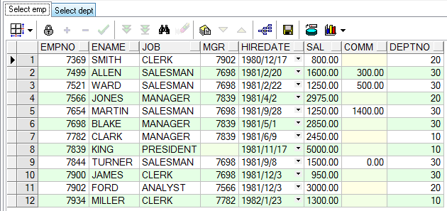

SELECT * FROM dept

```
部门表：表示一个部门的具体信息
DEPT（部门表）
NO               字段             类型                             描述
1                DEPTNO         NUMBER(2)                		部门编号
2                DNAME          VARCHAR2(14)          			部门名称
3                LOC            VARCHAR2(13)           			部门位置

```

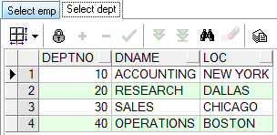

## 一，等值连接

--查询员工信息： 员工号 姓名 月薪 部门名称

select e.empno,e.ename,e.sal,d.dname

from emp e,dept d

where e.deptno=d.deptno;

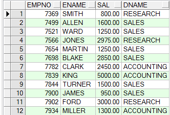

 

## 二，不等值连接

--查询员工信息： 员工号 姓名 月薪 工资级别

select * from salgrad;

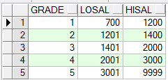    

​                       

select e.empno,e.ename,e.sal,s.grade

from emp e,salgrade s

where e.sal between s.losal and s.hisal;

 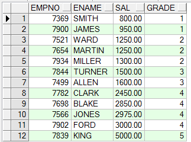

## 三，外连接

--按部门统计员工人数： 部门号 部门名称 人数

--以下答案是错的。少了一个部门。                      

select d.deptno 部门号,d.dname 部门名称,count(e.empno) 人数

from emp e,dept d

where e.deptno=d.deptno

group by d.deptno,d.dname

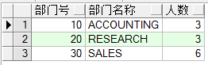

select * from dept;

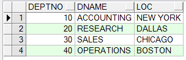

SQL> /*

SQL> 希望： 在最后的结果中，包含某些不成立的记录

SQL> 外连接:

SQL> 左外连接: 当where e.deptno=d.deptno不成立的时候,等号左边所代表的表 任然被包含

SQL>         写法: where e.deptno=d.deptno(+)

SQL> 右外连接: 当where e.deptno=d.deptno不成立的时候,等号右边所代表的表 任然被包含

SQL>         写法:where e.deptno(+)=d.deptno

SQL> */

select d.deptno,d.dname,count(e.empno)

from emp e,dept d

where e.deptno(+)=d.deptno

group by d.deptno,d.dname

order by 1

 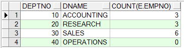

## 四，自连接

--查询员工信息：***的老板是***

select * from emp;

  

--自连接：通过表的别名，将同一张表视为多张表    字段多的情况最好不要用，查询是呈现笛卡尔积，两个次from

select e.ename||'的老板是'||b.ename

from emp e,emp b

where e.mgr=b.empno;

 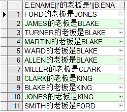

select count(*)

from emp e,emp b;

 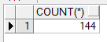

## 五，层次查询    

层次查询只查询一次， 因为只有一个from

select level,empno,ename,sal,mgr

from emp

connect by prior empno=mgr

start with mgr is null

order by 1;

 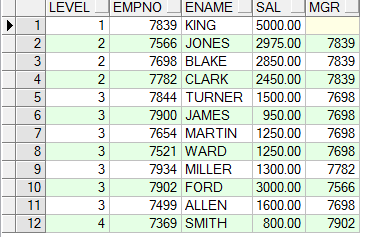

SQL> /*

SQL> 执行的过程:

SQL> 1. KING: start with mgr is null ---> empno=7839

SQL> 2. where mgr = 7839; ---> 7566 7698 7782

SQL> 3. where mgr in (7566 7698 7782)*/

SQL> spool off