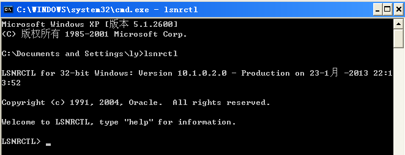
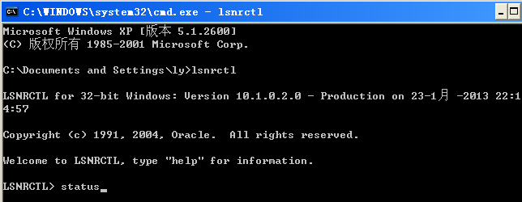
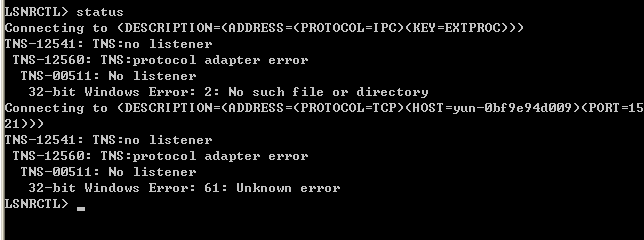
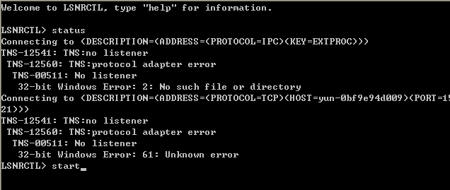
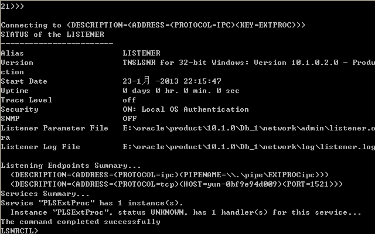

## PL/SQL连接oracle数据库出现TNS: no listener的解决办法

 

CMS

PL/SQL的英文全称为Procedure Language & Structured Query Language，是应用于oracle环境中，是一种高性能的基于事务处理的语言。
对于初学者来说使用oracle数据库会无所适从，而PL/SQL则提供了我们很方便的使用oracle数据库的工具。
我也是初学者，第一次使用PL/SQL时，用PL/SQL连接oracle数据库出现**TNS: no listener**错误，从网上找了一些资料，顺利的解决了这个问题，下面我把这次PL/SQL连接oracle数据库出现TNS: no listener的解决办法详细提供了下。
在运行中输入CMD，然后在命令行中输入lsnrctl，如下图所示：

然后在LSNRCTL>输入status，如下图所示：

输入status出现的结果如下：

然后在LSNRCTL>输入start，如下图所示：

输入start出现的结果如下：

然后就可以正常登陆了。
我的就是通过上述方法解决了问题，网上说如果又出现同样的错误问题，可以选择：到控制面板-管理工具-服务中找到OracleOraDb10g_home1TNSListener，右击属性-常规启动服务，也可以将启动类型由手动设为自动，保证重启之后也可以自动启动服务。
由于我通过第一种方法解决了，第二种方法的可行性我就没有论证了。
除非注明，文章均为25亿[网站后台管理系统](http://www.25yi.com/)原创，转载请以链接形式注明出处，谢谢。
本文地址：<http://www.25yi.com/sql/oraclenolistener-278/>