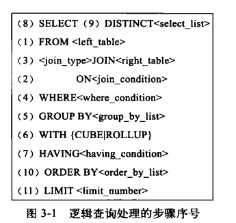

[TOC]


# 一次非常有意思的sql优化经历

分类: database
日期: 2015-05-11

原文地址: 

http://blog.chinaunix.net/uid-29632145-id-5021537.html

------

****[一次非常有意思的sql优化经历 ]()*2015-05-11 14:58:57*

分类： Mysql/postgreSQL

补充：看到这么多朋友对sql优化感兴趣，我又重新补充了下文章的内容，将更多关于sql优化的知识分享出来，

喜欢这篇文章的朋友给个赞吧，哈哈，欢迎交流，共同进步。

2015-4-30补充：非常感觉编辑的推荐，同时又对慢查询语句优化了一遍，并附上优化记录，欢迎阅读文章。

### 场景

我用的数据库是mysql5.6，下面简单的介绍下场景

课程表


```
create table Course(

c_id int PRIMARY KEY,

name varchar(10)

)
```


数据100条

学生表:


```
create table Student(

id int PRIMARY KEY,

name varchar(10)

)
```


数据70000条

学生成绩表SC


```
CREATE table SC(

    sc_id int PRIMARY KEY,

    s_id int,

    c_id int,

    score int )
```


数据70w条

查询目的：

查找语文考100分的考生

查询语句：

```
select s.* from Student s where s.s_id in (select s_id from SC sc where sc.c_id = 0 and sc.score = 100 )
```

执行时间：30248.271s

晕,为什么这么慢，先来查看下查询计划：

```
EXPLAIN select s.* from Student s where s.s_id in (select s_id from SC sc where sc.c_id = 0 and sc.score = 100 )
```

[](http://images.cnitblog.com/blog/722277/201504/281308508332906.png)

发现没有用到索引，type全是ALL，那么首先想到的就是建立一个索引，建立索引的字段当然是在where条件的字段。

先给sc表的c_id和score建个索引

```
CREATE index sc_c_id_index on SC(c_id);
```

```
CREATE index sc_score_index on SC(score);
```

再次执行上述查询语句，时间为: 1.054s

快了3w多倍，大大缩短了查询时间，看来索引能极大程度的提高查询效率，建索引很有必要，很多时候都忘记建

索引了，数据量小的的时候压根没感觉，这优化的感觉挺爽。

但是1s的时间还是太长了，还能进行优化吗，仔细看执行计划：

[](http://images.cnitblog.com/blog/722277/201504/281308568337873.png)

查看优化后的sql:


```
SELECT `YSB`.`s`.`s_id` AS `s_id`,
    `YSB`.`s`.`name` AS `name` FROM `YSB`.`Student` `s` WHERE < in_optimizer > (
        `YSB`.`s`.`s_id` ,< EXISTS > ( SELECT 1 FROM `YSB`.`SC` `sc` WHERE (
                    (`YSB`.`sc`.`c_id` = 0) AND (`YSB`.`sc`.`score` = 100) AND ( < CACHE > (`YSB`.`s`.`s_id`) = `YSB`.`sc`.`s_id`
                    )
                )
        )
    )
```


补充：这里有网友问怎么查看优化后的语句

方法如下：

在命令窗口执行 [](http://images.cnitblog.com/blog/722277/201504/281342048962810.png)

[](http://images.cnitblog.com/blog/722277/201504/281342059581151.png)

有type=all

按照我之前的想法，该sql的执行的顺序应该是先执行子查询

```
select s_id from SC sc where sc.c_id = 0 and sc.score = 100
```

耗时：0.001s

得到如下结果：

[](http://images.cnitblog.com/blog/722277/201504/281308597865371.png)

然后再执行

```
select s.* from Student s where s.s_id in(7,29,5000)
```

耗时：0.001s

这样就是相当快了啊，Mysql竟然不是先执行里层的查询，而是将sql优化成了exists子句，并出现了EPENDENT SUBQUERY，

mysql是先执行外层查询，再执行里层的查询，这样就要循环70007*8次。

那么改用连接查询呢？


```
SELECT s.* from Student s INNER JOIN SC sc on sc.s_id = s.s_id where sc.c_id=0 and sc.score=100
```


这里为了重新分析连接查询的情况，先暂时删除索引sc_c_id_index，sc_score_index

执行时间是：0.057s

效率有所提高，看看执行计划：

[](http://images.cnitblog.com/blog/722277/201504/281309019116755.png)

这里有连表的情况出现，我猜想是不是要给sc表的s_id建立个索引

CREATE index sc_s_id_index on SC(s_id);

show index from SC

[](http://images.cnitblog.com/blog/722277/201504/281309039744626.png)

在执行连接查询

时间: 1.076s，竟然时间还变长了，什么原因？查看执行计划：

[](http://images.cnitblog.com/blog/722277/201504/281309076938021.png)

优化后的查询语句为：


```
SELECT `YSB`.`s`.`s_id` AS `s_id`,
    `YSB`.`s`.`name` AS `name` FROM `YSB`.`Student` `s` JOIN `YSB`.`SC` `sc` WHERE (
        (
            `YSB`.`sc`.`s_id` = `YSB`.`s`.`s_id`
        ) AND (`YSB`.`sc`.`score` = 100) AND (`YSB`.`sc`.`c_id` = 0)
    )
```


貌似是先做的连接查询，再进行的where条件过滤

回到前面的执行计划：

[](http://images.cnitblog.com/blog/722277/201504/281309121615490.png)

这里是先做的where条件过滤，再做连表，执行计划还不是固定的，那么我们先看下标准的sql执行顺序：

[](http://images.cnitblog.com/blog/722277/201504/281309162242017.png)

正常情况下是先join再进行where过滤，但是我们这里的情况，如果先join，将会有70w条数据发送join做操，因此先执行where

过滤是明智方案，现在为了排除mysql的查询优化，我自己写一条优化后的sql


```
SELECT s.* FROM ( SELECT * FROM SC sc WHERE sc.c_id = 0 AND sc.score = 100 ) t INNER JOIN Student s ON t.s_id = s.s_id
```


即先执行sc表的过滤，再进行表连接，执行时间为：0.054s

和之前没有建s_id索引的时间差不多

查看执行计划：

[](http://images.cnitblog.com/blog/722277/201504/281309201619112.png)

先提取sc再连表，这样效率就高多了，现在的问题是提取sc的时候出现了扫描表，那么现在可以明确需要建立相关索引

```
CREATE index sc_c_id_index on SC(c_id);
```

```
CREATE index sc_score_index on SC(score);
```

再执行查询：


```
SELECT s.* FROM ( SELECT * FROM SC sc WHERE sc.c_id = 0 AND sc.score = 100 ) t INNER JOIN Student s ON t.s_id = s.s_id
```


执行时间为：0.001s，这个时间相当靠谱，快了50倍

执行计划：

[](http://images.cnitblog.com/blog/722277/201504/281309232553568.png)

我们会看到，先提取sc，再连表，都用到了索引。

那么再来执行下sql


```
SELECT s.* from Student s INNER JOIN SC sc on sc.s_id = s.s_id where sc.c_id=0 and sc.score=100
```


执行时间0.001s

执行计划：

[](http://images.cnitblog.com/blog/722277/201504/281309263808780.png)

这里是mysql进行了查询语句优化，先执行了where过滤，再执行连接操作，且都用到了索引。

 

2015-04-30日补充：最近又重新导入一些生产数据，经测试发现，前几天优化完的sql执行效率又变低了

调整内容为SC表的数据增长到300W,学生分数更为离散。

先回顾下：

show index from SC

[](http://images.cnitblog.com/blog/722277/201504/301012440526578.png)

执行sql


```
SELECT s.* from Student s INNER JOIN SC sc on sc.s_id = s.s_id where sc.c_id=81 and sc.score=84
```

```
 
```


执行时间：0.061s，这个时间稍微慢了点

执行计划：

[](http://images.cnitblog.com/blog/722277/201504/301012457409561.png)

这里用到了intersect并集操作，即两个索引同时检索的结果再求并集，再看字段score和c_id的区分度，

单从一个字段看，区分度都不是很大，从SC表检索，c_id=81检索的结果是70001,score=84的结果是39425

而c_id=81 and score=84 的结果是897，即这两个字段联合起来的区分度是比较高的，因此建立联合索引查询效率

将会更高，从另外一个角度看，该表的数据是300w，以后会更多，就索引存储而言，都是不小的数目，随着数据量的

增加，索引就不能全部加载到内存，而是要从磁盘去读取，这样索引的个数越多，读磁盘的开销就越大，因此根据具体

业务情况建立多列的联合索引是必要的，那么我们来试试吧。

```
alter table SC drop index sc_c_id_index; alter table SC drop index sc_score_index; create index sc_c_id_score_index on SC(c_id,score);
```

执行上述查询语句，消耗时间为：0.007s，这个速度还是可以接收的

执行计划：

[](http://images.cnitblog.com/blog/722277/201504/301012473803261.png)

该语句的优化暂时告一段落

总结：

1.mysql嵌套子查询效率确实比较低

2.可以将其优化成连接查询

3.连接表时，可以先用where条件对表进行过滤，然后做表连接

（虽然mysql会对连表语句做优化）

4.建立合适的索引，必要时建立多列联合索引

5.学会分析sql执行计划，mysql会对sql进行优化，所以分析执行计划很重要

### 索引优化

上面讲到子查询的优化，以及如何建立索引，而且在多个字段索引时，分别对字段建立了单个索引

后面发现其实建立联合索引效率会更高，尤其是在数据量较大，单个列区分度不高的情况下。

### 单列索引

查询语句如下：

```
select * from user_test_copy where sex = 2 and type = 2 and age = 10
```

索引：

```
CREATE index user_test_index_sex on user_test_copy(sex); CREATE index user_test_index_type on user_test_copy(type); CREATE index user_test_index_age on user_test_copy(age);
```

分别对sex,type,age字段做了索引，数据量为300w,查询时间：0.415s

执行计划：

[](http://images.cnitblog.com/blog/722277/201504/291444259742769.png)

发现type=index_merge

这是mysql对多个单列索引的优化，对结果集采用intersect并集操作

### 多列索引

我们可以在这3个列上建立多列索引，将表copy一份以便做测试

```
create index user_test_index_sex_type_age on user_test(sex,type,age);
```

查询语句：

```
select * from user_test where sex = 2 and type = 2 and age = 10
```

执行时间：0.032s，快了10多倍，且多列索引的区分度越高，提高的速度也越多

执行计划：

[](http://images.cnitblog.com/blog/722277/201504/291444304909521.png)

**最左前缀**

多列索引还有最左前缀的特性：

执行一下语句：

```
select * from user_test where sex = 2 select * from user_test where sex = 2 and type = 2 select * from user_test where sex = 2 and age = 10
```

都会使用到索引，即索引的第一个字段sex要出现在where条件中

### 索引覆盖

就是查询的列都建立了索引，这样在获取结果集的时候不用再去磁盘获取其它列的数据，直接返回索引数据即可

如：

```
select sex,type,age from user_test where sex = 2 and type = 2 and age = 10
```

执行时间：0.003s

要比取所有字段快的多

### 排序

```
select * from user_test where sex = 2 and type = 2 ORDER BY user_name
```

时间：0.139s

在排序字段上建立索引会提高排序的效率

```
create index user_name_index on user_test(user_name)
```

 

最后附上一些sql调优的总结，以后有时间再深入研究

\1. 列类型尽量定义成数值类型，且长度尽可能短，如主键和外键，类型字段等等

\2. 建立单列索引

\3. 根据需要建立多列联合索引

当单个列过滤之后还有很多数据，那么索引的效率将会比较低，即列的区分度较低，

那么如果在多个列上建立索引，那么多个列的区分度就大多了，将会有显著的效率提高。

\4. 根据业务场景建立覆盖索引

只查询业务需要的字段，如果这些字段被索引覆盖，将极大的提高查询效率

\5. 多表连接的字段上需要建立索引

这样可以极大的提高表连接的效率

\6. where条件字段上需要建立索引

\7. 排序字段上需要建立索引

\8. 分组字段上需要建立索引

\9. Where条件上不要使用运算函数，以免索引失效

 

**参考文章**

<http://www.cnblogs.com/linfangshuhellowored/p/4430293.html>

慢sql查询

<http://tech.meituan.com/mysql-index.html>

笛卡尔乘积

<http://www.cnblogs.com/Toolo/p/3634563.html>

sql优化

<http://www.cnblogs.com/mliang/p/3637937.html>

<http://www.cnblogs.com/xwdreamer/archive/2012/07/19/2599494.html>

执行计划参考：

<http://www.cnblogs.com/ggjucheng/archive/2012/11/11/2765237.html>

作者：[风过无痕-唐](http://www.cnblogs.com/tangyanbo/)
出处：<http://www.cnblogs.com/tangyanbo/>
本文以学习、研究和分享为主，欢迎转载，但必须在文章页面明显位置给出原文连接。如果文中有不妥或者错误的地方还望高手的你指出，以免误人子弟。如果觉得本文对你有所帮助不如【推荐】一下！如果你有更好的建议，不如留言一起讨论，共同进步！ 再次感谢您耐心的读完本篇文章。欢迎加QQ讨论群：261502547 