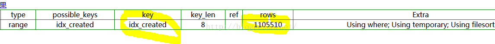

# 利用 force index优化sql语句性能

​    今天写了一个统计sql，在一个近亿条数据的表上执行，200s都查不出结果。SQL如下：

```
select customer,count(1) c  
from upv_**  
where created between "2015-07-06" and "2015-07-07"  
group by customer   
having c > 20  
order by c desc  
```

​    执行explain,发现这个sql扫描了8000W条记录到磁盘上。然后再进行筛选。type=index说明整个索引树都被扫描了，效果显然不理想。


​    拿着这个SQL去请教项目组的数据库大牛，仅仅加了一个force index，花了1s多就出结果了。修改后的SQL如下：

```
select customer,count(1) c  
from upv_** force index(idx_created)  
where created between "2015-07-06" and "2015-07-07"  
group by customer   
having c > 15  
order by c desc  
```

​    同样执行以下explain命令，这个SQL仅仅扫描了磁盘的110W行记录。也就是上一个SQL的80分之一。大家都知道，扫描磁盘是很耗时的IO操作，比内存操作慢几个数量级。type=range,说明索引树仅仅被部分扫描，要优于前面那个SQL.




​    除了磁盘扫描的行数的不一样，还有采用的索引的不用，上面的sql用的是联合索引，而下面的是单纯的created字段的索引。由于用的是created的索引，驱动条件就是created的区间，需要扫描的数据就立刻变小了，因为时间区间小。后面的SQL的key_len要远远小于前面的SQL，也就意味着要扫描的磁盘上的索引数据量要远远小于前面的SQL。

​    第一个sql使用的是错误的索引，带来低效的查询。然后每条SQL只可能使用一个索引。通过上面的分析就可以发现，force index()指令可以指定本次查询使用哪个索引！这样就可以避免MySql优化器用到了一个低效的索引。


http://blog.csdn.net/bruce128/article/details/46777567