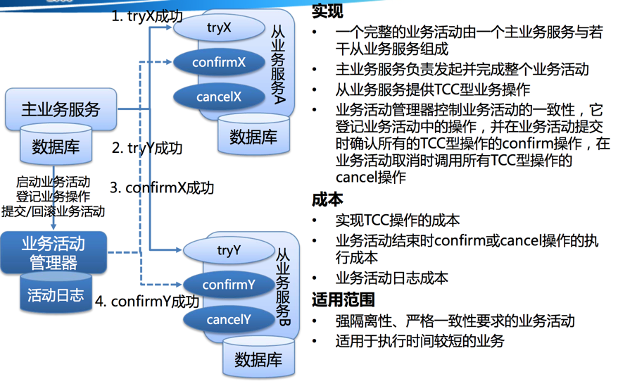

[TOC]


# TCC型分布式事务原理和实现之:原理介绍

## 前言

​      分布式事务的产生是由于需要同时对多个数据源进行事务操作（资源层），资源层的分布式事务常用的方案有JTA、spring事务等。随着微服务的盛行，服务层的分布式事务也日益重要，本文就着重讨论一种服务层分布式事务的实现原理：TCC。

## 钢性事务与柔性事务

​      一般而言，满足ACID的事务的为钢性事务，满足BASE理论的为柔性事务。其中，柔性事务大致可以分为以下四种：

- 两阶段型
- 补偿型
- 异步确保型
- 最大努力通知型

## TCC型事务

​      TCC属于补偿型柔性事务，本质也是一个两阶段型事务，这与JTA是极为相似的，但是与JTA的不同点是，JTA属于资源层事务，而TCC是服务层事务。  

​      在一个长事务（ long-running ）中 ，一个由两台服务器一起参与的事务，服务器A发起事务，服务器B参与事务，B的事务需要人工参与，所以处理时间可能很长。如果按照ACID的原则，要保持事务的隔离性、一致性，服务器A中发起的事务中使用到的事务资源将会被锁定，不允许其他应用访问到事务过程中的中间结果，直到整个事务被提交或者回滚。这就造成事务A中的资源被长时间锁定，系统的可用性将不可接受。
​      WS-BusinessActivity提供了一种基于补偿的long-running的事务处理模型。还是上面的例子，服务器A的事务如果执行顺利，那么事务A就先行提交，如果事务B也执行顺利，则事务B也提交，整个事务就算完成。但是如果事务B执行失败，事务B本身回滚，这时事务A已经被提交，所以需要执行一个补偿操作，将已经提交的事务A执行的操作作反操作，恢复到未执行前事务A的状态。这样的SAGA事务模型，是牺牲了一定的隔离性和一致性的，但是提高了long-running事务的可用性。          

​     在JTA事务中，所有需要被事务管理的资源（由不同厂商实现）都必须实现规定接口（比如XAResource中的commit和rollback等），同理，所有需要加入TCC事务的服务也必须提供相应的接口实现，在TCC中这些接口为：try、confirm、cancel（缩写为TCC）。TCC事务管理器会使用try、confirm、cancel接口协调多个服务进行事务处理，如下图所示：




​           **Try: 尝试执行业务**
​                 • 完成所有业务检查(一致性)
​                 • 预留必须业务资源(准隔离性)          
​            **Confirm:确认执行业务**
​                 • 真正执行业务
​                 • 不作任何业务检查
​                 • 只使用Try阶段预留的业务资源 
​                 • Confirm操作要满足幂等性
​           **Cancel: 取消执行业务**
​                 • 释放Try阶段预留的业务资源 
​                 • Cancel操作要满足幂等性

​           **TCC与2PC协议比较：**
​                 • 位于业务服务层而非资源层
​                 • 没有单独的准备(Prepare)阶段， Try操作兼备资源操作与准备能力 
​                 • Try操作可以灵活选择业务资源的锁定粒度(以业务定粒度) 
​                 • 较高开发成本

## TCC方案设计

​      一个好的TCC框架实现至少应该满足以下几个特点：

- **不与特定的服务框架耦合：**TCC作为服务层的分布式事务方案，自然离不开一些常用的微服务框架，比如：dubbo、dubbox、motan、hessian、grpc、thrift以及时下很火的spring cloud等。但是TCC框架本身不应该与特定服务框架绑定，无论服务框架是基于tcp还是http，无论是基于私有协议还是公有协议，TCC框架都应该能做到无缝整合。当然，框架本身可以针对特定的服务框架进行一些部分优化，比如针对dubbo，那么TCC框架本身可以充分利用dubbo隐式传参的特性进行事务上下文的传递，而不用显示的作为服务方法参数传递。
- **提供基于注解的配置：**提供基于注解而不是xml的服务配置方式，这样可以极大的方便服务的开发。注解用于标记try、confirm、cancel接口的具体实现，同时，被注解标记的TCC接口还会被框架提供的切面进行拦截，执行特定的事务逻辑。

```java
    @Compensable(confirmMethod = "confirmRecord", cancelMethod = "cancelRecord",transactionContextEditor = DubboTransactionContextEditor.class)
    @Transactional
    public String record(CapitalTradeOrderDto tradeOrderDto) {
        return "success";
    }

    @Transactional
    public void confirmRecord(CapitalTradeOrderDto tradeOrderDto) {
     
    }

    @Transactional
    public void cancelRecord(CapitalTradeOrderDto tradeOrderDto) {
      
    }
```

- **支持多种事务日志持久化机制：**事务日志持久化的性能是影响TCC性能的一个很重要因素，因此支持多种持久化机制便于根据特定应用场景进行灵活选择，比如支持基于文件、基于redis（开启AOF）、基于zookeeper、基于mysql等等。使用何种持久化机制，框架应该支持在xml或者注解中进行配置。
- **支持可配置recovery策略：**对于异常的事务（比如Confirm失败），TCC框架应该提供recovery机制，它会对事务日志进行扫描监控，并根据策略进行recovery操作。策略必须是可以配置的（基于xml或者注解），配置项可以有：最大重试次数、recovery时间间隔、支持Cron表达式等。   
- **使用spring：**由于spring框架几乎存在于每一个java项目中，因此TCC框架有理由选择spring来进行：依赖注入、aop、spring声明式事务等。

## 系列文章

[TCC型分布式事务原理和实现之：原理介绍](https://my.oschina.net/fileoptions/blog/899991)

[TCC型分布式事务原理和实现之：TransactionManager](https://my.oschina.net/fileoptions/blog/900650)

[TCC型分布式事务原理和实现之：Transaction与Participant](https://my.oschina.net/fileoptions/blog/903251)

TCC型分布式事务原理和实现之：事务切面

TCC型分布式事务原理和实现之：事务recovery

TCC型分布式事务原理和实现之：兼容dubbo


https://my.oschina.net/fileoptions/blog/899991