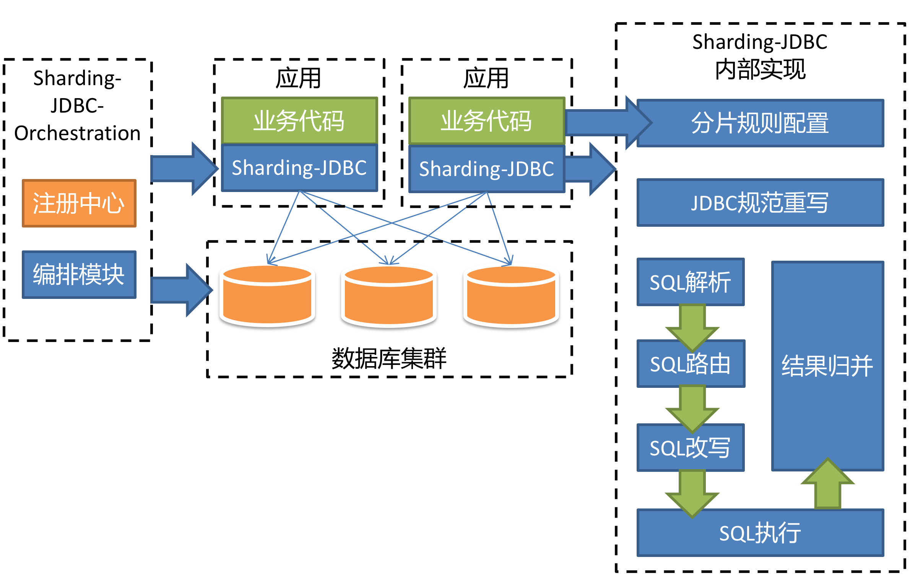
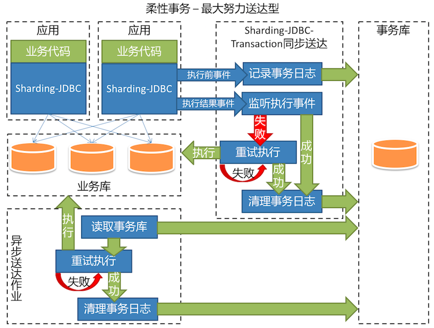

# shardingjdbc 简介 整体架构图

## 简介

Sharding-JDBC直接封装JDBC API，可以理解为增强版的JDBC驱动，旧代码迁移成本几乎为零：

- 可适用于任何基于java的ORM框架，如：JPA, Hibernate, Mybatis, Spring JDBC Template或直接使用JDBC。
- 可基于任何第三方的数据库连接池，如：DBCP, C3P0, BoneCP, Druid等。
- 理论上可支持任意实现JDBC规范的数据库。目前支持MySQL，Oracle，SQLServer和PostgreSQL。

Sharding-JDBC定位为轻量级java框架，使用客户端直连数据库，以jar包形式提供服务，未使用中间层，无需额外部署，无其他依赖，DBA也无需改变原有的运维方式。采用”半理解”理念的SQL解析引擎，以达到性能与兼容性的最大平衡。

Sharding-JDBC功能灵活且全面：

- 分片策略灵活，可支持=，BETWEEN，IN等多维度分片，也可支持多分片键共用。
- SQL解析功能完善，支持聚合，分组，排序，Limit，TOP等查询，并且支持Binding Table以及笛卡尔积的表查询。
- 支持柔性事务(目前仅最大努力送达型)。
- 支持读写分离。
- 支持分布式生成全局主键。

Sharding-JDBC配置多样：

- 支持Java编码和YAML的配置方式
- 支持自定义Spring命名空间与Spring boot starter
- 灵活多样的inline表达式

分布式治理能力突出： (2.0 only)

- 配置集中化与动态化，可支持数据源、表与分片策略的动态切换 (2.0.0.M1)
- 客户端的数据库治理，运行实例禁用启用 (2.0.0.M2)
- 基于Open Tracing协议的APM信息输出，读写分离Slave数据源禁用启用及ConfigMap支持 (2.0.0.M3)

------

以下是常见的分库分表产品和Sharding-JDBC的对比：

| 功能    | Cobar  | Cobar-client | TDDL    | Sharding-JDBC |
| ----- | ------ | ------------ | ------- | ------------- |
| 分库    | 有      | 有            | 未开源     | 有             |
| 分表    | 无      | 无            | 未开源     | 有             |
| 中间层   | 是      | 否            | 否       | 否             |
| ORM支持 | 任意     | 仅MyBatis     | 任意      | 任意            |
| 数据库支持 | 仅MySQL | 任意           | 任意      | 任意            |
| 异构语言  | 可      | 仅Java        | 仅Java   | 仅Java         |
| 外部依赖  | 无      | 无            | Diamond | 无             |

------

## 整体架构图

