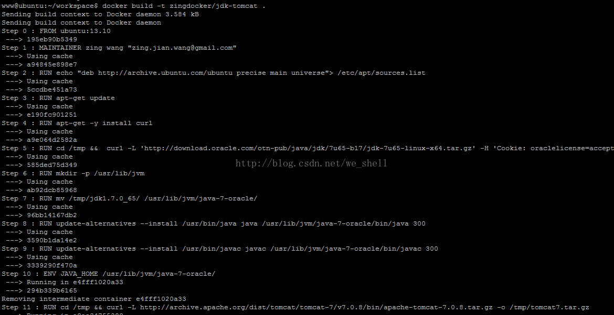

[TOC]


# Docker 如何使用Dockerfile构建镜像

转载 2015年01月31日 17:48:15

Dockfile是一种被Docker程序解释的脚本，Dockerfile由一条一条的指令组成，每条指令对应Linux下面的一条命令。Docker程序将这些Dockerfile指令翻译真正的Linux命令。Dockerfile有自己书写格式和支持的命令，Docker程序解决这些命令间的依赖关系，类似于Makefile。Docker程序将读取Dockerfile，根据指令生成定制的image。相比image这种黑盒子，Dockerfile这种显而易见的脚本更容易被使用者接受，它明确的表明image是怎么产生的。有了Dockerfile，当我们需要定制自己额外的需求时，只需在Dockerfile上添加或者修改指令，重新生成image即可，省去了敲命令的麻烦。

## 1. Dockerfile的书写规则及指令使用方法

Dockerfile的指令是忽略大小写的，建议使用大写，使用 # 作为注释，每一行只支持一条指令，每条指令可以携带多个参数。
Dockerfile的指令根据作用可以分为两种，构建指令和设置指令。构建指令用于构建image，其指定的操作不会在运行image的容器上执行；设置指令用于设置image的属性，其指定的操作将在运行image的容器中执行。


### FROM（指定基础image）

构建指令，必须指定且需要在Dockerfile其他指令的前面。后续的指令都依赖于该指令指定的image。FROM指令指定的基础image可以是官方远程仓库中的，也可以位于本地仓库。
**该指令有两种格式：**

```
FROM <image>  
```

指定基础image为该image的最后修改的版本。或者：

```
FROM <image>:<tag>  
```

指定基础image为该image的一个tag版本。


### MAINTAINER（用来指定镜像创建者信息）

构建指令，用于将image的制作者相关的信息写入到image中。当我们对该image执行docker inspect命令时，输出中有相应的字段记录该信息。
**格式：**

```
MAINTAINER <name>  
```

### RUN（安装软件用）

构建指令，RUN可以运行任何被基础image支持的命令。如基础image选择了ubuntu，那么软件管理部分只能使用ubuntu的命令。
**该指令有两种格式：**

```
RUN <command> (the command is run in a shell - `/bin/sh -c`)  
RUN ["executable", "param1", "param2" ... ]  (exec form)  
```


### CMD（设置container启动时执行的操作）

设置指令，用于container启动时指定的操作。该操作可以是执行自定义脚本，也可以是执行系统命令。该指令只能在文件中存在一次，如果有多个，则只执行最后一条。
**该指令有三种格式：**

```
CMD ["executable","param1","param2"] (like an exec, this is the preferred form)  
CMD command param1 param2 (as a shell) 
```

当Dockerfile指定了ENTRYPOINT，那么使用下面的格式：

```
CMD ["param1","param2"] (as default parameters to ENTRYPOINT)  
```

ENTRYPOINT指定的是一个可执行的脚本或者程序的路径，该指定的脚本或者程序将会以param1和param2作为参数执行。所以如果CMD指令使用上面的形式，那么Dockerfile中必须要有配套的ENTRYPOINT。


### ENTRYPOINT（设置container启动时执行的操作）

设置指令，指定容器启动时执行的命令，可以多次设置，但是只有最后一个有效。
**两种格式:**

```
ENTRYPOINT ["executable", "param1", "param2"] (like an exec, the preferred form)  
ENTRYPOINT command param1 param2 (as a shell)
```

该指令的使用分为两种情况，一种是独自使用，另一种和CMD指令配合使用。

当独自使用时，如果你还使用了CMD命令且CMD是一个完整的可执行的命令，那么CMD指令和ENTRYPOINT会互相覆盖只有最后一个CMD或者ENTRYPOINT有效。

```
# CMD指令将不会被执行，只有ENTRYPOINT指令被执行  
CMD echo “Hello, World!”  
ENTRYPOINT ls -l  
```

另一种用法和CMD指令配合使用来指定ENTRYPOINT的默认参数，这时CMD指令不是一个完整的可执行命令，仅仅是参数部分；ENTRYPOINT指令只能使用JSON方式指定执行命令，而不能指定参数。

```
FROM ubuntu  
CMD ["-l"]  
ENTRYPOINT ["/usr/bin/ls"]  
```


### USER（设置container容器的用户）

设置指令，设置启动容器的用户，默认是root用户。

```
# 指定memcached的运行用户  
ENTRYPOINT ["memcached"]  
USER daemon  
或  
ENTRYPOINT ["memcached", "-u", "daemon"]  
```


### EXPOSE（指定容器需要映射到宿主机器的端口）

设置指令，该指令会将容器中的端口映射成宿主机器中的某个端口。当你需要访问容器的时候，可以不是用容器的IP地址而是使用宿主机器的IP地址和映射后的端口。要完成整个操作需要两个步骤，首先在Dockerfile使用EXPOSE设置需要映射的容器端口，然后在运行容器的时候指定-p选项加上EXPOSE设置的端口，这样EXPOSE设置的端口号会被随机映射成宿主机器中的一个端口号。也可以指定需要映射到宿主机器的那个端口，这时要确保宿主机器上的端口号没有被使用。EXPOSE指令可以一次设置多个端口号，相应的运行容器的时候，可以配套的多次使用-p选项。
**格式:**

```
EXPOSE <port> [<port>...]  
```

```
# 映射一个端口  
EXPOSE port1  
# 相应的运行容器使用的命令  
docker run -p port1 image  
  
# 映射多个端口  
EXPOSE port1 port2 port3  
# 相应的运行容器使用的命令  
docker run -p port1 -p port2 -p port3 image  
# 还可以指定需要映射到宿主机器上的某个端口号  
docker run -p host_port1:port1 -p host_port2:port2 -p host_port3:port3 image 
```

端口映射是docker比较重要的一个功能，原因在于我们每次运行容器的时候容器的IP地址不能指定而是在桥接网卡的地址范围内随机生成的。宿主机器的IP地址是固定的，我们可以将容器的端口的映射到宿主机器上的一个端口，免去每次访问容器中的某个服务时都要查看容器的IP的地址。对于一个运行的容器，可以使用docker port加上容器中需要映射的端口和容器的ID来查看该端口号在宿主机器上的映射端口。


### ENV（用于设置环境变量）

构建指令，在image中设置一个环境变量。
**格式:**

```
ENV <key> <value> 
```

设置了后，后续的RUN命令都可以使用，container启动后，可以通过docker inspect查看这个环境变量，也可以通过在docker run --env key=value时设置或修改环境变量。

假如你安装了JAVA程序，需要设置JAVA_HOME，那么可以在Dockerfile中这样写：

```
ENV JAVA_HOME /path/to/java/dirent
```


### ADD（从src复制文件到container的dest路径）

构建指令，所有拷贝到container中的文件和文件夹权限为0755，uid和gid为0；如果是一个目录，那么会将该目录下的所有文件添加到container中，不包括目录；如果文件是可识别的压缩格式，则docker会帮忙解压缩（注意压缩格式）；如果<src>是文件且<dest>中不使用斜杠结束，则会将<dest>视为文件，<src>的内容会写入<dest>；如果<src>是文件且<dest>中使用斜杠结束，则会<src>文件拷贝到<dest>目录下。
**格式:**

```
ADD <src> <dest>  
```

<src> 是相对被构建的源目录的相对路径，可以是文件或目录的路径，也可以是一个远程的文件url;

<dest> 是container中的绝对路径


### VOLUME（指定挂载点)）

设置指令，使容器中的一个目录具有持久化存储数据的功能，该目录可以被容器本身使用，也可以共享给其他容器使用。我们知道容器使用的是AUFS，这种文件系统不能持久化数据，当容器关闭后，所有的更改都会丢失。当容器中的应用有持久化数据的需求时可以在Dockerfile中使用该指令。
**格式:**

```
VOLUME ["<mountpoint>"]  
```

```
FROM base  
VOLUME ["/tmp/data"]  
```

运行通过该Dockerfile生成image的容器，/tmp/data目录中的数据在容器关闭后，里面的数据还存在。例如另一个容器也有持久化数据的需求，且想使用上面容器共享的/tmp/data目录，那么可以运行下面的命令启动一个容器：

```
docker run -t -i -rm -volumes-from container1 image2 bash 
```

container1为第一个容器的ID，image2为第二个容器运行image的名字。


### WORKDIR（切换目录）

设置指令，可以多次切换(相当于cd命令)，对RUN,CMD,ENTRYPOINT生效。
**格式**:

```
WORKDIR /path/to/workdir  
```

```
# 在 /p1/p2 下执行 vim a.txt  
WORKDIR /p1 WORKDIR p2 RUN vim a.txt  
```


### ONBUILD（在子镜像中执行）

```
ONBUILD <Dockerfile关键字> 
```

ONBUILD 指定的命令在构建镜像时并不执行，而是在它的子镜像中执行。

详细资料可参考

<https://www.dockboard.org/docker-quicktip-3-onbuild>

## 2. 创建Dockerfile，构建jdk+tomcat环境

### **Dockerfile文件**

```dockerfile
# Pull base image  
FROM ubuntu:13.10  
  
MAINTAINER zing wang "zing.jian.wang@gmail.com"  
  
# update source  
RUN echo "deb http://archive.ubuntu.com/ubuntu precise main universe"> /etc/apt/sources.list  
RUN apt-get update  
  
# Install curl  
RUN apt-get -y install curl  
  
# Install JDK 7  
RUN cd /tmp &&  curl -L 'http://download.oracle.com/otn-pub/java/jdk/7u65-b17/jdk-7u65-linux-x64.tar.gz' -H 'Cookie: oraclelicense=accept-securebackup-cookie; gpw_e24=Dockerfile' | tar -xz  
RUN mkdir -p /usr/lib/jvm  
RUN mv /tmp/jdk1.7.0_65/ /usr/lib/jvm/java-7-oracle/  
  
# Set Oracle JDK 7 as default Java  
RUN update-alternatives --install /usr/bin/java java /usr/lib/jvm/java-7-oracle/bin/java 300     
RUN update-alternatives --install /usr/bin/javac javac /usr/lib/jvm/java-7-oracle/bin/javac 300     
  
ENV JAVA_HOME /usr/lib/jvm/java-7-oracle/  
  
# Install tomcat7  
RUN cd /tmp && curl -L 'http://archive.apache.org/dist/tomcat/tomcat-7/v7.0.8/bin/apache-tomcat-7.0.8.tar.gz' | tar -xz  
RUN mv /tmp/apache-tomcat-7.0.8/ /opt/tomcat7/  
  
ENV CATALINA_HOME /opt/tomcat7  
ENV PATH $PATH:$CATALINA_HOME/bin  
  
ADD tomcat7.sh /etc/init.d/tomcat7  
RUN chmod 755 /etc/init.d/tomcat7  
  
# Expose ports.  
EXPOSE 8080  
  
# Define default command.  
ENTRYPOINT service tomcat7 start && tail -f /opt/tomcat7/logs/catalina.out  
```

### **tomcat7.sh**

```shell
export JAVA_HOME=/usr/lib/jvm/java-7-oracle/  
export TOMCAT_HOME=/opt/tomcat7  
  
case $1 in  
start)  
  sh $TOMCAT_HOME/bin/startup.sh  
;;  
stop)  
  sh $TOMCAT_HOME/bin/shutdown.sh  
;;  
restart)  
  sh $TOMCAT_HOME/bin/shutdown.sh  
  sh $TOMCAT_HOME/bin/startup.sh  
;;  
esac  
exit 0  
```

我已经把这些文件上传到了Github[ https://github.com/agileshell/dockerfile-jdk-tomcat.git](https://github.com/agileshell/dockerfile-jdk-tomcat.git)

## 3. 构建镜像

脚本写好了，需要转换成镜像：

```
docker build -t zingdocker/jdk-tomcat .  
docker run -d -p 8090:8080 zingdocker/jdk-tomcat  
```




默认情况下，tomcat会占用8080端口，刚才在启动container的时候，指定了 -p 8090:8080，映射到宿主机端口就是8090。

```
http://<host>:8090
```

**host为主机IP**

****

**参考**
Docker - Reference - Dockerfile[ http://docs.docker.com/reference/builder/](http://docs.docker.com/reference/builder/)
<http://www.blogjava.net/yongboy/archive/2013/12/16/407643.html>
**一些例子**
<http://dockerfile.github.io/>
[https://github.com/Toub/toub-docker-tomcat8-java8-auto-deploy](http://dockerfile.github.io/)
<https://github.com/eugeneware/docker-wordpress-nginx>
<https://github.com/gemnasium/rails-meets-docker>


原文地址：http://blog.csdn.net/we_shell/article/details/38445979