# DOCKER windows安装

> 编者： xiaym 
> 日期：2015年1月20日 
> 排版工具： 马克飞象 
> QQ: 252536711

- DOCKER windows安装
  - [1.下载程序包]()
  - [2. 设置环境变量]()
  - [3. 启动DOCKERT]()
  - [4. 分析start.sh]()
  - [5. 利用SSH工具管理]()
  - \6. 下载镜像
    - [6.1 下载地址]()
    - [6.2 用FTP工具上传tar包]()
    - [6.3 安装]()
    - [6.4 查看镜像]()
    - [6.5 运行]()

**windows必须是64位的**

## 1.下载程序包

安装包 [https://github.com/boot2docker/windows-installer/releases(这个地址国内下载很慢)](https://github.com/boot2docker/windows-installer/releases)

[用这个： https://get.daocloud.io/toolbox/](https://get.daocloud.io/toolbox/)

下载最新版本的：[Docker](http://lib.csdn.net/base/docker)-install.exe即可。 
该安装包安装完成后，系统上会多出三个软件：

> [Oracle](http://lib.csdn.net/base/oracle) VM VirtualBox 
> [Git](http://lib.csdn.net/base/git) 
> Boot2Docker for Windows

以上三个默认安装即可。

## 2. 设置环境变量

 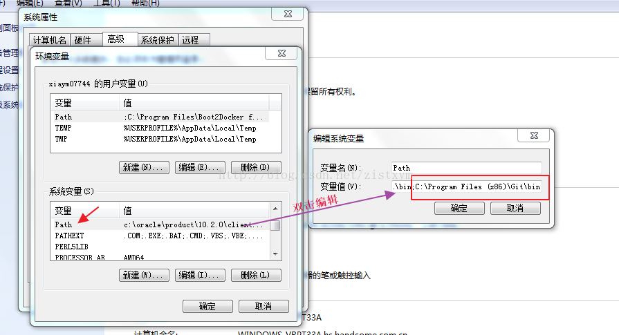

在命令窗口中，输入ls 如果能找到命令说明环境添加正确。

## 3. 启动DOCKERT

在命令窗口中，切到docker的安装目录下 
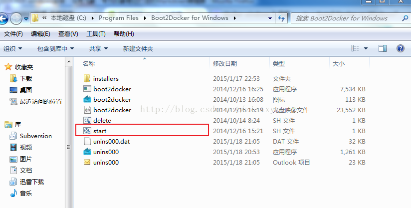

输入sh: 
然后输入start.sh,等待启动 

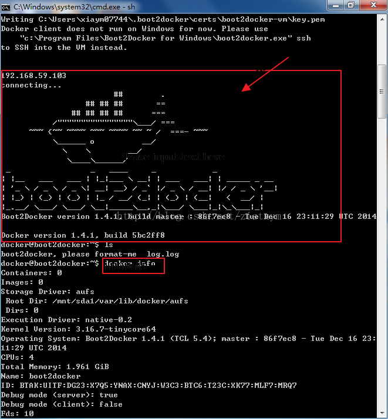
第一次启动中，如果有新版本会更新，时间比较长。

如果第二次启动，就非常快了。 

## 4. 分析start.sh

```
#!/bin/bashset -e

# clear the MSYS MOTD
clear

cd "$(dirname "$BASH_SOURCE")"

ISO="$HOME/.boot2docker/boot2docker.iso"

if [ ! -e "$ISO" ]; then
    echo 'copying initial boot2docker.iso (run "boot2docker.exe download" to update)'
    mkdir -p "$(dirname "$ISO")"
    cp ./boot2docker.iso "$ISO"fi

echo 'initializing...'
./boot2docker.exe init
echo

echo 'starting...'
./boot2docker.exe start
echo

./boot2docker.exe ip

echo 'connecting...'
./boot2docker.exe ssh
echo

echoecho '[Press any key to exit]'read
```

从内容上看主要是执行，如下语句

```
boot2docker.exe init
boot2docker.exe start
boot2docker.exe ssh
```

所有在命令行下执行 sh start.sh 即可

## 5. 利用SSH工具管理

在windows命令行进入docker后，不能复制，而且操作也不方便，因此用支持SSH的工具来管理是很好的，比如SECURECRT, PUTTY等，推荐用SECURECRT. 
在命令行下用boot2docker ip 可以查询到IP

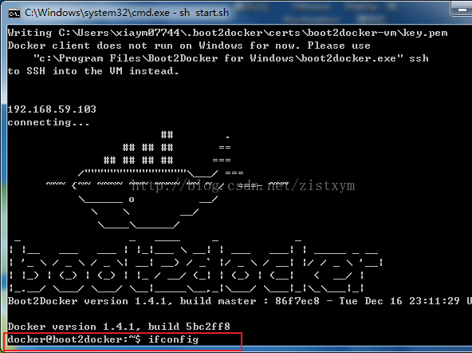

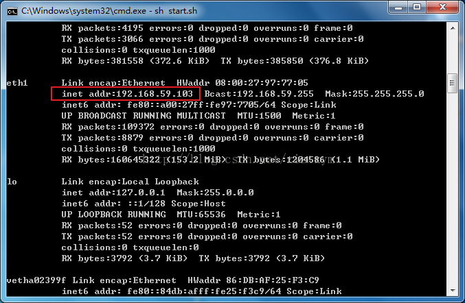

默认的用户名和密码是： **docker/tcuser**

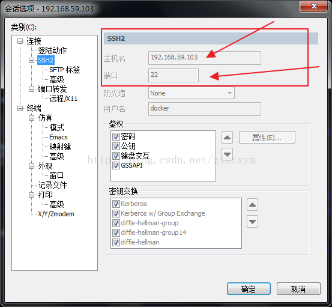

登录后的界面： 
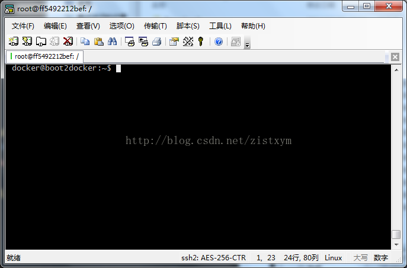

## 6. 下载镜像

### 6.1 下载地址

[http://download.openvz.org/template/precreated](http://download.openvz.org/template/precreated/ubuntu-14.04-x86_64.tar.gz) 
选择下载 **ubuntu-14.04-x86_64.tar.gz**

### 6.2 用FTP工具上传tar包

推荐使用：FileZilla 
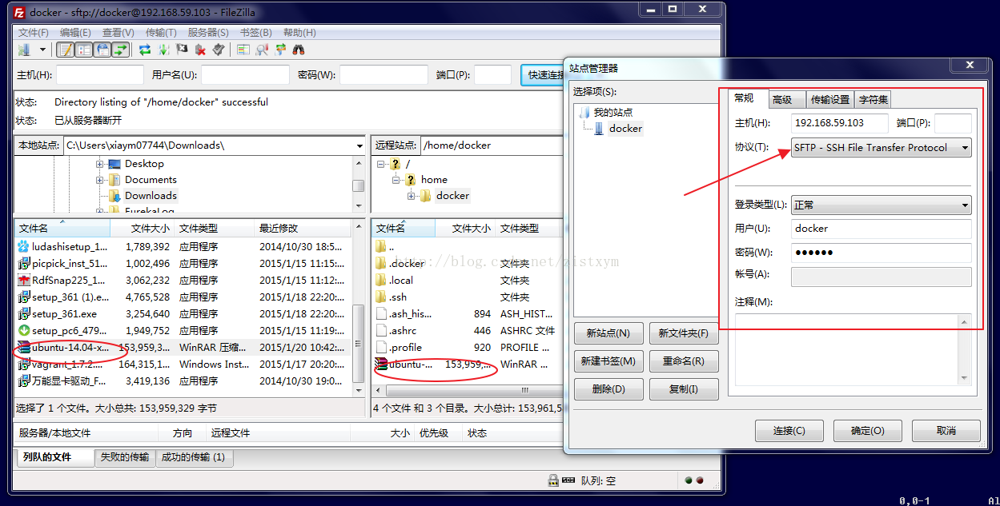

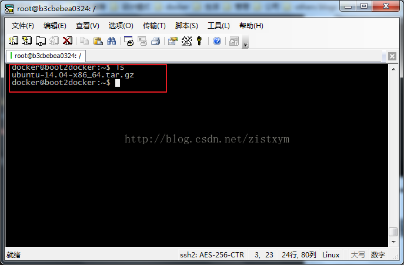

### 6.3 安装

命令：**cat ubuntu-14.04-x86_64.tar.gz |docker import - ubuntu:ubuntu14** 
速度非常快，大概10几秒就完成了。

### 6.4 查看镜像

查看： **docker images** 
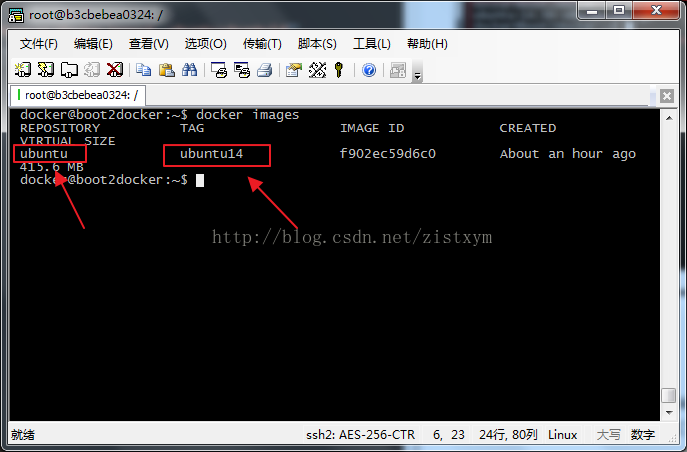

### 6.5 运行

运行：**docker run -i -t ubuntu:ubuntu14 /bin/bash**

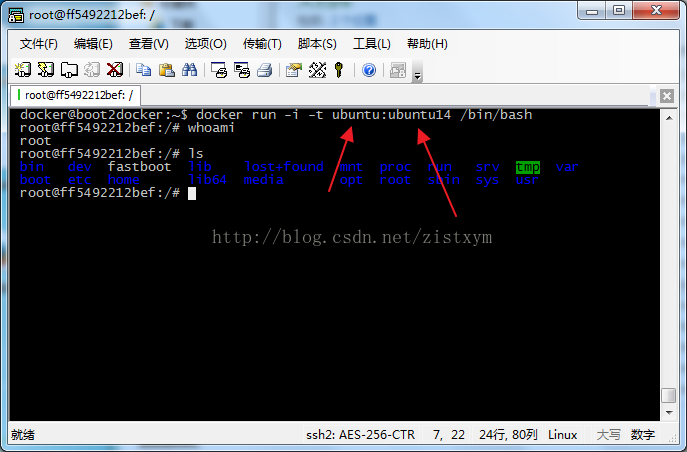

可以开始DOCKER旅行了。
来源： <http://blog.csdn.net/zistxym/article/details/42918339>