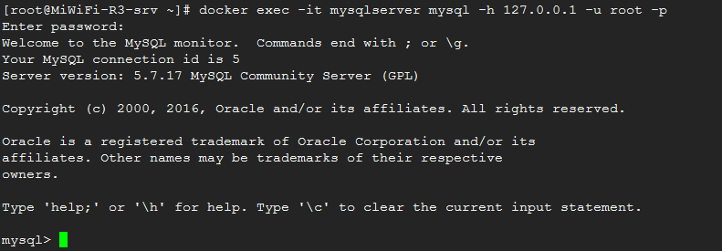

## Docker安装Mysql数据库容器

### 1.下载Mysql镜像文件

使用以下命令从Docker镜像库中下载mysql镜像

docker pull mysql

 

等下载成功后可以使用以下命令查询结果

docker images 

 

### 2.启动Mysql容器

启动mysql容器的方法很简单，运行以下命令即可：

docker run --name=mysqlserver -d -i -p 3306:3306 -e MYSQL_ROOT_PASSWORD=123456  -v `pwd`/mysql_data:/var/lib/mysql   mysql

   

   命令参数说明

​        --name 给容器起一个别名，可选，如果不指定，则Docker会自动生成不规则的字符串表示

​        -i 指定容器可以交互，有了此选项后，可以使用docker attach等与容器进行交互

​        -p 映射宿主机与容器中服务端口

​        -e 设置容器运行所需要的环境变量

​        -v 挂载 Volume 至 /var/lib/mysql 来作持久化存储。

通过docker ps -l可以查看容器是否正确启动 

 

STATUS 列中up标识容易已经启动

通过docker top mysqlserver 可以查询容器的硬件资源占用情况 

 

查看容器启动日志

docker logs -f mysqlserver 

 

### 3.访问Mysql数据库

由于我们在上面使用了-p参数映射了容器的3306端口到宿主机的3306端口，此时我们可以直接访问宿主机的3306端口来访问Docker中的mysql服务

mysql -h 127.0.0.1 -u root -p 

### 4.停止Mysql数据库

停止mysql容器可以使用以下命令

docker stop mysqlserver

### 5.移除mysql容器

停止mysql容器可以使用以下命令

docker rm mysqlserver

### 6.关于Mysql容器的高级应用

限定只能通过宿主机访问mysql数据库

​     如果需要限定只能通过宿主机访问mysql数据库，可以使用 –p 127.0.0.1:3306:3306 参数

自定义mysql的配置及备份mysql数据

如果需要修改mysql容器中的mysql配置，可以在启动容器参数中增加-v参数，映射本地的目录或文件到mysql容器，覆盖容器中的某个文件或文件夹

生产环境中使用的命令：

docker run -a STDIN -a STDOUT -a STDERR --privileged=true  --name=mysqlserver -v /data/mysql/my.cnf:/etc/mysql/my.cnf:ro -v /data/mysql/data/:/opt/mysql/data:rw -p 3306:3306 -e MYSQL_ROOT_PASSWORD=123456 mysql

转至：http://blog.sina.com.cn/s/blog_7f2ac7b70102vpyl.html