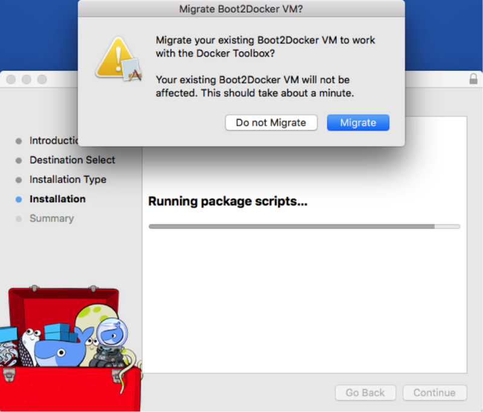
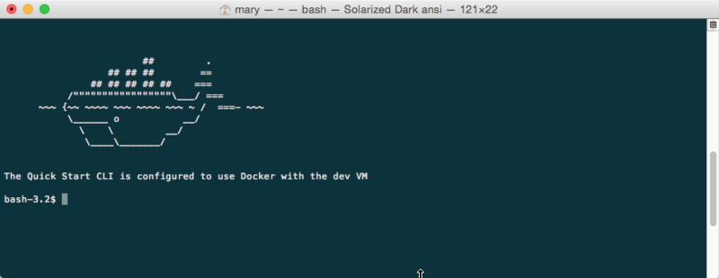

# Quick Start

## Installation

### Ubuntu

- 通过系统自带包安装

Ubuntu 14.04 版本系统中已经自带了 Docker 包，可以直接安装。

```
$ sudo apt-get update
$ sudo apt-get install -y docker.io
$ sudo ln -sf /usr/bin/docker.io /usr/local/bin/docker
$ sudo sed -i '$acomplete -F _docker docker' /etc/bash_completion.d/docker.io

```

如果使用操作系统自带包安装 Docker，目前安装的版本是比较旧的 0.9.1。 要安装更新的版本，可以通过使用 Docker 源的方式。

- 通过Docker源安装最新版本

要安装最新的 Docker 版本，首先需要安装 apt-transport-https 支持，之后通过添加源来安装。

```
$ sudo apt-get install apt-transport-https
$ sudo apt-key adv --keyserver hkp://keyserver.ubuntu.com:80 --recv-keys 36A1D7869245C8950F966E92D8576A8BA88D21E9
$ sudo bash -c "echo deb https://get.docker.io/ubuntu docker main > /etc/apt/sources.list.d/docker.list"
$ sudo apt-get update
$ sudo apt-get install lxc-docker

```

- 14.04 之前版本

如果是较低版本的 Ubuntu 系统，需要先更新内核。

```
$ sudo apt-get update
$ sudo apt-get install linux-image-generic-lts-raring linux-headers-generic-lts-raring
$ sudo reboot

```

然后重复上面的步骤即可。

安装之后启动 Docker 服务。

```
$ sudo service docker start
```

### CentOS

Docker 支持 CentOS6 及以后的版本。

- CentOS6

对于 CentOS6，可以使用 [EPEL](https://fedoraproject.org/wiki/EPEL) 库安装 Docker，命令如下

```
$ sudo yum install http://mirrors.yun-idc.com/epel/6/i386/epel-release-6-8.noarch.rpm
$ sudo yum install docker-io

```

- CentOS7

CentOS7 系统 `CentOS-Extras` 库中已带 Docker，可以直接安装：

```
$ sudo yum install docker

```

安装之后启动 Docker 服务，并让它随系统启动自动加载。

```
$ sudo service docker start
$ sudo chkconfig docker on
```

### Docker Toolbox(Mac & Windows)

> - [docker-toolbox](http://blog.arungupta.me/docker-toolbox/)

早期在Windows或者MAC环境下使用Docker主要利用的是Boot2Docker这个命令行工具，而Toolbox可以安装你在开发中运行Docker时所需要的一切：Docker客户端、Compose（仅Mac需要）、Kitematic、Machine以及VirtualBox。Toolbox使用Machine和VirtualBox在虚拟机中创建了一个引擎来运行容器。在该虚拟机上，你可以使用Docker客户端、Compose以及Kitematic来运行容器。而Toolbox本身已经可以取代了Boot2Docker的作用。



Docker的Toolbox主要集成了如下几个不同的工具的集合：

- Docker Client `docker` binary
- Docker Machine `docker-machine` binary
- Docker Compose `docker-compose` binary
- Kitematic – Desktop GUI for Docker
- Docker Quickstart Terminal app

以Mac系统为例，使用Docker Toolbox安装Docker环境与Linux系统的区别在于，在标准的Linux系统上的安装中，Docker客户端、Docker守护进程以及所有的容器都是直接运行在本地的：


而在OS X或者Windows系统的安装中，Docker的相关的程序是运行在一个内置的小型的Linux虚拟机中的。


在[这里](https://www.docker.com/toolbox)可以下载Toolbox的安装程序，双击打开按照步骤提示安装好之后，即可以进行下一步，首先在Applications文件夹或者Launchpad中打开Docker QuickStart Terminal，该程序会直接打开一个终端控制台，并且创建或者连接到一个叫`default`的虚拟机并且将控制台登录到该虚拟机中。当然，用户也可以用`docker-machine`命令来手动创建或者登录到虚拟机中：



#### From your shell:从命令行创建

- 创建一个新的Docker虚拟机

```
$ docker-machine create --driver virtualbox default
Creating VirtualBox VM...
Creating SSH key...
Starting VirtualBox VM...
Starting VM...
To see how to connect Docker to this machine, run: docker-machine env default
```

注意，该虚拟机相关的配置文件存放在`~/.docker/machine/machines/default`目录下。

- 列举所有可用的机器

```
$ docker-machine ls
NAME                ACTIVE   DRIVER       STATE     URL                         SWARM
default             *        virtualbox   Running   tcp://192.168.99.101:2376  
```

- 获取环境配置

```
$ docker-machine env default
export DOCKER_TLS_VERIFY="1"
export DOCKER_HOST="tcp://192.168.99.101:2376"
export DOCKER_CERT_PATH="/Users/mary/.docker/machine/machines/default"
export DOCKER_MACHINE_NAME="default"
# Run this command to configure your shell: 
# eval "$(docker-machine env default)"
```

- 连接到该虚拟机

```
$ eval "$(docker-machine env default)"
```

## Proxy & Mirror

### Proxy For boot2docker

如果是使用boot2docker配置的Docker的运行环境，那么配置文件并没有放置在Windows或者MAC系统种，而是附着在了小的Linux虚拟机的内核中。首先我们需要在boot2docker的命令行中进入到VM的设置：

```
Creating Machine default...
Creating VirtualBox VM...
Creating SSH key...
Starting VirtualBox VM...
Starting VM...
To see how to connect Docker to this machine, run: docker-machine env default
Starting machine default...
Started machines may have new IP addresses. You may need to re-run the `docker-machine env` command.
Setting environment variables for machine default...
 
. . .
 
                        ##         .
                  ## ## ##        ==
               ## ## ## ## ##    ===
           /"""""""""""""""""\___/ ===
      ~~~ {~~ ~~~~ ~~~ ~~~~ ~~~ ~ /  ===- ~~~
           \______ o           __/
             \    \         __/
              \____\_______/
 
 
docker is configured to use the default machine with IP 192.168.99.100
For help getting started, check out the docs at https://docs.docker.com
```

现在可以修改 /var/lib/boot2docker/profile 这个文件来设置代理:

```
docker@boot2docker:~$ sudo vi /var/lib/boot2docker/profile 

```

Tinycore 需要按照如下格式进行配置: protocol://ip:port

安全起见我同时设置了 HTTP 与 HTTPS.

```
export HTTP_PROXY=http://your.proxy.name:8080
export HTTPS_PROXY=http://your.proxy.name:8080

```

现在你可以重启整个服务以及Docker容器：

```
docker@boot2docker:~$ sudo /etc/init.d/docker restart
docker@boot2docker:~$ exit
Connection to localhost closed.

```

接下来就可以顺利的运行镜像了：

```
bash-3.2$ docker search ubuntu
NAME                                             DESCRIPTION                                     STARS     OFFICIAL   AUTOMATED
ubuntu                                           Official Ubuntu base image                      356                  
stackbrew/ubuntu                                 Official Ubuntu base image                      39                   
crashsystems/gitlab-docker                       A trusted, regularly updated build of GitL...

```

这个改变即使以后的虚拟机重启重置也都一直会被保留，因此只需要被设置一次。

### Docker Hub Mirror

DaoCloud提供Docker Hub Mirror服务。用户可以进入Docker Hub Mirror注册入口注册。在进入控制台页面后直接点击 启动你的加速器后，您即可得到一个Mirror的地址，将该地址配置在Docker Daemon的启动脚本中，重启Docker Daemon即可使得Docker Hub Mirror配置生效。

- Ubuntu：

安装或升级Docker

Docker 1.3.2版本以上才支持Docker Hub Mirror机制，如果您还没有安装Docker或者版本过低，请安装或升级版本。

配置Docker Hub Mirror

```
sudo echo "DOCKER_OPTS=\"$DOCKER_OPTS --registry-mirror=http://xxx.m.daocloud.io\"" >> /etc/default/docker service docker restart 
```

请将xxx替换为您在 DaoCloud 上注册后，为您专属生成的Mirror地址链接名。 该脚本可以将 --registry-mirror 加入到您的Docker配置文件 /etc/defaults/docker中。

尽情享受Docker Hub Mirror

Docker Hub Mirror使用不需要任何附件操作，就像这样下载官方Ubuntu镜像

```
docker pull ubuntu 
```

- CentOS：

安装或升级Docker

Docker 1.3.2版本以上才支持Docker Hub Mirror机制，如果您还没有安装Docker或者版本过低，请安装或升级版本。

配置Docker Hub Mirror

```
sudo sed -i 's|OPTIONS=|OPTIONS=--registry-mirror=http://xxx.m.daocloud.io |g' /etc/sysconfig/docker service docker restart 
```

请将xxx替换为您在 DaoCloud 上注册后，为您专属生成的Mirror地址链接名。

该脚本可以将 --registry-mirror 加入到您的Docker配置文件/etc/defaults/docker中。

尽情享受Docker Hub Mirror

Docker Hub Mirror使用不需要任何附件操作，就像这样下载官方Ubuntu镜像

```
docker pull ubuntu 
```

- MAC：

安装或升级MAC版本下的Boot2Docker

Docker 1.3.2版本以上才支持Docker Hub Mirror机制，如果您还没有安装Docker或者版本过低，请安装或升级版本。

配置Docker Hub Mirror

请确认你的Boot2Docker已经启动，并执行

```
boot2docker ssh sudo su echo "EXTRA_ARGS=\"--registry-mirror=http://xxx.m.daocloud.io\"" >> /var/lib/boot2docker/profile && exit exit boot2docker restart 
```

请将xxx替换为您在 DaoCloud 上注册后，为您专属生成的Mirror地址链接名。

尽情享受Docker Hub Mirror

Docker Hub Mirror使用不需要任何附件操作，就像这样下载官方Ubuntu镜像

```
docker pull ubuntu 
```

- Windows：

安装或升级MAC版本下的Boot2Docker

Docker 1.3.2版本以上才支持Docker Hub Mirror机制，如果您还没有安装Docker或者版本过低，请安装或升级版本。

配置Docker Hub Mirror

进入Boot2Docker Start Shell，并执行

```
sudo su echo "EXTRA_ARGS=\"--registry-mirror=http://xxx.m.daocloud.io\"" >> /var/lib/boot2docker/profile exit ＃ 重新启动Boot2Docker 
```

请将xxx替换为您在 DaoCloud 上注册后，为您专属生成的Mirror地址链接名

尽情享受Docker Hub Mirror

Docker Hub Mirror使用不需要任何附件操作，就像这样下载官方Ubuntu镜像

```
docker pull ubuntu 
```

## Hello World

在Docker的学习中我们依旧可以借鉴经典的HelloWorld，直接运行`docker run hello-world`即可，不过需要注意的是，由于总所周知的原因，国内往往无法顺利的下载镜像，如果遇到类似的网络的错误可以参考上文中的代理或者镜像的设置。

```
$ docker run hello-world
Unable to find image 'hello-world:latest' locally
511136ea3c5a: Pull complete
31cbccb51277: Pull complete
e45a5af57b00: Pull complete
hello-world:latest: The image you are pulling has been verified.
Important: image verification is a tech preview feature and should not be
relied on to provide security.
Status: Downloaded newer image for hello-world:latest
Hello from Docker.
This message shows that your installation appears to be working correctly.


To generate this message, Docker took the following steps:
1. The Docker client contacted the Docker daemon.
2. The Docker daemon pulled the "hello-world" image from the Docker Hub.
   (Assuming it was not already locally available.)
3. The Docker daemon created a new container from that image which runs the
   executable that produces the output you are currently reading.
4. The Docker daemon streamed that output to the Docker client, which sent it
   to your terminal.


To try something more ambitious, you can run an Ubuntu container with:
$ docker run -it ubuntu bash


For more examples and ideas, visit:
http://docs.docker.com/userguide/
```

### Run Commands(运行命令)

你的Container会在你结束命令之后自动退出，使用以下的命令选项可以将容器保持在激活状态：

- `-i` 即使在没有附着的情况下依然保持STDIN处于开启
- `-t` 分配一个伪TTY控制台

所以`run`命令就变成了：

```
docker run -it -d shykes/pybuilder bin/bash
```

如果希望能够附着到一个已经存在的容器中，则利用`exec`命令：

```
docker exec -it CONTAINER_ID /bin/bash
```

## Docker Commands

> - [docker-cheat-sheet](https://github.com/wsargent/docker-cheat-sheet#images)

本章主要对于常见的Docker命令行命令进行详细介绍。

### LifeCycle

#### Containers

- [`docker create`](https://docs.docker.com/reference/commandline/create) 会创建一个容器但是不会立刻启动
- [`docker run`](https://docs.docker.com/reference/commandline/run) 会创建并且启动某个容器

如果只是希望有一个暂时性的容器，可以使用 `docker run --rm` 将会在容器运行完毕之后删除该容器。

如果希望在打开某个容器之后能够与其进行交互, `docker run -t -i ` 会创建一个TTY控制台。

- [`docker stop`](https://docs.docker.com/reference/commandline/stop) 会关闭某个容器
- [`docker start`](https://docs.docker.com/reference/commandline/start) 会启动某个容器
- [`docker restart`](https://docs.docker.com/reference/commandline/restart) 会重新启动某个容器
- [`docker rm`](https://docs.docker.com/reference/commandline/rm) 会删除某个容器

如果希望能够移除所有与该容器相关的Volume，可以使用-v参数： `docker rm -v`.

- [`docker kill`](https://docs.docker.com/reference/commandline/kill) 会发送SIGKILL信号量到某个容器
- [`docker attach`](https://docs.docker.com/reference/commandline/attach) 会附着到某个正在运行的容器
- [`docker wait`](https://docs.docker.com/reference/commandline/wait) 会阻塞直到某个容器关闭

#### Images

- [`docker images`](https://docs.docker.com/reference/commandline/images) 会展示所有的镜像
- [`docker import`](https://docs.docker.com/reference/commandline/import) 会从原始码中创建镜像
- [`docker build`](https://docs.docker.com/reference/commandline/build) 会从某个Dockfile中创建镜像
- [`docker commit`](https://docs.docker.com/reference/commandline/commit) 会从某个Container中创建镜像
- [`docker rmi`](https://docs.docker.com/reference/commandline/rmi) 会移除某个镜像
- [`docker load`](https://docs.docker.com/reference/commandline/load) 以STDIN的方式从某个tar包中加载镜像
- [`docker save`](https://docs.docker.com/reference/commandline/save) 以STDOUT的方式将镜像存入到某个tar包中

### Info

#### Containers

- [`docker ps`](https://docs.docker.com/reference/commandline/ps) 会列举出所有正在运行的容器

`docker ps -a` 会展示出所有正在运行的和已经停止的容器

- [`docker logs`](https://docs.docker.com/reference/commandline/logs) 从某个容器中获取log日志
- [`docker inspect`](https://docs.docker.com/reference/commandline/inspect) 检测关于某个容器的详细信息
- [`docker events`](https://docs.docker.com/reference/commandline/events) 从某个容器中获取所有的事件
- [`docker port`](https://docs.docker.com/reference/commandline/port) 获取某个容器的全部的开放端口
- [`docker top`](https://docs.docker.com/reference/commandline/top) 展示某个容器中运行的全部的进程
- [`docker stats`](https://docs.docker.com/reference/commandline/stats) 展示某个容器中的资源的使用情况的统计信息
- [`docker diff`](https://docs.docker.com/reference/commandline/diff) 展示容器中文件的变化情况

#### Images

- [`docker history`](https://docs.docker.com/reference/commandline/history) 展示镜像的全部历史信息
- [`docker tag`](https://docs.docker.com/reference/commandline/tag) 为某个容器设置标签

### Import&Export

- [`docker cp`](https://docs.docker.com/reference/commandline/cp) 在容器与本地文件系统之间进行文件复制
- [`docker export`](https://docs.docker.com/reference/commandline/export) 将某个容器中的文件系统的内容输出到某个tar文件中

### Executing Commands

- [`docker exec`](https://docs.docker.com/reference/commandline/exec) 在容器中运行某个命令

如果需要在某个名字为foo的容器中运行交互命令，可以使用：

`docker exec -it foo /bin/bash`.

- 2015年11月04日发布

  [来源： ](https://segmentfault.com/a/1190000003951028)<https://segmentfault.com/a/1190000003951028#articleHeader0>