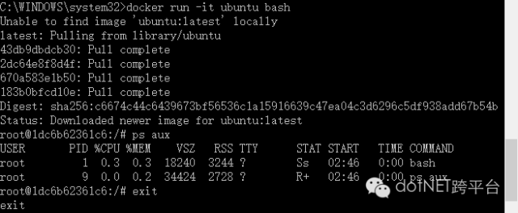

# 1. 前言

Docker最近推出了可以运行在Win10和Mac上的稳定版本，让我们赶紧来体验一下。 Docker发布Mac和Windows 的目标非常简单——开发者可以更加简单方便地在研发机器上使用Docker。下面是此次版本所改进的地方：

- 更快更可靠——在本地开发环境上，使用虚拟监控程序（hypervisors）就可以植入每个操作系统（无需VirtualBox）；
- 改进了Docker工具集成——开发者可以把所有的Docker工具绑定在本地应用程序上；
- 改进开发流程——大量的装备可用于代码和数据，还可以更加方便地访问在本地网络上运行的运行容器，IDEs支持[在线调试]()，使代码迭代更快速更轻松；
- 支持企业网络，Mac和Windows版本轻松访问企业VPN；
- 所有的新功能都可以在Docker 1.12引擎上使用；
- 支持自动更新，无论是稳定版还是测试版。

# 2. 安装准备

需要的条件为： 64bit Windows 10，开启Hyper-V 

### 2.1 下载Docker for Windows

从官网的下面地址可以下载

https://download.docker.com/win/stable/InstallDocker.msi 

### 2.2 开启win10的Hyper-V

控制面板 -> 程序 -> 启用或关闭Windows功能 -> 选中Hyper-V


完成后自动重启

 

# 3. 安装Docker

用刚才下载的安装包安装，安装完成后，启动Docker

如果没有开启Hyper-V，启动Docker的时候会提示开启Hyper-V

 

如果启动的时候，提示内存不足，启动失败，可以在设定中调节VM内存大小


 

# 4. 使用Docker

### 4.1 查看版本等信息

```
docker info
```


### 4.2 run hello world

```
docker run hello-world
```


### 4.3 启动一个Ubuntu容器

```
docker run -it ubuntu bash
```



### 4.4 查看所有容器

```
docker ps -a
```


### 4.5 启动一个nginx容器

```
docker run -d -p 81:80 --name webserver nginx
```


 

查看运行中的容器

```
docker ps
```


浏览器访问确认

 

# 5. 后记

Docker终于有了可以运行在Win10和Mac上的稳定版本，可以尝试在生产环境部署一下。

相关文章：

- [docker4dotnet #1 – 前世今生 & 世界你好](http://mp.weixin.qq.com/s?__biz=MzA5NzU3Njc5Mw==&mid=265****42&idx=1&sn=4900b2e7ea01e979****16cce89db4c4bd5&scene=21#wechat_redirect)
- [docker4dotnet #2 容器化主机](http://mp.weixin.qq.com/s?__biz=MzA5NzU3Njc5Mw==&mid=265****49&idx=1&sn=b329****48ed46b8fab77bb626****60c98bd&scene=21#wechat_redirect)
- [docker – 你应该知道的10件事](http://mp.weixin.qq.com/s?__biz=MzA5NzU3Njc5Mw==&mid=265****53&idx=1&sn=f19c5df9b3be04c86afafff166faf9f5&scene=21#wechat_redirect)
- [docker4dotnet #3 在macOS上使用VSC和Docker开发asp.net core+mysql应用](http://mp.weixin.qq.com/s?__biz=MzA5NzU3Njc5Mw==&mid=265****61&idx=1&sn=2fe345****96cff4295c991b170d4b&scene=21#wechat_redirect)

原文地址：http://www.cnblogs.com/ee900222/p/docker_4.html

------

请关注微信公众号 【devopshub】，获取更多关于DevOps研发运维一体化的信息

[]()