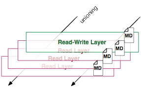
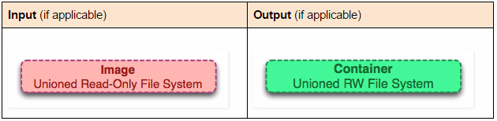

# 10张图带你深入理解Docker容器和镜像

[](http://dockerone.com/uploads/article/20151103/d6ad9c257d160164480b25b278f4a2ad.png)

题外话

### Image Definition

[](http://dockerone.com/uploads/article/20151103/522c40256149bad2b471d1a97c2b6bb5.png)

```
sudo tree -L 1 /var/lib/docker//var/lib/docker/
├── aufs
├── containers
├── graph
├── init
├── linkgraph.db
├── repositories-aufs
├── tmp
├── trust
└── volumes
7 directories, 2 files

```

### Container Definition

[](http://dockerone.com/uploads/article/20151103/b7fb9d924aa12099369c4793050fcfab.png)

### Running Container Definition

[](http://dockerone.com/uploads/article/20151103/8022edeebeb313742bd615aa695bbad3.png)

[](http://dockerone.com/uploads/article/20151103/1dc88de5a114b68d05c37aab7e103597.png)

```
docker run ubuntu touch happiness.txt

```

```
find / -name happiness.txt/var/lib/docker/aufs/diff/860a7b...889/happiness.txt

```

### Image Layer Definition

[](http://dockerone.com/uploads/article/20151103/e42d56394306894244af5bc6d757bee1.png)

[](http://dockerone.com/uploads/article/20151103/5cca590212e2a110be84cbdd3b6101ee.png)

[](http://dockerone.com/uploads/article/20151103/1ead4d955aeb5d968219794489948fc2.png)

Metadata Location:

```
/var/lib/docker/graph/e809f156dc985.../json

```

### 全局理解（Tying It All Together）

#### docker create <image-id>

[](http://dockerone.com/uploads/article/20151031/1397bbddca6651a3ae0316daa8d6d1cd.jpg)

[](http://dockerone.com/uploads/article/20151103/bbe622329b399778b077617ae6468676.png)

#### docker start <container-id>

[](http://dockerone.com/uploads/article/20151031/3f08537e309b923d049fdde3d3a1f926.jpg)

#### docker run <image-id>

[](http://dockerone.com/uploads/article/20151031/4178f2b64f6a2eeb994866931417f263.jpg)

[](http://dockerone.com/uploads/article/20151103/ea18907dedcd8893b39ae1f9e3ad8a3e.png)

#### docker ps

[](http://dockerone.com/uploads/article/20151031/fafeb4eb072e64b54b9979930a6d8db7.jpg)

#### docker ps –a

[](http://dockerone.com/uploads/article/20151031/120d394e57a03a5bb996b23e6e373cf1.jpg)

#### docker images

[](http://dockerone.com/uploads/article/20151031/f8b34de7f7f325e2933aac5cc679e224.jpg)

#### docker images –a

[](http://dockerone.com/uploads/article/20151031/6b3d2d1cae5a26961dc554fc05783b22.jpg)

#### docker stop <container-id>

[](http://dockerone.com/uploads/article/20151031/081cf8fbe8ab4dea4130ce2f25eae071.jpg)

#### docker kill <container-id>

[](http://dockerone.com/uploads/article/20151031/8aeee0c4c1134ee9d0c2200e03defcf4.jpg)

#### docker pause <container-id>

[](http://dockerone.com/uploads/article/20151031/2b34576a2187a972d4cc1cf9346658e2.jpg)

https://www.kernel.org/doc/Doc ... m.txt

#### docker rm <container-id>

[](http://dockerone.com/uploads/article/20151031/bba4521356b43813a634a0859fa53743.jpg)

#### docker rmi <image-id>

[](http://dockerone.com/uploads/article/20151031/df0fadb17158696cdce49a8e30f8c4c4.jpg)

#### docker commit <container-id>

[](http://dockerone.com/uploads/article/20151031/f642149d0144c83679dd228c93a91a37.jpg)

[](http://dockerone.com/uploads/article/20151103/a206a291a8d4b9c968061b853f92ad4e.png)

#### docker build

[](http://dockerone.com/uploads/article/20151031/d569d50a2c6cb4cdb07eb4cfc0712ab0.jpg)

[](http://dockerone.com/uploads/article/20151103/17f6091cc228e14eb151cc8909b4ab00.png)

#### docker exec <running-container-id>

[](http://dockerone.com/uploads/article/20151031/91b0fd6b6b3c0d372eafbe40221835a8.jpg)

#### docker inspect <container-id> or <image-id>

[](http://dockerone.com/uploads/article/20151031/eb03a3d750a4da43fc5825d8336314c1.jpg)

#### docker save <image-id>

[](http://dockerone.com/uploads/article/20151031/db73c5aad485bbacb3e97d0a8ddcdea4.jpg)

#### docker export <container-id>

[](http://dockerone.com/uploads/article/20151031/a766de204b53f10d5f56c36955b6b0ee.jpg)

#### docker history <image-id>

[](http://dockerone.com/uploads/article/20151031/f20de692d890a55b84ee5540c62e054e.jpg)

### 结论

原文链接：[Visualizing Docker Containers and Images](http://merrigrove.blogspot.sg/2015/10/visualizing-docker-containers-and-images.html)（翻译：杨润青）

译者介绍

2015-10-31

来源： <http://dockone.io/article/783>